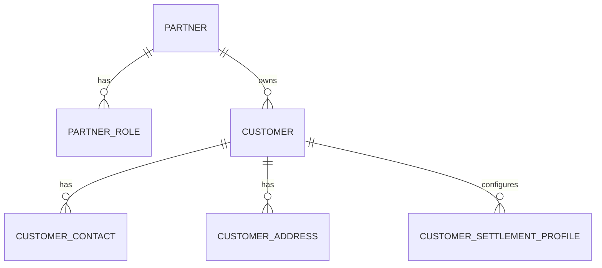
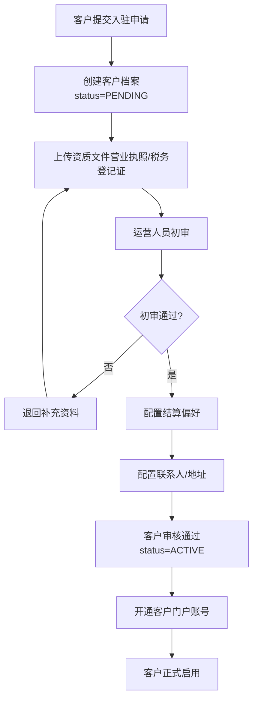
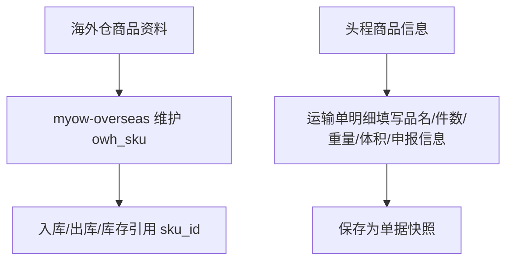
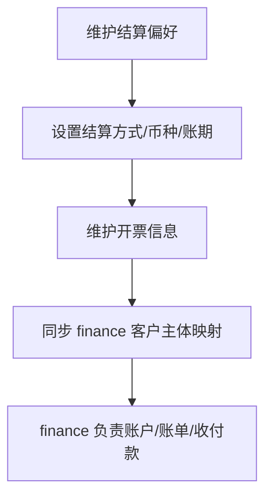

# MYOW-Customer 业务设计文档

## 目录
- **01** 概述与业务边界
- **02** 领域模型设计
- **03** 数据库表结构设计
- **04** API 接口设计
- **05** 业务流程设计
- **06** 关键业务规则
- **07** API 与 Provider 规格
- **08** 数据表与 DDL 收口
- **09** 权限、错误码与开发阶段
## 01 概述与业务边界

myow-customer 模块是 MYOW Platform 的客商主数据中心，负责海外仓、头程、财务等业务共同使用的外部业务主体（客户、供应商、海外代理、船公司等）的基础档案、业务角色、联系人、地址、客户等级、结算偏好与客户状态。它与 myow-user 形成本质区别：myow-user 管理内部系统用户与权限，myow-customer 管理外部客商主数据与客户门户账号。

### 1.1 核心职责

#### 客商主体

统一维护公司/个人/海外代理等外部主体，一个主体只保留一个 partner_code，并通过业务角色区分客户、供应商、船公司等身份。

#### 联系人管理

客户下多联系人维护，支持主联系人标记、职务、电话、邮箱，用于业务沟通与通知触达。

#### 客户等级

客户等级、服务等级、默认 SLA、风控标签和运营分层，用于业务模块做准入、优先级和策略判断。

#### 结算偏好

客户默认币种、结算方式、账期偏好、开票信息和财务主体标识。真实账户余额、扣款和账单归属 myow-finance。

#### 地址管理

客户发货地址、收货地址（海外仓地址）、账单地址的统一维护与默认地址设置。

### 1.2 与周边模块的边界划分

| 模块 | 协作内容 | 数据流向 |
| --- | --- | --- |
| myow-user | 平台内部员工账号、销售归属、操作员身份引用 | customer 记录 sales_owner_id / operator_id 等内部用户引用；客户门户账号由 customer 模块自管 |
| myow-overseas | 入库单/出库单引用客户 ID | customer 提供客户档案，overseas 做业务单据关联 |
| myow-finance | 账单生成时读取客户结算偏好、开票信息、财务主体 | customer 提供客户主数据，finance 管理费用项、账单、账户与收付款 |
| myow-firstmile | 头程运输单引用委托客户 | customer 提供客户档案，firstmile 做运输单关联 |

设计原则：myow-customer 作为客商主数据（Partner Master Data）和客户角色视图（Customer View）的唯一来源，其他业务模块通过只读接口（PartnerProvider / CustomerProvider）查询主体和客户信息，禁止在业务模块内重复维护客户、供应商或代理档案。商品 SKU 只归属 myow-overseas；头程模块如需要商品信息，采用单据快照字段填写，不引用 customer SKU。业务合同和价格规则归属具体业务模块，费用项字典、账户、账单和收付款归属 myow-finance。

## 02 领域模型设计

客户域以客商主体（Partner）为底层唯一主体，以客户档案（Customer）作为客户角色视图。联系人、地址、结算偏好等实体围绕 customer_id 展开；供应商、海外代理、船公司等身份通过 partner_role 表表达。各业务模块通过 customer_id 引用客户业务数据，通过 partner_id 进行客供一体识别和财务对冲关联；商品 SKU、业务合同、业务价格规则、账户流水和账单不放在 customer 模块。

### 2.1 实体关系图



图 2-1：客户域核心实体关系（星型结构）

### 2.2 聚合根与实体定义

#### 2.2.1 客户档案聚合（Customer Aggregate）

cm_customer 是客户角色聚合根，必须关联 cm_partner_profile.partner_id。同一个 partner 可以同时具备 CUSTOMER、SUPPLIER、OVERSEAS_AGENT、CARRIER 等业务角色，但客户业务模块只通过 customer_id 做业务引用，避免根据业务概念频繁改字段名。

| 字段 | 类型 | 约束 | 说明 |
| --- | --- | --- | --- |
| customer_id | BIGINT | PK | 客户唯一标识 |
| partner_id | BIGINT | NOT NULL | 客商主体 ID，用于客供一体和财务对冲识别 |
| customer_code | VARCHAR(32) | NOT NULL, UK | 客户编码，全局唯一 |
| tenant_id | BIGINT | NOT NULL | 所属租户 |
| customer_name | VARCHAR(128) | NOT NULL | 客户公司名称 |
| customer_type | VARCHAR(16) | NOT NULL | COMPANY / INDIVIDUAL |
| customer_level | VARCHAR(16) | DEFAULT 'BRONZE' | BRONZE / SILVER / GOLD / PLATINUM / DIAMOND |
| biz_license_no | VARCHAR(64) |  | 营业执照号 |
| tax_no | VARCHAR(64) |  | 税务登记号 |
| settlement_type | VARCHAR(16) | DEFAULT 'PREPAID' | PREPAID / CREDIT / MONTHLY |
| default_currency | VARCHAR(8) | DEFAULT 'USD' | 默认结算币种 |
| status | VARCHAR(16) | DEFAULT 'PENDING' | PENDING / ACTIVE / SUSPENDED / TERMINATED |
| sales_owner_id | BIGINT |  | 客户负责人，对应 myow-user 内部员工 user_id |
| owner_dept_id | BIGINT |  | 负责人部门，用于内部数据权限矩阵 |
| pool_status | VARCHAR(16) | DEFAULT 'PRIVATE' | PRIVATE / PUBLIC，私海或公海状态 |
| register_time | TIMESTAMP |  | 注册时间 |
| audit_time | TIMESTAMP |  | 资质审核通过时间 |
| remark | VARCHAR(512) |  | 备注 |
| create_by | BIGINT |  | 创建人 |
| create_time | TIMESTAMP(3) |  | 创建时间 |
| update_by | BIGINT |  | 更新人 |
| update_time | TIMESTAMP(3) |  | 更新时间 |
| deleted_flag | BOOLEAN | DEFAULT FALSE | 逻辑删除 |

#### 2.2.2 客户联系人实体（CustomerContact）

每个客户可维护多个联系人，其中一个标记为主联系人，用于日常业务沟通与系统通知。

| 字段 | 类型 | 约束 | 说明 |
| --- | --- | --- | --- |
| contact_id | BIGINT | PK | 联系人唯一标识 |
| tenant_id | BIGINT | NOT NULL | 所属租户 |
| customer_id | BIGINT | NOT NULL, FK | 所属客户 |
| contact_name | VARCHAR(64) | NOT NULL | 联系人姓名 |
| position | VARCHAR(32) |  | 职务 |
| phone | VARCHAR(32) |  | 电话 |
| email | VARCHAR(64) |  | 邮箱 |
| is_primary | BOOLEAN | DEFAULT FALSE | 是否主联系人 |
| status | SMALLINT | DEFAULT 1 | 0=停用，1=启用 |

#### 2.2.3 结算偏好实体（CustomerSettlementProfile）

结算偏好只保存客户默认币种、结算方式、账期偏好、开票信息和财务主体标识；真实账户余额、信用占用、充值、扣款和账单由 myow-finance 维护。

| 字段 | 类型 | 约束 | 说明 |
| --- | --- | --- | --- |
| profile_id | BIGINT | PK | 结算偏好ID |
| tenant_id | BIGINT | NOT NULL | 所属租户 |
| customer_id | BIGINT | NOT NULL, UK | 所属客户 |
| settlement_type | VARCHAR(16) | DEFAULT 'PREPAID' | PREPAID / CREDIT / MONTHLY |
| default_currency | VARCHAR(8) | DEFAULT 'USD' | 默认结算币种 |
| payment_terms | VARCHAR(32) |  | 账期偏好 |
| invoice_title | VARCHAR(128) |  | 开票抬头 |
| tax_no | VARCHAR(64) |  | 税号 |
| finance_subject_code | VARCHAR(64) |  | 财务主体编码 |

#### 2.2.4 客户地址实体（CustomerAddress）

客户的多地址管理，支持发货地址、收货地址（海外仓）、账单地址三种类型。

| 字段 | 类型 | 约束 | 说明 |
| --- | --- | --- | --- |
| address_id | BIGINT | PK | 唯一标识 |
| tenant_id | BIGINT | NOT NULL | 所属租户 |
| customer_id | BIGINT | NOT NULL | 所属客户 |
| address_type | VARCHAR(16) | NOT NULL | SHIP_FROM / SHIP_TO / BILLING |
| contact_name | VARCHAR(64) |  | 联系人姓名 |
| phone | VARCHAR(32) |  | 联系电话 |
| country | VARCHAR(64) |  | 国家 |
| province | VARCHAR(64) |  | 省/州 |
| city | VARCHAR(64) |  | 城市 |
| district | VARCHAR(64) |  | 区/县 |
| street | VARCHAR(128) |  | 街道地址 |
| zip_code | VARCHAR(16) |  | 邮编 |
| is_default | BOOLEAN | DEFAULT FALSE | 是否默认地址 |

### 2.3 枚举定义

| 枚举名 | 值 | 说明 |
| --- | --- | --- |
| CustomerType | COMPANY | 企业客户 |
|  | INDIVIDUAL | 个人客户 |
| CustomerLevel | BRONZE | 青铜 |
|  | SILVER | 白银 |
|  | GOLD | 黄金 |
|  | PLATINUM | 铂金 |
|  | DIAMOND | 钻石 |
| CustomerStatus | PENDING | 待审核 |
|  | ACTIVE | 生效中 |
|  | SUSPENDED | 已暂停 |
|  | TERMINATED | 已终止 |
| ContractStatus | DRAFT | 草稿 |
|  | EFFECTIVE | 生效中 |
|  | EXPIRED | 已过期 |
|  | TERMINATED | 已终止 |
| SettlementType | PREPAID | 预付款 |
|  | CREDIT | 信用额度 |
|  | MONTHLY | 月结 |
| AccountStatus | ACTIVE | 正常 |
|  | FROZEN | 冻结 |
|  | CLOSED | 关闭 |

## 03 数据库表结构设计

myow-customer 模块设计客商主体、客户档案、联系人、地址、结算偏好等主数据表，全部采用 PostgreSQL 语法。商品 SKU、业务合同、价格规则、账户余额和账单不在 customer 模块建表。

### 3.1 表清单与数据量预估

| 表名 | 中文名 | 预估数据量 | 核心索引 |
| --- | --- | --- | --- |
| cm_partner_profile | 客商主体表 | 千级/租户 | uk: partner_code; uk: tax_no / license_no |
| cm_partner_role | 客商业务角色表 | 千级/租户 | uk: partner_id + role_type; idx: role_type |
| cm_customer | 客户档案表 | 千级/租户 | uk: customer_code; idx: partner_id; idx: owner |
| cm_customer_contact | 客户联系人表 | 万级/租户 | idx: customer_id; idx: is_primary |
| cm_customer_settlement_profile | 客户结算偏好表 | 千级/租户 | uk: customer_id |
| cm_customer_address | 客户地址表 | 万级/租户 | idx: customer_id + address_type; idx: is_default |

### 3.2 核心表 DDL

#### cm_partner_profile（客商主体表）

```sql
CREATE TABLE cm_partner_profile (
    partner_id        BIGINT PRIMARY KEY,
    tenant_id         BIGINT NOT NULL,
    partner_code      VARCHAR(32) NOT NULL,
    partner_name      VARCHAR(128) NOT NULL,
    partner_type      VARCHAR(16) NOT NULL DEFAULT 'COMPANY',
    country_code      VARCHAR(8),
    biz_license_no    VARCHAR(64),
    tax_no            VARCHAR(64),
    status            VARCHAR(16) DEFAULT 'ACTIVE',
    risk_level        VARCHAR(16) DEFAULT 'NORMAL',
    remark            VARCHAR(512),
    create_by         BIGINT,
    create_time       TIMESTAMP(3) DEFAULT CURRENT_TIMESTAMP(3),
    update_by         BIGINT,
    update_time       TIMESTAMP(3) DEFAULT CURRENT_TIMESTAMP(3),
    deleted_flag      BOOLEAN DEFAULT FALSE,
    CONSTRAINT uk_partner_code UNIQUE (tenant_id, partner_code)
);
CREATE INDEX idx_partner_name ON cm_partner_profile(tenant_id, partner_name);
CREATE INDEX idx_partner_tax_no ON cm_partner_profile(tenant_id, tax_no);
COMMENT ON TABLE cm_partner_profile IS '客商主体表，一个外部公司或个人在系统内只保留一个主体编码';
```

#### cm_partner_role（客商业务角色表）

```sql
CREATE TABLE cm_partner_role (
    partner_role_id   BIGINT PRIMARY KEY,
    tenant_id         BIGINT NOT NULL,
    partner_id        BIGINT NOT NULL,
    role_type         VARCHAR(32) NOT NULL,
    role_status       VARCHAR(16) DEFAULT 'ACTIVE',
    customer_id       BIGINT,
    supplier_code     VARCHAR(32),
    offset_enabled    BOOLEAN DEFAULT FALSE,
    create_by         BIGINT,
    create_time       TIMESTAMP(3) DEFAULT CURRENT_TIMESTAMP(3),
    update_by         BIGINT,
    update_time       TIMESTAMP(3) DEFAULT CURRENT_TIMESTAMP(3),
    deleted_flag      BOOLEAN DEFAULT FALSE,
    CONSTRAINT uk_partner_role UNIQUE (tenant_id, partner_id, role_type)
);
CREATE INDEX idx_partner_role_type ON cm_partner_role(tenant_id, role_type, role_status);
COMMENT ON COLUMN cm_partner_role.role_type IS 'CUSTOMER / SUPPLIER / OVERSEAS_AGENT / CARRIER / CUSTOMS_BROKER';
COMMENT ON COLUMN cm_partner_role.offset_enabled IS '是否允许 finance 做应收应付对冲，具体对冲执行归属 myow-finance';
```

#### cm_customer（客户档案表）

```sql
CREATE TABLE cm_customer (
    customer_id       BIGINT PRIMARY KEY,
    tenant_id         BIGINT NOT NULL,
    partner_id        BIGINT NOT NULL,
    customer_code     VARCHAR(32) NOT NULL,
    customer_name     VARCHAR(128) NOT NULL,
    customer_type     VARCHAR(16) NOT NULL DEFAULT 'COMPANY',
    customer_level    VARCHAR(16) DEFAULT 'BRONZE',
    biz_license_no    VARCHAR(64),
    tax_no            VARCHAR(64),
    settlement_type   VARCHAR(16) DEFAULT 'PREPAID',
    default_currency  VARCHAR(8) DEFAULT 'USD',
    status            VARCHAR(16) DEFAULT 'PENDING',
    sales_owner_id    BIGINT,
    owner_dept_id     BIGINT,
    pool_status       VARCHAR(16) DEFAULT 'PRIVATE',
    register_time     TIMESTAMP,
    audit_time        TIMESTAMP,
    remark            VARCHAR(512),
    create_by         BIGINT,
    create_time       TIMESTAMP(3) DEFAULT CURRENT_TIMESTAMP(3),
    update_by         BIGINT,
    update_time       TIMESTAMP(3) DEFAULT CURRENT_TIMESTAMP(3),
    deleted_flag      BOOLEAN DEFAULT FALSE,
    CONSTRAINT uk_customer_code UNIQUE (tenant_id, customer_code)
);
CREATE INDEX idx_customer_status ON cm_customer(status);
CREATE INDEX idx_customer_level ON cm_customer(customer_level);
CREATE INDEX idx_customer_tenant ON cm_customer(tenant_id, status);
CREATE INDEX idx_customer_partner ON cm_customer(tenant_id, partner_id);
CREATE INDEX idx_customer_owner ON cm_customer(tenant_id, sales_owner_id, owner_dept_id, pool_status);
COMMENT ON TABLE cm_customer IS '客户档案表';
COMMENT ON COLUMN cm_customer.status IS 'PENDING / ACTIVE / SUSPENDED / TERMINATED';
COMMENT ON COLUMN cm_customer.pool_status IS 'PRIVATE / PUBLIC';
```

#### cm_customer_contact（客户联系人表）

```sql
CREATE TABLE cm_customer_contact (
    contact_id    BIGINT PRIMARY KEY,
    tenant_id     BIGINT NOT NULL,
    customer_id   BIGINT NOT NULL,
    contact_name  VARCHAR(64) NOT NULL,
    position      VARCHAR(32),
    phone         VARCHAR(32),
    email         VARCHAR(64),
    is_primary    BOOLEAN DEFAULT FALSE,
    status        SMALLINT DEFAULT 1,
    create_by     BIGINT,
    create_time   TIMESTAMP(3) DEFAULT CURRENT_TIMESTAMP(3),
    update_by     BIGINT,
    update_time   TIMESTAMP(3) DEFAULT CURRENT_TIMESTAMP(3),
    deleted_flag  BOOLEAN DEFAULT FALSE
);
CREATE INDEX idx_contact_customer ON cm_customer_contact(tenant_id, customer_id);
COMMENT ON TABLE cm_customer_contact IS '客户联系人表';
```

#### cm_customer_settlement_profile（客户结算偏好表）

```sql
CREATE TABLE cm_customer_settlement_profile (
    profile_id      BIGINT PRIMARY KEY,
    tenant_id       BIGINT NOT NULL,
    customer_id     BIGINT NOT NULL,
    settlement_type VARCHAR(16) DEFAULT 'PREPAID',
    default_currency VARCHAR(8) DEFAULT 'USD',
    payment_terms   VARCHAR(32),
    invoice_title   VARCHAR(128),
    tax_no          VARCHAR(64),
    finance_subject_code VARCHAR(64),
    create_by       BIGINT,
    create_time     TIMESTAMP(3) DEFAULT CURRENT_TIMESTAMP(3),
    update_by       BIGINT,
    update_time     TIMESTAMP(3) DEFAULT CURRENT_TIMESTAMP(3),
    deleted_flag    BOOLEAN DEFAULT FALSE,
    CONSTRAINT uk_settlement_customer UNIQUE (tenant_id, customer_id)
);
CREATE INDEX idx_settlement_customer ON cm_customer_settlement_profile(tenant_id, customer_id);
COMMENT ON TABLE cm_customer_settlement_profile IS '客户结算偏好表';
```

#### cm_customer_address（客户地址表）

```sql
CREATE TABLE cm_customer_address (
    address_id    BIGINT PRIMARY KEY,
    tenant_id     BIGINT NOT NULL,
    customer_id   BIGINT NOT NULL,
    address_type  VARCHAR(16) NOT NULL,
    contact_name  VARCHAR(64),
    phone         VARCHAR(32),
    country       VARCHAR(64),
    province      VARCHAR(64),
    city          VARCHAR(64),
    district      VARCHAR(64),
    street        VARCHAR(128),
    zip_code      VARCHAR(16),
    is_default    BOOLEAN DEFAULT FALSE,
    create_by     BIGINT,
    create_time   TIMESTAMP(3) DEFAULT CURRENT_TIMESTAMP(3),
    update_by     BIGINT,
    update_time   TIMESTAMP(3) DEFAULT CURRENT_TIMESTAMP(3),
    deleted_flag  BOOLEAN DEFAULT FALSE
);
CREATE INDEX idx_address_customer ON cm_customer_address(tenant_id, customer_id, address_type);
COMMENT ON TABLE cm_customer_address IS '客户地址表';
COMMENT ON COLUMN cm_customer_address.address_type IS 'SHIP_FROM / SHIP_TO / BILLING';
```

### 3.3 分表与归档策略

- cm_partner_profile：客商主体唯一来源，按 partner_code、名称、税号做检索；客户、供应商、代理共享同一主体。

- cm_customer：千级数据量，无需分区；全表缓存到 Redis，变更时失效；列表查询必须叠加内部员工数据权限条件。

- cm_customer_settlement_profile：只保存结算偏好，不保存余额、账单、充值和扣款流水。

- cm_customer_address：万级数据量，按 customer_id + address_type 索引即可。

## 04 API 接口设计

本章节定义 myow-customer 模块 API 设计原则。完整 Controller、Path、Command、权限码以第 07 章“API 与 Provider 规格”为准，避免同一接口在多处维护。

### 4.1 接口通用约定

- 基地址：/api/v1/customer

- Content-Type：application/json

- 认证：Header Authorization: Bearer {token}

- 接口风格：写操作与复杂查询统一使用命令式 POST，例如 /customers/create、/customers/page

- 幂等：写操作支持 Idempotency-Key

- 统一响应：{"code":0,"msg":"ok","data":{}}

### 4.2 接口职责边界

- Controller：只做参数校验、认证鉴权、幂等控制、统一响应封装。

- Application Service：编排业务校验、数据权限、领域服务、事务和事件发布。

- Provider：只读稳定契约，供 overseas、firstmile、finance 等模块调用。

- 操作日志：敏感写操作必须记录 operator_type、operator_id、request_id、before/after 摘要。

### 4.3 商品 SKU 边界

边界约束：myow-customer 不提供 SKU 创建、修改、查询、条码或包装规格接口。海外仓商品 SKU 归属 myow-overseas；头程模块如需要品名、件数、重量、体积、申报信息，采用单据明细快照字段填写，不引用 customer SKU。

设计要点：myow-customer 不提供业务价格查询接口。海外仓合同价格由 myow-overseas 提供，头程合同价格由 myow-firstmile 提供，费用项字典、计费事件、账单与账户由 myow-finance 负责。完整接口清单见第 07 章。

## 05 业务流程设计

本章节以流程图形式呈现客户域的核心业务流程：客户准入、商品 SKU 边界、结算偏好维护。商品 SKU、业务合同与价格规则在具体业务模块内维护。

### 5.1 客户准入与开户流程

新客户从注册申请到正式启用，经历资料录入、资质审核、结算偏好配置、门户账号开通等阶段。



图 5-1：客户准入与开户全流程

### 5.2 商品 SKU 边界流程

商品 SKU 不在 customer 中维护。海外仓入库、出库、库存需要 SKU 时，由 myow-overseas 维护并引用 owh_sku；头程业务不引用 SKU 主数据，直接在运输单或明细中填写商品快照信息。



图 5-2：商品 SKU 归属边界流程

### 5.3 结算偏好维护流程

结算偏好供 finance 生成账单、开票和账户策略时引用，不直接代表账户余额或信用占用。



图 5-3：结算偏好维护与财务引用流程

## 06 关键业务规则

本章节梳理客户域的强制性业务规则，涵盖客户编码、资质审核、商品 SKU 边界、结算偏好、合同价格边界与地址管理等方面。

### 6.1 客户编码与唯一性规则

- 编码规则：客户编码格式为 C{租户简码}{日期}{4位流水}，如 CUS202607010001。编码由系统在客户创建时自动生成，不可手动修改。

- 全局唯一：customer_code 在租户内全局唯一，通过数据库唯一索引强制约束。

- 主体防重：同一租户下按 partner_code、税号、营业执照号、公司名称相似度和联系人信息检测重复主体。允许同一 partner 拥有多个业务角色，但不允许同一公司重复创建多个 partner。

- 状态流转：PENDING -> ACTIVE -> SUSPENDED/TERMINATED。只有 ACTIVE 状态的客户可以创建业务单据（入库单/出库单/运输单）；SUSPENDED 状态客户暂停下单但保留历史数据；TERMINATED 状态客户不可恢复，仅做归档查询。

### 6.2 资质审核规则

- 企业客户：必须上传营业执照、税务登记证（或三证合一）、法人身份证正反面。营业执照需校验统一社会信用代码格式（18 位字母数字）。

- 个人客户：必须上传身份证正反面，校验身份证号格式与年龄（年满 18 周岁）。

- 自动校验：系统对接第三方工商信息接口（如天眼查/企查查）自动核验营业执照状态（存续/注销/吊销），状态异常时拦截审核。

- 审核时效：资质提交后运营人员需在 2 个工作日内完成初审，超期未审自动升级至运营主管。

### 6.3 合同与价格归属规则

- 客户中心不维护业务合同：海外仓合同归属 myow-overseas，头程合同归属 myow-firstmile。

- 客户中心不维护业务价格协议：海外仓仓储/入库/出库/增值服务价格规则归属 myow-overseas；头程运输/报关/港杂等价格规则归属 myow-firstmile。

- 费用项字典归属 finance：统一 fee_code、fee_name、费用方向、税类、默认单位由 myow-finance 维护。

- 引用方式：业务合同和价格规则通过 customer_id 关联客户，通过 fee_code 关联财务费用项字典。

### 6.4 商品 SKU 边界规则

- customer 不建 SKU：myow-customer 不创建 cm_customer_sku 或同类商品主数据表。

- 海外仓归属：海外仓商品资料、条码、包装、库存引用和 WMS 映射归属 myow-overseas 的 owh_sku。

- 头程填写：头程模块不引用 sku_id，需要商品信息时在运输单或明细中填写品名、件数、重量、体积、申报品名、HS Code 等快照字段。

- 跨模块引用：除 myow-overseas 内部外，其他模块不得依赖 SKU 主数据作为必填外键。

### 6.5 结算偏好与财务边界规则

- 客户中心只保存偏好：结算方式、默认币种、账期偏好、开票信息和财务主体编码。

- 财务中心保存账户：预付款余额、信用额度、额度占用、充值、扣款、核销和账单由 myow-finance 维护。

- 下单拦截：业务模块需要校验额度时调用 myow-finance，不直接读取 customer 结算偏好判断余额。

- 币种转换：汇率和账单币种换算由 myow-finance 维护，customer 只提供默认结算币种。

### 6.6 地址管理规则

- 默认地址：同一客户、同一 address_type 下只能有一个默认地址（is_default = true）。设置新的默认地址时，自动取消同类型下的其他默认地址。

- 地址引用校验：地址被业务单据（出库单/运输单）引用后，不允许删除；可标记为停用但保留记录。

- 国际地址规范：海外仓地址（SHIP_TO）必须包含国家、省/州、城市、街道、邮编；国内发货地址（SHIP_FROM）必须包含省、市、区、街道。

## 07 API 与 Provider 规格

本章节收口 myow-customer 的 HTTP API、Provider 契约和跨模块调用边界。所有 HTTP 接口统一使用命令式 POST，基路径为 /api/v1/customer；商品 SKU 不提供 customer API，由 myow-overseas 维护。

### 7.1 Controller 清单

| Controller | 基路径 | 职责 | P 阶段 |
| --- | --- | --- | --- |
| PartnerController | /api/v1/customer/partners | 客商主体创建、更新、详情、分页、重复主体检测 | P0 |
| PartnerRoleController | /api/v1/customer/partner-roles | 客户/供应商/海外代理等业务角色维护 | P0 |
| CustomerController | /api/v1/customer/customers | 客户档案 CRUD、审核、暂停、恢复、终止、负责人变更 | P0 |
| ContactController | /api/v1/customer/contacts | 联系人 CRUD、角色维护、设为主联系人 | P0 |
| AddressController | /api/v1/customer/addresses | 地址 CRUD、设为默认、停用 | P0 |
| SettlementProfileController | /api/v1/customer/settlement-profiles | 结算偏好、开票信息、财务主体编码维护 | P0 |
| CustomerAuthController | /api/v1/customer/auth | 客户门户登录、退出、当前账号、权限加载、Token 刷新 | P1 |
| CustomerAccountController | /api/v1/customer/accounts | 客户主子账号、启停、锁定/解锁、重置密码 | P1 |
| CustomerRoleController | /api/v1/customer/roles | 客户侧角色、权限授权、账号角色绑定 | P1 |
| ApiCredentialController | /api/v1/customer/api-credentials | AppKey/AppSecret、IP 白名单、调用日志查询 | P2 |
| CustomerPoolController | /api/v1/customer/pool | 公海流入、认领、放弃、指派、冷却规则 | P3 |
| CustomerFollowController | /api/v1/customer/follows | 客户跟进记录、下次跟进时间、跟进提醒 | P3 |
| CustomerTagController | /api/v1/customer/tags | 标签定义、客户打标、分群维护 | P3 |
| BlacklistController | /api/v1/customer/blacklists | 黑名单新增、解除、命中日志、准入校验 | P4 |
| OverseasAgentController | /api/v1/customer/overseas-agents | 海外代理能力、覆盖国家/港口、服务能力维护 | P4 |

### 7.2 API 方法清单

| 功能域 | 接口 | Command / Query | 权限码 |
| --- | --- | --- | --- |
| Partner | POST /partners/create | PartnerCreateCommand | customer:partner:create |
| Partner | POST /partners/update | PartnerUpdateCommand | customer:partner:update |
| Partner | POST /partners/page | PartnerPageQuery | customer:partner:list |
| Partner | POST /partners/detail | {partnerId} | customer:partner:detail |
| Partner | POST /partners/check-duplicate | PartnerDuplicateCheckQuery | customer:partner:list |
| PartnerRole | POST /partner-roles/save | PartnerRoleSaveCommand | customer:partner-role:save |
| Customer | POST /customers/create | CustomerCreateCommand | customer:customer:create |
| Customer | POST /customers/update | CustomerUpdateCommand | customer:customer:update |
| Customer | POST /customers/page | CustomerPageQuery | customer:customer:list |
| Customer | POST /customers/detail | {customerId} | customer:customer:detail |
| Customer | POST /customers/audit | CustomerAuditCommand | customer:customer:audit |
| Customer | POST /customers/change-status | CustomerStatusChangeCommand | customer:customer:change-status |
| Customer | POST /customers/change-owner | CustomerOwnerChangeCommand | customer:customer:change-owner |
| Contact | POST /contacts/create | ContactCreateCommand | customer:contact:create |
| Contact | POST /contacts/update | ContactUpdateCommand | customer:contact:update |
| Contact | POST /contacts/list-by-customer | {customerId} | customer:contact:list |
| Contact | POST /contacts/set-primary | {contactId} | customer:contact:set-primary |
| Address | POST /addresses/create | AddressCreateCommand | customer:address:create |
| Address | POST /addresses/update | AddressUpdateCommand | customer:address:update |
| Address | POST /addresses/list-by-customer | AddressListQuery | customer:address:list |
| Address | POST /addresses/set-default | {addressId} | customer:address:set-default |
| Settlement | POST /settlement-profiles/save | SettlementProfileSaveCommand | customer:settlement:save |
| Settlement | POST /settlement-profiles/detail | {customerId} | customer:settlement:detail |
| Auth | POST /auth/login | CustomerLoginCommand | 公开接口 + 限流 |
| Auth | POST /auth/logout | 无 | customer:portal:login |
| Auth | POST /auth/current | 无 | customer:portal:login |
| Account | POST /accounts/create | CustomerAccountCreateCommand | customer:account:create |
| Account | POST /accounts/change-status | CustomerAccountStatusCommand | customer:account:change-status |
| Role | POST /roles/save | CustomerRoleSaveCommand | customer:role:save |
| Role | POST /roles/grant-permissions | RolePermissionGrantCommand | customer:role:grant |
| API Credential | POST /api-credentials/create | ApiCredentialCreateCommand | customer:api-credential:create |
| API Credential | POST /api-credentials/reset-secret | {credentialId} | customer:api-credential:reset |
| Pool | POST /pool/claim | CustomerClaimCommand | customer:pool:claim |
| Pool | POST /pool/assign | CustomerAssignCommand | customer:pool:assign |
| Blacklist | POST /blacklists/create | BlacklistCreateCommand | customer:blacklist:create |
| Blacklist | POST /blacklists/check | BlacklistCheckQuery | customer:blacklist:check |

### 7.3 Provider 契约

Provider 是 customer 对其他模块开放的稳定只读契约。业务模块不得直接访问 customer 表，也不得复制客户主数据。商品 SKU 不通过 customer Provider 提供，海外仓 SKU 由 myow-overseas 自管。

| Provider | 方法 | 调用方 | 说明 |
| --- | --- | --- | --- |
| PartnerProvider | getPartner(partnerId) | finance / overseas / firstmile | 查询客商主体，用于客供一体识别 |
| PartnerProvider | listRoles(partnerId) | finance | 查询主体是否同时具备客户、供应商、海外代理等角色 |
| CustomerProvider | getCustomer(customerId) | overseas / firstmile / finance | 查询客户基础档案和状态 |
| CustomerProvider | validateActive(customerId) | overseas / firstmile | 校验客户是否允许创建业务单据 |
| SettlementProfileProvider | getProfile(customerId) | finance | 查询结算偏好、币种、开票信息 |
| AddressProvider | getDefaultAddress(customerId, addressType) | overseas / firstmile | 查询默认地址 |
| CustomerAccountProvider | getAccount(accountId) | customer portal / audit | 查询客户账号基础信息 |
| CustomerAccountProvider | listPermissionCodes(accountId) | customer portal | 加载客户侧权限码 |
| CustomerAccountProvider | resolveDataScope(accountId) | customer portal / business modules | 解析客户子账号可见数据范围 |
| CustomerDataPermissionProvider | buildStaffCustomerScope(userId) | customer admin APIs | 将内部员工数据权限转换为客户查询条件 |
| ApiCredentialProvider | validateCredential(appKey, signature) | openapi gateway | 校验 API 凭证、白名单和签名 |
| BlacklistProvider | check(targetType, targetValue) | customer / overseas / firstmile / finance | 准入、下单、创建凭证前的黑名单强校验 |

## 08 数据表与 DDL 收口

本章节统一收口 myow-customer 的数据表范围。P0 核心表在第 03 章给出完整 DDL；P1-P4 扩展表以 Flyway 迁移清单为准，字段命名遵循 tenant_id BIGINT、deleted_flag BOOLEAN、状态字典 SMALLINT 或 VARCHAR 枚举的项目规范。

### 8.1 表清单总览

| 阶段 | 表名 | 说明 | 核心索引/约束 |
| --- | --- | --- | --- |
| P0 | cm_partner_profile | 客商主体 | uk: tenant_id + partner_code; idx: tax_no |
| P0 | cm_partner_role | 客商业务角色 | uk: tenant_id + partner_id + role_type |
| P0 | cm_customer | 客户角色视图 | uk: tenant_id + customer_code; idx: partner_id; idx: owner |
| P0 | cm_customer_contact | 客户联系人 | idx: customer_id + contact_role |
| P0 | cm_customer_address | 客户地址 | idx: customer_id + address_type |
| P0 | cm_customer_settlement_profile | 结算偏好 | uk: tenant_id + customer_id |
| P0 | cm_customer_relation | 主子公司/多抬头关系 | uk: parent_customer_id + child_customer_id + relation_type |
| P0 | cm_customer_attachment | 附件索引 | idx: customer_id + attachment_type |
| P0 | cm_customer_kyc | KYC 审核记录 | idx: customer_id + audit_status |
| P1 | cm_customer_account | 客户门户账号 | uk: tenant_id + login_name; idx: customer_id |
| P1 | cm_customer_role | 客户侧角色 | uk: tenant_id + customer_id + role_code |
| P1 | cm_customer_permission | 客户侧权限字典 | uk: tenant_id + permission_code |
| P1 | cm_customer_account_role | 账号角色关系 | pk: account_id + role_id |
| P1 | cm_customer_role_permission | 角色权限关系 | pk: role_id + permission_code |
| P1 | cm_customer_account_scope | 客户账号数据范围 | idx: customer_id + account_id |
| P1 | cm_customer_login_log | 客户登录安全日志 | idx: account_id + login_time |
| P1 | cm_customer_oper_log | 客户域操作日志 | idx: biz_type + biz_id; idx: operator |
| P1 | cm_staff_customer_scope | 内部员工显式授权 | idx: user_id + expire_time |
| P1 | cm_customer_owner_history | 负责人变更历史 | idx: customer_id + change_time |
| P2 | cm_api_credential | API 凭证 | uk: tenant_id + app_key; idx: customer_id |
| P2 | cm_api_ip_whitelist | API IP 白名单 | idx: credential_id |
| P2 | cm_api_call_log | API 调用日志 | idx: credential_id + call_time |
| P3 | cm_customer_pool_record | 公海流转记录 | idx: customer_id + action_time |
| P3 | cm_customer_follow_record | 客户跟进记录 | idx: customer_id + next_follow_time |
| P3 | cm_customer_pool_rule | 公海规则配置 | uk: tenant_id + rule_code |
| P3 | cm_customer_claim_lock | 认领冷却记录 | idx: customer_id + sales_id |
| P3 | cm_customer_tag | 标签定义 | uk: tenant_id + tag_code |
| P3 | cm_customer_tag_relation | 客户标签关系 | uk: customer_id + tag_id |
| P3 | cm_customer_segment | 客户分群 | idx: tenant_id + status |
| P4 | cm_overseas_agent_capability | 海外代理能力 | idx: partner_id + country + port_code |
| P4 | cm_blacklist | 黑名单主表 | idx: target_type + target_value_hash |
| P4 | cm_blacklist_hit_log | 黑名单命中日志 | idx: biz_type + biz_id + hit_time |

### 8.2 Flyway 迁移批次

| 脚本 | 范围 | 说明 |
| --- | --- | --- |
| V1__customer_core.sql | P0 | partner、customer、contact、address、settlement、relation、attachment、kyc |
| V2__customer_account_rbac.sql | P1 | customer account、role、permission、account scope、login log、oper log |
| V3__customer_api_credential.sql | P2 | API credential、IP whitelist、API call log |
| V4__customer_sales_operation.sql | P3 | 公海、跟进、标签、分群 |
| V5__customer_risk_partner.sql | P4 | 海外代理能力、黑名单、黑名单命中日志 |

### 8.3 DDL 规则

- 租户字段：所有业务表必须包含 tenant_id BIGINT NOT NULL。

- 逻辑删除：所有可删除业务表统一使用 deleted_flag BOOLEAN DEFAULT FALSE。

- 审计字段：写表默认包含 create_by、create_time、update_by、update_time；日志表可只保留 create_time。

- 主体唯一性：partner_code 是客商主体唯一编码；customer_code 是客户角色编码；同一公司不得重复创建多个 partner。

- 商品边界：禁止创建 cm_customer_sku 或同类 customer 商品主数据表。

## 09 权限、错误码与开发阶段

本章节统一收口权限码、错误码、包结构、领域事件和开发优先级。后续开发以本章为准，避免前文规划章节产生重复口径。

### 9.1 推荐包结构

```
com.myow.customer
├── api
│   ├── controller              -- HTTP 命令式 POST 接口
│   └── provider                -- 给业务模块调用的只读 Provider
├── application
│   ├── command                 -- Create/Update/ChangeStatus 等命令对象
│   ├── query                   -- Page/List/Detail 查询对象
│   ├── service                 -- 应用服务，编排校验、领域逻辑和持久化
│   └── assembler               -- Command/DO/VO 转换
├── domain
│   ├── customer                -- 客户聚合和值对象
│   ├── settlement              -- 结算偏好聚合
│   └── event                   -- 领域事件
├── infrastructure
│   ├── persistence
│   │   ├── mapper              -- MyBatis Plus Mapper
│   │   └── po                  -- *DO 持久化对象
│   └── gateway                 -- 对 user/finance 的防腐层，可选
└── common
    ├── enums
    ├── error
    └── constant
```

### 9.2 聚合与服务边界

| 聚合 | 应用服务 | 职责 | 禁止职责 |
| --- | --- | --- | --- |
| Partner | PartnerService | 客商主体创建、重复主体识别、业务角色维护、客供一体关系 | 应收应付对冲执行、供应商账款核销 |
| Customer | CustomerService | 客户创建、更新、审核、暂停、恢复、终止、详情与分页、销售归属 | 合同签订、费用计算、账户扣款 |
| CustomerContact | ContactService | 联系人增删改查、主联系人维护 | 消息发送、通知模板 |
| CustomerAddress | AddressService | 地址增删改查、默认地址维护、地址引用保护 | 物流可达校验、渠道选择 |
| SettlementProfile | SettlementProfileService | 结算方式、默认币种、账期、开票信息、财务主体编码 | 余额、信用额度、账单、核销 |
| CustomerAccount | CustomerAccountService | 客户主子账号、角色权限、数据范围、登录安全 | 内部员工账号、后台 sys_role/sys_menu |
| CustomerDataPermission | CustomerDataPermissionService | 内部员工客户数据范围、脱敏、显式授权、负责人变更 | 维护组织架构和内部员工基础信息 |

### 9.3 权限码收口

| 功能域 | 权限码 | 说明 |
| --- | --- | --- |
| Partner | customer:partner:list, customer:partner:detail, customer:partner:create, customer:partner:update | 客商主体管理 |
| PartnerRole | customer:partner-role:save | 客商业务角色维护 |
| Customer | customer:customer:list, customer:customer:detail, customer:customer:create, customer:customer:update, customer:customer:audit, customer:customer:change-status, customer:customer:change-owner | 客户生命周期与负责人 |
| Contact | customer:contact:list, customer:contact:create, customer:contact:update, customer:contact:delete, customer:contact:set-primary | 联系人管理 |
| Address | customer:address:list, customer:address:create, customer:address:update, customer:address:delete, customer:address:set-default | 地址簿管理 |
| Settlement | customer:settlement:save, customer:settlement:detail | 结算偏好 |
| Account | customer:account:list, customer:account:create, customer:account:update, customer:account:change-status, customer:account:reset-password | 客户门户账号 |
| Role | customer:role:list, customer:role:save, customer:role:grant | 客户侧 RBAC |
| API Credential | customer:api-credential:list, customer:api-credential:create, customer:api-credential:reset, customer:api-credential:disable | 开放 API 凭证 |
| Pool | customer:pool:list, customer:pool:claim, customer:pool:assign, customer:pool:return | 公海客户 |
| Follow | customer:follow:list, customer:follow:create | 跟进记录 |
| Tag | customer:tag:list, customer:tag:save, customer:tag:bind | 标签画像 |
| Blacklist | customer:blacklist:list, customer:blacklist:create, customer:blacklist:release, customer:blacklist:check | 黑名单强熔断 |
| Export | customer:export:customer, customer:export:contact, customer:export:kyc | 敏感批量导出 |

### 9.4 客户门户权限码

```
portal:order:create
portal:order:view
portal:inventory:view
portal:inbound:create
portal:outbound:create
portal:firstmile:create
portal:bill:view
portal:payment:recharge
portal:api-credential:manage
portal:account:manage
portal:role:manage
portal:address:manage
```

### 9.5 错误码收口

| 错误码 | 名称 | 触发场景 |
| --- | --- | --- |
| CM_1001 | 参数错误 | 必填字段为空、格式非法 |
| CM_1002 | 编码已存在 | partner_code、customer_code 或 login_name 冲突 |
| CM_1003 | 疑似重复主体 | 名称、税号、营业执照、联系人命中重复主体规则 |
| CM_2001 | 客户不存在 | customer_id 未找到或已删除 |
| CM_2002 | 客户状态非法 | 非 ACTIVE 状态客户尝试创建新业务 |
| CM_2003 | 资质校验失败 | KYC、营业执照或工商状态异常 |
| CM_2004 | 联系人不存在 | contact_id 未找到 |
| CM_2005 | 地址不存在 | address_id 未找到 |
| CM_2006 | 结算偏好不存在 | 查询客户结算偏好未找到 |
| CM_2101 | 账号不存在 | 客户门户 account_id 或 login_name 未找到 |
| CM_2102 | 账号状态非法 | 账号禁用、锁定或需先修改密码 |
| CM_2103 | 登录失败次数过多 | 触发暴力破解防护 |
| CM_2201 | API 凭证无效 | AppKey 不存在、禁用、过期或签名错误 |
| CM_2202 | IP 白名单不匹配 | API 请求来源 IP 未命中白名单 |
| CM_2203 | 请求被限流 | 登录、查价或开放 API 触发限流 |
| CM_2301 | 公海认领失败 | 超出认领上限或处于冷却期 |
| CM_2401 | 黑名单命中 | 主体、联系人、电话、邮箱、税号命中黑名单 |
| CM_3001 | 无功能权限 | 当前用户未分配对应权限码 |
| CM_3002 | 无数据权限 | 客户不在当前员工或客户账号可见范围 |
| CM_9001 | 系统异常 | 未捕获运行时异常 |

### 9.6 状态与校验

- 客户状态：PENDING -> ACTIVE -> SUSPENDED -> ACTIVE；ACTIVE/SUSPENDED -> TERMINATED。TERMINATED 不允许恢复。

- 业务准入：只有 ACTIVE 客户可被 overseas/firstmile 创建新业务单据；SUSPENDED 仅允许查询历史单据。

- 商品 SKU 边界：customer 不校验 SKU 启停。海外仓 SKU 启停由 myow-overseas 负责；头程商品信息采用单据快照。

- 默认地址：同一 customer_id + address_type 只能有一个默认地址，设置默认地址必须在同一事务内取消旧默认。

- 结算偏好：每个客户最多一条有效结算偏好；缺失时 finance 可按租户默认策略处理，但业务模块不得自行推断账户余额。

- 客供一体：同一税号、营业执照或高相似名称不得创建多个 partner；新增客户/供应商/代理时必须先匹配已有 partner。

- 内部数据权限：后台客户列表、详情、联系人、附件、跟进记录必须先构建 staff customer scope，再查询业务数据。

- 客户账号数据权限：客户门户请求必须同时满足 permission_code 和 data_scope；缺一不可。

- 公网安全：客户登录、API 签名、查价、敏感操作必须接入限流、锁定、审计和告警。

### 9.7 领域事件

| 事件 | 触发时机 | 消费者 | 用途 |
| --- | --- | --- | --- |
| PartnerRoleChangedEvent | 客商主体角色新增、停用、开启对冲标识 | finance / overseas / firstmile | 刷新客供一体和代理能力缓存 |
| CustomerCreatedEvent | 客户创建成功 | user / finance | 可选创建门户账号、初始化财务主体映射 |
| CustomerOwnerChangedEvent | 客户认领、指派、回收、负责人变更 | customer / audit | 刷新内部数据权限缓存，记录客户归属历史 |
| CustomerStatusChangedEvent | 客户状态变更 | overseas / firstmile / finance | 刷新业务准入缓存 |
| SettlementProfileChangedEvent | 结算偏好变更 | finance | 刷新账单与开票信息缓存 |
| CustomerAccountChangedEvent | 客户账号创建、禁用、解锁、角色或数据范围变更 | customer portal | 刷新账号状态、权限和数据范围缓存 |
| ApiCredentialChangedEvent | API 凭证创建、重置、禁用、白名单变更 | openapi gateway | 刷新 API 凭证缓存 |

### 9.8 初始化与缓存

- 种子数据：客户等级、结算方式、客户门户默认角色、客户门户权限码、客户标签类型、公海规则默认值。

- 客户档案缓存：key = customer:profile:{customerId}，TTL 24 小时，客户状态或负责人变更时失效。

- 客商主体缓存：key = customer:partner:{partnerId}，TTL 24 小时，角色变更时失效。

- 客户账号权限缓存：key = customer:account:perm:{accountId}，TTL 2 小时，角色或权限变更时失效。

- API 凭证缓存：key = customer:api:credential:{appKey}，TTL 1 小时，重置、禁用、白名单变更时失效。

### 9.9 开发阶段

- P0 客商与客户主数据：partner/customer/contact/address/settlement-profile 基础 CRUD、状态流转、Provider。

- P1 账号与数据权限：客户门户主子账号、客户侧 RBAC、客户账号数据范围、内部员工客户数据权限。

- P2 跨模块集成：overseas/firstmile 引用 customer_id，finance 引用结算偏好、partner_id 和对冲标识。

- P3 销售运营：公海、跟进、标签画像、分群。

- P4 数据治理与安全：重复主体检测、黑名单、海外代理能力、限流、操作日志与审计报表。

MYOW-Customer 业务设计文档 v1.0 | 基于 myow-oms 项目编码规范 | 2026年6月
