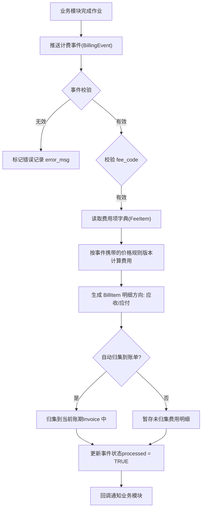
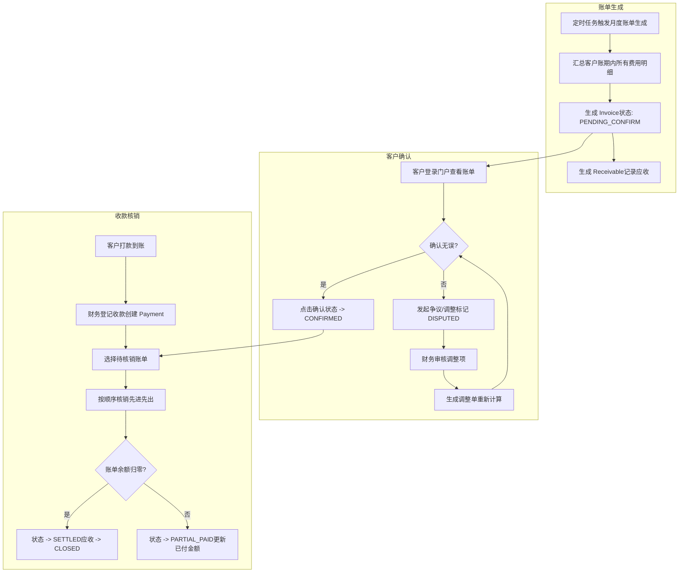
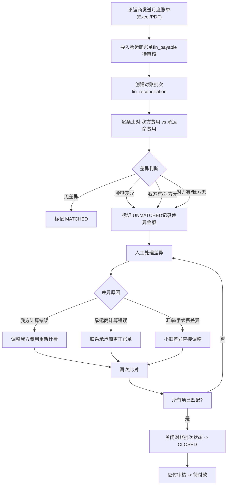

# MYOW-Finance 业务设计文档

## 目录
- **01** 概述与业务边界
- **02** 领域模型设计
- **03** 数据库表结构设计
- **04** API 接口设计
- **05** 业务流程设计
- **06** 关键业务规则
- **07** 可实现规格补充
## 01 概述与业务边界

myow-finance 模块是 MYOW Platform 的财务系统（FMS），负责统一费用项字典、计费事件、费用明细、应收/应付账单、账户、对账核销、收付款和财务报表。业务合同与价格规则归属具体业务模块，finance 不维护海外仓或头程合同本身。

### 1.1 核心职责

#### 计费引擎

接收业务模块推送的计费事件和价格规则匹配结果，按统一费用项字典生成费用明细，支持重算、作废、调整和幂等处理。

#### 应收管理

客户月度账单的自动生成、账单详情查询、账单确认/调整、应收账款账龄与催收管理。

#### 应付管理

承运商、供应商、仓库等相关应付费用的账单导入、费用审核、差异分析与付款计划管理。

#### 对账与核销

客户账单与预付款/信用额度的核销、承运商账单差异处理、银行收款到账核销。

#### 付款审批

承运商/供应商付款申请、多级审批流、付款计划、付款回单关联。

#### 财务报表

客户利润分析、仓单均成本、应收周转天数、账龄分析等关键财务指标。

### 1.2 与周边模块的协作关系

| 模块 | 协作内容 | 数据流向 |
| --- | --- | --- |
| myow-overseas | 入库/出库/仓储/增值作业完成后推送计费事件 | overseas -> finance（计费事件） |
| myow-firstmile | 头程运输配送完成后推送计费事件 | firstmile -> finance（头程费用） |
| myow-customer | 查询客户主数据、结算偏好、开票信息 | finance -> customer（客户主数据查询） |
| myow-system | 定时任务（账单生成、对账提醒、逾期催收） | system 提供任务调度 |

设计原则：费用项字典归属 finance，业务合同和价格规则归属业务模块。overseas/firstmile 在作业完成后推送计费事件，并携带 fee_code、计费基数、命中的合同/价格规则版本；finance 负责生成费用明细、账单、账户占用与收付款。

## 02 领域模型设计

myow-finance 模块围绕"费用项字典 → 计费事件 → 费用明细 → 账单 → 应收/应付 → 对账核销 → 付款"的主链路。所有业务计费触发由业务模块负责，finance 模块负责账务计算、归集和流转。

### 2.1 核心领域实体

#### FeeItem（费用项字典）

统一维护 fee_code、fee_name、费用方向、适用业务域、默认计费单位、税类和启停状态。业务模块的合同价格规则必须引用 fee_code。

#### BillingEvent（计费事件）

由业务模块推送的计费原始事件。包含业务类型（入库/出库/仓储/头程/尾程/VAS）、业务编号、客户 ID、操作发生时间、数量、重量、体积等信息。

#### BillItem（费用明细）

计费引擎根据事件+费项规则计算出的单条费用。包含费项编码、费率版本、计费基数、单价、折扣、税额、总金额与费用方向和币种。

#### Invoice（账单）

按时间周期（月度/自定义区间）和客户汇总生成的费用集合。包含账单编号、客户ID、账期、总额、已付额、余额与账单状态。

#### Receivable（应收）

面向客户的应收账款记录，与 Invoice 一一对应或按合同周期汇总。包含应收日期、账龄、到期日、信用状态、催收记录。

#### Payable（应付）

面向承运商/供应商的应付账款。包含应付对象类型（承运商/供应商/海外仓）、证明单据号、费用明细、审核状态。

#### Payment（付款记录）

客户到账登记（收款核销）和承运商付款记录（付款执行）。包含付款方/收款方、金额、币种、付款方式、银行流水号、关联单据。

#### Reconciliation（对账）

对账批次记录，包含对账周期、对账方类型（客户/承运商）、对账方 ID、差异明细与处理状态。

#### PaymentApproval（付款审批）

应付付款的审批单据，包含申请金额、审批节点、当前审批人、审批历史、付款计划关联。

### 2.2 领域实体关系图

```mermaid
erDiagram
    BillingEvent ||--o{ BillItem : "计算产生"
    BillItem }o--|| Invoice : "汇总归集"
    Invoice ||--|| Receivable : "生成应收"
    Invoice ||--o{ Reconciliation : "参与对账"
    BillItem }o--|| Payable : "归集应付"
    Payable ||--o{ PaymentApproval : "发起审批"
    PaymentApproval ||--|| Payment : "审批后付款"
    Payment ||--o{ Invoice : "核销"
    Payment ||--o{ Payable : "支付"

    BillingEvent {
        string eventId PK
        string bizType "业务类型代码"
        string bizNo "业务单号"
        string customerId "客户ID"
        string carrierId "承运商ID(可选)"
        string warehouseId "仓库ID"
        decimal quantity "数量"
        decimal weight "重量(kg)"
        decimal volume "体积(m3)"
        jsonb extraInfo "扩展字段"
        datetime occurredAt "业务发生时间"
        datetime createdAt "事件创建时间"
        bool processed "是否已处理"
    }
    BillItem {
        string itemId PK
        string feeCode "费项编码"
        string feeName "费项名称"
        string chargeDirection "费用方向(应收/应付)"
        decimal baseAmount "计费基数"
        decimal unitPrice "单价"
        decimal quantity "数量"
        decimal subtotal "小计"
        decimal discountRate "折扣率"
        decimal discountAmount "折扣额"
        decimal taxRate "税率"
        decimal taxAmount "税额"
        decimal totalAmount "总金额"
        string currency "币种"
        string ruleSnapshot "费率快照JSON"
        datetime billingDate "计费日期"
        string status "状态"
    }
    Invoice {
        string invoiceId PK
        string invoiceNo "账单编号"
        string customerId "客户ID"
        string invoiceType "账单类型(月度/临时)"
        date periodStart "账期开始"
        date periodEnd "账期结束"
        decimal totalAmount "账单总额"
        decimal paidAmount "已付金额"
        decimal balance "余额"
        string currency "币种"
        string status "状态(待确认/已确认/部分付款/已结清/已逾期)"
        datetime issuedAt "出账日期"
        date dueDate "付款到期日"
        datetime confirmedAt "确认时间"
    }
    Receivable {
        string receivableId PK
        string invoiceId FK
        string customerId "客户ID"
        decimal amount "应收金额"
        decimal collectedAmount "已收金额"
        decimal outstandingAmount "未收金额"
        int agingDays "账龄天数"
        string agingBucket "账龄区间"
        string creditStatus "信用状态"
        date dueDate "到期日"
        date lastFollowUp "最后催收日期"
        string status "状态"
    }
    Payable {
        string payableId PK
        string payableType "对象类型(承运商/供应商/仓库)"
        string payablePartyId "对象ID"
        string sourceDocNo "原始单据号"
        decimal amount "应付金额"
        decimal paidAmount "已付金额"
        decimal outstandingAmount "未付金额"
        string currency "币种"
        date dueDate "到期日"
        string status "状态(待审核/待付款/已付款)"
    }
    Payment {
        string paymentId PK
        string paymentType "类型(收款/付款)"
        string partyId "对方ID"
        string partyName "对方名称"
        string direction "方向(收入/支出)"
        decimal amount "金额"
        string currency "币种"
        string paymentMethod "付款方式(银行转账/支付宝/预付扣款)"
        string bankRefNo "银行流水号"
        string remarks "备注"
        datetime paymentDate "付款日期"
        string status "状态"
    }
    Reconciliation {
        string reconId PK
        string reconType "对账类型(客户/承运商)"
        string partyId "对账方ID"
        date periodStart "对账周期开始"
        date periodEnd "对账周期结束"
        int totalItems "总计费项数"
        int matchedItems "已匹配项数"
        int unmatchedItems "差异项数"
        decimal totalAmount "我方总额"
        decimal partyAmount "对方总额"
        decimal differenceAmount "差异金额"
        string status "状态"
    }
    PaymentApproval {
        string approvalId PK
        string payableId FK
        decimal requestedAmount "申请金额"
        string currency "币种"
        string purpose "付款用途"
        string currentApprover "当前审批人"
        string approvalChain "审批链JSON"
        int approvalLevel "当前审批层级"
        string status "状态(待提交/审批中/已通过/已驳回/已撤回)"
        datetime submittedAt "提交时间"
        datetime approvedAt "完成时间"
    }
```



领域实体 ER 图：8 个核心实体及关联关系

### 2.3 关键枚举定义

| 枚举名称 | 枚举值 | 说明 |
| --- | --- | --- |
| BizType | INBOUND_RECEIVE, INBOUND_PUTAWAY, OUTBOUND_PICK, OUTBOUND_PACK, OUTBOUND_SHIP, STORAGE_DAILY, VAS_LABELING, VAS_REPACK, FTL_PICKUP, FTL_SEA, FTL_AIR, FTL_DELIVERY, DISTRIBUTION_SHIP | 业务类型，对应各模块的计费事件 |
| FeeDirection | RECEIVABLE（应收）, PAYABLE（应付） | 费用方向 |
| InvoiceStatus | PENDING_CONFIRM, CONFIRMED, PARTIAL_PAID, SETTLED, OVERDUE, CANCELLED | 账单状态 |
| AgingBucket | BUCKET_0_30, BUCKET_31_60, BUCKET_61_90, BUCKET_91_PLUS | 应收账龄区间 |
| ApprovalStatus | DRAFT, PENDING, APPROVED, REJECTED, WITHDRAWN | 审批状态 |
| ReconStatus | PENDING, MATCHING, PARTIAL_MATCH, RESOLVED, CLOSED | 对账状态 |

## 03 数据库表结构设计

以下为 myow-finance 模块的 PostgreSQL DDL 定义，核心包含费用项字典、计费事件、费用明细、账单、应收应付、对账核销与收付款等表。所有表均包含 tenant_id 用于多租户隔离，以及 create_by/create_time/update_by/update_time 审计字段。（审计字段在实际 DDL 中已省略以节省篇幅，线上实施时需补齐）

### 3.1 费用项字典表（fin_fee_item）

```sql
CREATE TABLE fin_fee_item (
    fee_item_id        BIGSERIAL       PRIMARY KEY,
    tenant_id          BIGINT          NOT NULL DEFAULT 0,
    fee_code           VARCHAR(50)     NOT NULL,
    fee_name           VARCHAR(100)    NOT NULL,
    biz_domain         VARCHAR(32)     NOT NULL, -- OVERSEAS / FIRSTMILE / COMMON
    charge_direction   VARCHAR(20)     NOT NULL, -- RECEIVABLE / PAYABLE
    default_unit       VARCHAR(20),
    tax_category       VARCHAR(32),
    status             SMALLINT        DEFAULT 1,
    remark             VARCHAR(512),
    deleted_flag       BOOLEAN         DEFAULT FALSE,
    CONSTRAINT uk_fin_fee_item UNIQUE (tenant_id, fee_code)
);
CREATE INDEX idx_fin_fee_item_domain ON fin_fee_item(tenant_id, biz_domain, status);
COMMENT ON TABLE fin_fee_item IS '费用项字典表';
```

### 3.2 计费事件表（fin_billing_event）

```sql
CREATE TABLE fin_billing_event (
    event_id           BIGSERIAL       PRIMARY KEY,
    tenant_id          BIGINT          NOT NULL DEFAULT 0,
    biz_type           VARCHAR(50)     NOT NULL,
    biz_no             VARCHAR(64)     NOT NULL,
    customer_id        BIGINT          NOT NULL DEFAULT 0,
    carrier_id         BIGINT          DEFAULT 0,
    warehouse_id       BIGINT          DEFAULT 0,
    quantity           NUMERIC(18,4)   DEFAULT 0,
    weight             NUMERIC(18,4)   DEFAULT 0,
    volume             NUMERIC(18,4)   DEFAULT 0,
    extra_info         JSONB           DEFAULT '{}',
    occurred_at        TIMESTAMP       NOT NULL,
    processed          BOOLEAN         DEFAULT FALSE,
    process_time       TIMESTAMP,
    error_msg          TEXT,
    created_at         TIMESTAMP       DEFAULT CURRENT_TIMESTAMP
);
CREATE INDEX idx_fin_be_processed ON fin_billing_event(tenant_id, processed);
CREATE INDEX idx_fin_be_biz_type ON fin_billing_event(tenant_id, biz_type);
CREATE INDEX idx_fin_be_customer ON fin_billing_event(tenant_id, customer_id);
```

### 3.3 费用明细表（fin_bill_item）

```sql
CREATE TABLE fin_bill_item (
    item_id            BIGSERIAL       PRIMARY KEY,
    tenant_id          BIGINT          NOT NULL DEFAULT 0,
    event_id           BIGINT          NOT NULL,
    invoice_id         BIGINT          DEFAULT 0,
    fee_code           VARCHAR(50)     NOT NULL,
    fee_name           VARCHAR(100)    NOT NULL,
    charge_direction   VARCHAR(20)     NOT NULL, -- RECEIVABLE / PAYABLE
    charge_base        NUMERIC(18,4)   NOT NULL DEFAULT 0,
    unit_price         NUMERIC(18,4)   DEFAULT 0,
    quantity           NUMERIC(18,4)   DEFAULT 0,
    subtotal           NUMERIC(18,4)   DEFAULT 0,
    discount_rate      NUMERIC(5,4)    DEFAULT 0,
    discount_amount    NUMERIC(18,4)   DEFAULT 0,
    tax_rate           NUMERIC(5,4)    DEFAULT 0,
    tax_amount         NUMERIC(18,4)   DEFAULT 0,
    total_amount       NUMERIC(18,4)   NOT NULL DEFAULT 0,
    currency           VARCHAR(3)      NOT NULL DEFAULT 'USD',
    rule_snapshot      JSONB           NOT NULL DEFAULT '{}',
    billing_date       DATE            NOT NULL,
    status             VARCHAR(20)     NOT NULL DEFAULT 'ACTIVE',
    remarks            VARCHAR(500),
    created_at         TIMESTAMP       DEFAULT CURRENT_TIMESTAMP
);
CREATE INDEX idx_fin_bi_event ON fin_bill_item(tenant_id, event_id);
CREATE INDEX idx_fin_bi_invoice ON fin_bill_item(tenant_id, invoice_id);
CREATE INDEX idx_fin_bi_fee_code ON fin_bill_item(tenant_id, fee_code);
CREATE INDEX idx_fin_bi_billing_date ON fin_bill_item(tenant_id, billing_date);
```

### 3.3 账单表（fin_invoice）

```sql
CREATE TABLE fin_invoice (
    invoice_id         BIGSERIAL       PRIMARY KEY,
    tenant_id          BIGINT          NOT NULL DEFAULT 0,
    invoice_no         VARCHAR(64)     NOT NULL UNIQUE,
    customer_id        BIGINT          NOT NULL,
    invoice_type       VARCHAR(20)     NOT NULL DEFAULT 'MONTHLY', -- MONTHLY / TEMP
    period_start       DATE            NOT NULL,
    period_end         DATE            NOT NULL,
    total_amount       NUMERIC(18,2)   NOT NULL DEFAULT 0,
    paid_amount        NUMERIC(18,2)   DEFAULT 0,
    balance            NUMERIC(18,2)   DEFAULT 0,
    currency           VARCHAR(3)      NOT NULL DEFAULT 'USD',
    status             VARCHAR(20)     NOT NULL DEFAULT 'PENDING_CONFIRM',
    issued_at          TIMESTAMP       DEFAULT CURRENT_TIMESTAMP,
    due_date           DATE,
    confirmed_at       TIMESTAMP,
    confirmed_by       BIGINT          DEFAULT 0,
    cancelled_at       TIMESTAMP,
    cancel_reason      VARCHAR(500),
    remarks            VARCHAR(500),
    created_at         TIMESTAMP       DEFAULT CURRENT_TIMESTAMP
);
CREATE INDEX idx_fin_inv_customer ON fin_invoice(tenant_id, customer_id);
CREATE INDEX idx_fin_inv_status ON fin_invoice(tenant_id, status);
CREATE INDEX idx_fin_inv_period ON fin_invoice(tenant_id, period_start, period_end);
```

### 3.4 应收账款表（fin_receivable）

```sql
CREATE TABLE fin_receivable (
    receivable_id      BIGSERIAL       PRIMARY KEY,
    tenant_id          BIGINT          NOT NULL DEFAULT 0,
    invoice_id         BIGINT          NOT NULL,
    customer_id        BIGINT          NOT NULL,
    amount             NUMERIC(18,2)   NOT NULL DEFAULT 0,
    collected_amount   NUMERIC(18,2)   DEFAULT 0,
    outstanding_amount NUMERIC(18,2)   DEFAULT 0,
    aging_days         INT             DEFAULT 0,
    aging_bucket       VARCHAR(20),    -- BUCKET_0_30 / BUCKET_31_60 / ...
    credit_status      VARCHAR(20)     DEFAULT 'NORMAL',
    due_date           DATE            NOT NULL,
    last_follow_up     DATE,
    follow_up_count    INT             DEFAULT 0,
    follow_up_notes    TEXT,
    status             VARCHAR(20)     NOT NULL DEFAULT 'PENDING',
    created_at         TIMESTAMP       DEFAULT CURRENT_TIMESTAMP
);
CREATE INDEX idx_fin_rec_customer ON fin_receivable(tenant_id, customer_id);
CREATE INDEX idx_fin_rec_aging ON fin_receivable(tenant_id, aging_bucket);
CREATE INDEX idx_fin_rec_status ON fin_receivable(tenant_id, status);
```

### 3.5 应付账款表（fin_payable）

```sql
CREATE TABLE fin_payable (
    payable_id         BIGSERIAL       PRIMARY KEY,
    tenant_id          BIGINT          NOT NULL DEFAULT 0,
    payable_type       VARCHAR(20)     NOT NULL, -- CARRIER / SUPPLIER / WAREHOUSE
    payable_party_id   BIGINT          NOT NULL,
    source_doc_no      VARCHAR(64),
    amount             NUMERIC(18,2)   NOT NULL DEFAULT 0,
    paid_amount        NUMERIC(18,2)   DEFAULT 0,
    outstanding_amount NUMERIC(18,2)   DEFAULT 0,
    currency           VARCHAR(3)      NOT NULL DEFAULT 'USD',
    due_date           DATE,
    bill_received      BOOLEAN         DEFAULT FALSE,
    status             VARCHAR(20)     NOT NULL DEFAULT 'PENDING_AUDIT', -- PENDING_AUDIT / PENDING_PAYMENT / PAID
    audit_time         TIMESTAMP,
    auditor_id         BIGINT,
    audit_remark       VARCHAR(500),
    created_at         TIMESTAMP       DEFAULT CURRENT_TIMESTAMP
);
CREATE INDEX idx_fin_pay_type ON fin_payable(tenant_id, payable_type, payable_party_id);
CREATE INDEX idx_fin_pay_status ON fin_payable(tenant_id, status);
```

### 3.6 付款记录表（fin_payment）

```sql
CREATE TABLE fin_payment (
    payment_id         BIGSERIAL       PRIMARY KEY,
    tenant_id          BIGINT          NOT NULL DEFAULT 0,
    payment_type       VARCHAR(20)     NOT NULL, -- RECEIPT / DISBURSEMENT
    party_id           BIGINT          NOT NULL,
    party_name         VARCHAR(200),
    direction          VARCHAR(10)     NOT NULL, -- INCOME / EXPENSE
    amount             NUMERIC(18,2)   NOT NULL,
    currency           VARCHAR(3)      NOT NULL DEFAULT 'USD',
    payment_method     VARCHAR(50)     NOT NULL, -- BANK_TRANSFER / ALIPAY / CREDIT_DEDUCTION
    bank_ref_no        VARCHAR(100),
    transaction_date   DATE            NOT NULL,
    remarks            VARCHAR(500),
    status             VARCHAR(20)     NOT NULL DEFAULT 'PENDING',
    created_by         BIGINT,
    created_at         TIMESTAMP       DEFAULT CURRENT_TIMESTAMP
);
CREATE INDEX idx_fin_pay_type ON fin_payment(tenant_id, payment_type, party_id);
CREATE INDEX idx_fin_pay_date ON fin_payment(tenant_id, transaction_date);
```

### 3.7 对账表（fin_reconciliation + fin_reconciliation_item）

```sql
CREATE TABLE fin_reconciliation (
    recon_id           BIGSERIAL       PRIMARY KEY,
    tenant_id          BIGINT          NOT NULL DEFAULT 0,
    recon_type         VARCHAR(20)     NOT NULL, -- CUSTOMER / CARRIER
    party_id           BIGINT          NOT NULL,
    period_start       DATE            NOT NULL,
    period_end         DATE            NOT NULL,
    total_items        INT             DEFAULT 0,
    matched_items      INT             DEFAULT 0,
    unmatched_items    INT             DEFAULT 0,
    our_total          NUMERIC(18,2)   DEFAULT 0,
    party_total        NUMERIC(18,2)   DEFAULT 0,
    difference_amount  NUMERIC(18,2)   DEFAULT 0,
    result             JSONB           DEFAULT '{}',
    status             VARCHAR(20)     NOT NULL DEFAULT 'PENDING',
    resolved_at        TIMESTAMP,
    created_at         TIMESTAMP       DEFAULT CURRENT_TIMESTAMP
);

CREATE TABLE fin_reconciliation_item (
    recon_item_id      BIGSERIAL       PRIMARY KEY,
    tenant_id          BIGINT          NOT NULL DEFAULT 0,
    recon_id           BIGINT          NOT NULL REFERENCES fin_reconciliation(recon_id),
    source_type        VARCHAR(20)     NOT NULL, -- BILL / STATEMENT / IMPORT
    source_id          BIGINT,
    fee_code           VARCHAR(50),
    our_amount         NUMERIC(18,2)   DEFAULT 0,
    party_amount       NUMERIC(18,2)   DEFAULT 0,
    difference         NUMERIC(18,2)   DEFAULT 0,
    match_status       VARCHAR(20)     NOT NULL DEFAULT 'UNMATCHED',
    resolution         VARCHAR(500),
    created_at         TIMESTAMP       DEFAULT CURRENT_TIMESTAMP
);
CREATE INDEX idx_fin_recon_party ON fin_reconciliation(tenant_id, recon_type, party_id);
CREATE INDEX idx_fin_recon_status ON fin_reconciliation(tenant_id, status);
CREATE INDEX idx_fin_recon_item_recon ON fin_reconciliation_item(recon_id);
```

### 3.8 付款审批表（fin_payment_approval）

```sql
CREATE TABLE fin_payment_approval (
    approval_id        BIGSERIAL       PRIMARY KEY,
    tenant_id          BIGINT          NOT NULL DEFAULT 0,
    payable_id         BIGINT          NOT NULL,
    requested_amount   NUMERIC(18,2)   NOT NULL,
    currency           VARCHAR(3)      NOT NULL DEFAULT 'USD',
    purpose            VARCHAR(500)    NOT NULL,
    current_approver   BIGINT,
    approval_chain     JSONB           NOT NULL DEFAULT '[]',
    approval_level     INT             DEFAULT 0,
    status             VARCHAR(20)     NOT NULL DEFAULT 'DRAFT', -- DRAFT / PENDING / APPROVED / REJECTED / WITHDRAWN
    submitted_at       TIMESTAMP,
    approved_at        TIMESTAMP,
    reject_reason      VARCHAR(500),
    attachment_ids     JSONB           DEFAULT '[]',
    created_by         BIGINT,
    created_at         TIMESTAMP       DEFAULT CURRENT_TIMESTAMP
);

CREATE TABLE fin_approval_history (
    history_id         BIGSERIAL       PRIMARY KEY,
    tenant_id          BIGINT          NOT NULL DEFAULT 0,
    approval_id        BIGINT          NOT NULL REFERENCES fin_payment_approval(approval_id),
    approver_id        BIGINT          NOT NULL,
    action             VARCHAR(20)     NOT NULL, -- APPROVE / REJECT / FORWARD
    comment            VARCHAR(500),
    acted_at           TIMESTAMP       DEFAULT CURRENT_TIMESTAMP
);
CREATE INDEX idx_fin_pa_status ON fin_payment_approval(tenant_id, status);
CREATE INDEX idx_fin_pa_approver ON fin_payment_approval(tenant_id, current_approver);
CREATE INDEX idx_fin_ah_approval ON fin_approval_history(approval_id);
```

## 04 API 接口设计

myow-finance 模块按 RESTful 风格设计 API，划分为计费引擎、账单管理、应收管理、应付管理、付款管理、对账核销、付款审批和财务报表 8 个 Controller 组。所有接口均以 /api/finance 为前缀，需携带 X-Tenant-Id 请求头。

### 4.1 计费引擎（BillingController）

| 方法 | 路径 | 说明 |
| --- | --- | --- |
| POST | /api/finance/billing/events | 接收业务模块推送的计费事件 |
| GET | /api/finance/billing/events | 分页查询计费事件列表（支持按客户/业务类型/时间筛选） |
| GET | /api/finance/billing/events/{id} | 查询单条计费事件详情 |
| POST | /api/finance/billing/calculate | 手动触发指定事件重新计费（重算） |
| POST | /api/finance/billing/batch-issue | 批量处理积压未处理的计费事件 |

### 4.2 费用明细（BillItemController）

| 方法 | 路径 | 说明 |
| --- | --- | --- |
| GET | /api/finance/bill-items | 分页查询费用明细（支持按事件/账单/费项/方向筛选） |
| GET | /api/finance/bill-items/{id} | 查询单条费用明细详情 |
| GET | /api/finance/bill-items/by-invoice/{invoiceId} | 按账单 ID 查询其下所有费用明细 |
| POST | /api/finance/bill-items/_export | 导出费用明细（Excel） |

### 4.3 账单管理（InvoiceController）

| 方法 | 路径 | 说明 |
| --- | --- | --- |
| GET | /api/finance/invoices | 分页查询账单列表（支持按客户/状态/账期筛选） |
| GET | /api/finance/invoices/{id} | 查询账单详情（含费用明细汇总） |
| POST | /api/finance/invoices | 手动创建账单（指定客户、账期、费用项） |
| POST | /api/finance/invoices/generate-monthly | 触发月度账单自动生成（定时任务调用） |
| PUT | /api/finance/invoices/{id}/confirm | 客户确认账单 |
| PUT | /api/finance/invoices/{id}/adjust | 调整账单（指定调整项与原因） |
| PUT | /api/finance/invoices/{id}/cancel | 作废账单 |
| GET | /api/finance/invoices/{id}/pdf | 下载账单 PDF |

### 4.4 应收管理（ReceivableController）

| 方法 | 路径 | 说明 |
| --- | --- | --- |
| GET | /api/finance/receivables | 分页查询应收账款 |
| GET | /api/finance/receivables/aging | 账龄分析报表 |
| GET | /api/finance/receivables/customer/{id} | 查询指定客户的应收汇总 |
| PUT | /api/finance/receivables/{id}/write-off | 核销指定应收记录 |
| POST | /api/finance/receivables/{id}/follow-up | 记录催收操作 |

### 4.5 应付管理（PayableController）

| 方法 | 路径 | 说明 |
| --- | --- | --- |
| GET | /api/finance/payables | 分页查询应付账款 |
| POST | /api/finance/payables | 手动录入应付费用 |
| POST | /api/finance/payables/_import | 导入承运商账单（Excel/CSV） |
| PUT | /api/finance/payables/{id}/audit | 审核应付（通过/驳回） |
| GET | /api/finance/payables/carrier/{id} | 查询指定承运商的应付汇总 |

### 4.6 付款管理（PaymentController）

| 方法 | 路径 | 说明 |
| --- | --- | --- |
| GET | /api/finance/payments | 分页查询付款记录 |
| POST | /api/finance/payments | 登记收款（客户到账） |
| POST | /api/finance/payments/disburse | 登记付款（向承运商/供应商付款） |
| POST | /api/finance/payments/write-off | 付款核销（关联应收/应付单据） |

### 4.7 对账核销（ReconciliationController）

| 方法 | 路径 | 说明 |
| --- | --- | --- |
| GET | /api/finance/reconciliations | 分页查询对账记录 |
| POST | /api/finance/reconciliations | 创建对账批次 |
| PUT | /api/finance/reconciliations/{id}/resolve | 处理对账差异 |
| POST | /api/finance/reconciliations/{id}/close | 关闭对账批次 |
| POST | /api/finance/reconciliations/compare | 逐条比对账单差异 |

### 4.8 付款审批（PaymentApprovalController）

| 方法 | 路径 | 说明 |
| --- | --- | --- |
| GET | /api/finance/approvals | 分页查询审批列表（支持按状态/审批人筛选） |
| POST | /api/finance/approvals | 提交付款审批申请 |
| PUT | /api/finance/approvals/{id}/approve | 审批通过 |
| PUT | /api/finance/approvals/{id}/reject | 审批驳回 |
| GET | /api/finance/approvals/my-pending | 查询当前用户的待审批列表 |

### 4.9 财务报表（FinanceReportController）

| 方法 | 路径 | 说明 |
| --- | --- | --- |
| GET | /api/finance/reports/customer-profit | 客户利润分析报表 |
| GET | /api/finance/reports/warehouse-cost | 仓库单均成本报表 |
| GET | /api/finance/reports/receivable-aging | 应收账龄分析报表 |
| GET | /api/finance/reports/monthly-summary | 月度财务汇总报表 |
| POST | /api/finance/reports/_export | 导出财务数据（Excel） |

## 05 业务流程设计

myow-finance 模块包含四个核心业务流程：计费引擎处理链路、应收对账与核销、承运商账单对账、付款审批流程。

### 5.1 计费引擎处理流程

业务模块在完成作业后推送计费事件。业务合同与价格规则由业务模块匹配，finance 校验 fee_code 和计费基数，生成费用明细并归集到账单。



计费引擎核心处理链路：事件驱动、规则匹配、自动计费

### 5.2 应收对账与核销流程

月度账单生成后，客户可在卖家门户查看并确认。客户付款到账后，财务人员按照"先到款——后核销"的原则进行应收冲抵。



应收对账与核销全流程：账单生成 → 客户确认 → 收款核销

### 5.3 承运商账单对账流程

承运商/船公司每月提供物流账单，我方需将原始费用明细与承运商账单逐条比对，处理差异后生成应付。



承运商账单对账流程：账单导入 → 逐条比对 → 差异处理 → 关闭

### 5.4 付款审批流程

对承运商/供应商的付款需要经过多级审批。审批链可根据应付金额自动路由到不同层级的管理者，超过阈值还需总经理审批。

```mermaid
flowchart TB
    A["应付审核通过发起付款申请"] --> B["确定审批链"]
    B --> C{"金额判断"}
    C -->||$5,000 ~ $50,000| E["财务经理审批"]
    C -->|> $50,000| F["财务经理审批+总经理审批"]
    D --> G{"审批结果"}
    E --> G
    F --> G
    G -->|通过| H{"下一审批层级?"}
    H -->|有| I["流转至下一审批人"]
    I --> G
    H -->|无| J["终审通过状态 -> APPROVED"]
    G -->|驳回| K["状态 -> REJECTED记录驳回原因"]
    J --> L["执行付款创建 Payment"]
    L --> M["更新应付状态-> PAID"]
    K --> N["返回申请人可修改后重新提交"]
```

付款审批流程：申请 → 金额路由 → 多级审批 → 执行付款

## 06 关键业务规则

### 6.1 计费规则

| 规则名称 | 规则描述 | 优先级 |
| --- | --- | --- |
| 费项匹配 | 根据 BillingEvent.bizType + customer_id 查询客户合同下的有效费项规则，若无独立合同则使用平台默认费率 | 1 |
| 计费模型 | 支持 6 种计费模型：固定费用、按数量、按重量、按体积、按重量/体积取大、阶梯费率（分段计费） | 2 |
| 币种转换 | 若费项币种与客户合同约定币种不一致，按系统维护的汇率表折算（取账单生成日汇率） | 3 |
| 折扣计算 | 先按客户等级折扣率计算折扣金额（discountAmount = subtotal * discountRate），再计税 | 4 |
| 税额计算 | taxAmount = (subtotal - discountAmount) * taxRate，totalAmount = subtotal - discountAmount + taxAmount | 5 |
| 事件重复处理 | 同一 event_id 只计费一次（幂等），重算时需要先作废原 BillItem 再重新生成 | 6 |
| 仓储费规则 | 按 SKU × 日费率 × 在库天数计算（在库天数为自然日）。支持免租期（常用 3~5 天） | 7 |

### 6.2 账单生成规则

| 规则名称 | 规则描述 |
| --- | --- |
| 账期规则 | 月度账单以自然月为周期（上月 1 日 00:00:00 至 上月最后一天 23:59:59） |
| 出账时机 | 每月第 1 个工作日凌晨自动触发上月账单生成，也支持管理员手动出账 |
| 归集原则 | BillItem.billing_date 落在账期范围内方可归集；跨月费用按实际发生日期拆分 |
| 账单确认 | 客户在出账后 7 个自然日内未确认则自动标记为已确认（自动确认超时） |
| 账单调整 | 调整需要生成 AdjustItem 作为痕迹，原 BillItem 标记 VOIDED，不允许直接修改 |

### 6.3 应收与信用规则

| 规则名称 | 规则描述 |
| --- | --- |
| 账龄计算 | agingDays = (当前日期 - dueDate) 的差值，每日凌晨定时任务更新 |
| 账龄区间划分 | 0-30 天（正常）、31-60 天（关注）、61-90 天（次级）、91 天以上（可疑） |
| 信用控制 | 当 outstandingAmount 超过客户信用额度 80% 时，向客户发送信用预警通知 |
| 逾期处理 | 应收逾期超过 90 天，暂停该客户的所有新业务作业（入库/出库均不可操作），直至结清欠款 |
| 催收策略 | 逾期 15 天自动发送催收邮件；逾期 30 天客服人工电话催收；逾期 60 天发送律师函 |
| 核销顺序 | 按 FIFO 原则：先核销到期日最早的账单，同一天有多笔的按金额从大到小 |

### 6.4 付款审批规则

| 规则名称 | 规则描述 |
| --- | --- |
| 金额分级 | $0 ~ $4,999: 财务主管审批；$5,000 ~ $49,999: 财务经理审批；$50,000+: 财务经理 + 总经理双签 |
| 审批超时 | 审批人 48 小时内未操作，自动催办通知；72 小时未操作，自动转至上级审批人 |
| 驳回规则 | 驳回后申请人可修改重新提交，重新提交后的审批链从头开始，原审批记录保留 |
| 付款时效 | 审批通过后的付款申请需在 3 个工作日内完成付款执行 |

### 6.5 对账规则

| 规则名称 | 规则描述 |
| --- | --- |
| 自动比对 | 导入承运商账单后，按 tracking_no + fee_code 与系统 BillItem 自动匹配 |
| 容差阈值 | 单个费项差异 ≤ $2.00 或 ≤ 2%（取较小值），自动视为匹配（标记为 MINOR_DIFF） |
| 对账锁定 | 对账批次关闭后，该周期内的 BillItem 和应付记录不可再修改 |

## 07 可实现规格补充

### 7.1 模块包结构

```
com.myow.finance
├── interfaces
│   ├── controller
│   │   ├── BillingController.java
│   │   ├── BillItemController.java
│   │   ├── InvoiceController.java
│   │   ├── ReceivableController.java
│   │   ├── PayableController.java
│   │   ├── PaymentController.java
│   │   ├── ReconciliationController.java
│   │   ├── PaymentApprovalController.java
│   │   └── FinanceReportController.java
│   ├── dto
│   │   ├── request
│   │   │   ├── BillingEventRequest.java
│   │   │   ├── InvoiceGenerateRequest.java
│   │   │   ├── PaymentWriteOffRequest.java
│   │   │   └── ApprovalRequest.java
│   │   └── response
│   │       ├── InvoiceVO.java
│   │       ├── ReceivableAgingVO.java
│   │       └── FinanceReportVO.java
│   └── event
│       ├── BillingEventHandler.java        -- 接收业务模块计费事件
│       ├── InvoiceConfirmedEvent.java      -- 账单确认后的事件发布
│       └── PaymentReceivedEvent.java       -- 收款到账后的事件发布
├── application
│   ├── service
│   │   ├── BillingService.java             -- 计费引擎核心服务
│   │   ├── InvoiceService.java             -- 账单管理服务
│   │   ├── ReceivableService.java          -- 应收管理服务
│   │   ├── PayableService.java             -- 应付管理服务
│   │   ├── PaymentService.java             -- 付款/核销服务
│   │   ├── ReconciliationService.java      -- 对账服务
│   │   ├── PaymentApprovalService.java     -- 付款审批服务
│   │   └── FinanceReportService.java       -- 报表服务
│   └── converter
│       ├── BillItemConverter.java          -- MapStruct 转换器
│       ├── InvoiceConverter.java
│       └── PaymentConverter.java
├── domain
│   ├── entity
│   │   ├── BillingEvent.java
│   │   ├── BillItem.java
│   │   ├── Invoice.java
│   │   ├── Receivable.java
│   │   ├── Payable.java
│   │   ├── Payment.java
│   │   ├── Reconciliation.java
│   │   └── PaymentApproval.java
│   ├── enums
│   │   ├── BizType.java
│   │   ├── FeeDirection.java
│   │   ├── InvoiceStatus.java
│   │   ├── AgingBucket.java
│   │   ├── ApprovalStatus.java
│   │   └── ReconStatus.java
│   └── service
│       ├── BillingRuleEngine.java          -- 计费规则引擎（策略模式）
│       ├── FeeCalculator.java              -- 费用计算器
│       └── AgingCalculator.java            -- 账龄计算器
└── infrastructure
    ├── persistence
    │   ├── mapper
    │   │   ├── BillingEventMapper.java
    │   │   ├── BillItemMapper.java
    │   │   ├── InvoiceMapper.java
    │   │   ├── ReceivableMapper.java
    │   │   ├── PayableMapper.java
    │   │   ├── PaymentMapper.java
    │   │   ├── ReconciliationMapper.java
    │   │   └── PaymentApprovalMapper.java
    │   └── entity
    │       ├── BillingEventPO.java
    │       ├── BillItemPO.java
    │       ├── InvoicePO.java
    │       ├── ReceivablePO.java
    │       ├── PayablePO.java
    │       ├── PaymentPO.java
    │       ├── ReconciliationPO.java
    │       ├── ReconciliationItemPO.java
    │       ├── PaymentApprovalPO.java
    │       └── ApprovalHistoryPO.java
    ├── gateway
    │   ├── CustomerGateway.java            -- 调用 myow-customer 获取客户主数据/结算偏好
    │   └── BusinessRuleGateway.java        -- 可选调用业务模块校验合同/价格规则版本
    └── config
        ├── BillingEventReceiver.java       -- 事件监听（Spring ApplicationEvent）
        └── FinanceScheduleConfig.java      -- 定时任务配置
```

### 7.2 计费引擎实现要点

- 策略模式：FeeCalculator 接口定义 calculate(BillingEvent, FeeRule) 方法，每种计费模型（固定/按量/按重/阶梯等）实现各自的计算策略，通过 FeeCalculatorRegistry 注册

- 费用项缓存：费用项字典缓存在 Redis 中（key: finance:fee_item:{fee_code}），计费事件到达时优先查缓存，缓存未命中回查数据库

- 异步处理：BillingEventReceiver 将收到的计费事件写入阻塞队列或 Redis Stream，由后台线程池异步消费，消费完成后更新事件状态并回调业务模块

### 7.3 事件驱动集成

采用 Spring ApplicationEvent 实现 finance 模块与业务模块的松耦合集成：

| 事件名称 | 发布方 | 消费方 | 触发时机 |
| --- | --- | --- | --- |
| BillingEventPublished | overseas / firstmile | finance | 业务作业完成后 |
| InvoiceConfirmedEvent | finance | customer（通知客户） | 客户确认账单后 |
| PaymentReceivedEvent | finance | customer（更新信用额度） | 收款到账并核销后 |
| CreditWarningEvent | finance | system（发送通知） | 客户信用接近上限时 |

### 7.4 定时任务清单

| 任务名称 | 调度频率 | 执行逻辑 |
| --- | --- | --- |
| 月度账单生成 | 每月第 1 个工作日 02:00 | 汇总上月所有已出 BillItem，按客户分组生成 Invoice 和 Receivable |
| 账龄更新 | 每日 03:00 | 更新所有未结清应收的 agingDays 和 agingBucket |
| 逾期催收提醒 | 每日 09:00 | 扫描逾期应收，按催收策略发送提醒通知 |
| 计费事件重试 | 每 30 分钟 | 重新处理状态为 ERROR 的计费事件（最多重试 3 次，超过标记 FAILED） |
| 承运商账单到期提醒 | 每周一 10:00 | 扫描 7 天内到期的应付记录，提醒财务人员安排付款 |
| 未确认账单催办 | 每日 10:00 | 扫描出账后超过 5 天仍未确认的账单，发送催办通知 |

### 7.5 计费模型示例：阶梯费率

```
// 阶梯费率规则 JSON (FeeRule.ruleDefinition)
{
  "model": "TIERED",
  "tiers": [
    { "from": 0,     "to": 100,    "unitPrice": 5.00, "unit": "kg" },
    { "from": 101,   "to": 500,    "unitPrice": 4.50, "unit": "kg" },
    { "from": 501,   "to": 1000,   "unitPrice": 4.00, "unit": "kg" },
    { "from": 1001,  "to": null,   "unitPrice": 3.50, "unit": "kg" }
  ],
  "calculation": "TIERED_TOTAL",      // TIERED_TOTAL: 各阶梯金额相加; ALL_AT_TOP: 全部按最高档
  "currency": "USD",
  "rounding": "HALF_UP",
  "scale": 2
}

// 示例计算: 重量 750kg
// TIERED_TOTAL: 100*5.00 + 400*4.50 + 250*4.00 = 500 + 1800 + 1000 = $3,300.00
// ALL_AT_TOP: 750 * 4.00 = $3,000.00
```

### 7.6 汇率管理

系统需维护多币种汇率表（fin_exchange_rate），包含基准币种（USD）、目标币种、汇率值、生效日期和有效期。汇率为每日更新，支持手动修正。费用计算时取账单日期的汇率，同一账单内统一使用单一汇率。

```sql
CREATE TABLE fin_exchange_rate (
    rate_id      BIGSERIAL       PRIMARY KEY,
    tenant_id    BIGINT          NOT NULL DEFAULT 0,
    from_currency VARCHAR(3)     NOT NULL,
    to_currency   VARCHAR(3)     NOT NULL,
    rate         NUMERIC(18,6)   NOT NULL,
    effective_date DATE          NOT NULL,
    source       VARCHAR(20)     DEFAULT 'AUTO', -- AUTO / MANUAL
    created_at   TIMESTAMP       DEFAULT CURRENT_TIMESTAMP,
    UNIQUE(tenant_id, from_currency, to_currency, effective_date)
);
```

MYOW-OMS - myow-finance 业务设计文档 - 版本 v1.0 - 2026年6月
