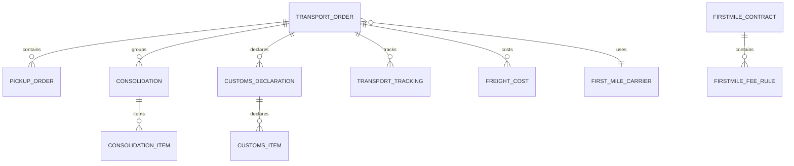
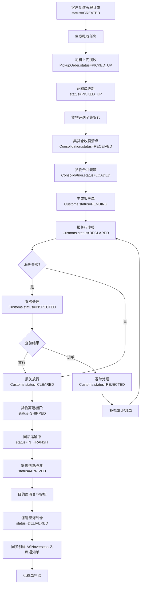
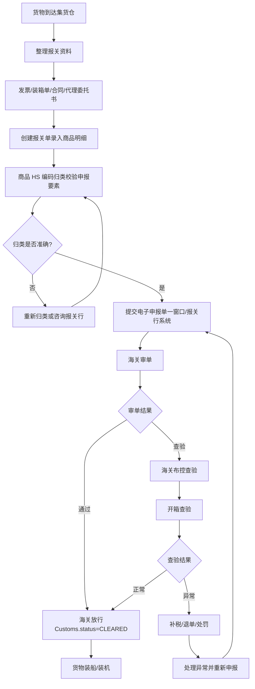
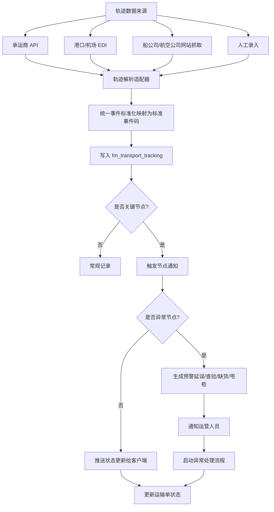
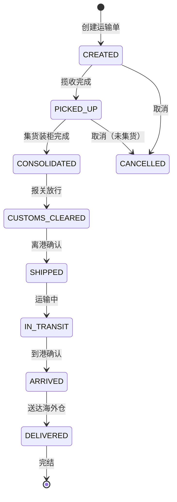

# MYOW-Firstmile 业务设计文档

## 目录
- **01** 概述与业务边界
- **02** 领域模型设计
- **03** 数据库表结构设计
- **04** API 接口设计
- **05** 业务流程设计
- **06** 关键业务规则
- **07** 可实现规格补充
## 01 概述与业务边界

myow-firstmile 模块是 MYOW Platform 的头程物流管理中心，承担货物从国内卖家/供应商到海外仓库这段物流的全生命周期管理。它负责头程运输单、报关、轨迹、头程合同与费用规则；费用确认后向 myow-finance 推送计费事件。

### 1.1 核心职责

#### 国内揽收

揽收单创建、分配司机或第三方揽收商、上门揽收状态跟踪、异常件处理与重新预约。

#### 集货与拼箱

国内集货仓收货、货品清点、货物合并、装箱/打托、生成箱唛与托盘标签。

#### 出口报关

报关单创建、商品 HS 编码申报、单证（发票/装箱单/合同）管理、报关状态跟踪。

#### 国际运输

头程运输方式选择（海运/空运/铁路/卡航）、订舱/订位、船期/航班跟踪、运单管理。

#### 物流跟踪

头程段全程轨迹采集与标准化、关键节点预警（延误、查验、到港）、轨迹可视化。

#### 海外仓预约

货物预计到港时间与海外仓 ASN（入库通知单）对接、预约入库时间窗口、预约变更与取消。

#### 承运商管理

头程承运商（货代/船公司/航空公司）档案维护、运价协议管理、服务评价与考核。

#### 头程费用

头程合同、运价规则、运费、报关费、港杂费、保险费等费用的预估、确认与计费事件推送。

### 1.2 上下游协作关系

| 协作模块 | 协作内容 | 数据流向 |
| --- | --- | --- |
| myow-overseas | 头程货物到达后生成 ASN，预约入库时间 | firstmile -> overseas（运输单完结 -> 创建入库单） |
| myow-overseas | 海外仓回传实际入库数量，用于头程短少索赔 | overseas -> firstmile（入库差异 -> 索赔单） |
| myow-finance | 头程费用确认后推送应付账单 | firstmile -> finance（费用明细 -> 对账/结算） |
| myow-customer | 运输单、合同、费用规则引用客户 ID | firstmile -> customer（客户查询） |
| myow-user | 司机/操作员账号与权限 | user 提供登录与鉴权 |
| myow-system | 定时任务（轨迹抓取、费用结算提醒） | system 提供任务调度 |

头程定义：在本系统中，"头程"（First Mile）指从国内发货方（卖家仓库/工厂）到海外目的仓库之间的完整物流链路，包括国内段运输、出口报关、国际干线运输、目的国清关与末端派送到仓。头程合同与价格规则归属 myow-firstmile；费用项字典、账单、账户和收付款归属 myow-finance。

## 02 领域模型设计

头程物流域以运输单（TransportOrder）为核心聚合根，串联揽收、集货、报关、跟踪、头程合同、费用规则等子域。实体间呈链式关联，符合物流单据随货流转的业务特征。

### 2.1 实体关系图



图 2-1：头程物流核心实体关系

### 2.2 聚合根与实体定义

#### 2.2.1 头程运输单聚合（TransportOrder Aggregate）

以 fm_transport_order 表为核心的聚合，贯穿头程物流全链路。运输单状态机驱动下游各子域的作业节奏。

| 字段 | 类型 | 约束 | 说明 |
| --- | --- | --- | --- |
| transport_id | BIGINT | PK | 运输单唯一标识 |
| transport_no | VARCHAR(32) | NOT NULL, UK | 运输单号 |
| tenant_id | BIGINT | NOT NULL | 所属租户 |
| customer_id | BIGINT | NOT NULL | 委托客户（卖家） |
| carrier_id | BIGINT |  | 头程承运商 |
| transport_mode | VARCHAR(16) | NOT NULL | SEA / AIR / RAIL / ROAD / EXPRESS |
| status | VARCHAR(16) | NOT NULL DEFAULT 'CREATED' | 运输单状态 |
| origin_address | VARCHAR(256) |  | 起运地地址 |
| dest_warehouse_id | BIGINT | NOT NULL | 目的海外仓 |
| etd | DATE |  | 预计离港时间 |
| eta | DATE |  | 预计到港时间 |
| actual_ship_time | TIMESTAMP |  | 实际离港时间 |
| actual_arrival_time | TIMESTAMP |  | 实际到港时间 |
| total_packages | INT | DEFAULT 0 | 总件数 |
| total_weight | DECIMAL(12,3) | DEFAULT 0 | 总重量 kg |
| total_volume | DECIMAL(12,3) | DEFAULT 0 | 总体积 m3 |
| master_bill_no | VARCHAR(32) |  | 主单号（海运提单/空运主单） |
| house_bill_no | VARCHAR(32) |  | 分单号 |
| remark | VARCHAR(512) |  | 备注 |
| create_by | BIGINT |  | 创建人 |
| create_time | TIMESTAMP(3) |  | 创建时间 |
| update_by | BIGINT |  | 更新人 |
| update_time | TIMESTAMP(3) |  | 更新时间 |
| deleted_flag | SMALLINT | DEFAULT 0 | 逻辑删除 |

#### 2.2.2 揽收单实体（PickupOrder）

关联运输单，记录国内段上门揽收信息。一个运输单可包含多个揽收单（多点揽收）。

| 字段 | 类型 | 约束 | 说明 |
| --- | --- | --- | --- |
| pickup_id | BIGINT | PK | 揽收单唯一标识 |
| pickup_no | VARCHAR(32) | NOT NULL, UK | 揽收单号 |
| transport_id | BIGINT | NOT NULL | 关联运输单 |
| pickup_status | VARCHAR(16) | DEFAULT 'PENDING' | PENDING / ASSIGNED / PICKED_UP / EXCEPTION |
| sender_name | VARCHAR(64) |  | 发件人姓名 |
| sender_phone | VARCHAR(32) |  | 发件人电话 |
| sender_address | VARCHAR(256) |  | 发件地址 |
| pickup_time | TIMESTAMP |  | 预约揽收时间 |
| driver_name | VARCHAR(64) |  | 司机/揽收员 |
| driver_phone | VARCHAR(32) |  | 司机电话 |
| packages | INT | DEFAULT 0 | 揽收件数 |
| weight | DECIMAL(10,3) | DEFAULT 0 | 揽收重量 kg |
| exception_reason | VARCHAR(256) |  | 异常原因 |

#### 2.2.3 集货/拼箱单实体（Consolidation）

多个运输单或货品明细在国内集货仓合并后生成，记录装箱信息与托盘信息。头程货品信息采用单据快照，不引用 SKU 主数据。

| 字段 | 类型 | 约束 | 说明 |
| --- | --- | --- | --- |
| consol_id | BIGINT | PK | 集货单唯一标识 |
| consol_no | VARCHAR(32) | NOT NULL, UK | 集货单号 |
| transport_id | BIGINT | NOT NULL | 关联运输单 |
| consol_status | VARCHAR(16) | DEFAULT 'CREATED' | CREATED / RECEIVED / SORTED / LOADED |
| container_no | VARCHAR(32) |  | 集装箱号（海运） |
| seal_no | VARCHAR(32) |  | 铅封号 |
| total_cartons | INT | DEFAULT 0 | 总箱数 |
| total_pallets | INT | DEFAULT 0 | 总托盘数 |
| warehouse_location | VARCHAR(128) |  | 集货仓位置 |

#### 2.2.4 报关单实体（CustomsDeclaration）

出口报关单，关联运输单，包含报关商品明细。

| 字段 | 类型 | 约束 | 说明 |
| --- | --- | --- | --- |
| customs_id | BIGINT | PK | 报关单唯一标识 |
| customs_no | VARCHAR(32) | NOT NULL, UK | 报关单号 |
| transport_id | BIGINT | NOT NULL | 关联运输单 |
| customs_status | VARCHAR(16) | DEFAULT 'PENDING' | PENDING / DECLARED / INSPECTED / CLEARED / REJECTED |
| declarant | VARCHAR(64) |  | 报关行/申报单位 |
| trade_mode | VARCHAR(16) |  | 贸易方式（一般贸易/跨境电商等） |
| total_amount | DECIMAL(14,2) | DEFAULT 0 | 申报总金额 |
| currency | VARCHAR(8) | DEFAULT 'USD' | 币别 |
| customs_port | VARCHAR(64) |  | 报关口岸 |
| declare_time | TIMESTAMP |  | 申报时间 |
| clear_time | TIMESTAMP |  | 放行时间 |

#### 2.2.5 头程轨迹实体（TransportTracking）

记录头程段关键节点，数据来源包括承运商 API 推送、港口/机场 EDI、人工录入。

| 字段 | 类型 | 约束 | 说明 |
| --- | --- | --- | --- |
| tracking_id | BIGINT | PK | 轨迹唯一标识 |
| transport_id | BIGINT | NOT NULL | 关联运输单 |
| event_code | VARCHAR(32) | NOT NULL | 事件编码 |
| event_name | VARCHAR(64) | NOT NULL | 事件名称 |
| event_time | TIMESTAMP(3) | NOT NULL | 事件发生时间 |
| location | VARCHAR(128) |  | 发生地点 |
| description | VARCHAR(512) |  | 事件描述 |
| source | VARCHAR(16) | DEFAULT 'API' | 数据来源：API / EDI / MANUAL |
| create_time | TIMESTAMP(3) |  | 记录时间 |

### 2.3 枚举定义

| 枚举名 | 值 | 说明 |
| --- | --- | --- |
| TransportMode | SEA | 海运 |
|  | AIR | 空运 |
|  | RAIL | 铁路 |
|  | ROAD | 公路/卡航 |
|  | EXPRESS | 国际快递 |
| TransportStatus | CREATED | 已创建 |
|  | PICKED_UP | 已揽收 |
|  | CONSOLIDATED | 已集货 |
|  | CUSTOMS_CLEARED | 已报关放行 |
|  | SHIPPED | 已离港/起飞 |
|  | IN_TRANSIT | 运输中 |
|  | ARRIVED | 已到港/落地 |
|  | DELIVERED | 已送达海外仓 |
| CustomsStatus | PENDING | 待申报 |
|  | DECLARED | 已申报 |
|  | INSPECTED | 查验中 |
|  | CLEARED | 已放行 |
|  | REJECTED | 被退单/拒绝 |
| PickupStatus | PENDING | 待分配 |
|  | ASSIGNED | 已分配 |
|  | PICKED_UP | 已揽收 |
|  | EXCEPTION | 异常 |

## 03 数据库表结构设计

myow-firstmile 模块设计运输单、揽收、集货、报关、轨迹、承运商、头程合同、头程费用规则、费用确认等核心表。头程轨迹表数据量较大，需关注索引与归档策略。

### 3.1 表清单与数据量预估

| 表名 | 中文名 | 预估数据量 | 核心索引 |
| --- | --- | --- | --- |
| fm_transport_order | 头程运输单表 | 万级/租户/年 | uk: transport_no; idx: status + eta |
| fm_pickup_order | 揽收单表 | 万级/租户/年 | idx: transport_id; idx: pickup_status |
| fm_consolidation | 集货拼箱表 | 千级/租户/年 | idx: transport_id |
| fm_consolidation_item | 集货明细表 | 万级/租户/年 | idx: consol_id; idx: item_name |
| fm_customs_declaration | 报关单表 | 千级/租户/年 | uk: customs_no; idx: transport_id |
| fm_customs_item | 报关商品明细表 | 万级/租户/年 | idx: customs_id |
| fm_transport_tracking | 头程轨迹表 | 百万级/租户/年 | idx: transport_id + event_time |
| fm_firstmile_contract | 头程服务合同表 | 千级/租户 | uk: tenant_id + contract_no; idx: customer_id + status |
| fm_firstmile_fee_rule | 头程费用规则表 | 万级/租户 | idx: contract_id + fee_code; idx: route + transport_mode |
| fm_freight_cost | 头程费用表 | 万级/租户/年 | idx: transport_id + cost_type |
| fm_first_mile_carrier | 头程承运商表 | 百级（全局） | uk: carrier_code |

### 3.2 核心表 DDL

#### fm_transport_order（头程运输单表）

```sql
CREATE TABLE fm_transport_order (
    transport_id        BIGINT PRIMARY KEY,
    transport_no        VARCHAR(32) NOT NULL UNIQUE,
    tenant_id           BIGINT NOT NULL,
    customer_id         BIGINT NOT NULL,
    carrier_id          BIGINT,
    transport_mode      VARCHAR(16) NOT NULL,
    status              VARCHAR(16) NOT NULL DEFAULT 'CREATED',
    origin_address      VARCHAR(256),
    dest_warehouse_id   BIGINT NOT NULL,
    etd                 DATE,
    eta                 DATE,
    actual_ship_time    TIMESTAMP,
    actual_arrival_time TIMESTAMP,
    total_packages      INT DEFAULT 0,
    total_weight        DECIMAL(12,3) DEFAULT 0,
    total_volume        DECIMAL(12,3) DEFAULT 0,
    master_bill_no      VARCHAR(32),
    house_bill_no       VARCHAR(32),
    remark              VARCHAR(512),
    create_by           BIGINT,
    create_time         TIMESTAMP(3) DEFAULT CURRENT_TIMESTAMP(3),
    update_by           BIGINT,
    update_time         TIMESTAMP(3) DEFAULT CURRENT_TIMESTAMP(3),
    deleted_flag        BOOLEAN DEFAULT FALSE
);
CREATE INDEX idx_transport_status_eta ON fm_transport_order(status, eta);
CREATE INDEX idx_transport_customer ON fm_transport_order(customer_id, create_time);
CREATE INDEX idx_transport_carrier ON fm_transport_order(carrier_id, status);
COMMENT ON TABLE fm_transport_order IS '头程运输单表';
COMMENT ON COLUMN fm_transport_order.transport_mode IS 'SEA / AIR / RAIL / ROAD / EXPRESS';
```

#### fm_pickup_order（揽收单表）

```sql
CREATE TABLE fm_pickup_order (
    pickup_id       BIGINT PRIMARY KEY,
    pickup_no       VARCHAR(32) NOT NULL UNIQUE,
    transport_id    BIGINT NOT NULL,
    pickup_status   VARCHAR(16) DEFAULT 'PENDING',
    sender_name     VARCHAR(64),
    sender_phone    VARCHAR(32),
    sender_address  VARCHAR(256),
    pickup_time     TIMESTAMP,
    driver_name     VARCHAR(64),
    driver_phone    VARCHAR(32),
    packages        INT DEFAULT 0,
    weight          DECIMAL(10,3) DEFAULT 0,
    exception_reason VARCHAR(256),
    create_by       BIGINT,
    create_time     TIMESTAMP(3) DEFAULT CURRENT_TIMESTAMP(3),
    update_by       BIGINT,
    update_time     TIMESTAMP(3) DEFAULT CURRENT_TIMESTAMP(3),
    deleted_flag    BOOLEAN DEFAULT FALSE
);
CREATE INDEX idx_pickup_transport ON fm_pickup_order(transport_id);
CREATE INDEX idx_pickup_status ON fm_pickup_order(pickup_status);
COMMENT ON TABLE fm_pickup_order IS '揽收单表';
```

#### fm_consolidation（集货拼箱表）

```sql
CREATE TABLE fm_consolidation (
    consol_id           BIGINT PRIMARY KEY,
    consol_no           VARCHAR(32) NOT NULL UNIQUE,
    transport_id        BIGINT NOT NULL,
    consol_status       VARCHAR(16) DEFAULT 'CREATED',
    container_no        VARCHAR(32),
    seal_no             VARCHAR(32),
    total_cartons       INT DEFAULT 0,
    total_pallets       INT DEFAULT 0,
    warehouse_location  VARCHAR(128),
    create_by           BIGINT,
    create_time         TIMESTAMP(3) DEFAULT CURRENT_TIMESTAMP(3),
    update_by           BIGINT,
    update_time         TIMESTAMP(3) DEFAULT CURRENT_TIMESTAMP(3),
    deleted_flag        BOOLEAN DEFAULT FALSE
);
CREATE INDEX idx_consol_transport ON fm_consolidation(transport_id);
COMMENT ON TABLE fm_consolidation IS '集货拼箱表';
```

#### fm_customs_declaration（报关单表）

```sql
CREATE TABLE fm_customs_declaration (
    customs_id      BIGINT PRIMARY KEY,
    customs_no      VARCHAR(32) NOT NULL UNIQUE,
    transport_id    BIGINT NOT NULL,
    customs_status  VARCHAR(16) DEFAULT 'PENDING',
    declarant       VARCHAR(64),
    trade_mode      VARCHAR(16),
    total_amount    DECIMAL(14,2) DEFAULT 0,
    currency        VARCHAR(8) DEFAULT 'USD',
    customs_port    VARCHAR(64),
    declare_time    TIMESTAMP,
    clear_time      TIMESTAMP,
    remark          VARCHAR(512),
    create_by       BIGINT,
    create_time     TIMESTAMP(3) DEFAULT CURRENT_TIMESTAMP(3),
    update_by       BIGINT,
    update_time     TIMESTAMP(3) DEFAULT CURRENT_TIMESTAMP(3),
    deleted_flag    BOOLEAN DEFAULT FALSE
);
CREATE INDEX idx_customs_transport ON fm_customs_declaration(transport_id);
CREATE INDEX idx_customs_status ON fm_customs_declaration(customs_status);
COMMENT ON TABLE fm_customs_declaration IS '报关单表';
COMMENT ON COLUMN fm_customs_declaration.customs_status IS 'PENDING / DECLARED / INSPECTED / CLEARED / REJECTED';
```

#### fm_transport_tracking（头程轨迹表）

```sql
CREATE TABLE fm_transport_tracking (
    tracking_id     BIGINT PRIMARY KEY,
    transport_id    BIGINT NOT NULL,
    event_code      VARCHAR(32) NOT NULL,
    event_name      VARCHAR(64) NOT NULL,
    event_time      TIMESTAMP(3) NOT NULL,
    location        VARCHAR(128),
    description     VARCHAR(512),
    source          VARCHAR(16) DEFAULT 'API',
    create_time     TIMESTAMP(3) DEFAULT CURRENT_TIMESTAMP(3)
);
CREATE INDEX idx_tracking_transport_time ON fm_transport_tracking(transport_id, event_time);
CREATE INDEX idx_tracking_event ON fm_transport_tracking(event_code, event_time);
COMMENT ON TABLE fm_transport_tracking IS '头程轨迹表';
COMMENT ON COLUMN fm_transport_tracking.source IS 'API / EDI / MANUAL';
```

#### fm_freight_cost（头程费用表）

```sql
CREATE TABLE fm_freight_cost (
    cost_id         BIGINT PRIMARY KEY,
    transport_id    BIGINT NOT NULL,
    cost_type       VARCHAR(32) NOT NULL,
    cost_name       VARCHAR(64),
    amount          DECIMAL(14,2) DEFAULT 0,
    currency        VARCHAR(8) DEFAULT 'USD',
    settlement_status VARCHAR(16) DEFAULT 'UNSETTLED',
    remark          VARCHAR(256),
    create_by       BIGINT,
    create_time     TIMESTAMP(3) DEFAULT CURRENT_TIMESTAMP(3),
    update_by       BIGINT,
    update_time     TIMESTAMP(3) DEFAULT CURRENT_TIMESTAMP(3)
);
CREATE INDEX idx_cost_transport ON fm_freight_cost(transport_id, cost_type);
CREATE INDEX idx_cost_settlement ON fm_freight_cost(settlement_status, create_time);
COMMENT ON TABLE fm_freight_cost IS '头程费用表';
COMMENT ON COLUMN fm_freight_cost.cost_type IS 'FREIGHT / CUSTOMS / PORT / INSURANCE / OTHER';
```

#### fm_firstmile_contract（头程服务合同表）

```sql
CREATE TABLE fm_firstmile_contract (
    contract_id     BIGINT PRIMARY KEY,
    tenant_id       BIGINT NOT NULL,
    contract_no     VARCHAR(64) NOT NULL,
    customer_id     BIGINT NOT NULL,
    contract_name   VARCHAR(128) NOT NULL,
    contract_status VARCHAR(16) DEFAULT 'DRAFT',
    start_date      DATE NOT NULL,
    end_date        DATE NOT NULL,
    currency        VARCHAR(8) DEFAULT 'USD',
    attachment_url  VARCHAR(512),
    remark          VARCHAR(512),
    create_by       BIGINT,
    create_time     TIMESTAMP(3) DEFAULT CURRENT_TIMESTAMP(3),
    update_by       BIGINT,
    update_time     TIMESTAMP(3) DEFAULT CURRENT_TIMESTAMP(3),
    deleted_flag    BOOLEAN DEFAULT FALSE,
    CONSTRAINT uk_fm_contract_no UNIQUE (tenant_id, contract_no)
);
CREATE INDEX idx_fm_contract_customer ON fm_firstmile_contract(tenant_id, customer_id, contract_status);
COMMENT ON TABLE fm_firstmile_contract IS '头程服务合同表';
```

#### fm_firstmile_fee_rule（头程费用规则表）

```sql
CREATE TABLE fm_firstmile_fee_rule (
    rule_id         BIGINT PRIMARY KEY,
    tenant_id       BIGINT NOT NULL,
    contract_id     BIGINT NOT NULL,
    customer_id     BIGINT NOT NULL,
    fee_code        VARCHAR(50) NOT NULL,
    transport_mode  VARCHAR(16),
    origin_port     VARCHAR(64),
    destination_port VARCHAR(64),
    warehouse_id    BIGINT,
    charge_model    VARCHAR(32) NOT NULL,
    billing_unit    VARCHAR(32),
    unit_price      DECIMAL(18,6) NOT NULL DEFAULT 0,
    min_charge      DECIMAL(18,2) DEFAULT 0,
    currency        VARCHAR(8) DEFAULT 'USD',
    effective_date  DATE NOT NULL,
    expiry_date     DATE,
    status          SMALLINT DEFAULT 1,
    remark          VARCHAR(512),
    create_by       BIGINT,
    create_time     TIMESTAMP(3) DEFAULT CURRENT_TIMESTAMP(3),
    update_by       BIGINT,
    update_time     TIMESTAMP(3) DEFAULT CURRENT_TIMESTAMP(3),
    deleted_flag    BOOLEAN DEFAULT FALSE
);
CREATE INDEX idx_fm_fee_rule_contract ON fm_firstmile_fee_rule(contract_id, fee_code);
CREATE INDEX idx_fm_fee_rule_route ON fm_firstmile_fee_rule(tenant_id, transport_mode, origin_port, destination_port);
COMMENT ON TABLE fm_firstmile_fee_rule IS '头程费用规则表，fee_code 引用 fin_fee_item';
```

### 3.3 分表与归档策略

- fm_transport_tracking：数据量最大，建议按 event_time 按月分区（PostgreSQL 声明式分区），保留最近 6 个月热数据，历史轨迹归档到对象存储或压缩表。

- fm_transport_order / fm_pickup_order：万级/年，按 tenant_id + create_time 索引即可，无需分表。

- fm_consolidation / fm_customs_declaration：千级/年，数据量小，不分区。

- fm_freight_cost：费用记录需长期保留用于审计，保留 3 年后归档到历史库。

## 04 API 接口设计

本章节定义 myow-firstmile 模块对外暴露的 RESTful API，统一以 /api/v1/firstmile 为前缀。接口层负责字段校验（@Valid）、权限拦截（Sa-Token）与操作日志埋点。

### 4.1 接口通用约定

- 基地址：/api/v1/firstmile

- Content-Type：application/json

- 认证：Header Authorization: Bearer {token}

- 幂等：写操作支持 Idempotency-Key

- 统一响应：{"code":0,"msg":"ok","data":{}}

### 4.2 头程运输单

| Method | Path | 说明 | Query / Body |
| --- | --- | --- | --- |
| POST | /transport-orders | 创建运输单 | Body: TransportOrderCreateDTO |
| PUT | /transport-orders/{id} | 更新运输单（CREATED 态可改） | Body: TransportOrderUpdateDTO |
| GET | /transport-orders/{id} | 运输单详情 | Path: id（含揽收/集货/报关/轨迹） |
| GET | /transport-orders | 运输单列表 | Query: transportNo, status, transportMode, customerId, etaRange, page, size |
| POST | /transport-orders/{id}/cancel | 取消运输单 | Path: id（仅 CREATED / PICKED_UP 可取消） |
| POST | /transport-orders/{id}/submit-customs | 提交报关 | Path: id |
| POST | /transport-orders/{id}/ship-confirm | 离港确认 | Body: {actualShipTime, masterBillNo} |
| POST | /transport-orders/{id}/arrival-confirm | 到港确认 | Body: {actualArrivalTime} |
| POST | /transport-orders/{id}/delivery-confirm | 送达海外仓确认 | Path: id（同步创建 overseas ASN） |

### 4.3 揽收管理

| Method | Path | 说明 | Query / Body |
| --- | --- | --- | --- |
| POST | /pickup-orders | 创建揽收单 | Body: PickupOrderCreateDTO |
| PUT | /pickup-orders/{id} | 更新揽收单 | Body: PickupOrderUpdateDTO |
| GET | /pickup-orders/{id} | 揽收单详情 | Path: id |
| GET | /pickup-orders | 揽收单列表 | Query: pickupNo, status, transportId, page, size |
| POST | /pickup-orders/{id}/assign | 分配司机 | Body: {driverName, driverPhone} |
| POST | /pickup-orders/{id}/pickup-confirm | 揽收完成确认 | Body: {packages, weight} |
| POST | /pickup-orders/{id}/exception | 标记异常 | Body: {exceptionReason} |

### 4.4 集货拼箱

| Method | Path | 说明 | Query / Body |
| --- | --- | --- | --- |
| POST | /consolidations | 创建集货单 | Body: ConsolidationCreateDTO |
| GET | /consolidations/{id} | 集货单详情 | Path: id（含明细） |
| GET | /consolidations | 集货单列表 | Query: transportId, consolNo, status, page, size |
| POST | /consolidations/{id}/receive | 集货仓收货确认 | Body: ReceiveConfirmDTO |
| POST | /consolidations/{id}/load | 装柜/装车确认 | Body: {containerNo, sealNo} |

### 4.5 报关管理

| Method | Path | 说明 | Query / Body |
| --- | --- | --- | --- |
| POST | /customs-declarations | 创建报关单 | Body: CustomsDeclarationCreateDTO |
| PUT | /customs-declarations/{id} | 更新报关单 | Body: CustomsDeclarationUpdateDTO |
| GET | /customs-declarations/{id} | 报关单详情 | Path: id（含商品明细） |
| GET | /customs-declarations | 报关单列表 | Query: customsNo, status, transportId, page, size |
| POST | /customs-declarations/{id}/declare | 申报确认 | Path: id |
| POST | /customs-declarations/{id}/clear | 放行确认 | Body: {clearTime} |
| POST | /customs-declarations/{id}/reject | 退单确认 | Body: {rejectReason} |

### 4.6 头程轨迹

| Method | Path | 说明 | Query / Body |
| --- | --- | --- | --- |
| POST | /transport-trackings | 录入轨迹（人工/系统） | Body: TransportTrackingCreateDTO |
| GET | /transport-trackings | 轨迹列表 | Query: transportId, eventCode, dateRange, page, size |
| GET | /transport-orders/{id}/trackings | 运输单轨迹时间线 | Path: id（按 event_time 排序） |
| POST | /transport-trackings/batch-import | 批量导入轨迹（EDI/Excel） | multipart: file |

### 4.7 头程费用

| Method | Path | 说明 | Query / Body |
| --- | --- | --- | --- |
| POST | /freight-costs | 录入费用 | Body: FreightCostCreateDTO |
| PUT | /freight-costs/{id} | 更新费用 | Body: FreightCostUpdateDTO |
| GET | /freight-costs | 费用列表 | Query: transportId, costType, settlementStatus, page, size |
| POST | /freight-costs/{id}/confirm | 费用确认 | Path: id（确认后推送 finance） |
| GET | /transport-orders/{id}/cost-summary | 运输单费用汇总 | Path: id |

### 4.8 承运商管理

| Method | Path | 说明 | Query / Body |
| --- | --- | --- | --- |
| POST | /first-mile-carriers | 创建承运商 | Body: FirstMileCarrierCreateDTO |
| PUT | /first-mile-carriers/{id} | 更新承运商 | Body: FirstMileCarrierUpdateDTO |
| GET | /first-mile-carriers/{id} | 承运商详情 | Path: id |
| GET | /first-mile-carriers | 承运商列表 | Query: carrierCode, carrierName, transportMode, status, page, size |
| POST | /first-mile-carriers/{id}/toggle | 启用/停用 | Path: id |

设计要点：运输单详情接口（GET /transport-orders/{id}）采用聚合查询模式，一次性返回运输单本体、揽收单列表、集货单、报关单、最新 5 条轨迹、费用汇总，减少前端多次请求。大数据量关联（如轨迹）通过独立分页接口获取。

## 05 业务流程设计

本章节以流程图形式呈现头程物流的三大核心业务流程：头程运输单全生命周期、出口报关流程、以及头程轨迹采集与预警。

### 5.1 头程运输单全生命周期

从客户下单头程服务开始，经历揽收、集货、报关、国际运输，最终送达海外仓并与 ASN 对接。运输单状态机驱动各环节的作业节奏。



图 5-1：头程运输单从创建到完结的全生命周期

### 5.2 出口报关流程

报关是头程物流中的关键合规环节，涉及商品归类、单证准备、申报、查验与放行。



图 5-2：出口报关从资料准备到放行的完整流程

### 5.3 头程轨迹采集与预警流程

头程轨迹来源多样，系统需统一采集、标准化并基于关键节点触发预警。



图 5-3：头程轨迹多源采集、标准化与预警流程

### 5.4 运输单状态机



图 5-4：头程运输单状态机

## 06 关键业务规则

本章节梳理头程物流域的强制性业务规则，涵盖运输单状态流转、揽收时效、报关合规、轨迹标准、费用结算与海外仓预约等方面。

### 6.1 运输单状态流转规则

- 正向流转：运输单状态必须严格按照 CREATED -> PICKED_UP -> CONSOLIDATED -> CUSTOMS_CLEARED -> SHIPPED -> IN_TRANSIT -> ARRIVED -> DELIVERED 的顺序推进，不允许逆向回退。

- 取消条件：仅 CREATED 和 PICKED_UP 状态的运输单允许取消；已进入集货环节（CONSOLIDATED 及之后）的运输单不可取消，只能通过异常完结流程处理。

- 状态校验：每个状态变更接口必须通过状态机校验，非法状态跳转返回错误码 FM_2001（非法状态流转）。

- 时效记录：每个关键状态节点的发生时间必须精确记录到秒（actual_ship_time, actual_arrival_time 等），用于后续时效分析与 KPI 考核。

### 6.2 揽收时效规则

- 预约窗口：揽收预约时间必须在当前时间 2 小时后、72 小时内，避免过近导致调度不及或过远导致计划失效。

- 时效 SLA：同城揽收从分配司机到完成揽收的 SLA 为 24 小时；跨省揽收 SLA 为 48 小时。超期未揽收自动触发预警并升级至运营主管。

- 异常重派：揽收异常（如地址错误、客户不在、货物不符）需在 2 小时内完成重派或转为客户自送，避免阻塞后续集货计划。

### 6.3 报关合规规则

- HS 编码校验：报关商品明细中的 HS 编码必须在海关有效编码库中存在，系统对接海关商品编码 API 做实时校验，无效编码禁止提交申报。

- 申报一致性：报关单上的商品名称、数量、重量、金额必须与集货单实际货物一致，差异超过 5% 时强制要求说明原因并走异常审批。

- 单证完整性：提交报关前必须校验发票、装箱单、合同/订单、代理委托书（如适用）是否齐全，缺少任一单证禁止提交。

- 查验响应：海关查验通知到达后，系统需在 30 分钟内通知运营人员，并在 4 小时内完成配合查验的准备工作（开箱、单证备齐）。

### 6.4 轨迹标准化与预警规则

- 事件码标准：系统维护统一的头程事件码标准（如 DEPARTURE、ARRIVAL、CUSTOMS_HOLD、TRANSFER 等），不同承运商的原始事件通过适配器映射为标准事件码后入库。

- ETA 动态修正：当轨迹出现关键延误节点（如船舶晚点、航班取消、海关查验）时，系统自动重新计算 ETA 并推送至客户与运营端。

- 预警分级： 黄色预警：ETA 延迟 1~3 天，通知运营人员关注。

- 红色预警：ETA 延迟超过 3 天，或发生海关退单、货物破损/丢失，立即通知客户与运营主管。

- 紧急预警：货物到港后 7 天未提柜/清关，或运输单超过预计时效 50%，启动索赔流程。

- 轨迹补录：系统抓取失败或承运商未提供 API 时，支持运营人员人工补录轨迹，补录需注明数据来源为 MANUAL 并记录操作人。

### 6.5 头程费用结算规则

- 合同归属：头程运输合同归属 myow-firstmile，覆盖揽收、报关、海运、空运、卡派、港杂、保险等头程服务。

- 费用项引用：费用规则必须引用 myow-finance 的 fee_code，例如 FM_PICKUP_FEE、FM_CUSTOMS_FEE、FM_SEA_FREIGHT、FM_AIR_FREIGHT、FM_PORT_FEE。

- 价格维度：头程费用规则可按客户、运输方式、起运港、目的港、目的仓、柜型、重量段、体积段等维度配置。

- 费用锁定：运输单到达 DELIVERED 状态后，关联的 FreightCost 记录进入可结算态，此前费用可修改，此后修改需走费用调整审批流程。

- 币种统一：费用记录默认以 USD 记账，人民币费用按录入当日汇率换算为 USD；汇率来源为系统每日定时抓取的国家外汇管理局中间价。

- 对账触发：费用确认后，通过事件机制推送至 myow-finance 模块生成应付账单；finance 模块完成对账与付款后回调更新 settlement_status 为 SETTLED。

- 异常费用：查验费、滞港费、改单费等非预期费用需在发生 24 小时内录入系统并关联责任方（客户/承运商/仓库），用于后续追偿或分摊。

### 6.6 海外仓预约与 ASN 对接规则

- 预约前置条件：只有在运输单 status = ARRIVED（已到港）且目的国清关完成后，才允许发起海外仓入库预约。

- ASN 创建：运输单状态变为 DELIVERED 时，可由运营人员或系统根据运输单货品快照创建海外仓入库通知单（InboundOrder）。如果需要关联海外仓 SKU，应在 myow-overseas 中完成 SKU 匹配或补录，firstmile 不持有 sku_id 外键。

- 预约时间窗口：海外仓通常要求提前 24~48 小时预约，系统根据 ETA 自动在到港前 1 天生成预约提醒，运营人员确认后提交预约申请。

- 差异处理：海外仓实际入库数量与 ASN 预期数量出现差异时，差异数据由 overseas 模块回传至 firstmile，firstmile 据此生成短少/破损索赔单并通知客户。

## 07 可实现规格补充

本章节汇总接口清单、权限标识、错误码、初始化种子与缓存策略，为后续开发提供可直接落地的规格依据。

### 7.1 接口清单汇总

| Controller | 基路径 | 能力范围 |
| --- | --- | --- |
| TransportOrderController | /api/v1/firstmile/transport-orders | 运输单 CRUD、状态推进、取消 |
| PickupOrderController | /api/v1/firstmile/pickup-orders | 揽收单 CRUD、分配司机、揽收确认、异常标记 |
| ConsolidationController | /api/v1/firstmile/consolidations | 集货单 CRUD、收货确认、装柜确认 |
| CustomsDeclarationController | /api/v1/firstmile/customs-declarations | 报关单 CRUD、申报/放行/退单确认 |
| TransportTrackingController | /api/v1/firstmile/transport-trackings | 轨迹录入、查询、批量导入 |
| FreightCostController | /api/v1/firstmile/freight-costs | 费用录入、确认、汇总查询 |
| FirstMileCarrierController | /api/v1/firstmile/first-mile-carriers | 承运商档案管理 |

### 7.2 权限标识汇总

| 功能域 | 权限标识 | 说明 |
| --- | --- | --- |
| 运输单 | firstmile:transport:list, firstmile:transport:create, firstmile:transport:update, firstmile:transport:delete, firstmile:transport:cancel, firstmile:transport:ship, firstmile:transport:arrival | 运输单全生命周期权限 |
| 揽收单 | firstmile:pickup:list, firstmile:pickup:create, firstmile:pickup:update, firstmile:pickup:delete, firstmile:pickup:assign, firstmile:pickup:confirm | 揽收管理 |
| 集货单 | firstmile:consol:list, firstmile:consol:create, firstmile:consol:update, firstmile:consol:delete, firstmile:consol:receive, firstmile:consol:load | 集货拼箱管理 |
| 报关单 | firstmile:customs:list, firstmile:customs:create, firstmile:customs:update, firstmile:customs:delete, firstmile:customs:declare, firstmile:customs:clear | 报关管理 |
| 轨迹 | firstmile:tracking:list, firstmile:tracking:create, firstmile:tracking:import | 轨迹查询与录入 |
| 费用 | firstmile:cost:list, firstmile:cost:create, firstmile:cost:update, firstmile:cost:confirm | 费用管理 |
| 承运商 | firstmile:carrier:list, firstmile:carrier:create, firstmile:carrier:update, firstmile:carrier:delete, firstmile:carrier:toggle | 承运商档案管理 |

### 7.3 错误码汇总

| 错误码 | 名称 | 触发场景 |
| --- | --- | --- |
| FM_1001 | 参数错误 | 必填字段为空、运输方式非法 |
| FM_1002 | 单号重复 | 运输单号/揽收单号/报关单号已存在 |
| FM_2001 | 非法状态流转 | 尝试跳过或逆向变更运输单状态 |
| FM_2002 | 运输单不存在 | 操作的运输单 ID 未找到 |
| FM_2003 | 运输单不可取消 | 尝试取消已进入集货环节的运输单 |
| FM_2004 | 揽收时效超时 | 揽收单超过 SLA 未完成 |
| FM_2005 | 报关资料不全 | 缺少发票/装箱单等必要单证 |
| FM_2006 | HS 编码无效 | 报关商品明细中的 HS 编码校验失败 |
| FM_2007 | 费用已锁定 | 运输单完结后尝试修改费用 |
| FM_3001 | 无权限操作 | 当前角色未分配对应权限标识 |
| FM_9001 | 系统异常 | 未捕获的运行时异常 |

### 7.4 初始化种子数据

- 头程承运商：预置 5 家常用头程承运商（2 家海运、1 家空运、1 家铁路、1 家国际快递），含承运商编码、联系方式、支持运输方式。

- 轨迹事件码：初始化标准事件码 20 个，覆盖 CREATED、PICKED_UP、RECEIVED、LOADED、DECLARED、CLEARED、DEPARTURE、ARRIVAL、DELIVERED 等关键节点及异常节点（CUSTOMS_HOLD、DELAY、DAMAGED）。

- 贸易方式：初始化常用贸易方式字典（一般贸易 0110、跨境电商 9610、市场采购 1039 等）。

- 费用类型：初始化头程费用类型（运费、报关费、港杂费、仓储费、保险费、查验费、滞港费）。

### 7.5 缓存与性能策略

- 承运商缓存：头程承运商全量缓存到 Redis（key = firstmile:carrier:all），TTL 1 小时；承运商变更后发布缓存失效事件。

- 轨迹事件码缓存：标准事件码映射表缓存到本地内存（ConcurrentHashMap），应用启动时加载，变更后需重启或热更新。

- 运输单查询优化：高频查询条件（status + eta, customer_id + create_time）建立复合索引；列表查询默认按 create_time DESC 倒序，支持游标分页防止深分页性能劣化。

- 轨迹批量写入：承运商 API 回调或 EDI 批量导入时，采用批量插入（MyBatis Plus saveBatch，批次大小 500），减少数据库往返。

- ETA 计算缓存：相同船期/航班的 ETA 计算结果缓存到 Redis（key = firstmile:eta:{vessel}/{voyage}），TTL 6 小时，减少重复计算。

MYOW-Firstmile 业务设计文档 v1.0 | 基于 myow-oms 项目编码规范 | 2026年6月
