# MYOW-Overseas 业务设计文档

## 目录
- **01** 概述与业务边界
- **02** 模块结构总览
- **03** 领域模型设计
- **04** 数据库表结构设计
- **05** API 接口设计
- **06** 业务流程设计
- **07** 关键业务规则
- **08** 权限码与错误码
## 01 概述与业务边界

myow-overseas 模块是 MYOW Platform 的海外仓 OMS 业务中枢，负责客户仓配配置、入库/出库指令编排、库存快照与库存预占、物流渠道选择、面单系统对接、履约状态跟踪和外部 ERP/WMS 状态同步。当前阶段不设计自研 WMS 的库内作业执行能力，库内收货、上架、拣货、复核、打包等动作由外部 WMS 或未来独立 WMS 域承接。

### 1.1 核心职责

#### 仓配资源配置

仓库档案、客户仓库授权、服务能力、时区、国家/地区、外部仓库编码映射。

#### 入库指令

入库预报（ASN）创建、推送外部 WMS、接收入库状态、收货差异与上架完成回传。

#### 出库履约

订单接收、仓库选择、库存预占、出库指令下发、打单系统对接、发货状态跟踪。

#### 库存中心

库存快照、可用库存、预占库存、冻结库存、在途库存、库存流水与外部 WMS 库存同步。

#### 物流与打单

承运商、物流产品、渠道规则、面单模板、打单系统对接、轨迹回传与不可达规则。

#### 外部系统对接

ERP、WMS、打单系统、承运商 API 的账号配置、接口映射、推送记录与异常重试。

### 1.2 与周边模块的关系

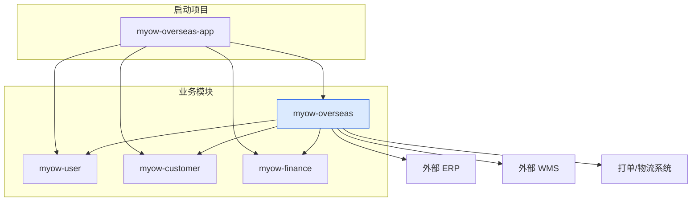

图 1-1：myow-overseas 在模块体系中的位置

### 1.3 业务边界划分

- 客户中心（myow-customer）：维护客商主体、客户档案、联系人、地址、结算偏好与客户门户账号。海外仓业务表直接使用 customer_id 关联客户，保持查询与报表口径简单稳定。

- 海外仓 OMS（myow-overseas）：负责客户仓库授权、海外仓商品 SKU、订单编排、仓库选择、库存预占、入出库指令、物流渠道选择、打单请求、履约状态跟踪和外部系统同步。该模块不直接执行库内实物作业。

- 外部 WMS / ERP：负责实际收货、上架、拣货、复核、打包、盘点、库内移库等执行动作，并通过接口向平台回传状态、库存和异常。

- 打单/物流系统：负责面单生成、承运商下单、轨迹回传和物流异常同步；myow-overseas 维护渠道规则与调用记录。

- 财务中心（myow-finance）：负责计费规则、账单生成、费用核销，读取入库、出库、仓储、渠道与外部系统回传数据生成费用。

边界原则：当前阶段优先建设平台 OMS 能力，myow-overseas 负责业务编排和外部系统集成，不实现波次、拣货、复核、打包等库内 WMS 执行逻辑。未来自研 WMS 时再独立补充库内执行域。

## 02 模块结构总览

myow-overseas 按海外仓 OMS 的业务闭环划分模块。当前结构先确定业务边界与章节骨架，后续再逐个模块细化领域模型、状态机、API、DDL、权限码、错误码和开发优先级。

### 2.1 一级模块划分

| 序号 | 模块 | 核心范围 | 边界说明 |
| --- | --- | --- | --- |
| 01 | 海外仓基础数据中心 | 仓库主数据、仓库服务能力、功能分区、工作时间、截单时间、物流商、物流渠道、邮编分区、货型定义、计费重规则、附加费规则。 | 维护 OMS 判断、路由和计费所需的基础规则，不设计 WMS 库内执行资源调度。 |
| 02 | 商品 / SKU 主数据 | 客户 SKU、海外仓内部 SKU、条码、平台 SKU/FNSKU/ASIN 映射、重量尺寸、HS Code、申报价值、敏感属性、ERP/WMS SKU 同步。 | 商品 SKU 只归属海外仓模块；头程模块不引用 SKU 主表，只保留货物快照字段。 |
| 03 | 入库管理 / ASN | ERP 预报、手工创建、模板导入、箱标与唛头、头程物流追踪、WMS 收货回传、实收差异、照片凭证、卖家确认。 | OMS 管入库预报和差异确认；WMS 管实际收货、质检、上架动作。 |
| 04 | 库存中心 | 在途、可用、预占、冻结、坏品/瑕疵、已出库口径、库存流水、批次库存、库存同步、库存上行推送 ERP。 | OMS 库存是业务逻辑库存，以 WMS 物理库存回传为重要来源。 |
| 05 | 出库与订单履约 | ERP 推单、手工创建、智能审单、地址校验、缺货/欠费拦截、FIFO/FEFO 锁库、出库指令下发、WMS 发货回传。 | OMS 负责编排和状态机；拣货、复核、打包仍由 WMS 执行。 |
| 06 | 物流渠道 / 路由 / 打单 | 渠道可达规则、物流路由、TMS 账号、面单生成、Tracking Number、Shipping Label、轨迹回传、渠道与打单方式绑定。 | 打单可通过第三方 TMS 或承运商 API；OMS 保存调用记录和结果。 |
| 07 | 计费规则与成本规则 | 客户报价、仓储费、入库费、出库拣货费、包材费、尾程物流售价、服务商成本、通道底价、计费事件。 | 海外仓维护业务报价和成本规则并产生计费事件；财务中心负责账单、流水、核销和收付款。 |
| 08 | 退货与售后 | RMA、Return Label、退货预报、WMS 退货清点、质检照片、重新上架、销毁、退回国内、售后定责。 | 退货执行在 WMS；卖家处置指令、库存结果和费用事件归 OMS 编排。 |
| 09 | 库内特殊指令与 VAS | 贴标、换包装、拍照、组装 SKU、拆包拆箱、非标操作申请、WMS 完成回传、增值服务计费。 | VAS 是 OMS 可售服务能力；具体作业动作仍由 WMS 或仓库服务商完成。 |
| 10 | BI 与报表看板 | 卖家发货量、库存周转、热销 SKU、扣费流水、仓库时效、坪效、渠道占比、服务商绩效。 | 优先沉淀业务事实表和统计口径，复杂分析可后续接入独立 BI。 |
| 11 | 第三方系统集成与映射 | ERP 授权、WMS 对接、TMS 账号、渠道映射、仓库映射、SKU 映射、回调验签、幂等、重试、日志。 | 统一解决系统间编码翻译、接口授权、推送回传和异常追踪。 |

### 2.2 后续细化顺序

- P0 基础能力：海外仓基础数据中心、SKU 主数据、第三方系统集成与映射。

- P1 核心履约：入库/ASN、库存中心、出库与订单履约、物流渠道/路由/打单。

- P2 商业闭环：计费规则与成本规则、退货与售后、VAS 增值服务。

- P3 运营分析：BI 与报表看板、服务商绩效、仓库运营指标。

结构原则：后续每个一级模块都按统一规格展开：业务目标、边界说明、领域模型、状态机、关键规则、API、DDL、权限码、错误码、开发优先级。

### 2.3 海外仓基础数据中心细化设计

海外仓基础数据中心是 OMS 的规则底座，负责维护报价、客户选择、ERP 对接、WMS 指令下发、物流路由和打单计费所需的基础资料。该模块不直接维护客商主体，仓库服务商、物流商、海外代理等主体统一由 myow-customer 的客商管理中心维护，myow-overseas 统一使用 customer_id 关联客商主体并维护海外仓业务属性。

#### 2.3.1 仓库管理：仓群及物理仓

仓库管理采用“仓群 + 物理仓”双层结构。仓群是面向销售报价、客户选择和第三方 ERP 对接的逻辑容器；物理仓是真实执行入库、库存、出库、退货和 VAS 的仓库资源。

| 对象 | 定位 | 核心字段 | 关键规则 |
| --- | --- | --- | --- |
| 仓群配置WarehouseCluster | 纯逻辑容器，一端连接客户售价、报价方案和 ERP 仓库编码，一端绑定多个物理仓。 | 仓群代码、仓群名称、所属国家、结算币种、状态、备注。 | 仓群代码租户内唯一；仓群本身不产生库存，不接收 WMS 回传；报价、客户授权和 ERP 映射优先挂到仓群。 |
| 仓群物理仓绑定WarehouseClusterMember | 维护仓群与物理仓的元素集合关系，后台以穿梭框选择物理仓。 | 仓群 ID、物理仓 ID、优先级、是否默认、启用状态、生效时间。 | 一个仓群可绑定多个物理仓；一个物理仓可归属多个仓群；同一仓群只能有一个默认物理仓。 |
| 物理仓配置PhysicalWarehouse | 真实仓库资源，用于 WMS 指令、库存归属、截单时间、发货地址、渠道分区和运营统计。 | 物理仓代码、仓库名称、仓库服务商 customer_id、合作类型、仓库系统、关联仓库代码、备注。 | 物理仓代码租户内唯一；仓库服务商必须来自客商管理中心且具备供应商/仓库服务商角色。 |
| 仓库地址与联系人WarehouseAddressContact | 维护仓库发货地址、联系人和时区信息，供物流分区、截单时间和面单发件人使用。 | 国家、省/州、城市、邮编、详细地址、时区、联系人、电话、邮箱。 | 每个物理仓至少维护一个默认发货地址；地址变更需要保留历史，避免影响已创建订单和面单。 |
| 仓库附加数据WarehouseOperationProfile | 维护运营和计费所需的物理属性。 | 仓库面积、总容积、最大托盘数、存储结构、工作时间、截单时间、重量单位、尺寸单位、尺重单位、默认体积重系数。 | 截单时间按仓库本地时区判断；重量/尺寸单位必须和渠道计费规则可转换。 |

#### 2.3.2 物流管理：物流产品及物流渠道

物流管理采用“物流产品 + 物流渠道”双层结构。物流产品是面向客户报价、客户选择和 ERP 对接的逻辑容器；物流渠道是真实打单、承运商下单和轨迹回传使用的执行通道。

| 对象 | 定位 | 核心字段 | 关键规则 |
| --- | --- | --- | --- |
| 物流商档案 | 物流商主体由客商管理中心维护，myow-overseas 引用 customer_id 并维护物流业务能力。 | 物流商 customer_id、合作状态、支持国家、对接方式、备注。 | 物流商必须在客商中心具备供应商/物流商角色；黑名单或停用物流商禁止新增产品和渠道。 |
| 物流产品配置LogisticsProduct | 逻辑容器，一端连接客户售价和 ERP 渠道编码，一端根据路由规则匹配一个或多个物流渠道。 | 物流产品代码、物流产品名称、物流商、类型、状态、备注。 | 产品代码租户内唯一；客户下单或 ERP 推单优先选择物流产品，而不是直接选择具体渠道。 |
| 物流产品类型 | 标识面单、结算和执行责任。 | 客户记账码、自供面单、仓库面单、卡派 LTL。 | 不同类型决定是否需要 OMS 打单、是否需要客户上传面单、是否允许仓库代打、是否进入卡派预约流程。 |
| 物流产品规则配置 | 维护产品级可达、附加费和风险判断规则。 | 偏远地址规则库、AHS 超长规则库、AHS 超重规则库、OS 规则库、地址类型规则库、燃油附加费联动规则。 | 产品级规则用于报价和候选渠道过滤；渠道级规则用于最终执行校验。 |
| 物流渠道配置LogisticsChannel | 真实执行通道，用于打单、承运商下单、轨迹同步和成本核算。 | 渠道代码、渠道名称、物流商、渠道类型、备注、状态。 | 渠道代码租户内唯一；停用渠道不能被路由选中，但历史订单仍保留原渠道。 |
| 渠道业务属性 | 描述渠道对包裹、地址和服务选项的支持范围。 | 签名服务、支持地址类型、是否支持带电、是否提供保险、是否支持一单多件、是否支持子母件。 | 订单审单和路由时必须同时校验商品敏感属性、包裹结构、地址类型和服务选项。 |
| 面单服务配置 | 定义面单来源和打单系统。 | 面单获取方式、打单系统、账号配置、面单模板、面单尺寸、是否支持多件标签。 | 面单获取方式包括导入面单、仓库面单、打单系统；选择物流渠道时必须校验对应打单系统可用。 |
| 面单格式配置 | 配置订单信息打印到面单或扩展标签上的内容。 | 打印字段、字段映射、参考号规则、客户编码、订单号、SKU 摘要、仓库备注。 | 仅在打单系统或承运商 API 支持自定义字段时生效；字段不得包含客户敏感信息的未授权明文。 |

#### 2.3.3 物流渠道路由规则

物流产品下可以配置多条渠道路由规则。系统先按规则筛选候选渠道，再按决策方式选择最终渠道。规则未命中时使用默认渠道；规则命中多个渠道时按成本最低、时效最快、优先级最高或人工指定策略决策。

| 规则层级 | 匹配条件 | 动作 | 说明 |
| --- | --- | --- | --- |
| 产品默认路由 | 物流产品 + 仓群/物理仓 + 目的国家。 | 返回默认物流渠道。 | 当没有命中更细规则时兜底使用。 |
| 区域路由 | 国家、省/州、城市、邮编段、物流分区。 | 限制可用渠道或指定渠道池。 | 用于偏远地区、不可达区域、卡派覆盖范围。 |
| 包裹尺重路由 | 实重、体积重、计费重、最长边、第二长边、周长、体积、一单多件数量。 | 过滤渠道、触发 AHS/OS、切换大件渠道。 | 用于包裹尺寸、超长、超重和 Oversize 判断。 |
| 商品属性路由 | 带电、液体、粉末、磁性、危险品、是否可投保。 | 过滤不可承运渠道或要求特定服务。 | 来自 SKU 主数据和订单包裹申报属性。 |
| 服务选项路由 | 签名服务、保险、住宅/商业地址、时效等级。 | 选择支持对应服务的渠道。 | 不支持服务选项的渠道直接剔除。 |
| 客户策略路由 | 客户、客户等级、合同、指定渠道偏好。 | 限定渠道白名单/黑名单、覆盖默认决策方式。 | 客户合同或大客户专属渠道优先于通用规则。 |

#### 2.3.4 物流规则库

物流规则库用于统一维护渠道过滤、附加费、地址判断和计费前置判断。规则库只负责“判定与标记”，具体收费金额由计费规则与成本规则模块引用规则结果计算。

| 规则库 | 配置内容 | 输出结果 | 使用场景 |
| --- | --- | --- | --- |
| 偏远地址规则库 | 国家、州/省、城市、邮编、邮编段、承运商区域文件。 | 是否偏远、偏远等级、适用物流商/渠道。 | 渠道过滤、偏远附加费、报价提示。 |
| AHS 超长规则库 | 最长边、第二长边、长宽高组合、周长阈值。 | 是否触发 AHS_LENGTH。 | 渠道可用性判断、附加费事件。 |
| AHS 超重规则库 | 实重、计费重、单件重量阈值。 | 是否触发 AHS_WEIGHT。 | 渠道可用性判断、附加费事件。 |
| OS 规则库 | Oversize 尺寸、重量、周长、特殊货型阈值。 | 是否触发 OVERSIZE、货型等级。 | 大件渠道路由、超大件附加费。 |
| 燃油附加费联动规则 | 物流商、渠道、国家、月份、生效日期、百分比或固定金额。 | 燃油费率版本。 | 客户报价、服务商成本和账单生成。 |
| 地址类型规则库 | 第三方地址校验结果、邮编库、客户声明、历史校验记录。 | 商业/住宅/未知、置信度。 | 住宅附加费、渠道过滤、审单拦截。 |
| 地址校验规则 | 国家、州邮编一致性、必填字段、黑名单地址、PO Box、军区地址。 | 通过、警告、拦截、人工确认。 | 订单审单、打单前校验。 |

#### 2.3.5 第三方对接与映射

第三方对接与映射解决 ERP、WMS、TMS、承运商之间编码不一致的问题。业务上以平台仓群、物理仓、物流产品、物流渠道为标准主数据，对外通过映射表转换为第三方系统编码。

| 配置项 | 核心内容 | 关键规则 |
| --- | --- | --- |
| 仓库物流渠道映射 | 物理仓、物流产品、物流渠道、仓库侧渠道代码、打单系统渠道代码、启用状态。 | 同一物理仓下，一个平台渠道可映射多个外部系统编码，但同一外部系统内映射必须唯一。 |
| 仓库物流分区管理 | 物流商、物理仓发货地址、目的邮编/区域、Zone、版本号、生效日期。 | Zone File 按物流商 + 发货仓地址版本化管理；费率计算必须引用订单创建时的有效版本。 |
| 仓库系统集成配置 | WMS 系统、API 地址、授权方式、仓库编码映射、推送开关、回调验签、超时和重试策略。 | 物理仓必须绑定一个默认 WMS 集成配置后才能接收入库/出库指令。 |
| 打单系统集成配置 | TMS/Carrier API、账号、API 地址、授权方式、面单模板、支持渠道、回调配置。 | 物流渠道的面单获取方式为打单系统时，必须绑定有效打单系统配置。 |
| ERP 映射配置 | 客户、ERP 系统、ERP 仓库编码、ERP 物流渠道编码、平台仓群、平台物流产品。 | ERP 推单优先映射到仓群和物流产品，再由 OMS 路由到物理仓和物流渠道。 |

#### 2.3.6 状态生命周期

基础数据属于低频维护、高频读取的数据，必须严格控制启停、发布和历史引用。已被订单、库存、费用规则、合同或外部映射引用的数据，原则上不做物理删除，只允许停用或失效。

| 对象 | 状态 | 允许操作 | 引用规则 |
| --- | --- | --- | --- |
| 仓群 | DRAFT、ENABLED、DISABLED、ARCHIVED | 草稿可编辑；启用后可被客户授权、报价和 ERP 映射引用；停用后禁止新订单选择；归档后只读。 | 历史订单、费用规则、ERP 映射保留原仓群 ID，不随名称变更重新计算。 |
| 物理仓 | DRAFT、ENABLED、SUSPENDED、DISABLED、ARCHIVED | 启用后可接收入库/出库；暂停后禁止新出库但可处理在途入库和退货；停用后禁止新业务。 | 存在库存余额、在途 ASN、处理中出库单时不能归档。 |
| 物流产品 | DRAFT、ENABLED、DISABLED、ARCHIVED | 启用后可被客户、合同、ERP 渠道映射选择；停用后禁止新订单选择。 | 历史订单保留原物流产品，后续轨迹和账单仍按订单快照处理。 |
| 物流渠道 | DRAFT、ENABLED、SUSPENDED、DISABLED、ARCHIVED | 启用后可被路由选中；暂停后保留历史处理但不再产生新面单；停用后禁止路由。 | 已打单订单继续使用原渠道完成轨迹回传和费用核算。 |
| 规则库 / 路由规则 | DRAFT、PUBLISHED、EXPIRED、ARCHIVED | 草稿可编辑；发布后生成版本号；失效后不再参与新订单判断；归档只读。 | 订单必须记录命中的规则版本，后续费用复算和争议处理按订单创建时版本。 |
| 第三方集成配置 | DRAFT、ENABLED、DISABLED | 启用前必须通过连接测试；停用后禁止新推送，但允许接收历史回调。 | 已推送外部系统的业务单据保留原配置 ID 和外部编码。 |

#### 2.3.7 唯一性、版本与生效规则

- 租户隔离：所有基础数据表均包含 tenant_id BIGINT、deleted_flag BOOLEAN、审计字段；全局物流规则如需跨租户复用，也必须通过租户授权或模板复制落地到租户数据。

- 编码唯一：仓群代码、物理仓代码、物流产品代码、物流渠道代码在租户内唯一；第三方编码在 tenant_id + external_system_id + mapping_type 范围内唯一。

- 版本化规则：Zone File、偏远规则、AHS/OS 规则、燃油附加费、地址类型规则、路由规则都必须版本化，字段至少包含 version_no、effective_from、effective_to、published_time。

- 生效时间：规则按订单创建时间匹配有效版本；如果是补录或重算费用，必须允许指定业务发生时间重新匹配历史版本。

- 配置快照：订单、面单、计费事件必须保存仓群、物理仓、物流产品、物流渠道、规则版本和外部编码快照，避免基础数据变更影响历史业务。

- 删除限制：已被客户授权、合同报价、订单、库存、计费事件或映射引用的数据禁止物理删除，只能停用、失效或归档。

#### 2.3.8 物流路由执行链路

物流路由必须先完成编码翻译，再完成候选渠道过滤，最后进行决策。路由结果需要保存完整命中链路，用于客服解释、费用复算和异常排查。

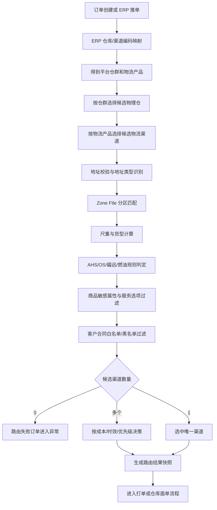

图 2-1：物流路由执行链路

#### 2.3.9 领域对象与建议表结构

本小节先给出基础数据中心的建议表清单，后续在数据库章节统一收口为正式 DDL。

| 表名 | 领域对象 | 核心字段 | 唯一约束 / 索引 |
| --- | --- | --- | --- |
| owh_warehouse_cluster | 仓群 | cluster_code, cluster_name, country_code, currency_code, status | uk: tenant_id + cluster_code |
| owh_physical_warehouse | 物理仓 | warehouse_code, warehouse_name, service_provider_customer_id, cooperation_type, wms_system_id, external_warehouse_code, status | uk: tenant_id + warehouse_code; idx: service_provider_customer_id |
| owh_warehouse_cluster_member | 仓群物理仓绑定 | cluster_id, warehouse_id, priority, default_flag, status, effective_from, effective_to | uk: tenant_id + cluster_id + warehouse_id |
| owh_warehouse_operation_profile | 仓库运营属性 | warehouse_id, timezone, working_hours, cutoff_time, area, volume, weight_unit, dimension_unit, dim_factor | uk: tenant_id + warehouse_id |
| owh_logistics_product | 物流产品 | product_code, product_name, carrier_customer_id, product_type, default_decision_strategy, status | uk: tenant_id + product_code; idx: carrier_customer_id |
| owh_logistics_channel | 物流渠道 | channel_code, channel_name, carrier_customer_id, channel_type, label_source, tms_system_id, status | uk: tenant_id + channel_code |
| owh_logistics_channel_capability | 渠道能力 | channel_id, signature_options, address_types, battery_flag, insurance_flag, multi_piece_flag, child_label_flag | uk: tenant_id + channel_id |
| owh_routing_rule | 物流路由规则 | product_id, warehouse_scope_type, condition_json, action_json, priority, version_no, status, effective_from, effective_to | idx: tenant_id + product_id + status + priority |
| owh_logistics_rule_set | 物流规则库 | rule_type, rule_name, carrier_customer_id, channel_id, version_no, condition_json, result_json, status, effective_from, effective_to | idx: tenant_id + rule_type + status; idx: channel_id |
| owh_zone_file | 物流分区版本 | carrier_customer_id, origin_warehouse_id, version_no, country_code, status, effective_from, effective_to | uk: tenant_id + carrier_customer_id + origin_warehouse_id + version_no |
| owh_zone_file_detail | 物流分区明细 | zone_file_id, destination_country, postal_code_from, postal_code_to, zone_code | idx: zone_file_id + destination_country + postal_code_from |
| owh_integration_mapping | 第三方映射 | external_system_id, mapping_type, platform_biz_id, external_code, external_name, status | uk: tenant_id + external_system_id + mapping_type + external_code |
| owh_integration_config | 第三方集成配置 | system_type, system_code, auth_type, endpoint_url, credential_ref, callback_secret, retry_policy, status | uk: tenant_id + system_code |

#### 2.3.10 API 规格草案

基础数据 API 统一使用命令式 POST，所有路径以 /api/v1/overseas/base 开头。查询接口也采用 POST，便于复杂条件和权限上下文扩展。

| 分组 | 接口 | 说明 | 核心入参 |
| --- | --- | --- | --- |
| 仓群 | POST /warehouse-cluster/create | 创建仓群 | clusterCode, clusterName, countryCode, currencyCode |
| 仓群 | POST /warehouse-cluster/update | 更新仓群基础信息 | clusterId, clusterName, status, remark |
| 仓群 | POST /warehouse-cluster/bind-warehouses | 绑定物理仓集合 | clusterId, warehouseIds, defaultWarehouseId, priorities |
| 物理仓 | POST /physical-warehouse/create | 创建物理仓 | warehouseCode, warehouseName, serviceProviderCustomerId, address, timezone |
| 物理仓 | POST /physical-warehouse/update-operation-profile | 维护仓库运营属性 | warehouseId, workingHours, cutoffTime, unitConfig, storageProfile |
| 物流产品 | POST /logistics-product/create | 创建物流产品 | productCode, productName, carrierCustomerId, productType |
| 物流产品 | POST /logistics-product/update-routing-strategy | 配置默认路由策略 | productId, defaultChannelId, decisionStrategy |
| 物流渠道 | POST /base/logistics-channel/create | 创建物流渠道 | channelCode, channelName, carrierCustomerId, labelSource |
| 物流渠道 | POST /logistics-channel/update-capability | 维护渠道能力 | channelId, signatureOptions, addressTypes, sensitiveSupport, labelConfig |
| 规则库 | POST /rule-set/save-draft | 保存规则草稿 | ruleType, ruleName, conditionJson, resultJson |
| 规则库 | POST /rule-set/publish | 发布规则版本 | ruleSetId, effectiveFrom, effectiveTo |
| 路由 | POST /routing-rule/save-draft | 保存路由规则草稿 | productId, priority, conditionJson, actionJson |
| 路由 | POST /routing-rule/test | 路由规则试算 | warehouseClusterId, productId, packageInfo, address, skuAttributes |
| 分区 | POST /zone-file/import | 导入物流分区文件 | carrierCustomerId, originWarehouseId, fileId, effectiveFrom |
| 集成 | POST /integration-config/test-connection | 测试 WMS/TMS/Carrier 连接 | integrationConfigId |
| 映射 | POST /integration-mapping/save | 保存第三方编码映射 | externalSystemId, mappingType, platformBizId, externalCode |

#### 2.3.11 权限码与错误码

| 权限码 | 说明 |
| --- | --- |
| overseas:base:warehouse-cluster:view | 查看仓群 |
| overseas:base:warehouse-cluster:manage | 创建、更新、启停仓群与绑定物理仓 |
| overseas:base:physical-warehouse:manage | 维护物理仓、地址、运营属性和 WMS 关系 |
| overseas:base:logistics-product:manage | 维护物流产品、产品类型和产品级路由策略 |
| overseas:base:logistics-channel:manage | 维护物流渠道、渠道能力、面单配置 |
| overseas:base:rule-set:manage | 维护偏远、AHS、OS、燃油、地址校验等规则库 |
| overseas:base:routing-rule:manage | 维护和测试物流路由规则 |
| overseas:base:integration:manage | 维护 WMS/TMS/ERP 集成配置和编码映射 |

| 错误码 | 说明 | 触发场景 |
| --- | --- | --- |
| OWH_BASE_001 | 编码已存在 | 仓群、物理仓、物流产品、物流渠道编码重复。 |
| OWH_BASE_002 | 客商主体不可用 | 仓库服务商或物流商 customer_id 不存在、停用、黑名单或角色不匹配。 |
| OWH_BASE_003 | 状态不允许操作 | 已归档数据被编辑，或停用数据被新业务引用。 |
| OWH_BASE_004 | 存在业务引用，禁止删除 | 基础数据已被订单、库存、合同、规则或映射引用。 |
| OWH_BASE_005 | 规则生效区间冲突 | 同一规则类型、物流商、渠道下有效时间重叠。 |
| OWH_BASE_006 | 路由无可用渠道 | 物流产品下无启用渠道，或被地址、尺重、敏感属性全部过滤。 |
| OWH_BASE_007 | 集成连接测试失败 | WMS/TMS/Carrier API 认证失败、网络超时或返回业务错误。 |
| OWH_BASE_008 | 第三方映射冲突 | 同一外部系统、映射类型、外部编码指向多个平台对象。 |
| OWH_BASE_009 | 物流分区未命中 | 按发货仓、物流商、目的邮编无法匹配 Zone。 |
| OWH_BASE_010 | 面单配置不可用 | 渠道要求打单系统，但未绑定有效打单配置或面单模板。 |

#### 2.3.12 开发优先级

| 阶段 | 范围 | 完成标准 |
| --- | --- | --- |
| P0 | 仓群、物理仓、物流产品、物流渠道、第三方映射的基础 CRUD 与启停。 | 入库、出库、ERP 映射可以引用基础数据；所有编码唯一性、状态校验可用。 |
| P1 | 仓群绑定物理仓、渠道能力、面单服务配置、WMS/TMS 集成连接测试。 | 出库订单可从仓群和物流产品路由到物理仓与渠道，并校验面单配置。 |
| P2 | Zone File、偏远/AHS/OS/地址类型/燃油规则库、路由规则发布和试算。 | 路由执行链可返回命中规则、候选渠道、最终渠道和失败原因。 |
| P3 | 规则版本回溯、批量导入、复制模板、变更审计、路由模拟报表。 | 支持运营批量维护和历史争议追溯。 |

设计边界：仓群、物流产品是对客和对 ERP 的逻辑层；物理仓、物流渠道是对 WMS/TMS 的执行层。报价和客户选择优先挂逻辑层，库存、入库、出库、打单执行必须最终落到物理仓和物流渠道。

### 2.4 商品 / SKU 主数据细化设计

商品 / SKU 主数据是海外仓入库、库存、出库、物流路由和计费的共同基础。该模块只在 myow-overseas 内设计，头程模块不引用 SKU 主表；头程业务如需货物信息，使用名称、件数、箱规、申报等快照字段。

#### 2.4.1 商品信息

商品主数据以客户维度隔离，同一客户下维护海外仓标准 SKU 编码、卖家 SKU、条码、申报、尺重、安全库存和特殊属性。SKU 基础信息完整后才允许进入 ASN、WMS 同步和出库履约流程。

| 分组 | 字段 | 说明 | 关键规则 |
| --- | --- | --- | --- |
| 基础信息 | SKU Code | 海外仓标准编码，平台内稳定主编码。 | 同一租户 + customer_id 下唯一；创建后原则上不允许修改。 |
| 基础信息 | Seller SKU Code | 卖家商品编码，来自客户 ERP、店铺或手工维护。 | 允许一个 SKU 绑定多个外部 Seller SKU，但主 Seller SKU 只能有一个。 |
| 基础信息 | 商品名称 | 中文名称、英文名称。 | 英文名称用于申报、面单扩展字段和 WMS 显示。 |
| 基础信息 | 商品分类 | 平台商品分类或客户自定义分类。 | 用于运营查询、报表和敏感属性默认值。 |
| 申报信息 | HS Code 前 6 位 | 通用海关编码前 6 位。 | 只保存通用段，具体国家完整编码可作为扩展申报配置。 |
| 申报信息 | 申报价值与币种 | declared_value、declared_currency。 | 币种必须使用 ISO 4217；申报价值不能为负。 |
| 条码信息 | 自定义条码一、二 | 客户或仓库现场扫描使用的条码。 | 同一客户下条码建议唯一；与 WMS 冲突时由同步中心暴露失败原因。 |
| 尺重信息 | 单品长宽高、重量、体积 | 客户预报尺重与仓库实测尺重分开保存。 | 出库路由和计费优先使用已审核的实测尺重；未实测时使用预报尺重。 |
| 特殊属性 | 带电、危险品、液体、粉末、磁性、易碎 | 影响渠道过滤、WMS 操作提示和合规审核。 | 危险品或禁运属性可触发 SKU 冻结或出库拦截。 |
| 包装信息 | 销售包装、外箱包装、默认装箱数、包装备注 | 支持 WMS 入库清点、出库包装和 VAS 判断。 | 包装变更需要记录版本，避免影响历史订单。 |
| 安全库存 | 最低/最高安全库存水位 | 按 SKU + 仓群或 SKU + 物理仓配置。 | 低于最低水位触发补货预警，高于最高水位触发滞销或仓储成本预警。 |
| 备注 | remark | 内部备注。 | 不向 WMS 或客户门户展示敏感内部信息，除非接口明确要求。 |

#### 2.4.2 SKU 编码与映射关系

SKU 主数据必须支持多编码并存，解决卖家、平台、海外仓、WMS、ERP 之间商品编码不同的问题。平台标准 SKU Code 是内部主键口径，外部编码通过映射表维护。

| 映射类型 | 示例 | 用途 | 唯一性 |
| --- | --- | --- | --- |
| SELLER_SKU | 客户 ERP SKU、店铺 SKU | ERP 推送 ASN、订单时识别商品。 | 同一客户 + 外部系统 + Seller SKU 唯一。 |
| FNSKU | Amazon FNSKU | FBA 相关识别、换标和客户查询。 | 同一客户下建议唯一。 |
| ASIN | Amazon ASIN | 销售平台商品关联和报表。 | 可多 SKU 关联同一 ASIN。 |
| WAREHOUSE_SKU | WMS 内部 SKU | WMS 指令下发和库存回传。 | 同一 WMS + 物理仓内唯一。 |
| BARCODE | UPC/EAN/自定义条码 | 仓库扫描、收货、复核、出库。 | 同一客户下建议唯一，允许按业务配置放宽。 |

#### 2.4.3 商品生命周期

| 状态 | 含义 | 允许动作 | 限制 |
| --- | --- | --- | --- |
| DRAFT 草稿 / 待审核 | 卖家同步或导入后信息不完整，或待运营审核。 | 补充基础信息、修改预报尺重、补充条码和申报信息。 | 禁止创建入库预报 ASN，禁止同步 WMS。 |
| ACTIVE 可用 / 已激活 | 商业基础信息完整，允许进入业务流程。 | 创建 ASN、同步 WMS、参与库存预警。 | 出库路由和计费使用卖家预报尺重，系统提示未实测风险。 |
| VERIFIED 已实测 / 正常售卖 | 货物到仓后，WMS 或复测中心确认实测尺重。 | 全量支持入库、库存、出库、路由、计费、报表。 | 实测尺重变更必须通过尺重复测流程。 |
| SUSPENDED 冻结 | 合规风险、侵权、违禁品、客户纠纷或运营手动冻结。 | 允许查看、解冻、处理历史业务。 | 禁止新建 ASN，禁止出库，WMS 停止上下架和出库动作。 |
| ARCHIVED 归档 | 长期不再使用，只保留历史追溯。 | 只读查询。 | 禁止新业务引用；存在库存余额时不能归档。 |

#### 2.4.4 尺重复测中心

尺重复测中心是海外仓的“数据纠偏中心”和“利润保卫站”，上游接收 WMS 称重一体机、PDA 扫描、库内抽检或卖家账单争议发起的复测申请；中游提供差异比价、可视化审核和异常拦截；下游更新 SKU 实测主数据，并将结果分发给出库路由引擎和计费引擎。

| 页面 | 核心能力 | 关键字段 / 交互 |
| --- | --- | --- |
| 复测申请单列表 | 审核工作台，用于运营、财务和仓库管理人员处理复测。 | 申请单号、SKU 编码、申请来源、物理仓、审核状态、申请原因、重量偏差率、体积偏差率、风险等级、创建时间。 |
| 复测详情与差异审核 | 新旧物理数据强对比，突出物流商附加费临界点。 | Old/New/Diff/偏差比例；最长边、次长边、实重、体积重、计费重；AHS/OS/超重/超长临界值预警。 |
| 复测策略配置 | 配置自动审核阈值和账单追溯策略。 | 自动通过阈值、是否触发附加费临界点、允许账单追溯、追溯天数、适用客户/仓库/渠道。 |

- 批准变更：锁定本次实测数据，更新 SKU 实测尺重，生成复测生效日志，触发 WMS 商品更新、出库路由和计费引擎事件。

- 驳回申请：保持旧数据不变，必须填写驳回原因，例如测量对象错误、设备异常、外箱与单品混淆。

- 要求重新测量：打回 WMS，由仓库现场换设备或人员二次复测，原申请进入 WAIT_REMEASURE 状态。

- 自动审核：当实测偏差 ≤ 3% 且未触发任何物流商附加费临界点时，可配置为系统自动通过。

- 账单追溯：若开启追溯，复测变大并审核通过后，系统扫描过去 X 天已发货订单，按新尺重模拟计费，生成运费补收差额流水或待确认事件。

#### 2.4.5 尺重复测状态机

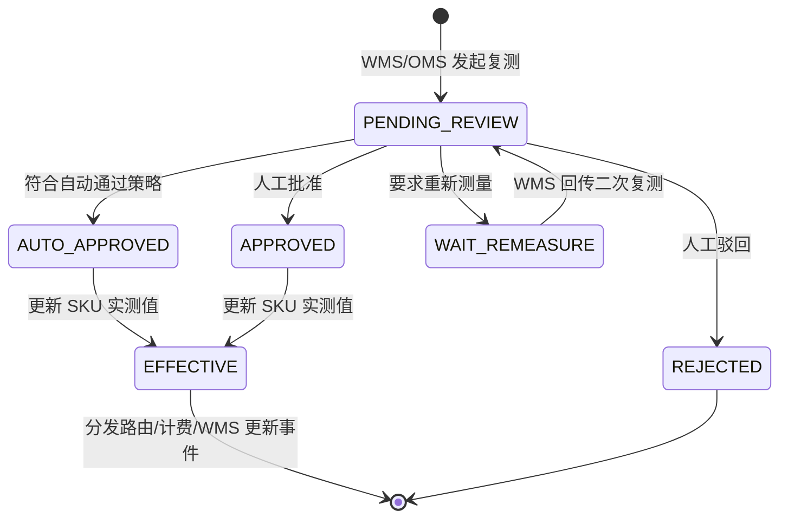

图 2-2：SKU 尺重复测状态机

#### 2.4.6 商品同步中心

商品同步中心负责将 OMS SKU 主数据推送到物理仓对应的 WMS，并监控每一次同步结果。同步采用“自动 + 手动”双触发机制，避免接口失败导致仓库现场无法收货、扫描或出库。

| 触发方式 | 触发时机 | 目标物理仓 | 说明 |
| --- | --- | --- | --- |
| 自动触发 | ASN 审核通过 | ASN 目的物理仓 | 系统识别 ASN 包含 SKU，提前推送至对应 WMS，确保仓库收货前已有商品资料。 |
| 自动触发 | 复测审核通过 | 该 SKU 已入库过的所有物理仓 | 向相关 WMS 发起 Update SKU，确保 WMS 端尺重与 OMS 同步。 |
| 手动触发 | 商品列表或同步中心批量同步 | 运营选择的物理仓 | 用于 WMS 故障恢复、新仓紧急调拨、单批商品补推。 |

| 监控字段 | 说明 |
| --- | --- |
| 同步流水号 | 唯一 Key，用于幂等、重试和问题追踪。 |
| SKU 编码 | 本次同步的商品。 |
| 目的物理仓 | 如 US_LA_01，系统根据仓库集成配置识别 WMS。 |
| 同步状态 | SYNCING、SUCCESS、FAILED、RETRYING。 |
| WMS 返回消息 | 保存对方 WMS 原始返回文本，例如“商品条码已存在”。 |
| 最后同步时间 / 操作人 | 区分系统自动触发和人工手动触发。 |
| 重试次数 / 下一次重试时间 | 支持网络失败自动重试和人工一键重试。 |

#### 2.4.7 数据闭环与事件分发

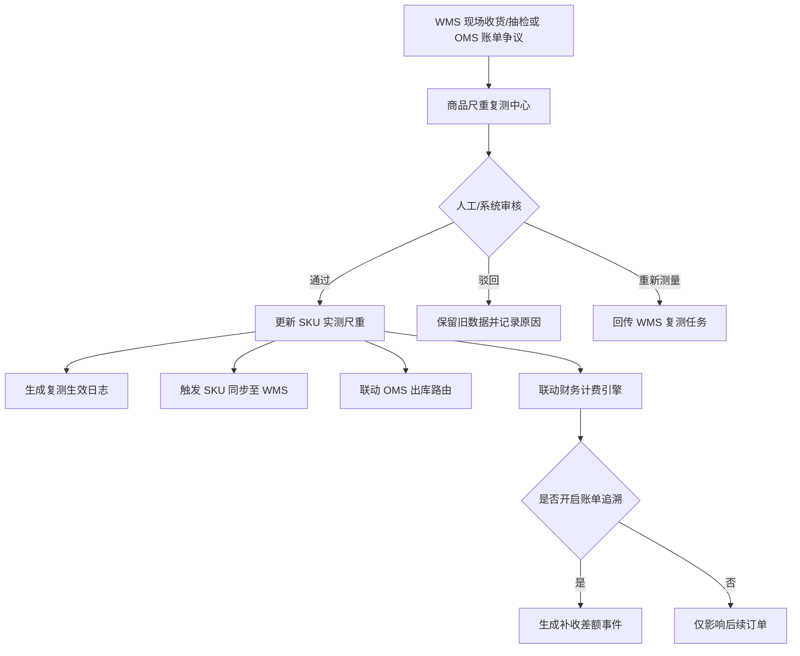

图 2-3：SKU 尺重复测数据闭环

#### 2.4.8 建议表结构

| 表名 | 领域对象 | 核心字段 | 唯一约束 / 索引 |
| --- | --- | --- | --- |
| owh_sku | SKU 主数据 | customer_id, sku_code, seller_sku_code, name_cn, name_en, category_id, hs_code6, declared_value, declared_currency, status | uk: tenant_id + customer_id + sku_code |
| owh_sku_dimension | SKU 尺重 | sku_id, source_type, length, width, height, weight, volume, dim_weight, unit, verified_flag, effective_time | idx: sku_id + source_type + effective_time |
| owh_sku_attribute | SKU 特殊属性 | sku_id, battery_flag, dangerous_flag, liquid_flag, powder_flag, magnetic_flag, fragile_flag | uk: tenant_id + sku_id |
| owh_sku_barcode | SKU 条码 | sku_id, barcode_type, barcode_value, primary_flag, status | idx: tenant_id + customer_id + barcode_value |
| owh_sku_mapping | SKU 外部映射 | sku_id, external_system_id, mapping_type, external_code, external_name, status | uk: tenant_id + external_system_id + mapping_type + external_code |
| owh_sku_safety_stock | SKU 安全库存 | sku_id, scope_type, warehouse_cluster_id, warehouse_id, min_qty, max_qty, status | idx: sku_id + scope_type |
| owh_sku_remeasure_order | 尺重复测单 | remeasure_no, sku_id, warehouse_id, source_type, reason, old_dimension_json, new_dimension_json, risk_level, status | uk: tenant_id + remeasure_no; idx: sku_id + status |
| owh_sku_remeasure_log | 复测生效日志 | remeasure_id, sku_id, old_dimension_json, effective_dimension_json, effective_time, operator_id | idx: sku_id + effective_time |
| owh_sku_sync_record | SKU 同步记录 | sync_no, sku_id, warehouse_id, wms_system_id, trigger_type, sync_status, request_payload, response_message, retry_count | uk: tenant_id + sync_no; idx: sku_id + warehouse_id + sync_status |

#### 2.4.9 API 规格草案

SKU API 统一使用命令式 POST，路径以 /api/v1/overseas/sku 开头。

| 分组 | 接口 | 说明 |
| --- | --- | --- |
| SKU | POST /create | 创建 SKU 草稿或激活 SKU。 |
| SKU | POST /update-basic | 更新基础信息、申报信息、备注。 |
| SKU | POST /update-attributes | 更新特殊属性和包装信息。 |
| SKU | POST /activate | 信息完整后激活 SKU。 |
| SKU | POST /suspend | 冻结 SKU，并触发 WMS 停止作业通知。 |
| SKU | POST /mapping/save | 保存 Seller SKU、FNSKU、ASIN、WMS SKU、条码映射。 |
| 复测 | POST /remeasure/apply | WMS 或 OMS 发起尺重复测申请。 |
| 复测 | POST /remeasure/approve | 批准复测并更新 SKU 实测尺重。 |
| 复测 | POST /remeasure/reject | 驳回复测申请。 |
| 复测 | POST /remeasure/request-remeasure | 要求 WMS 重新测量。 |
| 复测 | POST /remeasure/rule/save | 维护自动审核和账单追溯策略。 |
| 同步 | POST /sync/manual-push | 人工批量同步 SKU 到指定物理仓 WMS。 |
| 同步 | POST /sync/retry | 重试失败的 SKU 同步记录。 |
| 同步 | POST /sync/page | 查询 SKU 同步监控台。 |

#### 2.4.10 权限码、错误码与优先级

| 权限码 | 说明 |
| --- | --- |
| overseas:sku:view | 查看 SKU 主数据。 |
| overseas:sku:manage | 创建、编辑、激活、冻结 SKU。 |
| overseas:sku:mapping:manage | 维护 SKU 外部编码和条码映射。 |
| overseas:sku:remeasure:review | 审核尺重复测申请。 |
| overseas:sku:remeasure:rule | 维护复测自动审核和追溯策略。 |
| overseas:sku:sync:manage | 手动同步、重试 SKU 同步。 |

| 错误码 | 说明 | 触发场景 |
| --- | --- | --- |
| OWH_SKU_001 | SKU 编码已存在 | 同一客户下 SKU Code 重复。 |
| OWH_SKU_002 | SKU 信息不完整 | 缺少名称、申报、尺重、条码等激活必填字段。 |
| OWH_SKU_003 | SKU 状态不允许操作 | 草稿创建 ASN、冻结 SKU 出库、归档 SKU 编辑。 |
| OWH_SKU_004 | 外部编码映射冲突 | 同一 ERP/WMS/FNSKU/条码映射到多个 SKU。 |
| OWH_SKU_005 | 复测单状态不允许审核 | 已生效、已驳回或待二次复测状态重复审核。 |
| OWH_SKU_006 | 复测数据无效 | 尺重为空、负数、单位不支持或明显异常。 |
| OWH_SKU_007 | SKU 同步失败 | WMS API 返回失败或网络异常。 |
| OWH_SKU_008 | SKU 存在库存，禁止归档 | SKU 在任意物理仓存在在途、可用、预占或冻结库存。 |

| 阶段 | 范围 | 完成标准 |
| --- | --- | --- |
| P0 | SKU 主数据、条码、外部映射、状态生命周期。 | SKU 可创建、激活、冻结，可被 ASN 和订单识别。 |
| P1 | SKU 自动/手动同步 WMS、同步监控台、失败重试。 | ASN 审核通过可自动推送 SKU 到目的仓 WMS。 |
| P2 | 尺重复测中心、审核、实测尺重生效日志。 | WMS/OMS 可发起复测，审核通过后更新 SKU 实测数据。 |
| P3 | 复测自动审核、AHS/OS 临界预警、账单追溯事件。 | 复测结果可联动路由引擎和计费引擎。 |

## 03 领域模型设计

领域模型按限界上下文划分为海外仓基础数据中心、商品 / SKU 主数据、入库管理、库存中心、出库履约、物流渠道与打单、计费规则与成本规则、退货售后、VAS 增值服务、BI 报表、外部系统集成与映射十一个子域。当前文档只设计 OMS 平台能力，库内 WMS 执行模型作为未来扩展。

### 3.1 子域与聚合划分

| 子域 | 聚合根 | 核心实体 | 值对象 |
| --- | --- | --- | --- |
| 海外仓基础数据中心 | Warehouse | WarehouseZone, CargoTypeRule, RatingRule, SurchargeRule | WarehouseCode, WarehouseAddress, CutoffTime |
| 商品 / SKU 主数据 | Sku | SkuMapping, SkuPackage, SkuBarcode, SkuSyncRecord | SkuCode, PackageSpec, SensitiveAttribute |
| 入库管理 / ASN | InboundOrder | InboundItem, InboundCarton, InboundPushRecord, InboundDifference | InboundStatus, ExternalOrderNo, BoxLabel |
| 库存中心 | Inventory | InventorySnapshot, InventoryFlow, StockBatch, InventorySyncRecord | InventoryStatus, SyncSource, QualityStatus |
| 出库与订单履约 | OutboundOrder | OutboundItem, StockReservation, FulfillmentEvent, OrderReviewResult | OutboundStatus, ReservationStatus |
| 物流渠道 / 路由 / 打单 | LogisticsChannel | Carrier, ChannelProduct, ChannelRule, LabelOrder, TrackingEvent | ChannelCode, LabelStatus, RouteStrategy |
| 计费规则与成本规则 | OverseasContract | OverseasFeeRule, ProviderCostRule, BillingEvent | FeeCode, ChargeModel, CostModel |
| 退货与售后 | ReturnOrder | ReturnItem, ReturnLabel, ReturnQcResult, ReturnInstruction | RmaNo, ReturnStatus, DispositionType |
| 库内特殊指令与 VAS | VasOrder | VasItem, VasWorkResult, VasBillingEvent | VasType, VasStatus |
| BI 与报表看板 | AnalyticsView | SellerMetric, WarehouseMetric, ProviderMetric | MetricCode, StatisticPeriod |
| 第三方系统集成与映射 | ExternalSystem | ApiCredential, IntegrationMapping, PushRecord, CallbackRecord, RetryTask | SystemType, MappingType, PushStatus |

### 3.2 实体关系图

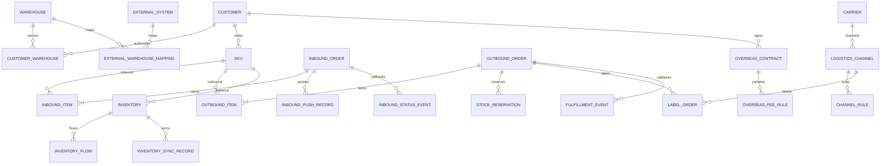

图 3-1：核心实体关系（省略字段，仅展示关联）

### 3.3 核心实体定义

#### 3.3.1 仓库（Warehouse）

仓库是海外仓履约资源的载体，聚合根为 Warehouse，描述仓库基础信息、服务能力、时区、国家/地区和外部系统映射。库区、库位等库内执行结构暂不进入当前 OMS 平台设计。

| 字段 | 类型 | 约束 | 说明 |
| --- | --- | --- | --- |
| warehouse_id | BIGINT | PK | 仓库唯一标识 |
| warehouse_code | VARCHAR(32) | NOT NULL, UK | 仓库编码（如 WH-US-LAX-01） |
| warehouse_name | VARCHAR(64) | NOT NULL | 仓库名称 |
| country | VARCHAR(32) | NOT NULL | 国家（如 US） |
| state | VARCHAR(32) |  | 州/省 |
| city | VARCHAR(64) |  | 城市 |
| address | VARCHAR(256) |  | 详细地址 |
| status | SMALLINT | DEFAULT 1 | 0=停用, 1=启用 |

#### 3.3.2 客户仓库授权（CustomerWarehouse）

客户仓库授权定义客户可使用哪些仓库、支持哪些服务、默认外部 WMS 账号以及启停状态。海外仓业务表保留 customer_id，不额外引入货主命名。

| 字段 | 类型 | 约束 | 说明 |
| --- | --- | --- | --- |
| customer_warehouse_id | BIGINT | PK | 客户仓库授权ID |
| customer_id | BIGINT | NOT NULL | 客户ID |
| warehouse_id | BIGINT | NOT NULL | 仓库ID |
| external_system_id | BIGINT |  | 默认外部 WMS 系统 |
| service_flags | VARCHAR(128) |  | 支持服务：INBOUND/OUTBOUND/RETURN/STORAGE/LABEL |
| priority | SMALLINT | DEFAULT 0 | 分仓优先级 |
| status | SMALLINT | DEFAULT 1 | 0=停用, 1=启用 |

#### 3.3.3 入库单（InboundOrder）

入库单是 ASN（Advance Shipping Notice）的落地实体，聚合根管理入库单生命周期与入库明细。

| 字段 | 类型 | 约束 | 说明 |
| --- | --- | --- | --- |
| inbound_id | BIGINT | PK | 入库单唯一标识 |
| inbound_no | VARCHAR(32) | NOT NULL, UK | 入库单号（如 IB-20260626-001） |
| warehouse_id | BIGINT | FK, NOT NULL | 目的仓库 |
| customer_id | BIGINT | FK, NOT NULL | 客户ID |
| inbound_type | VARCHAR(16) | NOT NULL | 入库类型：PURCHASE=采购入库, RETURN=退货入库, TRANSFER=调拨入库 |
| status | VARCHAR(16) | NOT NULL | PENDING/RECEIVING/RECEIVED/QC_DONE/PUTAWAY_DONE/CANCELLED |
| expect_quantity | INT |  | 预计到货数量 |
| actual_quantity | INT |  | 实际收货数量 |
| expect_time | TIMESTAMP |  | 预计到货时间 |
| actual_time | TIMESTAMP |  | 实际到货时间 |
| tracking_no | VARCHAR(64) |  | 物流跟踪号 |
| carrier | VARCHAR(32) |  | 承运商 |
| remark | VARCHAR(512) |  | 备注 |

#### 3.3.4 出库单（OutboundOrder）

出库单是 OMS 平台的履约指令实体，负责库存预占、仓库确认、物流渠道选择、打单请求和外部 WMS 状态跟踪。拣货、复核、打包等库内执行动作由外部 WMS 回传履约事件。

| 字段 | 类型 | 约束 | 说明 |
| --- | --- | --- | --- |
| outbound_id | BIGINT | PK | 出库单唯一标识 |
| outbound_no | VARCHAR(32) | NOT NULL, UK | 出库单号（如 OB-20260626-001） |
| warehouse_id | BIGINT | FK, NOT NULL | 发货仓库 |
| customer_id | BIGINT | FK, NOT NULL | 客户ID |
| outbound_type | VARCHAR(16) | NOT NULL | 出库类型：SALE=销售出库, RETURN=退件出库, TRANSFER=调拨出库 |
| status | VARCHAR(16) | NOT NULL | PENDING/ALLOCATED/PUSHED/ACCEPTED/PROCESSING/SHIPPED/CANCELLED/EXCEPTION |
| channel_id | BIGINT | FK | 指定物流渠道 |
| recipient_name | VARCHAR(64) |  | 收件人姓名 |
| recipient_phone | VARCHAR(32) |  | 收件人电话 |
| recipient_address | VARCHAR(256) |  | 收件地址 |
| recipient_zip | VARCHAR(16) |  | 收件邮编 |
| total_weight | INT |  | 总重量（克） |
| total_volume | INT |  | 总体积（立方厘米） |
| priority | SMALLINT | DEFAULT 0 | 优先级：0=普通, 1=加急, 2=特急 |

#### 3.3.5 库存余额（Inventory）

库存按租户 + 客户 + 仓库 + SKU + 批次维度管理，平台维护可用、预占、冻结、在库与在途数量，并接收外部 WMS 库存同步。

| 字段 | 类型 | 约束 | 说明 |
| --- | --- | --- | --- |
| inventory_id | BIGINT | PK | 库存余额唯一标识 |
| customer_id | BIGINT | NOT NULL | 客户ID |
| warehouse_id | BIGINT | FK, NOT NULL | 仓库 |
| sku_id | BIGINT | FK, NOT NULL | SKU |
| batch_no | VARCHAR(64) |  | 批次号 |
| on_hand_qty | INT | DEFAULT 0 | 在库实物数量 |
| available_qty | INT | DEFAULT 0 | 可用数量 |
| reserved_qty | INT | DEFAULT 0 | 预占数量 |
| frozen_qty | INT | DEFAULT 0 | 冻结数量 |
| in_transit_qty | INT | DEFAULT 0 | 在途数量 |
| quality_status | VARCHAR(16) | DEFAULT 'GOOD' | 品质状态：GOOD=良品, DAMAGED=破损, EXPIRED=过期, QUARANTINE=隔离 |

#### 3.3.6 外部系统（ExternalSystem）

外部系统聚合维护 ERP、WMS、打单系统和承运商 API 的连接配置、账号凭证、接口能力、推送策略与回调验签规则。

| 字段 | 类型 | 约束 | 说明 |
| --- | --- | --- | --- |
| external_system_id | BIGINT | PK | 外部系统ID |
| system_code | VARCHAR(32) | NOT NULL, UK | 系统编码 |
| system_type | VARCHAR(16) | NOT NULL | ERP/WMS/LABEL/CARRIER |
| base_url | VARCHAR(256) |  | 接口地址 |
| auth_type | VARCHAR(16) |  | 认证方式 |
| status | SMALLINT | DEFAULT 1 | 0=停用, 1=启用 |

#### 3.3.7 物流渠道（LogisticsChannel）

物流渠道定义承运商的服务产品与计费分区，是出库单匹配物流方案的依据。

| 字段 | 类型 | 约束 | 说明 |
| --- | --- | --- | --- |
| channel_id | BIGINT | PK | 渠道唯一标识 |
| channel_code | VARCHAR(32) | NOT NULL, UK | 渠道编码 |
| channel_name | VARCHAR(64) | NOT NULL | 渠道名称 |
| carrier_customer_id | BIGINT | FK, NOT NULL | 物流商客商 ID，关联 myow-customer 的 customer_id |
| service_type | VARCHAR(32) |  | 服务类型：GROUND=陆运, EXPRESS=快递, INTERNATIONAL=国际 |
| max_weight | INT |  | 最大重量限制（克） |
| max_length | INT |  | 最大边长限制（厘米） |
| status | SMALLINT | DEFAULT 1 | 0=停用, 1=启用 |

### 3.4 枚举定义

| 枚举 | 值 | 说明 |
| --- | --- | --- |
| InboundStatusEnum | PENDING | 待提交 |
| PUSHED | 已推送外部 WMS |  |
| ACCEPTED | 外部 WMS 已接收 |  |
| RECEIVING | 外部 WMS 收货中 |  |
| RECEIVED | 外部 WMS 收货完成 |  |
| EXCEPTION | 异常 |  |
| CANCELLED | 已取消 |  |
| OutboundStatusEnum | PENDING | 待处理 |
| ALLOCATED | 已预占库存 |  |
| PUSHED | 已推送外部 WMS |  |
| ACCEPTED | 外部 WMS 已接收 |  |
| PROCESSING | 外部 WMS 执行中 |  |
| SHIPPED | 已发货 |  |
| EXCEPTION | 异常 |  |
| CANCELLED | 已取消 |  |
| ExternalSystemTypeEnum | ERP | ERP 系统 |
| WMS | WMS 系统 |  |
| LABEL | 打单系统 |  |
| CARRIER | 承运商 API |  |
| ReservationStatusEnum | RESERVED | 已预占 |
| RELEASED | 已释放 |  |
| DEDUCTED | 已扣减 |  |
| FAILED | 预占失败 |  |
| QualityStatusEnum | GOOD | 良品 |
| DAMAGED | 破损 |  |
| EXPIRED | 过期 |  |
| QUARANTINE | 隔离 |  |

## 04 数据库表结构设计

所有表统一使用 PostgreSQL，字符集 UTF-8。业务表均包含 tenant_id BIGINT 实现多租户隔离，包含 deleted_flag BOOLEAN DEFAULT FALSE 实现逻辑删除，包含 create_by/update_by/create_time/update_time 实现审计。需要并发更新的余额类表必须包含 version BIGINT DEFAULT 0。

### 4.1 核心表清单

| 表名 | 说明 | 数据量预估 | 核心索引 |
| --- | --- | --- | --- |
| owh_warehouse_cluster | 仓群，面向报价、客户选择和 ERP 对接的逻辑仓库容器 | 十级/租户 | uk: tenant_id + cluster_code |
| owh_physical_warehouse | 物理仓，真实执行入库、库存、出库、退货和 VAS 的仓库资源 | 十级/租户 | uk: tenant_id + warehouse_code; idx: service_provider_customer_id |
| owh_warehouse_cluster_member | 仓群与物理仓绑定关系 | 百级/租户 | uk: tenant_id + cluster_id + warehouse_id |
| owh_warehouse_operation_profile | 物理仓运营属性、截单时间、单位、存储能力 | 十级/租户 | uk: tenant_id + warehouse_id |
| owh_customer_warehouse | 客户仓库授权 | 百级/租户 | uk: tenant_id + customer_id + warehouse_id |
| owh_logistics_product | 物流产品，面向报价、客户选择和 ERP 对接的逻辑物流容器 | 百级/租户 | uk: tenant_id + product_code; idx: carrier_customer_id |
| owh_logistics_channel | 物流渠道，真实打单、承运商下单和轨迹回传的执行通道 | 百级/租户 | uk: tenant_id + channel_code; idx: carrier_customer_id |
| owh_logistics_channel_capability | 物流渠道能力配置 | 百级/租户 | uk: tenant_id + channel_id |
| owh_routing_rule | 物流产品到物流渠道的路由规则 | 千级/租户 | idx: tenant_id + product_id + status + priority |
| owh_logistics_rule_set | 偏远、AHS、OS、燃油、地址校验等规则库 | 万级/租户 | idx: tenant_id + rule_type + status; idx: channel_id |
| owh_zone_file | 物流商按发货仓地址形成的分区规则版本 | 百级/租户 | uk: tenant_id + carrier_customer_id + origin_warehouse_id + version_no |
| owh_zone_file_detail | 物流分区明细 | 十万级/租户 | idx: zone_file_id + destination_country + postal_code_from |
| owh_integration_config | ERP/WMS/TMS/Carrier API 集成配置 | 十级/租户 | uk: tenant_id + system_code |
| owh_integration_mapping | 仓库、物流产品、物流渠道、SKU 等第三方编码映射 | 万级/租户 | uk: tenant_id + external_system_id + mapping_type + external_code |
| owh_sku | SKU 主数据 | 万级/租户 | uk: tenant_id + customer_id + sku_code |
| owh_sku_dimension | SKU 预报尺重与实测尺重 | 十万级/租户 | idx: sku_id + source_type + effective_time |
| owh_sku_attribute | SKU 特殊属性 | 万级/租户 | uk: tenant_id + sku_id |
| owh_sku_barcode | SKU 条码 | 十万级/租户 | idx: tenant_id + customer_id + barcode_value |
| owh_sku_mapping | Seller SKU、FNSKU、ASIN、WMS SKU、条码等外部映射 | 十万级/租户 | uk: tenant_id + external_system_id + mapping_type + external_code |
| owh_sku_safety_stock | SKU 按仓群或物理仓配置的安全库存 | 十万级/租户 | idx: sku_id + scope_type |
| owh_sku_remeasure_order | SKU 尺重复测申请单 | 万级/月 | uk: tenant_id + remeasure_no; idx: sku_id + status |
| owh_sku_remeasure_log | SKU 尺重复测生效日志 | 万级/月 | idx: sku_id + effective_time |
| owh_sku_sync_record | SKU 推送 WMS 的同步记录 | 百万级/月 | uk: tenant_id + sync_no; idx: sku_id + warehouse_id + sync_status |
| owh_inbound_order | 入库指令 | 万级/月 | uk: tenant_id + inbound_no; idx: warehouse_id + status |
| owh_inbound_item | 入库明细 | 十万级/月 | idx: inbound_id + sku_id |
| owh_inbound_push_record | 入库指令推送记录 | 十万级/月 | idx: inbound_id + push_status |
| owh_inbound_status_event | 入库状态回传事件 | 十万级/月 | idx: inbound_id + event_time |
| owh_outbound_order | 出库履约单 | 万级/月 | uk: tenant_id + outbound_no; idx: warehouse_id + status |
| owh_outbound_item | 出库明细 | 十万级/月 | idx: outbound_id + sku_id |
| owh_stock_reservation | 库存预占记录 | 十万级/月 | idx: outbound_id + status |
| owh_fulfillment_event | 履约状态事件 | 百万级/月 | idx: outbound_id + event_time |
| owh_inventory | 库存余额 | 百万级 | uk: tenant_id + customer_id + warehouse_id + sku_id + batch_id |
| owh_inventory_flow | 库存流水 | 千万级/月 | idx: inventory_id + create_time; idx: biz_type + biz_id |
| owh_stock_batch | 库存批次 | 十万级 | uk: batch_no |
| owh_inventory_sync_record | 外部库存同步记录 | 百万级/月 | idx: external_system_id + sync_time |
| owh_label_order | 打单请求 | 万级/月 | idx: outbound_id + label_status |
| owh_overseas_contract | 海外仓服务合同 | 千级/租户 | uk: tenant_id + contract_no; idx: customer_id + status |
| owh_overseas_fee_rule | 海外仓费用规则 | 万级/租户 | idx: contract_id + fee_code; idx: warehouse_id + sku_id |
| owh_external_push_record | 外部推送记录 | 百万级/月 | idx: biz_type + biz_id; idx: push_status |

### 4.2 建表语句示例

#### 基础数据中心表

```sql
CREATE TABLE owh_warehouse_cluster (
    cluster_id      BIGINT PRIMARY KEY,
    tenant_id       BIGINT NOT NULL,
    cluster_code    VARCHAR(32) NOT NULL,
    cluster_name    VARCHAR(128) NOT NULL,
    country_code    VARCHAR(8) NOT NULL,
    currency_code   VARCHAR(8) NOT NULL,
    status          VARCHAR(16) NOT NULL DEFAULT 'DRAFT',
    remark          VARCHAR(512),
    create_by       BIGINT,
    create_time     TIMESTAMP(3) DEFAULT CURRENT_TIMESTAMP(3),
    update_by       BIGINT,
    update_time     TIMESTAMP(3) DEFAULT CURRENT_TIMESTAMP(3),
    deleted_flag    BOOLEAN DEFAULT FALSE,
    CONSTRAINT uk_owh_warehouse_cluster_code UNIQUE (tenant_id, cluster_code)
);
COMMENT ON TABLE owh_warehouse_cluster IS '仓群表，面向报价、客户选择和 ERP 对接的逻辑仓库容器';

CREATE TABLE owh_physical_warehouse (
    warehouse_id    BIGINT PRIMARY KEY,
    tenant_id       BIGINT NOT NULL,
    warehouse_code  VARCHAR(32) NOT NULL,
    warehouse_name  VARCHAR(128) NOT NULL,
    service_provider_customer_id BIGINT NOT NULL,
    cooperation_type VARCHAR(32),
    wms_system_id   BIGINT,
    external_warehouse_code VARCHAR(64),
    country_code    VARCHAR(8) NOT NULL,
    state           VARCHAR(64),
    city            VARCHAR(64),
    postal_code     VARCHAR(32),
    address_line1   VARCHAR(256),
    address_line2   VARCHAR(256),
    contact_name    VARCHAR(64),
    contact_phone   VARCHAR(32),
    contact_email   VARCHAR(128),
    timezone        VARCHAR(64) NOT NULL,
    status          VARCHAR(16) NOT NULL DEFAULT 'DRAFT',
    remark          VARCHAR(512),
    create_by       BIGINT,
    create_time     TIMESTAMP(3) DEFAULT CURRENT_TIMESTAMP(3),
    update_by       BIGINT,
    update_time     TIMESTAMP(3) DEFAULT CURRENT_TIMESTAMP(3),
    deleted_flag    BOOLEAN DEFAULT FALSE,
    CONSTRAINT uk_owh_physical_warehouse_code UNIQUE (tenant_id, warehouse_code)
);
CREATE INDEX idx_owh_physical_warehouse_provider ON owh_physical_warehouse(tenant_id, service_provider_customer_id);
COMMENT ON TABLE owh_physical_warehouse IS '物理仓表，真实执行入库、库存、出库、退货和 VAS 的仓库资源';

CREATE TABLE owh_warehouse_cluster_member (
    member_id       BIGINT PRIMARY KEY,
    tenant_id       BIGINT NOT NULL,
    cluster_id      BIGINT NOT NULL,
    warehouse_id    BIGINT NOT NULL,
    priority        INT DEFAULT 0,
    default_flag    BOOLEAN DEFAULT FALSE,
    status          VARCHAR(16) NOT NULL DEFAULT 'ENABLED',
    effective_from  TIMESTAMP(3),
    effective_to    TIMESTAMP(3),
    create_by       BIGINT,
    create_time     TIMESTAMP(3) DEFAULT CURRENT_TIMESTAMP(3),
    update_by       BIGINT,
    update_time     TIMESTAMP(3) DEFAULT CURRENT_TIMESTAMP(3),
    deleted_flag    BOOLEAN DEFAULT FALSE,
    CONSTRAINT uk_owh_cluster_member UNIQUE (tenant_id, cluster_id, warehouse_id)
);
COMMENT ON TABLE owh_warehouse_cluster_member IS '仓群与物理仓绑定关系表';

CREATE TABLE owh_warehouse_operation_profile (
    profile_id      BIGINT PRIMARY KEY,
    tenant_id       BIGINT NOT NULL,
    warehouse_id    BIGINT NOT NULL,
    working_hours   VARCHAR(256),
    cutoff_time     TIME,
    area_value      DECIMAL(18,4),
    volume_value    DECIMAL(18,4),
    max_pallet_qty  INT,
    storage_structure VARCHAR(512),
    weight_unit     VARCHAR(16) NOT NULL DEFAULT 'LB',
    dimension_unit  VARCHAR(16) NOT NULL DEFAULT 'IN',
    dim_factor      DECIMAL(18,6),
    create_by       BIGINT,
    create_time     TIMESTAMP(3) DEFAULT CURRENT_TIMESTAMP(3),
    update_by       BIGINT,
    update_time     TIMESTAMP(3) DEFAULT CURRENT_TIMESTAMP(3),
    deleted_flag    BOOLEAN DEFAULT FALSE,
    CONSTRAINT uk_owh_warehouse_profile UNIQUE (tenant_id, warehouse_id)
);
COMMENT ON TABLE owh_warehouse_operation_profile IS '物理仓运营属性表';

CREATE TABLE owh_logistics_product (
    product_id      BIGINT PRIMARY KEY,
    tenant_id       BIGINT NOT NULL,
    product_code    VARCHAR(32) NOT NULL,
    product_name    VARCHAR(128) NOT NULL,
    carrier_customer_id BIGINT NOT NULL,
    product_type    VARCHAR(32) NOT NULL,
    default_channel_id BIGINT,
    default_decision_strategy VARCHAR(32),
    status          VARCHAR(16) NOT NULL DEFAULT 'DRAFT',
    remark          VARCHAR(512),
    create_by       BIGINT,
    create_time     TIMESTAMP(3) DEFAULT CURRENT_TIMESTAMP(3),
    update_by       BIGINT,
    update_time     TIMESTAMP(3) DEFAULT CURRENT_TIMESTAMP(3),
    deleted_flag    BOOLEAN DEFAULT FALSE,
    CONSTRAINT uk_owh_logistics_product_code UNIQUE (tenant_id, product_code)
);
CREATE INDEX idx_owh_logistics_product_carrier ON owh_logistics_product(tenant_id, carrier_customer_id);
COMMENT ON TABLE owh_logistics_product IS '物流产品表，面向报价、客户选择和 ERP 对接的逻辑物流容器';

CREATE TABLE owh_logistics_channel (
    channel_id      BIGINT PRIMARY KEY,
    tenant_id       BIGINT NOT NULL,
    channel_code    VARCHAR(32) NOT NULL,
    channel_name    VARCHAR(128) NOT NULL,
    carrier_customer_id BIGINT NOT NULL,
    channel_type    VARCHAR(32),
    label_source    VARCHAR(32) NOT NULL,
    tms_system_id   BIGINT,
    label_format    VARCHAR(16) DEFAULT 'PDF',
    status          VARCHAR(16) NOT NULL DEFAULT 'DRAFT',
    remark          VARCHAR(512),
    create_by       BIGINT,
    create_time     TIMESTAMP(3) DEFAULT CURRENT_TIMESTAMP(3),
    update_by       BIGINT,
    update_time     TIMESTAMP(3) DEFAULT CURRENT_TIMESTAMP(3),
    deleted_flag    BOOLEAN DEFAULT FALSE,
    CONSTRAINT uk_owh_logistics_channel_code UNIQUE (tenant_id, channel_code)
);
CREATE INDEX idx_owh_logistics_channel_carrier ON owh_logistics_channel(tenant_id, carrier_customer_id);
COMMENT ON TABLE owh_logistics_channel IS '物流渠道表，真实打单、承运商下单和轨迹回传的执行通道';

CREATE TABLE owh_logistics_channel_capability (
    capability_id   BIGINT PRIMARY KEY,
    tenant_id       BIGINT NOT NULL,
    channel_id      BIGINT NOT NULL,
    signature_options VARCHAR(128),
    address_types   VARCHAR(64),
    battery_flag    BOOLEAN DEFAULT FALSE,
    insurance_flag  BOOLEAN DEFAULT FALSE,
    multi_piece_flag BOOLEAN DEFAULT FALSE,
    child_label_flag BOOLEAN DEFAULT FALSE,
    capability_json TEXT,
    create_by       BIGINT,
    create_time     TIMESTAMP(3) DEFAULT CURRENT_TIMESTAMP(3),
    update_by       BIGINT,
    update_time     TIMESTAMP(3) DEFAULT CURRENT_TIMESTAMP(3),
    deleted_flag    BOOLEAN DEFAULT FALSE,
    CONSTRAINT uk_owh_channel_capability UNIQUE (tenant_id, channel_id)
);
COMMENT ON TABLE owh_logistics_channel_capability IS '物流渠道能力配置表';

CREATE TABLE owh_routing_rule (
    routing_rule_id BIGINT PRIMARY KEY,
    tenant_id       BIGINT NOT NULL,
    product_id      BIGINT NOT NULL,
    warehouse_scope_type VARCHAR(32),
    priority        INT DEFAULT 0,
    condition_json  TEXT NOT NULL,
    action_json     TEXT NOT NULL,
    version_no      VARCHAR(32) NOT NULL,
    status          VARCHAR(16) NOT NULL DEFAULT 'DRAFT',
    effective_from  TIMESTAMP(3),
    effective_to    TIMESTAMP(3),
    create_by       BIGINT,
    create_time     TIMESTAMP(3) DEFAULT CURRENT_TIMESTAMP(3),
    update_by       BIGINT,
    update_time     TIMESTAMP(3) DEFAULT CURRENT_TIMESTAMP(3),
    deleted_flag    BOOLEAN DEFAULT FALSE
);
CREATE INDEX idx_owh_routing_rule_product ON owh_routing_rule(tenant_id, product_id, status, priority);
COMMENT ON TABLE owh_routing_rule IS '物流产品到物流渠道的路由规则表';

CREATE TABLE owh_logistics_rule_set (
    rule_set_id     BIGINT PRIMARY KEY,
    tenant_id       BIGINT NOT NULL,
    rule_type       VARCHAR(32) NOT NULL,
    rule_name       VARCHAR(128) NOT NULL,
    carrier_customer_id BIGINT,
    channel_id      BIGINT,
    version_no      VARCHAR(32) NOT NULL,
    condition_json  TEXT NOT NULL,
    result_json     TEXT NOT NULL,
    status          VARCHAR(16) NOT NULL DEFAULT 'DRAFT',
    effective_from  TIMESTAMP(3),
    effective_to    TIMESTAMP(3),
    create_by       BIGINT,
    create_time     TIMESTAMP(3) DEFAULT CURRENT_TIMESTAMP(3),
    update_by       BIGINT,
    update_time     TIMESTAMP(3) DEFAULT CURRENT_TIMESTAMP(3),
    deleted_flag    BOOLEAN DEFAULT FALSE
);
CREATE INDEX idx_owh_rule_set_type ON owh_logistics_rule_set(tenant_id, rule_type, status);
CREATE INDEX idx_owh_rule_set_channel ON owh_logistics_rule_set(channel_id);
COMMENT ON TABLE owh_logistics_rule_set IS '物流规则库表，维护偏远、AHS、OS、燃油、地址校验等规则';

CREATE TABLE owh_zone_file (
    zone_file_id    BIGINT PRIMARY KEY,
    tenant_id       BIGINT NOT NULL,
    carrier_customer_id BIGINT NOT NULL,
    origin_warehouse_id BIGINT NOT NULL,
    version_no      VARCHAR(32) NOT NULL,
    country_code    VARCHAR(8) NOT NULL,
    status          VARCHAR(16) NOT NULL DEFAULT 'DRAFT',
    effective_from  TIMESTAMP(3),
    effective_to    TIMESTAMP(3),
    create_by       BIGINT,
    create_time     TIMESTAMP(3) DEFAULT CURRENT_TIMESTAMP(3),
    update_by       BIGINT,
    update_time     TIMESTAMP(3) DEFAULT CURRENT_TIMESTAMP(3),
    deleted_flag    BOOLEAN DEFAULT FALSE,
    CONSTRAINT uk_owh_zone_file_version UNIQUE (tenant_id, carrier_customer_id, origin_warehouse_id, version_no)
);
COMMENT ON TABLE owh_zone_file IS '物流分区文件版本表';

CREATE TABLE owh_zone_file_detail (
    detail_id       BIGINT PRIMARY KEY,
    tenant_id       BIGINT NOT NULL,
    zone_file_id    BIGINT NOT NULL,
    destination_country VARCHAR(8) NOT NULL,
    postal_code_from VARCHAR(32),
    postal_code_to  VARCHAR(32),
    zone_code       VARCHAR(32) NOT NULL,
    create_time     TIMESTAMP(3) DEFAULT CURRENT_TIMESTAMP(3)
);
CREATE INDEX idx_owh_zone_detail_lookup ON owh_zone_file_detail(zone_file_id, destination_country, postal_code_from);
COMMENT ON TABLE owh_zone_file_detail IS '物流分区文件明细表';

CREATE TABLE owh_integration_config (
    integration_config_id BIGINT PRIMARY KEY,
    tenant_id       BIGINT NOT NULL,
    system_type     VARCHAR(32) NOT NULL,
    system_code     VARCHAR(64) NOT NULL,
    system_name     VARCHAR(128) NOT NULL,
    auth_type       VARCHAR(32),
    endpoint_url    VARCHAR(512),
    credential_ref  VARCHAR(256),
    callback_secret VARCHAR(256),
    retry_policy    VARCHAR(512),
    status          VARCHAR(16) NOT NULL DEFAULT 'DRAFT',
    create_by       BIGINT,
    create_time     TIMESTAMP(3) DEFAULT CURRENT_TIMESTAMP(3),
    update_by       BIGINT,
    update_time     TIMESTAMP(3) DEFAULT CURRENT_TIMESTAMP(3),
    deleted_flag    BOOLEAN DEFAULT FALSE,
    CONSTRAINT uk_owh_integration_config_code UNIQUE (tenant_id, system_code)
);
COMMENT ON TABLE owh_integration_config IS 'ERP/WMS/TMS/Carrier API 集成配置表';

CREATE TABLE owh_integration_mapping (
    mapping_id      BIGINT PRIMARY KEY,
    tenant_id       BIGINT NOT NULL,
    external_system_id BIGINT NOT NULL,
    mapping_type    VARCHAR(32) NOT NULL,
    platform_biz_id BIGINT NOT NULL,
    external_code   VARCHAR(128) NOT NULL,
    external_name   VARCHAR(256),
    status          VARCHAR(16) NOT NULL DEFAULT 'ENABLED',
    create_by       BIGINT,
    create_time     TIMESTAMP(3) DEFAULT CURRENT_TIMESTAMP(3),
    update_by       BIGINT,
    update_time     TIMESTAMP(3) DEFAULT CURRENT_TIMESTAMP(3),
    deleted_flag    BOOLEAN DEFAULT FALSE,
    CONSTRAINT uk_owh_integration_mapping_code UNIQUE (tenant_id, external_system_id, mapping_type, external_code)
);
COMMENT ON TABLE owh_integration_mapping IS '第三方编码映射表';
```

#### 商品 / SKU 主数据表

```sql
CREATE TABLE owh_sku (
    sku_id          BIGINT PRIMARY KEY,
    tenant_id       BIGINT NOT NULL,
    customer_id     BIGINT NOT NULL,
    sku_code        VARCHAR(64) NOT NULL,
    seller_sku_code VARCHAR(128),
    name_cn         VARCHAR(256),
    name_en         VARCHAR(256) NOT NULL,
    category_id     BIGINT,
    hs_code6        VARCHAR(16),
    declared_value  DECIMAL(18,4),
    declared_currency VARCHAR(8),
    custom_barcode1 VARCHAR(128),
    custom_barcode2 VARCHAR(128),
    status          VARCHAR(16) NOT NULL DEFAULT 'DRAFT',
    remark          VARCHAR(512),
    create_by       BIGINT,
    create_time     TIMESTAMP(3) DEFAULT CURRENT_TIMESTAMP(3),
    update_by       BIGINT,
    update_time     TIMESTAMP(3) DEFAULT CURRENT_TIMESTAMP(3),
    deleted_flag    BOOLEAN DEFAULT FALSE,
    CONSTRAINT uk_owh_sku_code UNIQUE (tenant_id, customer_id, sku_code)
);
CREATE INDEX idx_owh_sku_customer_status ON owh_sku(tenant_id, customer_id, status);
COMMENT ON TABLE owh_sku IS 'SKU 主数据表';

CREATE TABLE owh_sku_dimension (
    dimension_id    BIGINT PRIMARY KEY,
    tenant_id       BIGINT NOT NULL,
    sku_id          BIGINT NOT NULL,
    source_type     VARCHAR(32) NOT NULL,
    length_value    DECIMAL(18,4),
    width_value     DECIMAL(18,4),
    height_value    DECIMAL(18,4),
    weight_value    DECIMAL(18,4),
    volume_value    DECIMAL(18,4),
    dim_weight      DECIMAL(18,4),
    weight_unit     VARCHAR(16) NOT NULL DEFAULT 'LB',
    dimension_unit  VARCHAR(16) NOT NULL DEFAULT 'IN',
    verified_flag   BOOLEAN DEFAULT FALSE,
    effective_time  TIMESTAMP(3),
    create_by       BIGINT,
    create_time     TIMESTAMP(3) DEFAULT CURRENT_TIMESTAMP(3),
    deleted_flag    BOOLEAN DEFAULT FALSE
);
CREATE INDEX idx_owh_sku_dimension_sku ON owh_sku_dimension(sku_id, source_type, effective_time);
COMMENT ON TABLE owh_sku_dimension IS 'SKU 尺重表，保存预报尺重与实测尺重';

CREATE TABLE owh_sku_attribute (
    attribute_id    BIGINT PRIMARY KEY,
    tenant_id       BIGINT NOT NULL,
    sku_id          BIGINT NOT NULL,
    battery_flag    BOOLEAN DEFAULT FALSE,
    dangerous_flag  BOOLEAN DEFAULT FALSE,
    liquid_flag     BOOLEAN DEFAULT FALSE,
    powder_flag     BOOLEAN DEFAULT FALSE,
    magnetic_flag   BOOLEAN DEFAULT FALSE,
    fragile_flag    BOOLEAN DEFAULT FALSE,
    package_info    VARCHAR(512),
    create_by       BIGINT,
    create_time     TIMESTAMP(3) DEFAULT CURRENT_TIMESTAMP(3),
    update_by       BIGINT,
    update_time     TIMESTAMP(3) DEFAULT CURRENT_TIMESTAMP(3),
    deleted_flag    BOOLEAN DEFAULT FALSE,
    CONSTRAINT uk_owh_sku_attribute UNIQUE (tenant_id, sku_id)
);
COMMENT ON TABLE owh_sku_attribute IS 'SKU 特殊属性表';

CREATE TABLE owh_sku_barcode (
    barcode_id      BIGINT PRIMARY KEY,
    tenant_id       BIGINT NOT NULL,
    customer_id     BIGINT NOT NULL,
    sku_id          BIGINT NOT NULL,
    barcode_type    VARCHAR(32) NOT NULL,
    barcode_value   VARCHAR(128) NOT NULL,
    primary_flag    BOOLEAN DEFAULT FALSE,
    status          VARCHAR(16) NOT NULL DEFAULT 'ENABLED',
    create_by       BIGINT,
    create_time     TIMESTAMP(3) DEFAULT CURRENT_TIMESTAMP(3),
    update_by       BIGINT,
    update_time     TIMESTAMP(3) DEFAULT CURRENT_TIMESTAMP(3),
    deleted_flag    BOOLEAN DEFAULT FALSE
);
CREATE INDEX idx_owh_sku_barcode_value ON owh_sku_barcode(tenant_id, customer_id, barcode_value);
COMMENT ON TABLE owh_sku_barcode IS 'SKU 条码表';

CREATE TABLE owh_sku_mapping (
    mapping_id      BIGINT PRIMARY KEY,
    tenant_id       BIGINT NOT NULL,
    sku_id          BIGINT NOT NULL,
    external_system_id BIGINT,
    mapping_type    VARCHAR(32) NOT NULL,
    external_code   VARCHAR(128) NOT NULL,
    external_name   VARCHAR(256),
    status          VARCHAR(16) NOT NULL DEFAULT 'ENABLED',
    create_by       BIGINT,
    create_time     TIMESTAMP(3) DEFAULT CURRENT_TIMESTAMP(3),
    update_by       BIGINT,
    update_time     TIMESTAMP(3) DEFAULT CURRENT_TIMESTAMP(3),
    deleted_flag    BOOLEAN DEFAULT FALSE,
    CONSTRAINT uk_owh_sku_mapping_code UNIQUE (tenant_id, external_system_id, mapping_type, external_code)
);
COMMENT ON TABLE owh_sku_mapping IS 'SKU 外部编码映射表';

CREATE TABLE owh_sku_safety_stock (
    safety_stock_id BIGINT PRIMARY KEY,
    tenant_id       BIGINT NOT NULL,
    sku_id          BIGINT NOT NULL,
    scope_type      VARCHAR(32) NOT NULL,
    warehouse_cluster_id BIGINT,
    warehouse_id    BIGINT,
    min_qty         INT DEFAULT 0,
    max_qty         INT,
    status          VARCHAR(16) NOT NULL DEFAULT 'ENABLED',
    create_by       BIGINT,
    create_time     TIMESTAMP(3) DEFAULT CURRENT_TIMESTAMP(3),
    update_by       BIGINT,
    update_time     TIMESTAMP(3) DEFAULT CURRENT_TIMESTAMP(3),
    deleted_flag    BOOLEAN DEFAULT FALSE
);
CREATE INDEX idx_owh_sku_safety_stock_sku ON owh_sku_safety_stock(sku_id, scope_type);
COMMENT ON TABLE owh_sku_safety_stock IS 'SKU 安全库存配置表';

CREATE TABLE owh_sku_remeasure_order (
    remeasure_id    BIGINT PRIMARY KEY,
    tenant_id       BIGINT NOT NULL,
    remeasure_no    VARCHAR(64) NOT NULL,
    sku_id          BIGINT NOT NULL,
    warehouse_id    BIGINT,
    source_type     VARCHAR(32) NOT NULL,
    reason          VARCHAR(512),
    old_dimension_json TEXT,
    new_dimension_json TEXT NOT NULL,
    risk_level      VARCHAR(16),
    status          VARCHAR(32) NOT NULL DEFAULT 'PENDING_REVIEW',
    reject_reason   VARCHAR(512),
    create_by       BIGINT,
    create_time     TIMESTAMP(3) DEFAULT CURRENT_TIMESTAMP(3),
    update_by       BIGINT,
    update_time     TIMESTAMP(3) DEFAULT CURRENT_TIMESTAMP(3),
    deleted_flag    BOOLEAN DEFAULT FALSE,
    CONSTRAINT uk_owh_sku_remeasure_no UNIQUE (tenant_id, remeasure_no)
);
CREATE INDEX idx_owh_sku_remeasure_sku ON owh_sku_remeasure_order(sku_id, status);
COMMENT ON TABLE owh_sku_remeasure_order IS 'SKU 尺重复测申请单表';

CREATE TABLE owh_sku_remeasure_log (
    log_id          BIGINT PRIMARY KEY,
    tenant_id       BIGINT NOT NULL,
    remeasure_id    BIGINT NOT NULL,
    sku_id          BIGINT NOT NULL,
    old_dimension_json TEXT,
    effective_dimension_json TEXT NOT NULL,
    effective_time  TIMESTAMP(3) NOT NULL,
    operator_id     BIGINT,
    create_time     TIMESTAMP(3) DEFAULT CURRENT_TIMESTAMP(3)
);
CREATE INDEX idx_owh_sku_remeasure_log_sku ON owh_sku_remeasure_log(sku_id, effective_time);
COMMENT ON TABLE owh_sku_remeasure_log IS 'SKU 尺重复测生效日志表';

CREATE TABLE owh_sku_sync_record (
    sync_id         BIGINT PRIMARY KEY,
    tenant_id       BIGINT NOT NULL,
    sync_no         VARCHAR(64) NOT NULL,
    sku_id          BIGINT NOT NULL,
    warehouse_id    BIGINT NOT NULL,
    wms_system_id   BIGINT,
    trigger_type    VARCHAR(32) NOT NULL,
    sync_status     VARCHAR(32) NOT NULL DEFAULT 'SYNCING',
    request_payload TEXT,
    response_message TEXT,
    retry_count     INT DEFAULT 0,
    next_retry_time TIMESTAMP(3),
    operator_id     BIGINT,
    create_time     TIMESTAMP(3) DEFAULT CURRENT_TIMESTAMP(3),
    update_time     TIMESTAMP(3) DEFAULT CURRENT_TIMESTAMP(3),
    deleted_flag    BOOLEAN DEFAULT FALSE,
    CONSTRAINT uk_owh_sku_sync_no UNIQUE (tenant_id, sync_no)
);
CREATE INDEX idx_owh_sku_sync_lookup ON owh_sku_sync_record(sku_id, warehouse_id, sync_status);
COMMENT ON TABLE owh_sku_sync_record IS 'SKU 同步 WMS 记录表';
```

#### owh_customer_warehouse（客户仓库授权表）

```sql
CREATE TABLE owh_customer_warehouse (
    customer_warehouse_id BIGINT PRIMARY KEY,
    tenant_id       BIGINT NOT NULL,
    customer_id     BIGINT NOT NULL,
    warehouse_id    BIGINT NOT NULL,
    external_system_id BIGINT,
    service_flags   VARCHAR(128),
    priority        SMALLINT DEFAULT 0,
    status          SMALLINT DEFAULT 1,
    remark          VARCHAR(512),
    create_by       BIGINT,
    create_time     TIMESTAMP(3) DEFAULT CURRENT_TIMESTAMP(3),
    update_by       BIGINT,
    update_time     TIMESTAMP(3) DEFAULT CURRENT_TIMESTAMP(3),
    deleted_flag    BOOLEAN DEFAULT FALSE,
    CONSTRAINT uk_customer_warehouse UNIQUE (tenant_id, customer_id, warehouse_id)
);
CREATE INDEX idx_customer_warehouse_customer ON owh_customer_warehouse(tenant_id, customer_id);
COMMENT ON TABLE owh_customer_warehouse IS '客户仓库授权表';
```

#### owh_inbound_order（入库单表）

```sql
CREATE TABLE owh_inbound_order (
    inbound_id      BIGINT PRIMARY KEY,
    inbound_no      VARCHAR(32) NOT NULL UNIQUE,
    tenant_id       BIGINT NOT NULL,
    warehouse_id    BIGINT NOT NULL,
    customer_id     BIGINT NOT NULL,
    inbound_type    VARCHAR(16) NOT NULL,
    status          VARCHAR(16) NOT NULL DEFAULT 'PENDING',
    expect_quantity INT DEFAULT 0,
    actual_quantity INT DEFAULT 0,
    expect_time     TIMESTAMP,
    actual_time     TIMESTAMP,
    tracking_no     VARCHAR(64),
    carrier         VARCHAR(32),
    remark          VARCHAR(512),
    create_by       BIGINT,
    create_time     TIMESTAMP(3) DEFAULT CURRENT_TIMESTAMP(3),
    update_by       BIGINT,
    update_time     TIMESTAMP(3) DEFAULT CURRENT_TIMESTAMP(3),
    deleted_flag    BOOLEAN DEFAULT FALSE
);
CREATE INDEX idx_inbound_wh_status ON owh_inbound_order(warehouse_id, status);
CREATE INDEX idx_inbound_customer ON owh_inbound_order(customer_id, create_time);
COMMENT ON TABLE owh_inbound_order IS '入库单（ASN）表';
```

#### owh_inbound_item（入库明细表）

```sql
CREATE TABLE owh_inbound_item (
    item_id         BIGINT PRIMARY KEY,
    inbound_id      BIGINT NOT NULL,
    sku_id          BIGINT NOT NULL,
    expect_qty      INT NOT NULL DEFAULT 0,
    actual_qty      INT DEFAULT 0,
    damaged_qty     INT DEFAULT 0,
    shortage_qty    INT DEFAULT 0,
    overage_qty     INT DEFAULT 0,
    batch_no        VARCHAR(32),
    expiry_date     DATE,
    serial_number   VARCHAR(64),
    remark          VARCHAR(512),
    create_time     TIMESTAMP(3) DEFAULT CURRENT_TIMESTAMP(3),
    update_time     TIMESTAMP(3) DEFAULT CURRENT_TIMESTAMP(3)
);
CREATE INDEX idx_inbound_item_inbound ON owh_inbound_item(inbound_id);
CREATE INDEX idx_inbound_item_sku ON owh_inbound_item(sku_id);
COMMENT ON TABLE owh_inbound_item IS '入库明细表';
```

#### owh_inventory（库存余额表）

```sql
CREATE TABLE owh_inventory (
    inventory_id    BIGINT PRIMARY KEY,
    tenant_id       BIGINT NOT NULL,
    customer_id     BIGINT NOT NULL,
    warehouse_id    BIGINT NOT NULL,
    sku_id          BIGINT NOT NULL,
    batch_no        VARCHAR(64),
    on_hand_qty     INT DEFAULT 0,
    available_qty   INT DEFAULT 0,
    reserved_qty    INT DEFAULT 0,
    frozen_qty      INT DEFAULT 0,
    in_transit_qty  INT DEFAULT 0,
    version         BIGINT DEFAULT 0,
    create_by       BIGINT,
    create_time     TIMESTAMP(3) DEFAULT CURRENT_TIMESTAMP(3),
    update_by       BIGINT,
    update_time     TIMESTAMP(3) DEFAULT CURRENT_TIMESTAMP(3),
    deleted_flag    BOOLEAN DEFAULT FALSE
);
CREATE UNIQUE INDEX uk_inventory_balance ON owh_inventory(tenant_id, customer_id, warehouse_id, sku_id, COALESCE(batch_no, ''));
CREATE INDEX idx_inventory_sku ON owh_inventory(tenant_id, customer_id, sku_id);
CREATE INDEX idx_inventory_warehouse ON owh_inventory(warehouse_id, sku_id);
COMMENT ON TABLE owh_inventory IS '库存余额表';
COMMENT ON COLUMN owh_inventory.on_hand_qty IS '外部 WMS 回传或平台确认的在库实物数量';
COMMENT ON COLUMN owh_inventory.in_transit_qty IS '在途数量，不计入 on_hand_qty';
```

#### owh_inventory_flow（库存流水表）

```sql
CREATE TABLE owh_inventory_flow (
    flow_id         BIGINT PRIMARY KEY,
    tenant_id       BIGINT NOT NULL,
    customer_id     BIGINT NOT NULL,
    inventory_id    BIGINT,
    warehouse_id    BIGINT NOT NULL,
    sku_id          BIGINT NOT NULL,
    biz_type        VARCHAR(32) NOT NULL,
    biz_id          BIGINT,
    biz_no          VARCHAR(64),
    quantity_type   VARCHAR(32) NOT NULL,
    before_qty      INT NOT NULL,
    change_qty      INT NOT NULL,
    after_qty       INT NOT NULL,
    source_type     VARCHAR(32) NOT NULL,
    remark          VARCHAR(512),
    create_by       BIGINT,
    create_time     TIMESTAMP(3) DEFAULT CURRENT_TIMESTAMP(3)
);
CREATE INDEX idx_inventory_flow_inventory ON owh_inventory_flow(inventory_id, create_time);
CREATE INDEX idx_inventory_flow_biz ON owh_inventory_flow(biz_type, biz_id);
COMMENT ON TABLE owh_inventory_flow IS '库存流水表';
COMMENT ON COLUMN owh_inventory_flow.quantity_type IS 'ON_HAND/AVAILABLE/RESERVED/FROZEN/IN_TRANSIT';
```

#### owh_outbound_order（出库单表）

```sql
CREATE TABLE owh_outbound_order (
    outbound_id     BIGINT PRIMARY KEY,
    outbound_no     VARCHAR(32) NOT NULL UNIQUE,
    tenant_id       BIGINT NOT NULL,
    warehouse_id    BIGINT NOT NULL,
    customer_id     BIGINT NOT NULL,
    outbound_type   VARCHAR(16) NOT NULL,
    status          VARCHAR(16) NOT NULL DEFAULT 'PENDING',
    channel_id      BIGINT,
    recipient_name  VARCHAR(64),
    recipient_phone VARCHAR(32),
    recipient_address VARCHAR(256),
    recipient_zip   VARCHAR(16),
    recipient_country VARCHAR(32),
    total_weight    INT DEFAULT 0,
    total_volume    INT DEFAULT 0,
    priority        SMALLINT DEFAULT 0,
    tracking_no     VARCHAR(64),
    shipped_time    TIMESTAMP,
    remark          VARCHAR(512),
    create_by       BIGINT,
    create_time     TIMESTAMP(3) DEFAULT CURRENT_TIMESTAMP(3),
    update_by       BIGINT,
    update_time     TIMESTAMP(3) DEFAULT CURRENT_TIMESTAMP(3),
    deleted_flag    BOOLEAN DEFAULT FALSE
);
CREATE INDEX idx_outbound_wh_status ON owh_outbound_order(warehouse_id, status);
CREATE INDEX idx_outbound_customer ON owh_outbound_order(customer_id, create_time);
COMMENT ON TABLE owh_outbound_order IS '出库单表';
```

#### owh_fulfillment_event（履约事件表）

```sql
CREATE TABLE owh_fulfillment_event (
    event_id        BIGINT PRIMARY KEY,
    tenant_id       BIGINT NOT NULL,
    customer_id     BIGINT NOT NULL,
    outbound_id     BIGINT NOT NULL,
    event_type      VARCHAR(32) NOT NULL,
    event_status    VARCHAR(32),
    event_time      TIMESTAMP(3) NOT NULL,
    external_system_id BIGINT,
    external_order_no VARCHAR(64),
    payload         TEXT,
    remark          VARCHAR(512),
    create_time     TIMESTAMP(3) DEFAULT CURRENT_TIMESTAMP(3)
);
CREATE INDEX idx_fulfillment_event_order ON owh_fulfillment_event(outbound_id, event_time);
COMMENT ON TABLE owh_fulfillment_event IS '出库履约状态事件表';
```

#### owh_overseas_contract（海外仓服务合同表）

```sql
CREATE TABLE owh_overseas_contract (
    contract_id     BIGINT PRIMARY KEY,
    tenant_id       BIGINT NOT NULL,
    contract_no     VARCHAR(64) NOT NULL,
    customer_id     BIGINT NOT NULL,
    contract_name   VARCHAR(128) NOT NULL,
    contract_status VARCHAR(16) DEFAULT 'DRAFT',
    start_date      DATE NOT NULL,
    end_date        DATE NOT NULL,
    settlement_type VARCHAR(16),
    currency        VARCHAR(8) DEFAULT 'USD',
    attachment_url  VARCHAR(512),
    remark          VARCHAR(512),
    create_by       BIGINT,
    create_time     TIMESTAMP(3) DEFAULT CURRENT_TIMESTAMP(3),
    update_by       BIGINT,
    update_time     TIMESTAMP(3) DEFAULT CURRENT_TIMESTAMP(3),
    deleted_flag    BOOLEAN DEFAULT FALSE,
    CONSTRAINT uk_owh_contract_no UNIQUE (tenant_id, contract_no)
);
CREATE INDEX idx_owh_contract_customer ON owh_overseas_contract(tenant_id, customer_id, contract_status);
COMMENT ON TABLE owh_overseas_contract IS '海外仓服务合同表';
```

#### owh_overseas_fee_rule（海外仓费用规则表）

```sql
CREATE TABLE owh_overseas_fee_rule (
    rule_id         BIGINT PRIMARY KEY,
    tenant_id       BIGINT NOT NULL,
    contract_id     BIGINT NOT NULL,
    customer_id     BIGINT NOT NULL,
    fee_code        VARCHAR(50) NOT NULL,
    warehouse_id    BIGINT,
    sku_id          BIGINT,
    charge_model    VARCHAR(32) NOT NULL,
    billing_unit    VARCHAR(32),
    unit_price      DECIMAL(18,6) NOT NULL DEFAULT 0,
    min_charge      DECIMAL(18,2) DEFAULT 0,
    currency        VARCHAR(8) DEFAULT 'USD',
    effective_date  DATE NOT NULL,
    expiry_date     DATE,
    status          SMALLINT DEFAULT 1,
    remark          VARCHAR(512),
    create_by       BIGINT,
    create_time     TIMESTAMP(3) DEFAULT CURRENT_TIMESTAMP(3),
    update_by       BIGINT,
    update_time     TIMESTAMP(3) DEFAULT CURRENT_TIMESTAMP(3),
    deleted_flag    BOOLEAN DEFAULT FALSE
);
CREATE INDEX idx_owh_fee_rule_contract ON owh_overseas_fee_rule(contract_id, fee_code);
CREATE INDEX idx_owh_fee_rule_dimension ON owh_overseas_fee_rule(tenant_id, customer_id, warehouse_id, sku_id);
COMMENT ON TABLE owh_overseas_fee_rule IS '海外仓费用规则表，fee_code 引用 fin_fee_item';
```

### 4.3 分表与归档策略

- owh_inventory_flow / owh_external_push_record / owh_sku_sync_record：数据量最大，建议按 create_time 按月分区（PostgreSQL 原生表分区），或归档到历史库。

- owh_zone_file_detail：物流分区明细按物流商和版本导入，数据量较大，建议保留当前有效版本在线，历史版本归档但不可物理删除。

- owh_logistics_rule_set / owh_routing_rule：规则表必须版本化，不做覆盖更新；发布新版本时旧版本失效但保留历史。

- owh_sku_dimension / owh_sku_remeasure_log：SKU 尺重变更必须保留历史，支持账单追溯和争议处理。

- owh_inbound_order / owh_outbound_order：单租户月万级，按 tenant_id + 时间索引即可，无需分表。

- owh_inventory：实时库存数据量百万级，按 tenant_id + customer_id + warehouse_id + sku_id 联合索引，支持快速库存查询。

- owh_warehouse_cluster / owh_physical_warehouse / owh_logistics_product / owh_logistics_channel / owh_sku：主数据表不分区，通过租户、编码、状态索引支撑查询。

## 05 API 接口设计

本章节定义 myow-overseas 模块对外暴露的命令式 POST API，遵循当前平台接口风格。所有接口统一以 /api/v1/overseas 为前缀，由网关层统一鉴权并注入当前租户上下文。

### 5.1 接口通用约定

- 基地址：/api/v1/overseas

- Content-Type：application/json

- 认证：Header 携带 Authorization: Bearer {token}（Sa-Token）

- 租户隔离：通过 Sa-Token 登录上下文自动注入 tenant_id，MyBatis Plus 拦截器完成数据过滤

- 接口风格：写操作统一使用命令式 POST，例如 /base/warehouse-cluster/create、/outbound-order/allocate-stock；查询接口也使用 POST 承载复杂查询条件

- 幂等：写操作接口支持 Idempotency-Key 请求头，防止重复提交

- 统一响应：{"code":0,"msg":"ok","data":{}}，业务异常 code > 0

### 5.2 基础数据中心 API

| 分组 | Method | Path | 说明 | 主要 Body |
| --- | --- | --- | --- | --- |
| 仓群 | POST | /base/warehouse-cluster/create | 创建仓群 | clusterCode, clusterName, countryCode, currencyCode |
| 仓群 | POST | /base/warehouse-cluster/update | 更新仓群 | clusterId, clusterName, status, remark |
| 仓群 | POST | /base/warehouse-cluster/page | 仓群分页 | clusterCode, clusterName, countryCode, status, pageNum, pageSize |
| 仓群 | POST | /base/warehouse-cluster/bind-warehouses | 绑定物理仓集合 | clusterId, warehouseIds, defaultWarehouseId, priorities |
| 物理仓 | POST | /base/physical-warehouse/create | 创建物理仓 | warehouseCode, warehouseName, serviceProviderCustomerId, address, timezone |
| 物理仓 | POST | /base/physical-warehouse/update | 更新物理仓基础信息 | warehouseId, warehouseName, serviceProviderCustomerId, status, remark |
| 物理仓 | POST | /base/physical-warehouse/update-operation-profile | 维护仓库运营属性 | warehouseId, workingHours, cutoffTime, unitConfig, storageProfile |
| 物理仓 | POST | /base/physical-warehouse/page | 物理仓分页 | warehouseCode, warehouseName, countryCode, status, pageNum, pageSize |
| 物流产品 | POST | /base/logistics-product/create | 创建物流产品 | productCode, productName, carrierCustomerId, productType |
| 物流产品 | POST | /base/logistics-product/update-routing-strategy | 配置默认路由策略 | productId, defaultChannelId, decisionStrategy |
| 物流产品 | POST | /base/logistics-product/page | 物流产品分页 | productCode, carrierCustomerId, productType, status, pageNum, pageSize |
| 物流渠道 | POST | /base/logistics-channel/create | 创建物流渠道 | channelCode, channelName, carrierCustomerId, labelSource |
| 物流渠道 | POST | /base/logistics-channel/update-capability | 维护渠道能力 | channelId, signatureOptions, addressTypes, sensitiveSupport, labelConfig |
| 物流渠道 | POST | /base/logistics-channel/page | 物流渠道分页 | channelCode, carrierCustomerId, labelSource, status, pageNum, pageSize |
| 规则库 | POST | /base/rule-set/save-draft | 保存规则草稿 | ruleType, ruleName, conditionJson, resultJson |
| 规则库 | POST | /base/rule-set/publish | 发布规则版本 | ruleSetId, effectiveFrom, effectiveTo |
| 路由 | POST | /base/routing-rule/save-draft | 保存路由规则草稿 | productId, priority, conditionJson, actionJson |
| 路由 | POST | /base/routing-rule/test | 路由规则试算 | warehouseClusterId, productId, packageInfo, address, skuAttributes |
| 分区 | POST | /base/zone-file/import | 导入物流分区文件 | carrierCustomerId, originWarehouseId, fileId, effectiveFrom |
| 集成 | POST | /base/integration-config/test-connection | 测试 WMS/TMS/Carrier 连接 | integrationConfigId |
| 映射 | POST | /base/integration-mapping/save | 保存第三方编码映射 | externalSystemId, mappingType, platformBizId, externalCode |
| 客户仓库 | POST | /base/customer-warehouse/bind | 绑定客户可用仓群/物理仓 | customerId, warehouseClusterId, warehouseId, serviceConfig |

### 5.3 商品 / SKU 主数据 API

| 分组 | Method | Path | 说明 | 主要 Body |
| --- | --- | --- | --- | --- |
| SKU | POST | /sku/create | 创建 SKU 草稿或激活 SKU | customerId, skuCode, sellerSkuCode, nameCn, nameEn, declaredInfo, dimensionInfo |
| SKU | POST | /sku/update-basic | 更新基础信息、申报信息、备注 | skuId, nameCn, nameEn, categoryId, hsCode6, declaredValue, declaredCurrency |
| SKU | POST | /sku/update-attributes | 更新特殊属性和包装信息 | skuId, batteryFlag, dangerousFlag, liquidFlag, powderFlag, magneticFlag, fragileFlag, packageInfo |
| SKU | POST | /sku/activate | 信息完整后激活 SKU | skuId |
| SKU | POST | /sku/suspend | 冻结 SKU，并触发 WMS 停止作业通知 | skuId, reason |
| SKU | POST | /sku/page | SKU 分页 | customerId, skuCode, sellerSkuCode, status, pageNum, pageSize |
| 映射 | POST | /sku/mapping/save | 保存 Seller SKU、FNSKU、ASIN、WMS SKU、条码映射 | skuId, externalSystemId, mappingType, externalCode, externalName |
| 复测 | POST | /sku/remeasure/apply | WMS 或 OMS 发起尺重复测申请 | skuId, warehouseId, sourceType, reason, newDimension |
| 复测 | POST | /sku/remeasure/approve | 批准复测并更新 SKU 实测尺重 | remeasureId, auditRemark, billingTraceConfig |
| 复测 | POST | /sku/remeasure/reject | 驳回复测申请 | remeasureId, rejectReason |
| 复测 | POST | /sku/remeasure/request-remeasure | 要求 WMS 重新测量 | remeasureId, reason |
| 复测 | POST | /sku/remeasure/rule/save | 维护自动审核和账单追溯策略 | autoApproveThreshold, surchargeCheckFlag, billingTraceDays |
| 同步 | POST | /sku/sync/manual-push | 人工批量同步 SKU 到指定物理仓 WMS | skuIds, warehouseIds |
| 同步 | POST | /sku/sync/retry | 重试失败的 SKU 同步记录 | syncRecordIds |
| 同步 | POST | /sku/sync/page | 查询 SKU 同步监控台 | skuCode, warehouseId, syncStatus, dateRange, pageNum, pageSize |

### 5.4 入库管理

| Method | Path | 说明 | 主要 Query / Body |
| --- | --- | --- | --- |
| POST | /inbound-order/create | 创建入库指令（ASN） | Body: InboundOrderCreateCommand（含 items） |
| POST | /inbound-order/update | 更新入库指令（未推送前可改） | Body: InboundOrderUpdateCommand |
| POST | /inbound-order/detail | 入库指令详情 | Body: {inboundId} |
| POST | /inbound-order/page | 入库指令分页 | Body: inboundNo, status, warehouseId, customerId, dateRange, pageNum, pageSize |
| POST | /inbound-order/push | 推送入库指令至外部 WMS | Body: {inboundId, externalSystemId} |
| POST | /inbound-order/cancel | 取消入库指令 | Body: {inboundId, reason} |
| POST | /inbound-order/status-callback | 接收入库状态回传 | Body: externalOrderNo, status, receivedQty, differenceDetail |

### 5.5 出库管理

| Method | Path | 说明 | 主要 Query / Body |
| --- | --- | --- | --- |
| POST | /outbound-order/create | 创建出库履约单 | Body: OutboundOrderCreateCommand（含收件人、items、渠道偏好） |
| POST | /outbound-order/update | 更新出库履约单（未推送前可改） | Body: OutboundOrderUpdateCommand |
| POST | /outbound-order/detail | 出库履约单详情 | Body: {outboundId} |
| POST | /outbound-order/page | 出库履约单分页 | Body: outboundNo, status, warehouseId, customerId, pageNum, pageSize |
| POST | /outbound-order/allocate-stock | 库存预占 | Body: {outboundId, allocateMode} |
| POST | /outbound-order/release-stock | 释放预占 | Body: {outboundId, reason} |
| POST | /outbound-order/push | 推送出库指令至外部 WMS | Body: {outboundId, externalSystemId} |
| POST | /outbound-order/status-callback | 接收履约状态回传 | Body: externalOrderNo, status, trackingNo, shippedTime, exceptionDetail |

### 5.6 库存管理

| Method | Path | 说明 | 主要 Query / Body |
| --- | --- | --- | --- |
| POST | /inventory/page | 库存查询（多维度） | Body: customerId, warehouseId, skuId, batchNo, pageNum, pageSize |
| POST | /inventory/summary | 库存汇总（按 SKU/仓库） | Body: customerId, warehouseId, skuId |
| POST | /inventory/sync | 从外部 WMS 同步库存 | Body: externalSystemId, warehouseId, syncMode |
| POST | /inventory/adjust | 平台库存调整 | Body: inventoryId, quantityType, adjustQty, reason |
| POST | /inventory/freeze | 冻结库存 | Body: inventoryId, freezeQty, reason |
| POST | /inventory/release | 释放冻结 | Body: inventoryId, releaseQty, reason |
| POST | /inventory-flow/page | 库存流水分页 | Body: inventoryId, bizType, dateRange, pageNum, pageSize |

### 5.7 打单与面单

| Method | Path | 说明 | 主要 Query / Body |
| --- | --- | --- | --- |
| POST | /label-order/rate-estimate | 运费试算 | Body: logisticsProductId, warehouseId, packageInfo, destinationAddress |
| POST | /label-order/route | 物流路由 | Body: outboundId, logisticsProductId, packageInfo, destinationAddress |
| POST | /label-order/create | 创建打单请求 | Body: outboundId, channelId, packageInfo |
| POST | /label-order/retry | 重试打单请求 | Body: labelOrderId |
| POST | /label-order/callback | 接收打单结果回传 | Body: labelOrderNo, labelStatus, trackingNo, labelUrl, errorMessage |

### 5.8 DTO 示例（InboundOrderCreateDTO）

```json
{
  "warehouseId": 1001,
  "customerId": 2001,
  "inboundType": "PURCHASE",
  "expectedTime": "2026-07-01T10:00:00",
  "referenceNo": "PO-20260701-001",
  "items": [
    {
      "skuId": 5001,
      "expectedQty": 100,
      "batchNo": "B20260701A",
      "productionDate": "2026-06-01",
      "expiryDate": "2027-06-01"
    }
  ],
  "remark": "首批补货"
}
```

设计要点：创建入库单与创建出库单的 DTO 均包含明细行列表，接口层统一做字段校验（@Valid）与租户归属校验；明细行数量上限默认 200 行，防止超大请求拖垮服务。

## 06 业务流程设计

本章节以流程图形式呈现海外仓 OMS 平台核心流程：入库指令同步、出库履约编排、库存同步与预占释放、物流打单与状态回传。库内收货、上架、拣货、复核、打包等动作由外部 WMS 执行并回传结果。

### 6.1 基础数据发布与启停流程

仓群、物理仓、物流产品、物流渠道、规则库和集成配置都属于低频维护、高频读取的基础数据。所有基础数据必须经过草稿、启用或发布、停用、归档等状态控制，避免影响历史订单、库存和账单。

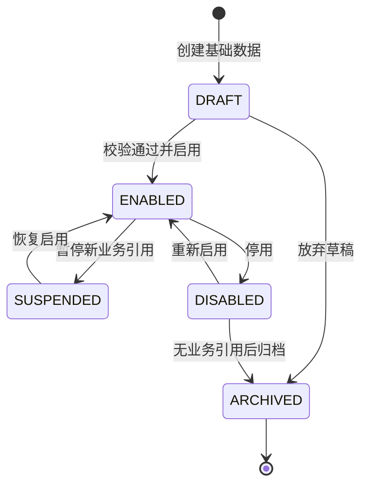

图 6-1：基础数据发布与启停状态机

### 6.2 物流路由执行流程

物流路由先完成 ERP 编码映射，再从物流产品和仓群找到候选物理仓与候选渠道，最后通过地址、分区、尺重、敏感属性、客户策略和成本时效决策得到最终渠道。


图 6-2：物流路由执行流程

### 6.3 SKU 生命周期

SKU 从草稿到激活、实测、冻结、归档必须受状态约束。草稿 SKU 禁止创建 ASN；冻结 SKU 禁止出库；存在库存余额的 SKU 禁止归档。

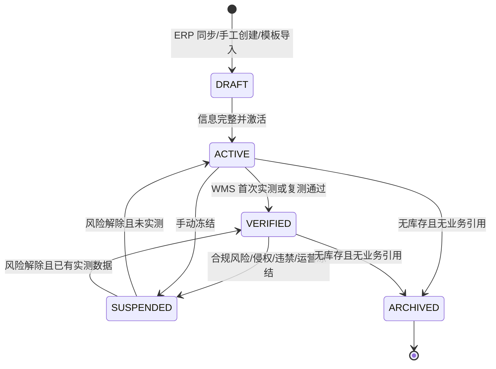

图 6-3：SKU 生命周期状态机

### 6.4 SKU 尺重复测流程

尺重复测由 WMS 现场收货/抽检或 OMS 账单争议触发。审核通过后更新 SKU 实测尺重，并分发到 WMS、出库路由和计费引擎。


图 6-4：SKU 尺重复测状态机

### 6.5 SKU 同步 WMS 流程

SKU 同步支持自动和手动两类触发：ASN 审核通过时自动推送目的物理仓；复测审核通过时自动更新 SKU 已入库过的物理仓；运营可人工批量推送和重试失败记录。

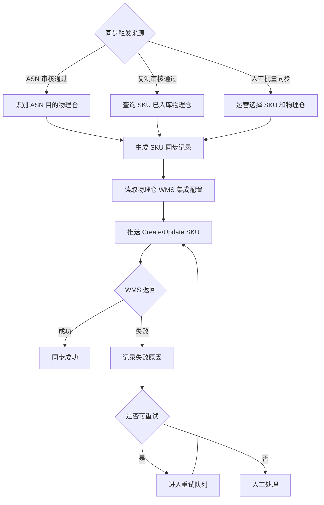

图 6-5：SKU 同步 WMS 流程

### 6.6 入库指令同步流程

客户或 ERP 创建入库预报后，平台生成 ASN 并推送至外部 WMS。外部 WMS 完成收货、质检、上架后回传状态与差异，平台更新入库单和库存。

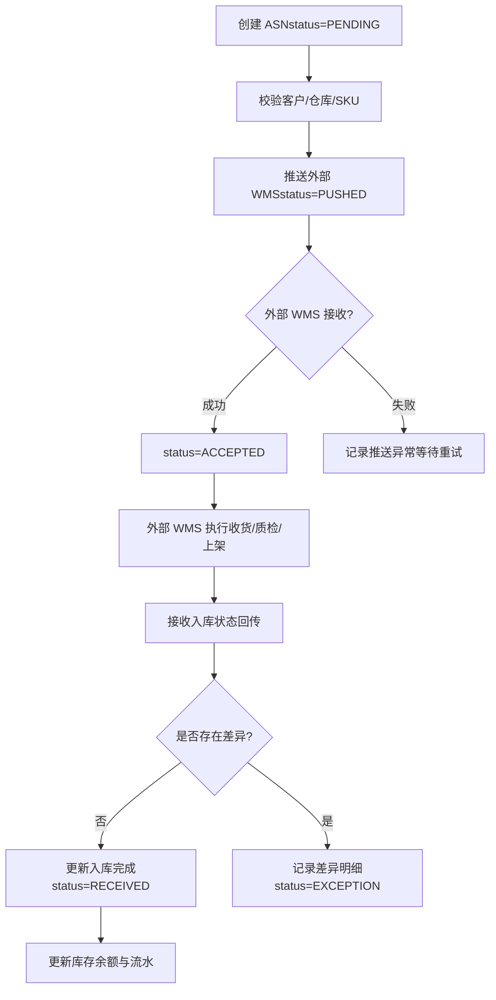

图 6-6：收货上架全流程（ASN -> 收货 -> 质检 -> 上架 -> 库存更新）

外部执行原则：平台只维护入库指令、状态和差异，不设计库位推荐和上架任务。外部 WMS 回传的库内明细可作为扩展字段或原始 payload 保存。

### 6.7 出库履约编排流程

出库单创建后，平台完成仓库校验、库存预占、渠道选择、打单请求和出库指令推送；外部 WMS 执行库内作业后回传发货状态。

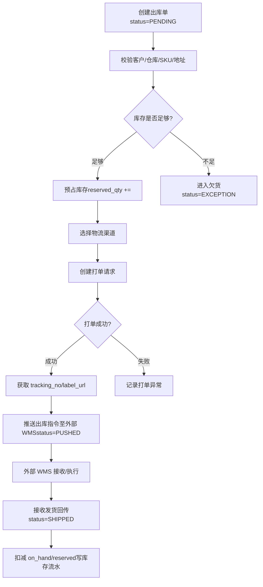

图 6-7：出库履约编排流程（预占 -> 打单 -> 推送 WMS -> 发货回传）

### 6.8 库存同步差异处理流程

当前阶段不设计平台盘点任务。外部 WMS 完成盘点或库存校准后，将库存快照同步到平台；平台负责识别差异、生成库存流水、更新库存余额并记录差异来源。

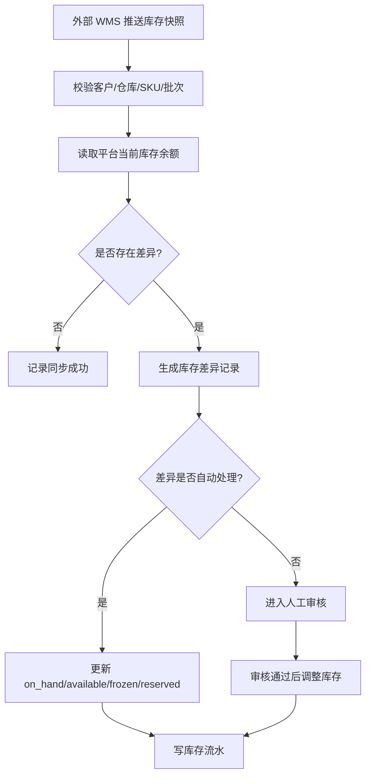

图 6-8：库存同步差异处理流程（同步 -> 对比 -> 差异 -> 调整）

### 6.9 库存冻结与释放流程

冻结用于临时锁定部分库存，防止被出库分配占用；释放则将冻结库存转回可用状态。

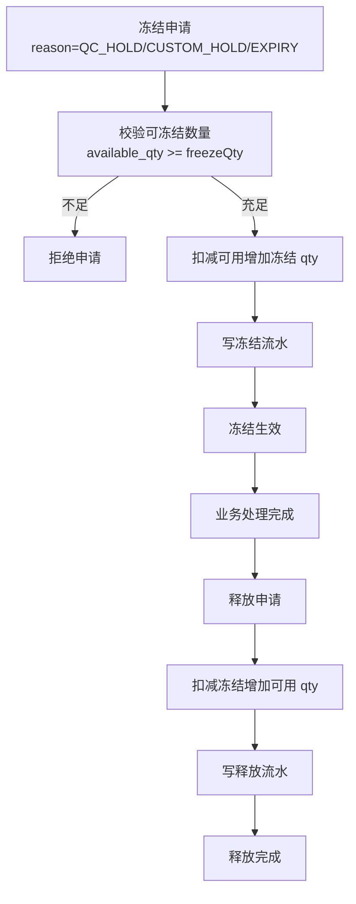

图 6-9：库存冻结/释放状态流转

### 6.10 出库履约状态机

出库履约状态机描述平台订单从创建、预占、推送外部 WMS 到发货完成的生命周期。

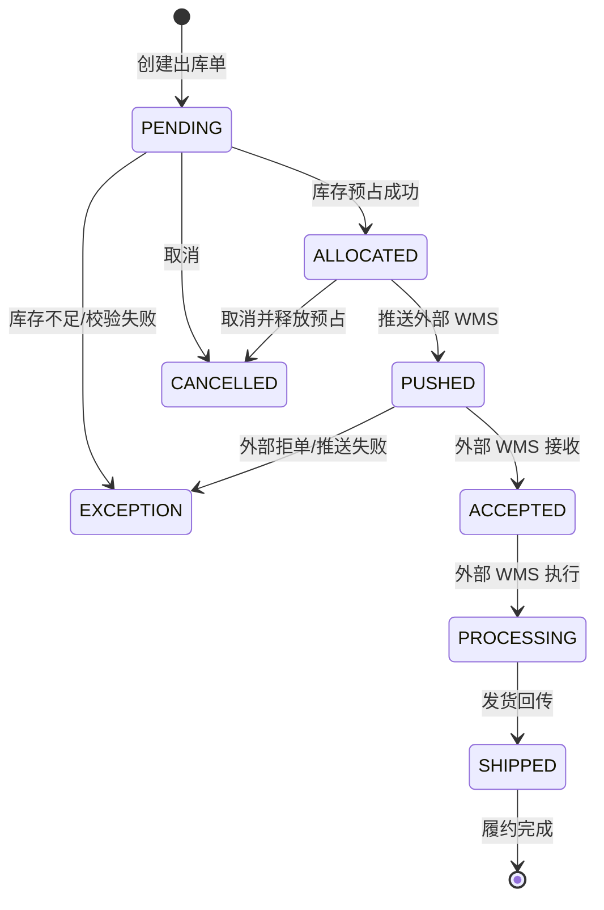

图 6-10：出库履约状态机

## 07 关键业务规则

本章节梳理海外仓 OMS 平台必须强制执行的业务规则与约束，涵盖库存一致性、库存预占、外部系统幂等、渠道选择、安全库存及超卖防控等方面。

### 7.1 基础数据状态与引用规则

- 只读历史：仓群、物理仓、物流产品、物流渠道、规则库和集成配置一旦被订单、库存、合同、报价或外部映射引用，禁止物理删除，只允许停用、失效或归档。

- 启用前校验：物理仓启用前必须维护地址、时区、仓库服务商 customer_id 和 WMS 集成关系；物流渠道启用前必须维护物流商 customer_id、面单来源和渠道能力。

- 规则发布：路由规则、Zone File、偏远/AHS/OS/燃油/地址规则必须先保存草稿，再发布版本；发布后不覆盖修改，只能发布新版本。

- 业务快照：订单、面单和计费事件必须保存仓群、物理仓、物流产品、物流渠道、规则版本和外部编码快照，避免基础数据变更影响历史业务。

### 7.2 编码、映射与版本规则

- 编码唯一：仓群代码、物理仓代码、物流产品代码、物流渠道代码在租户内唯一；SKU Code 在租户 + customer_id 下唯一。

- 第三方映射唯一：同一租户、同一外部系统、同一映射类型、同一外部编码只允许指向一个平台对象。

- 版本生效：规则版本按业务发生时间匹配；订单创建、复测生效、计费重算等场景必须明确使用哪个业务时间。

- 外部编码不强校验格式：平台只校验外部编码非空、长度、唯一性，不校验具体格式，避免不同 ERP/WMS/TMS 厂商规则冲突。

### 7.3 物流路由规则

- 逻辑层优先：客户和 ERP 优先选择仓群与物流产品；OMS 再根据规则落到物理仓和物流渠道。

- 过滤顺序：路由必须按 ERP 映射、仓群、物流产品、地址校验、Zone、尺重、AHS/OS、商品敏感属性、客户策略、成本/时效决策的顺序执行。

- 失败原因：路由失败必须返回明确原因，例如无可用渠道、地址不可达、超尺寸、敏感品不支持、面单配置不可用。

- 结果快照：路由结果必须保存候选渠道、过滤原因、命中规则版本和最终渠道，便于客服解释和费用争议处理。

### 7.4 SKU 生命周期规则

- DRAFT：草稿或待审核 SKU 信息不完整，禁止创建 ASN，禁止同步 WMS。

- ACTIVE：基础信息完整，允许创建 ASN 和同步 WMS；出库路由和计费使用预报尺重，并提示未实测风险。

- VERIFIED：WMS 首次实测或复测通过后进入已实测状态，路由和计费优先使用实测尺重。

- SUSPENDED：合规、侵权、违禁品或运营风险触发冻结，禁止新建 ASN、禁止出库，并通知 WMS 停止上下架和出库动作。

- ARCHIVED：仅无库存、无在途、无预占、无冻结、无未完成业务时允许归档。

### 7.5 SKU 尺重复测规则

- 发起来源：复测可由 WMS 收货复测、库内抽检复测、OMS 账单争议复测发起。

- 自动通过：当实测偏差 ≤ 3% 且未触发任何物流商附加费临界点时，可按策略自动通过。

- 人工审核：触发 AHS/OS、重量超档、体积重明显变化、客户账单争议等情况必须人工审核。

- 生效动作：复测通过后更新 SKU 实测尺重，记录复测生效日志，并触发 WMS SKU 更新、出库路由更新和计费事件。

- 账单追溯：开启账单追溯时，复测变大并审核通过后，可按过去 X 天已发货订单模拟计费并生成补收差额事件。

### 7.6 SKU 同步 WMS 规则

- ASN 自动同步：ASN 审核通过后，系统自动将 ASN 明细中的 SKU 推送到目的物理仓 WMS。

- 复测自动同步：复测审核通过后，系统自动将 SKU 新尺重推送到该 SKU 已入库过的所有物理仓 WMS。

- 人工兜底：运营可在 SKU 列表或同步监控台批量选择 SKU 和物理仓手动同步。

- 失败重试：网络失败和 5xx 可自动重试；条码冲突、字段校验失败、WMS 业务拒绝不自动重试，进入人工处理。

- 同步可观测：每次同步必须记录同步流水号、触发来源、目的物理仓、请求报文、WMS 返回消息、状态、重试次数和操作人。

### 7.7 库存一致性规则

核心公式：对于任意库存余额，on_hand_qty = available_qty + reserved_qty + frozen_qty。in_transit_qty 表示在途库存，不计入在库实物数量。系统在任何库存事务提交前必须校验该公式。

- 非负约束：所有库存数量字段（on_hand, available, reserved, frozen, in_transit）必须 ≥ 0；任一字段为负时事务必须回滚并触发告警。

- 预占一致性：出库单预占时 available_qty -= qty 且 reserved_qty += qty；取消出库单时反向释放；发货确认时 on_hand_qty -= qty 且 reserved_qty -= qty。

- 在途独立：在途库存只受采购、调拨、入库预报或外部系统同步影响，不参与出库预占，不计入可售库存。

- 流水对账：每次库存变动必须同步写入 owh_inventory_flow，流水汇总数量必须与库存净变动相等；每日定时任务对账差异。

- 乐观锁防并发：owh_inventory 表使用 version 字段实现乐观锁；更新时 WHERE version = #{oldVersion}，失败则重试或抛并发冲突异常。

### 7.8 外部仓库编码规则

平台仓库编码和外部仓库编码必须分离维护。平台使用 warehouse_code 作为内部稳定编码，外部 ERP/WMS 使用 owh_integration_mapping 维护映射。

- warehouse_code：平台仓库编码，租户内唯一，建议格式 WH-{COUNTRY}-{CITY}-{SEQ}。

- external_warehouse_code：外部系统仓库编码，同一外部系统内唯一。

- 映射唯一性：同一租户、同一外部系统、同一平台仓库只允许一个有效外部仓库编码。

- 状态隔离：停用外部映射不影响平台仓库档案，但禁止继续向该外部系统推送入库/出库指令。

编码校验：平台不校验外部仓库编码格式，只校验非空、长度和唯一性，避免不同 WMS 厂商编码规则冲突。

### 7.9 外部系统推送与回传规则

- 幂等键：入库、出库、打单推送必须生成业务幂等键，建议使用 tenant_id + biz_type + biz_no + target_system。

- 推送记录：每次外部调用必须写入 owh_external_push_record，记录请求、响应、状态、重试次数和下一次重试时间。

- 回调验签：外部系统回调必须校验来源、签名、时间戳和幂等键，重复回调只允许更新最后回调时间，不重复扣减库存。

- 异常重试：网络失败和 5xx 可按退避策略重试；业务拒单、参数错误、签名错误不自动重试，进入人工处理。

### 7.10 海外仓合同与费用规则

- 合同归属：海外仓服务合同归属 myow-overseas，覆盖仓储、入库、出库、退件、贴标、换标、打包、耗材等海外仓服务。

- 费用项引用：费用规则必须引用 myow-finance 的 fee_code，例如 OWH_STORAGE_FEE、OWH_INBOUND_FEE、OWH_OUTBOUND_FEE、OWH_LABEL_FEE。

- 价格维度：海外仓费用规则可按 customer_id、warehouse_id、sku_id、服务类型、重量段、体积段、件数、天数等维度配置。

- 计费事件：作业完成或外部 WMS 回传状态后，myow-overseas 负责匹配合同费用规则，并向 myow-finance 推送计费事件。

### 7.11 渠道选择规则

#### 客户优先

客户指定渠道或渠道偏好优先级最高；若指定渠道不可用，则根据客户授权规则选择备选渠道。

#### 可达校验

根据国家、邮编、地址、重量、体积、商品属性过滤不可达或超限制渠道。

#### 成本与时效

在满足客户规则的前提下，按运费、时效、服务等级和渠道稳定性综合排序。

#### 打单约束

渠道选择必须校验对应打单系统配置可用，打单失败时可按规则切换备选渠道或进入异常处理。

### 7.12 先进先出 / 先到期先出规则

- 默认策略：库存分配默认采用 FEFO（First Expired First Out，先到期先出）；对于无保质期商品，降级为 FIFO（First In First Out）。

- 批次分配顺序：按 expiry_date ASC, production_date ASC, batch_id ASC 排序分配库存。

- 临期拦截：距保质期到期日 ≤ 7 天的库存自动标记为 EXPIRY_WARNING，分配时降级，优先发给非敏感渠道或促销处理。

- 过期冻结：超过保质期的库存自动冻结，禁止出库，触发报损流程。

### 7.13 安全库存预警规则

- 安全库存定义：每个 SKU 在每个仓库可设置 safe_stock_qty；当 available_qty ≤ safe_stock_qty 时触发预警。

- 预警分级： 黄色预警：available ≤ safe_stock × 1.5，提醒补货。

- 红色预警：available ≤ safe_stock，紧急补货。

- 断货预警：available = 0 且有未满足预占，立即通知运营。

- 补货建议：系统根据近 30 天日均出库量与在途库存，自动计算建议补货量 suggest_qty = max(ceil(avg_daily_out × 14), safe_stock × 2) - in_transit_qty。

### 7.14 超卖与欠货防控规则

- 强预占模式：出库单创建即预占库存；若可用库存不足，创建失败并返回缺货 SKU 列表。适用于自营仓、库存可信场景。

- 弱预占模式：出库单创建允许缺货，进入 BACKORDER 或 EXCEPTION 状态，待库存补足后重新触发预占。适用于预售或供应商代发场景。

- 缺货分配：当多个出库单竞争同一 SKU 最后库存时，按优先级（priority DESC）+ 创建时间（create_time ASC）排序分配。

- 欠货释放：外部 WMS 回传缺货或拒单时，平台立即释放该订单预占，订单进入 EXCEPTION，并记录履约异常事件。

- 重复推送拦截：同一出库单已推送外部 WMS 后，禁止重复创建新推送任务；通过 status、推送记录和幂等键联合校验。

### 7.15 退货入库规则（扩展）

- 退货单来源：由 OMS 或客服系统发起，生成 RMA（Return Merchandise Authorization）单号，同步至 WMS 创建退货入库单。

- 退货质检：退货商品由外部 WMS 质检并回传 GOOD（可二次销售）、DAMAGED（损坏）、DISPOSE（报废）等结果；平台记录结果并同步库存与退款/财务流程。

- 退款联动：退货入库完成且质检为 GOOD 后，回调 OMS/财务系统触发退款；若为 DAMAGED，进入客诉定责流程。

## 08 权限码与错误码

本章节统一收口 myow-overseas 的权限码和错误码。前期已细化的基础数据中心与商品 / SKU 模块以本章节为开发实现依据；后续入库、库存、出库、计费、退货、VAS 等模块细化后继续追加到本章。

### 8.1 权限码命名规则

- 格式：overseas:{domain}:{resource}:{action}，其中 domain 表示业务域，resource 表示资源，action 表示动作。

- 动作：常用动作包括 view、manage、review、sync、export。

- 粒度：P0 阶段以菜单/功能级权限为主；涉及复测审核、规则发布、集成配置等高风险动作必须单独授权。

- 数据权限：客户、仓库、仓群维度的数据可见性由组织和客户授权规则控制，不通过权限码表达。

### 8.2 基础数据中心权限码

| 权限码 | 说明 | 适用功能 |
| --- | --- | --- |
| overseas:base:warehouse-cluster:view | 查看仓群 | 仓群列表、详情、绑定关系查看 |
| overseas:base:warehouse-cluster:manage | 管理仓群 | 创建、更新、启停仓群与绑定物理仓 |
| overseas:base:physical-warehouse:manage | 管理物理仓 | 维护物理仓、地址、运营属性和 WMS 关系 |
| overseas:base:logistics-product:manage | 管理物流产品 | 维护物流产品、产品类型和产品级路由策略 |
| overseas:base:logistics-channel:manage | 管理物流渠道 | 维护物流渠道、渠道能力、面单配置 |
| overseas:base:rule-set:manage | 管理物流规则库 | 维护偏远、AHS、OS、燃油、地址校验等规则库 |
| overseas:base:routing-rule:manage | 管理路由规则 | 维护和测试物流路由规则 |
| overseas:base:integration:manage | 管理系统集成 | 维护 WMS/TMS/ERP 集成配置和编码映射 |

### 8.3 商品 / SKU 权限码

| 权限码 | 说明 | 适用功能 |
| --- | --- | --- |
| overseas:sku:view | 查看 SKU 主数据 | SKU 列表、详情、同步记录、复测记录查看 |
| overseas:sku:manage | 管理 SKU 主数据 | 创建、编辑、激活、冻结 SKU |
| overseas:sku:mapping:manage | 管理 SKU 映射 | 维护 Seller SKU、FNSKU、ASIN、WMS SKU、条码映射 |
| overseas:sku:remeasure:review | 审核尺重复测 | 批准、驳回、要求重新测量 |
| overseas:sku:remeasure:rule | 管理复测策略 | 维护自动审核阈值、附加费临界点校验、账单追溯策略 |
| overseas:sku:sync:manage | 管理 SKU 同步 | 手动同步、失败重试、同步异常处理 |

### 8.4 错误码命名规则

- 格式：OWH_{DOMAIN}_{SEQ}，其中 OWH 表示 overseas warehouse，DOMAIN 表示业务域，SEQ 为三位序号。

- 基础数据中心：使用 OWH_BASE_001 起编号。

- 商品 / SKU：使用 OWH_SKU_001 起编号。

- 错误消息：接口返回给前端的错误消息必须稳定、可翻译；内部异常细节写入日志，不直接暴露外部系统密钥、原始签名或敏感响应。

### 8.5 基础数据中心错误码

| 错误码 | 说明 | 触发场景 |
| --- | --- | --- |
| OWH_BASE_001 | 编码已存在 | 仓群、物理仓、物流产品、物流渠道编码重复。 |
| OWH_BASE_002 | 客商主体不可用 | 仓库服务商或物流商 customer_id 不存在、停用、黑名单或角色不匹配。 |
| OWH_BASE_003 | 状态不允许操作 | 已归档数据被编辑，或停用数据被新业务引用。 |
| OWH_BASE_004 | 存在业务引用，禁止删除 | 基础数据已被订单、库存、合同、规则或映射引用。 |
| OWH_BASE_005 | 规则生效区间冲突 | 同一规则类型、物流商、渠道下有效时间重叠。 |
| OWH_BASE_006 | 路由无可用渠道 | 物流产品下无启用渠道，或被地址、尺重、敏感属性全部过滤。 |
| OWH_BASE_007 | 集成连接测试失败 | WMS/TMS/Carrier API 认证失败、网络超时或返回业务错误。 |
| OWH_BASE_008 | 第三方映射冲突 | 同一外部系统、映射类型、外部编码指向多个平台对象。 |
| OWH_BASE_009 | 物流分区未命中 | 按发货仓、物流商、目的邮编无法匹配 Zone。 |
| OWH_BASE_010 | 面单配置不可用 | 渠道要求打单系统，但未绑定有效打单配置或面单模板。 |

### 8.6 商品 / SKU 错误码

| 错误码 | 说明 | 触发场景 |
| --- | --- | --- |
| OWH_SKU_001 | SKU 编码已存在 | 同一客户下 SKU Code 重复。 |
| OWH_SKU_002 | SKU 信息不完整 | 缺少名称、申报、尺重、条码等激活必填字段。 |
| OWH_SKU_003 | SKU 状态不允许操作 | 草稿创建 ASN、冻结 SKU 出库、归档 SKU 编辑。 |
| OWH_SKU_004 | 外部编码映射冲突 | 同一 ERP/WMS/FNSKU/条码映射到多个 SKU。 |
| OWH_SKU_005 | 复测单状态不允许审核 | 已生效、已驳回或待二次复测状态重复审核。 |
| OWH_SKU_006 | 复测数据无效 | 尺重为空、负数、单位不支持或明显异常。 |
| OWH_SKU_007 | SKU 同步失败 | WMS API 返回失败或网络异常。 |
| OWH_SKU_008 | SKU 存在库存，禁止归档 | SKU 在任意物理仓存在在途、可用、预占或冻结库存。 |

MYOW-Overseas 业务设计文档 v1.0 | 基于 myow-oms 项目编码规范 | 2026年6月
