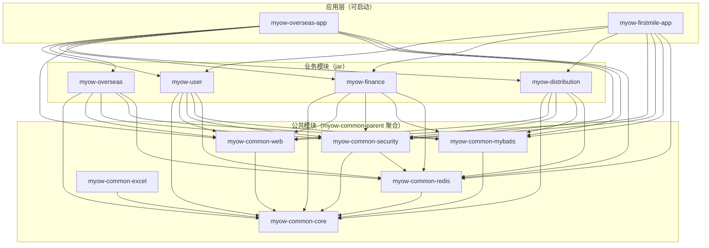
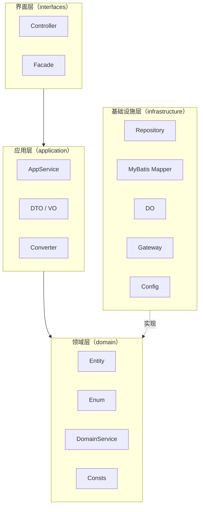

# MYOW-OMS 编码设计规范

## 目录
- **01** 概述与适用范围
- **02** 模块与分层架构
- **03** 命名规范
- **04** 领域模型规范
- **05** API 接口规范
- **06** 数据库与持久层规范
- **07** 应用内事件规范
- **08** 缓存规范
- **09** 异常与错误码规范
- **10** 日志与监控规范
- **11** 安全规范
- **12** 国际化规范
## 01 概述与适用范围

本规范为 MYOW-OMS 项目的编码设计语言，基于现有代码库的实际结构编制。项目采用 Maven 多模块单体架构，各业务模块以 jar 包形式被应用模块依赖，在同一 JVM 内运行。规范的目标是在 user、finance、distribution、overseas、firstmile 各模块内建立统一的代码表达范式。

### 1.1 技术栈基线

#### Java 17 + Spring Boot 3.2.3

使用 Record、模式匹配、文本块等新特性；Spring Boot 3.x 原生支持 Jakarta EE 命名空间。

#### PostgreSQL + MyBatis Plus 3.5.5

主数据库使用 PostgreSQL 15+，持久层使用 MyBatis Plus，代码生成器辅助生成基础 CRUD。

#### Sa-Token + Redis

认证授权使用 Sa-Token，会话存储在 Redis；Redisson 提供分布式锁与缓存能力。

#### MapStruct + Lombok

对象转换使用 MapStruct 编译期生成，减少手写转换代码；Lombok 简化样板代码。

### 1.2 模块结构

```
myow-oms (parent POM)
├── myow-overseas-app       # 海外仓应用（可启动）
├── myow-firstmile-app      # 首公里应用（可启动）
├── myow-user               # 用户/角色/权限/部门（业务模块）
├── myow-overseas           # 海外仓业务（仓库、库存、渠道、入库、出库）
├── myow-finance            # 财务计费（业务模块）
├── myow-distribution       # 分销（业务模块）
└── myow-common-parent      # 公共模块聚合父模块
    ├── myow-common-core    # 公共核心（异常、响应、枚举、工具、端口接口）
    ├── myow-common-web     # Web 公共（全局异常、JSON、Knife4j）
    ├── myow-common-security # 安全公共（Sa-Token 适配）
    ├── myow-common-mybatis # MyBatis 公共（数据源、分页）
    ├── myow-common-redis   # Redis 公共（Redisson 配置）
    └── myow-common-excel   # Excel 公共（导入导出）
```

### 1.3 规范适用边界

- 适用范围：所有业务模块（myow-user / myow-overseas / myow-finance / myow-distribution）与应用模块（myow-overseas-app / myow-firstmile-app）

- 不适用：myow-common-core 与 myow-common-* 公共模块的底层配置类、前端代码、运维脚本

- 增量原则：存量代码不要求一次性重写，新增功能与重构区域须遵循本规范

- 优先级：安全规范与数据库规范为强制项，其他规范在代码评审中逐步收敛

## 02 模块与分层架构

每个业务模块内部采用 DDD 四层架构，包结构按分层职责严格划分。领域层（domain）不依赖任何外部框架，基础设施层（infrastructure）通过依赖倒置为领域层提供技术实现。模块间优先通过 myow-common-core 中定义的 Port 接口协作，由能力提供方模块在 infrastructure.gateway 中实现适配，禁止直接访问其他模块的 infrastructure 或 domain 层。

### 2.1 模块间依赖规则



图 2-1：目标模块依赖关系（箭头表示 Maven 依赖方向）

模块间调用约束：

1. 应用模块负责组装可启动应用，可以依赖业务模块与公共模块，但不承载业务规则。

2. 业务模块之间禁止直接调用对方的 infrastructure、domain 或具体 application service；跨模块查询与命令优先通过 myow-common-core 中的 Port 接口完成。

3. Port 接口按能力命名并放在 com.myow.common.port，实现类由数据提供方放在自身 infrastructure.gateway 包下，例如 DeptInfoPort 由 user 模块实现。

4. 禁止出现循环依赖——业务模块只能依赖 common 模块，不能彼此建立 Maven 依赖。

### 2.2 模块内四层架构



图 2-2：模块内 DDD 四层架构（以 myow-user 为参考）

### 2.3 包结构模板

以 myow-user 为范例，包名前缀固定为 com.myow.{模块名}：

```
com.myow.user
├── interfaces
│   └── controller
│       ├── UserController.java
│       ├── UserLoginController.java
│       └── DeptController.java
├── application
│   ├── service
│   │   ├── UserManagementService.java
│   │   ├── UserLoginService.java
│   │   └── DeptService.java
│   ├── dto
│   │   ├── CreateUserReqDTO.java
│   │   ├── UserRespDTO.java
│   │   └── PageUserReqDTO.java
│   ├── vo
│   │   ├── UserLoginResultVO.java
│   │   └── UserMenuRespVO.java
│   └── converter
│       ├── UserApplicationConverter.java
│       └── DeptApplicationConverter.java
├── domain
│   ├── entity
│   │   ├── User.java
│   │   ├── Dept.java
│   │   └── Role.java
│   ├── enums
│   │   ├── GenderEnum.java
│   │   └── MenuTypeEnum.java
│   ├── service
│   │   └── UserDomainService.java
│   └── consts
│       └── SystemCacheConst.java
└── infrastructure
    ├── persistence
    │   ├── mapper
    │   │   ├── UserMapper.java
    │   │   └── DeptMapper.java
    │   ├── po
    │   │   ├── UserDO.java
    │   │   └── DeptDO.java
    │   └── repository
    │       ├── UserRepository.java
    │       └── DeptRepository.java
    ├── gateway
    │   └── UserTenantUserPort.java
    └── config
        ├── MyMetaObjectHandler.java
        └── SaTokenConfig.java
```

禁止事项：

1. Controller 不得直接调用 Mapper 或 Repository，必须经过 AppService。

2. domain 层不得出现 Spring 注解、MyBatis 注解或任何框架依赖。

3. application 层的 DTO / VO 不得进入 domain 层，跨层数据传输须通过 Converter 转换。

## 03 命名规范

命名是代码可读性的第一要素。本规范对类、方法、变量、数据库对象、API 端点等全部可命名实体制定统一规则，确保在 IDE 中通过名称即可判断其类型与作用域。

### 3.1 类命名

| 类型 | 命名规则 | 示例 |
| --- | --- | --- |
| 实体（Entity） | 名词，领域概念直接映射 | User, Dept, OutboundOrder |
| 持久化对象（DO） | 实体名 + DO | UserDO, DeptDO |
| 应用服务 | 领域名 + Service | UserManagementService, DeptService |
| 领域服务 | 领域名 + DomainService | UserDomainService |
| 仓库 | 实体名 + Repository | UserRepository, DeptRepository |
| Controller | 资源名 + Controller | UserController, DeptController |
| 请求 DTO | 动作 + ReqDTO / Page + ReqDTO | CreateUserReqDTO, PageUserReqDTO |
| 响应 DTO | 资源名 + RespDTO | UserRespDTO, DeptRespDTO |
| 响应 VO | 资源名 + VO | UserLoginResultVO, UserMenuRespVO |
| Converter | 资源名 + ApplicationConverter | UserApplicationConverter |
| Mapper | 实体名 + Mapper | UserMapper, DeptMapper |
| 枚举 | 状态 / 类型 + Enum | GenderEnum, MenuTypeEnum |
| 异常 | 场景 + Exception | BusinessException, SerialNumberException |
| 常量类 | 领域 + Const / Consts | SystemCacheConst, TenantConst |
| 工具类 | 功能 + Utils / Helper | EnumUtil, MessageUtils |
| 端口 / 适配器 | 功能 + Port | DeptInfoPort, TenantUserPort |
| 配置类 | 配置名 + Config | SaTokenConfig, RedisConfig |

### 3.2 方法命名

| 场景 | 命名规则 | 示例 |
| --- | --- | --- |
| 查询单条 | getBy{条件} / findBy{条件} | getById(Long id), findByUserName(String userName) |
| 查询列表 | list{条件} | listByDeptId(Long deptId) |
| 分页查询 | page{条件} | page(PageUserReqDTO pageParam) |
| 创建 | create / save | create(CreateUserReqDTO req), save(User user) |
| 更新 | update / modify | update(UpdateUserReqDTO req) |
| 删除 | remove / delete | removeById(Long id) |
| 校验 | validate / check | validateUserName(String userName) |
| 转换 | to{目标类型} / from{源类型} | toEntity(), fromDO(UserDO dataObject) |
| 登录相关 | login / logout / refresh | login(UserLoginReqDTO req) |

### 3.3 变量与常量命名

- 局部变量：camelCase，如 userName, deptId

- 成员变量：camelCase，不使用 m / _ 前缀

- 常量：UPPER_SNAKE_CASE，如 MAX_PAGE_SIZE = 200, CACHE_TTL = 3600

- 静态常量：使用 static final，放置在 Const / Consts 类中

- 布尔变量：使用 is / has / can 前缀，如 isDeleted, hasRole

- 集合变量：使用复数形式，如 users, deptList

- ID 变量：明确类型，如 userId, tenantId

### 3.4 数据库对象命名

| 对象 | 命名规则 | 示例 |
| --- | --- | --- |
| 表名 | 模块前缀_实体名，全小写下划线 | sys_user, sys_dept, fin_contract |
| 主键 | id | id BIGINT PRIMARY KEY |
| 外键 | 引用表名_单数_id | dept_id, tenant_id |
| 索引 | idx_表名_字段名 | idx_sys_user_dept_id |
| 唯一索引 | uk_表名_字段名 | uk_sys_user_user_name |
| 逻辑删除 | 统一 deleted | deleted SMALLINT DEFAULT 0 |
| 时间戳 | create_time / update_time | 统一使用 timestamp(3) |

### 3.5 API 端点命名

- 基础路径：/api/{模块}/{资源}，如 /api/user/users, /api/finance/contracts

- 资源分隔：使用复数名词，如 users, depts, contracts

- 子资源：{资源}/{id}/{子资源}，如 /api/user/users/{id}/roles

- 动作：使用 POST + 动作路径，如 POST /api/user/users/{id}/disable

- 登录相关：/api/auth/login, /api/auth/logout, /api/auth/refresh

### 3.6 缓存 Key 命名

- 格式：{模块}:{领域}:{标识}

- 用户权限：user:perm:{userId}

- 部门树：user:dept:tree:{tenantId}

- 字典数据：user:dict:{dictType}

- 会话 Token：satoken:login:token:{tokenValue}（Sa-Token 内置）

## 04 领域模型规范

领域模型是 DDD 的核心。本规范明确 Entity、Enum、DomainService、Repository 的编码范式，确保领域层的纯粹性与业务表达力。在当前项目中，Entity 与 DO 分离，通过 Converter 在 application 层完成转换。

### 4.1 实体（Entity）

- 必须有唯一标识（ID），使用 Long 类型，数据库主键使用雪花算法或自增

- 实体类放在 domain.entity 包下，不加任何框架注解

- 状态变更通过领域方法完成，禁止直接 setter 修改状态

- 使用 Lombok 的 @Getter，但避免 @Setter，只在需要时提供特定字段的 setter

```
package com.myow.user.domain.entity;

import lombok.Getter;

@Getter
public class User {
    private Long id;
    private String userName;
    private String nickName;
    private Long deptId;
    private Integer status;
    private LocalDateTime createTime;
    private LocalDateTime updateTime;

    private User() {}

    public static User create(String userName, String nickName, Long deptId) {
        User user = new User();
        user.userName = userName;
        user.nickName = nickName;
        user.deptId = deptId;
        user.status = 1;
        return user;
    }

    public void disable() {
        this.status = 0;
    }

    public void enable() {
        this.status = 1;
    }

    public void updateDept(Long deptId) {
        this.deptId = deptId;
    }
}
```

### 4.2 持久化对象（DO）

- DO 放在 infrastructure.persistence.po 包下，与数据库表一一对应

- 使用 MyBatis Plus 注解（@TableName, @TableId, @TableField）

- DO 仅用于数据持久化，不参与业务逻辑，禁止将 DO 传递到 interface 层

- 字段命名与数据库列名保持一致，使用驼峰映射

```
package com.myow.user.infrastructure.persistence.po;

import com.baomidou.mybatisplus.annotation.*;
import lombok.Data;

@Data
@TableName("sys_user")
public class UserDO {
    @TableId(type = IdType.ASSIGN_ID)
    private Long id;
    private String userName;
    private String nickName;
    private Long deptId;
    private Integer status;
    @TableLogic
    private Integer deleted;
    @TableField(fill = FieldFill.INSERT)
    private LocalDateTime createTime;
    @TableField(fill = FieldFill.INSERT_UPDATE)
    private LocalDateTime updateTime;
}
```

### 4.3 枚举（Enum）

- 枚举放在 domain.enums 包下，实现 BaseEnum 接口

- 提供 getCode() 和 getDesc() 方法，数据库中存储 code

- 禁止在数据库中使用魔法数字，所有状态/类型字段必须使用枚举

```
package com.myow.user.domain.enums;

import com.myow.common.enums.BaseEnum;
import lombok.AllArgsConstructor;
import lombok.Getter;

@Getter
@AllArgsConstructor
public enum GenderEnum implements BaseEnum {
    MALE(1, "男"),
    FEMALE(2, "女"),
    UNKNOWN(0, "未知");

    private final Integer code;
    private final String desc;
}
```

### 4.4 领域服务（DomainService）

- 当领域逻辑不属于任何单一实体时，使用 DomainService 承载

- 无状态，不持有实体引用作为成员变量

- 方法参数明确传入所需实体

```
package com.myow.user.domain.service;

public class UserDomainService {

    public void validateUserUnique(String userName, Long excludeId) {
        // 校验用户名唯一性逻辑
    }

    public void assignDefaultRole(Long userId) {
        // 为新用户分配默认角色逻辑
    }
}
```

### 4.5 仓库（Repository）

- Repository 放在 infrastructure.persistence.repository 包下，直接调用 Mapper

- Repository 负责 Entity 与 DO 之间的转换，返回 domain 层的 Entity

- 命名遵循 save, getById, getBy{条件}, remove 模式

```
package com.myow.user.infrastructure.persistence.repository;

import com.myow.user.domain.entity.User;
import com.myow.user.infrastructure.persistence.mapper.UserMapper;
import com.myow.user.infrastructure.persistence.po.UserDO;
import lombok.RequiredArgsConstructor;
import org.springframework.stereotype.Repository;

@Repository
@RequiredArgsConstructor
public class UserRepository {
    private final UserMapper userMapper;
    private final UserApplicationConverter converter;

    public User getById(Long id) {
        UserDO dataObject = userMapper.selectById(id);
        return dataObject == null ? null : converter.toEntity(dataObject);
    }

    public User getByUserName(String userName) {
        UserDO dataObject = userMapper.selectByUserName(userName);
        return dataObject == null ? null : converter.toEntity(dataObject);
    }

    public void save(User user) {
        UserDO dataObject = converter.toDO(user);
        if (user.getId() == null) {
            userMapper.insert(dataObject);
        } else {
            userMapper.updateById(dataObject);
        }
    }

    public void removeById(Long id) {
        userMapper.deleteById(id);
    }
}
```

### 4.6 Converter 规范

- 使用 MapStruct 定义 Converter 接口，编译期自动生成实现类

- Converter 放在 application.converter 包下

- Entity 与 DO 之间的字段映射必须显式声明，禁止隐式猜测

```
package com.myow.user.application.converter;

import com.myow.user.domain.entity.User;
import com.myow.user.infrastructure.persistence.po.UserDO;
import org.mapstruct.Mapper;
import org.mapstruct.Mapping;

@Mapper(componentModel = "spring")
public interface UserApplicationConverter {

    User toEntity(UserDO dataObject);

    UserDO toDO(User entity);

    @Mapping(target = "deptName", ignore = true)
    UserRespDTO toRespDTO(User entity);
}
```

## 05 API 接口规范

API 是模块对外暴露的契约。本规范覆盖 URL 设计、请求响应格式、分页、幂等、版本控制等维度，确保各模块接口的一致性。

### 5.1 URL 设计

| 操作 | 方法 | URL 模式 | 示例 |
| --- | --- | --- | --- |
| 创建 | POST | /api/{模块}/{资源} | POST /api/user/users |
| 查询单条 | GET | /api/{模块}/{资源}/{id} | GET /api/user/users/10001 |
| 查询列表 | GET | /api/{模块}/{资源} | GET /api/user/users?deptId=1 |
| 更新 | PUT | /api/{模块}/{资源}/{id} | PUT /api/user/users/10001 |
| 删除 | DELETE | /api/{模块}/{资源}/{id} | DELETE /api/user/users/10001 |
| 业务动作 | POST | /api/{模块}/{资源}/{id}/{动作} | POST /api/user/users/10001/disable |
| 登录 | POST | /api/auth/login | POST /api/auth/login |

### 5.2 统一响应格式

使用 myow-common-core 中定义的 Result：

```json
{
  "code": 200,
  "message": "success",
  "data": {
    "id": 10001,
    "userName": "admin",
    "nickName": "管理员"
  },
  "traceId": "a1b2c3d4e5f6g7h8"
}
```

- code：业务状态码，200 表示成功，非 200 表示业务异常

- message：可读的业务提示

- data：实际业务数据

- traceId：全链路追踪 ID

### 5.3 分页规范

- 请求参数：使用 PageParam，支持 pageNo（从 1 开始）、pageSize（默认 20，最大 200）、sort

- 响应结构：使用 PageResult，包含 list, total, pageNo, pageSize, pages

```json
{
  "code": 200,
  "data": {
    "list": [...],
    "total": 156,
    "pageNo": 1,
    "pageSize": 20,
    "pages": 8
  }
}
```

### 5.4 幂等设计

- 所有写操作须支持幂等

- 使用 Sa-Token 的 Token 机制或自定义 Idempotency-Key 请求头

- 服务端使用 Redis 缓存幂等键，TTL 24 小时

### 5.5 Springdoc / OpenAPI 注解规范

所有对外 HTTP 接口必须补充 Springdoc 相关注解，接口文档需要能直接支撑后续 UI 页面生成、前端联调和测试用例编写。禁止只写路径和方法而不描述业务含义、请求字段、响应字段和异常场景。

#### 5.5.1 Controller 注解要求

- Controller 类：必须使用 @Tag 描述接口分组，name 使用业务模块 + 资源名称，description 说明该 Controller 覆盖的业务范围。

- 接口方法：必须使用 @Operation，summary 写清楚接口功能，description 说明业务规则、状态约束、幂等要求、主要副作用。

- 请求参数：路径参数、查询参数、请求体字段必须通过 @Parameter、@RequestBody、@Schema 描述清楚含义、是否必填、示例值。

- 响应对象：返回 VO / RespDTO 必须使用 @Schema 描述字段含义，枚举字段必须说明可选值。

- 响应码：重要接口应使用 @ApiResponses / @ApiResponse 标明成功、参数错误、业务错误、无权限等典型结果。

- 隐藏接口：内部调试、临时接口、仅供系统内部调用且不希望出现在 OpenAPI 文档中的接口，必须显式使用 @Hidden，并说明原因。

#### 5.5.2 DTO / VO 字段注解要求

- 请求 DTO：每个对前端可见字段必须添加 @Schema(description = "...", requiredMode = ...)；必填字段同时使用 Bean Validation 注解，例如 @NotNull、@NotBlank、@Size。

- 响应 VO：每个字段必须添加 @Schema(description = "...", example = "...")，方便前端自动生成表格列、详情字段和表单回显。

- 枚举字段：必须在字段说明中列出枚举值含义，或在枚举类上使用 @Schema 补充说明。

- 金额、数量、时间：必须说明单位、精度和时区，例如金额币种、重量单位、ISO-8601 时间格式。

- 敏感字段：密码、密钥、Token、AppSecret 等字段不得作为普通响应字段暴露；如请求中需要出现，必须在 description 中说明安全用途。

#### 5.5.3 示例代码

```
import io.swagger.v3.oas.annotations.Operation;
import io.swagger.v3.oas.annotations.Parameter;
import io.swagger.v3.oas.annotations.media.Schema;
import io.swagger.v3.oas.annotations.responses.ApiResponse;
import io.swagger.v3.oas.annotations.responses.ApiResponses;
import io.swagger.v3.oas.annotations.tags.Tag;
import jakarta.validation.Valid;
import jakarta.validation.constraints.NotBlank;

@Tag(name = "海外仓-仓群管理", description = "维护仓群基础信息、仓群启停和仓群绑定物理仓")
@RestController
@RequestMapping("/api/v1/overseas/base/warehouse-cluster")
public class WarehouseClusterController {

    @Operation(
        summary = "创建仓群",
        description = "创建面向报价、客户选择和 ERP 对接的逻辑仓库容器。仓群代码在租户内唯一，创建后默认为 DRAFT 状态。"
    )
    @ApiResponses({
        @ApiResponse(responseCode = "200", description = "创建成功"),
        @ApiResponse(responseCode = "OWH_BASE_001", description = "仓群编码已存在"),
        @ApiResponse(responseCode = "400", description = "请求参数错误")
    })
    @PostMapping("/create")
    public Result<Long> create(@Valid @RequestBody CreateWarehouseClusterReqDTO req) {
        return Result.success(appService.create(req));
    }

    @Operation(summary = "查询仓群详情", description = "根据仓群 ID 查询仓群基础信息和当前状态。")
    @PostMapping("/detail")
    public Result<WarehouseClusterRespVO> detail(
        @Parameter(description = "仓群 ID", required = true, example = "10001")
        @RequestBody @Valid DetailReqDTO req
    ) {
        return Result.success(appService.detail(req.getId()));
    }
}

@Schema(description = "创建仓群请求")
public class CreateWarehouseClusterReqDTO {
    @Schema(description = "仓群代码，租户内唯一，例如 US_WEST_CLUSTER", requiredMode = Schema.RequiredMode.REQUIRED, example = "US_WEST_CLUSTER")
    @NotBlank
    private String clusterCode;

    @Schema(description = "仓群名称", requiredMode = Schema.RequiredMode.REQUIRED, example = "美国西部仓群")
    @NotBlank
    private String clusterName;

    @Schema(description = "所属国家 ISO Alpha-2 编码", requiredMode = Schema.RequiredMode.REQUIRED, example = "US")
    @NotBlank
    private String countryCode;

    @Schema(description = "结算币种 ISO 4217 编码", requiredMode = Schema.RequiredMode.REQUIRED, example = "USD")
    @NotBlank
    private String currencyCode;
}

@Schema(description = "仓群响应")
public class WarehouseClusterRespVO {
    @Schema(description = "仓群 ID", example = "10001")
    private Long clusterId;

    @Schema(description = "仓群代码", example = "US_WEST_CLUSTER")
    private String clusterCode;

    @Schema(description = "状态：DRAFT=草稿，ENABLED=启用，DISABLED=停用，ARCHIVED=归档", example = "ENABLED")
    private String status;
}
```

#### 5.5.4 文档质量要求

- 可读：前端不看后端代码，仅通过 OpenAPI 文档应能理解接口用途、字段含义和错误场景。

- 可生成：接口分组、字段描述、示例值、必填信息必须足够完整，支持后续生成 UI 表单、表格列和 TypeScript 类型。

- 可测试：每个接口应提供典型示例值，便于 Swagger UI、Apifox、Postman 或自动化测试快速构造请求。

- 同步维护：修改接口入参、响应字段、状态枚举、错误码时，必须同步更新 Springdoc 注解，不允许代码与文档不一致。

## 06 数据库与持久层规范

数据库是系统的核心资产。本项目使用 PostgreSQL，通过 MyBatis Plus 进行持久化操作。本规范覆盖表命名、字段类型、索引设计、租户隔离等关键规则。

### 6.1 表设计原则

- 命名：模块前缀 + 下划线 + 实体名，如 sys_user, sys_dept, fin_contract

- 字符集：PostgreSQL 默认 UTF-8

- 逻辑删除：所有业务表须包含 deleted SMALLINT DEFAULT 0，配合 MyBatis Plus @TableLogic

- 时间戳：须包含 create_time timestamp(3) DEFAULT CURRENT_TIMESTAMP(3) 和 update_time timestamp(3) DEFAULT CURRENT_TIMESTAMP(3)

- 多租户：业务表须包含 tenant_id BIGINT，配合 MyBatis Plus 多租户拦截器自动过滤

- 字段数量：单表字段不超过 50 个

- 注释：每个表和字段都必须有 COMMENT 说明

### 6.2 字段类型规范

| 数据类型 | PostgreSQL 类型 | Java 类型 | 说明 |
| --- | --- | --- | --- |
| 主键 ID | BIGINT | Long | 雪花算法或自增 |
| 金额 | NUMERIC(19,4) | BigDecimal | 统一 4 位小数 |
| 状态 / 类型 | SMALLINT / VARCHAR | Integer / Enum | 状态用 SMALLINT，类型用 VARCHAR |
| 布尔 | SMALLINT | Integer | 0 = false, 1 = true |
| 时间 | TIMESTAMP(3) | LocalDateTime | 毫秒精度 |
| JSON | JSONB | String / Object | 用于扩展字段 |
| 大文本 | TEXT | String | 备注、日志内容 |

### 6.3 MyBatis Plus 使用规范

- Mapper 继承 BaseMapper，获得基础 CRUD 能力

- 复杂查询使用 XML Mapper，放在 resources/mapper/ 目录下

- Service 层继承 ServiceImpl 或自行封装 Repository

- 分页查询使用 Page，通过 MyPageUtil 转换

- 多租户过滤通过 MyTenantLineHandler 自动注入，业务代码不手动拼接 tenant_id

### 6.4 索引设计

- 每个表必须有主键索引

- 业务查询条件中的等值过滤字段须建索引

- 单表索引数量不超过 6 个

- 覆盖索引优先：查询条件与返回字段尽量被索引覆盖

## 07 应用内事件规范

同一应用内模块间的协作优先使用 Spring 事件机制（ApplicationEvent），避免直接 Service 调用导致的紧耦合。跨应用通信通过 HTTP 接口或消息队列实现。

### 7.1 事件定义

- 事件类放在 domain 或 application 包下，继承 ApplicationEvent 或使用自定义事件

- 事件命名使用过去时态，如 UserCreatedEvent, OrderPaidEvent

- 事件对象包含发生时间、源实体 ID、必要上下文数据

```
package com.myow.user.domain.event;

import lombok.Getter;

@Getter
public class UserCreatedEvent {
    private final Long userId;
    private final String userName;
    private final Long tenantId;
    private final LocalDateTime occurredAt;

    public UserCreatedEvent(Long userId, String userName, Long tenantId) {
        this.userId = userId;
        this.userName = userName;
        this.tenantId = tenantId;
        this.occurredAt = LocalDateTime.now();
    }
}
```

### 7.2 事件发布与监听

```
// 发布事件
@Service
@RequiredArgsConstructor
public class UserManagementService {
    private final ApplicationEventPublisher eventPublisher;

    public void createUser(CreateUserReqDTO req) {
        // ... 创建用户逻辑
        eventPublisher.publishEvent(new UserCreatedEvent(userId, req.getUserName(), tenantId));
    }
}

// 监听事件
@Component
@RequiredArgsConstructor
public class UserEventListener {
    private final UserDomainService userDomainService;

    @EventListener
    @Async
    public void onUserCreated(UserCreatedEvent event) {
        userDomainService.assignDefaultRole(event.getUserId());
    }
}
```

### 7.3 事件消费原则

- 事件监听使用 @Async 异步处理，避免阻塞主流程

- 监听器须保证幂等性，使用 {eventType}:{entityId} 作为幂等键

- 事件处理失败不影响主事务，失败记录进入日志，人工介入处理

## 08 缓存规范

缓存是提升系统吞吐量的关键手段。本项目使用 Redis（通过 Redisson）作为集中式缓存，本地缓存（Caffeine）仅限全局配置类数据。

### 8.1 缓存使用场景

| 数据类型 | 缓存方案 | 过期策略 |
| --- | --- | --- |
| 用户权限 | Redis Hash，key: user:perm:{userId} | 30min TTL + 权限变更主动刷新 |
| 部门树 | Redis String（JSON） | 1h TTL + 部门变更主动刷新 |
| 字典数据 | Redis String（JSON） | 24h TTL |
| 租户配置 | Redis String（JSON） | 1h TTL |
| 会话 Token | Redis String（Sa-Token 内置） | 与 token 过期时间一致 |

### 8.2 缓存更新策略

- Cache-Aside：查询时先查缓存，未命中再查数据库并回写缓存

- 更新时失效：数据变更后先更新数据库，再删除缓存

- 禁止缓存穿透：数据库未命中的查询也写入缓存，值为空对象，TTL 60s

## 09 异常与错误码规范

异常处理直接影响用户体验与问题排查效率。本项目使用 myow-common-core 中定义的 BusinessException 和 myow-common-web 中定义的 GlobalExceptionHandler 统一处理异常。

### 9.1 错误码结构

错误码采用 {模块}_{场景}{序号} 的格式：

```
USER_1001  # 用户模块参数错误
USER_2001  # 用户模块业务规则错误
FIN_1001   # 财务模块参数错误
SYS_9999   # 系统未知错误
```

- 第 1 部分：模块简称，如 USER / FIN / DIST / SYS

- 第 2 部分：1xxx 参数错误，2xxx 业务规则错误，3xxx 系统错误，4xxx 第三方错误

### 9.2 异常使用规范

- 参数校验异常：使用 IllegalArgumentException 或自定义参数异常，返回 400

- 业务规则异常：使用 BusinessException，返回 200 但 code 非 200

- 系统异常：使用 RuntimeException 或 BusinessException，返回 500

- 全局处理：所有异常由 GlobalExceptionHandler 统一捕获并转换为 Result

### 9.3 错误提示策略

- 参数错误：返回具体字段与原因，如 "用户名不能为空"

- 业务规则错误：返回业务语义，如 "用户已存在"

- 系统错误：返回模糊提示，内部记录详细堆栈

## 10 日志与监控规范

日志是线上问题排查的关键线索。本项目使用 logback-spring.xml 配置日志，按环境输出到控制台或文件。

### 10.1 日志级别使用

| 级别 | 使用场景 |
| --- | --- |
| ERROR | 系统异常、数据不一致、无法自动恢复的错误 |
| WARN | 业务异常、可自动恢复的异常、潜在风险 |
| INFO | 核心业务流程节点、状态变更 |
| DEBUG | 调试信息、参数详情、SQL 语句 |

### 10.2 日志格式

```
2026-06-26 14:30:00.123 [traceId=a1b2c3d4] [userId=1001] [tenantId=2001] INFO c.m.u.s.UserManagementService - 用户创建成功，userId=10001, userName=admin
```

- traceId：全链路追踪 ID

- userId / tenantId：当前用户与租户 ID

- 消息：结构化文本，关键参数使用 key=value 格式

### 10.3 性能日志

- 所有外部调用（数据库、Redis、HTTP）须记录耗时

- 慢查询阈值：SQL 超过 500ms、HTTP 超过 3s、Redis 超过 50ms

## 11 安全规范

安全是系统的底线。本项目使用 Sa-Token 进行认证授权，配合 Redis 实现分布式会话管理。

### 11.1 认证与授权

- 认证：Sa-Token，Token 有效期 2 小时，支持自动续期

- 授权：RBAC 模型，角色 - 权限 - 资源三级关联

- 数据权限：用户只能访问所属租户（tenantId）的数据，SQL 中通过多租户拦截器自动过滤

- 密码：使用 BCrypt 加密存储，禁止明文传输与存储

### 11.2 数据加密

- 传输加密：生产环境强制 HTTPS（TLS 1.2+）

- 存储加密：敏感字段（手机号、身份证）使用 AES 加密存储

- 日志脱敏：日志中手机号显示为 138****1234

### 11.3 审计日志

- 所有写操作记录审计日志，保留 180 天

- 审计日志内容：操作人、操作时间、IP 地址、操作类型、资源 ID、变更前后值

- 审计日志存储在 sys_oper_log 表中

### 11.4 防攻击

- 防重放：API 请求携带时间戳和签名，有效期 5 分钟

- 限流：基于 Sa-Token 或 Sentinel 实现接口限流

- SQL 注入：禁止使用字符串拼接 SQL，必须使用 MyBatis 参数绑定

- XSS：后端返回 JSON，前端统一转义输出

## 12 国际化规范

本项目已配置 Spring MessageSource，支持多语言提示。资源文件放在 resources/i18n/ 目录下。

### 12.1 多语言

- 资源文件：messages.properties（默认）, messages_en.properties, messages_zh_CN.properties

- Locale 获取：从请求头 Accept-Language 或用户配置中获取

- 错误消息：错误码对应的消息 key 格式为 {errorCode}

- 禁止硬编码：代码中禁止出现任何硬编码提示，全部走 MessageSource

### 12.2 多币种

- 存储：金额统一使用 NUMERIC(19,4)，同时存储币种字段 currency VARCHAR(3)

- 精度：USD/EUR/GBP 保留 2 位小数，JPY 保留 0 位小数

### 12.3 多时区

- 存储：数据库使用服务器时区（默认 UTC+8）

- 展示：API 返回 ISO-8601 格式

- 实体字段：LocalDateTime

消息工具使用示例：

```
// 获取国际化消息
String message = MessageUtils.message("USER_1001");

// 带参数的消息
String message = MessageUtils.message("USER_1002", new Object[]{"userName"});
```

MYOW-OMS 编码设计规范 v1.0 &middot; 2026年6月

本规范基于当前项目代码库实际结构编制，随项目演进持续迭代
