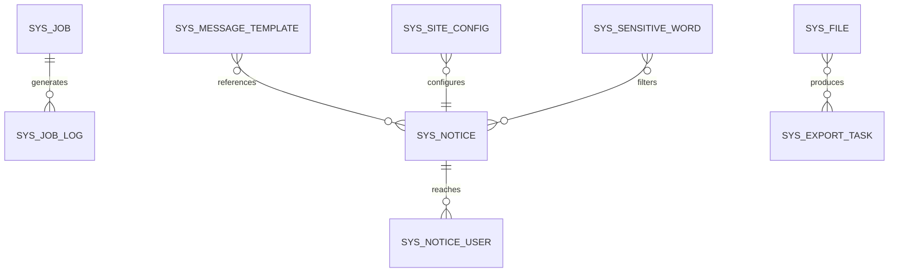
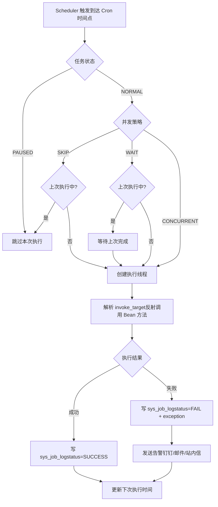
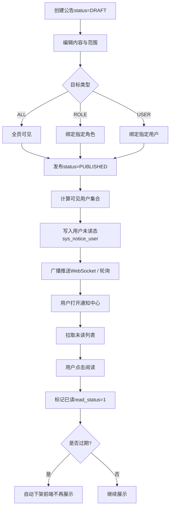
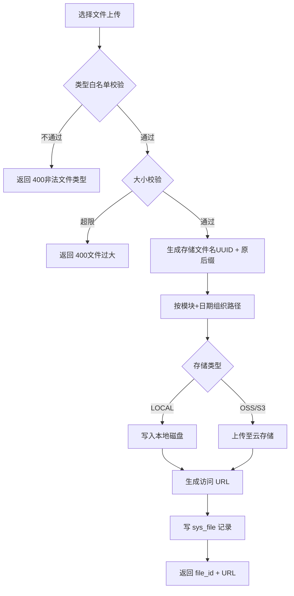
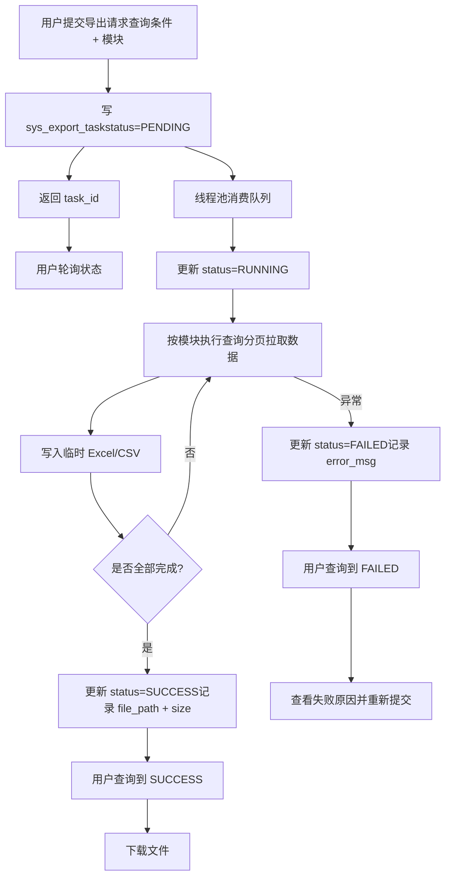

# MYOW-System 业务设计文档

## 目录
- **01** 概述与业务边界
- **02** 领域模型设计
- **03** 数据库表结构设计
- **04** API 接口设计
- **05** 业务流程设计
- **06** 关键业务规则
- **07** 可实现规格补充
## 01 概述与业务边界

myow-system 模块是 MYOW Platform 的系统运维与基础支撑平台，为 myow-overseas、myow-firstmile、myow-finance、myow-customer 等业务模块提供通用系统能力。它与 myow-user 形成明确分工：myow-user 聚焦身份认证与权限控制（RBAC、租户、组织架构），myow-system 聚焦系统级配置、公共运维服务与非业务类支撑功能。

### 1.1 核心职责

#### 定时任务调度

基于 Cron 表达式的任务配置、暂停/恢复、立即执行、执行策略控制（并发/跳过/等待）以及执行日志追踪。

#### 通知公告

系统级通知与公告的发布、撤回、范围控制（全员/指定角色/指定用户）、已读状态追踪与过期自动下架。

#### 文件/附件管理

统一文件上传、存储（本地/云存储）、下载、分类管理与模块归属标记，支持类型白名单与大小限制。

#### 站点配置

多站点/多门户的差异化配置管理，如站点名称、Logo、版权信息、客服联系方式、前端主题参数等。

#### 敏感词过滤

敏感词库维护、文本实时检测与替换，支持多类别（违禁词/广告词/政治敏感）与多级管控策略。

#### 消息模板

短信、邮件、站内信模板的统一管理，支持变量占位符、多渠道切换与模板预览。

#### 数据导出任务

大数据量异步导出队列管理，支持按模块、按条件生成 Excel/CSV，提供进度查询与文件下载。

#### 在线用户与服务监控

基于 Sa-Token 会话的在线用户查询与强制下线；JVM、数据库连接、Redis、磁盘等基础监控指标采集。

### 1.2 与 myow-user 的边界划分

| 功能域 | myow-user | myow-system |
| --- | --- | --- |
| 用户/角色/部门/岗位 | 全权负责 | 不复用，仅通过 API 查询用户列表用于通知范围选择 |
| 字典管理 | 已包含（sys_dict / sys_dict_data） | 不复用，业务模块统一调用 myow-user 字典接口 |
| 系统参数 | 已包含（sys_config） | 不复用；站点配置使用独立表 sys_site_config，语义与用途不同 |
| 操作/登录日志 | 已包含（sys_oper_log / sys_login_log） | 不复用；system 模块可提供日志归档清理策略配置 |
| 定时任务 | 不涉及 | 全权负责 |
| 通知公告 | 不涉及 | 全权负责 |
| 文件管理 | 仅提供头像上传（规划） | 全权负责统一文件服务 |
| 站点配置 | 不涉及 | 全权负责 |
| 敏感词 | 不涉及 | 全权负责 |
| 消息模板 | 不涉及 | 全权负责 |
| 数据导出 | 不涉及 | 全权负责 |

设计原则：myow-system 与 myow-user 之间通过 Dubbo 或 Spring 本地调用解耦。system 模块在需要用户列表、角色列表时，调用 myow-user 暴露的只读接口（如 UserProvider.getUserByIds()、RoleProvider.listRoles()），不在 system 模块内重复维护用户域实体。

## 02 领域模型设计

myow-system 的领域模型以配置类、记录类和服务类实体为主，实体间关联度较低，呈扁平化结构。每个子域独立维护自己的聚合，便于后续按需拆分或扩展。

### 2.1 实体关系图



图 2-1：myow-system 核心实体关系（松耦合结构）

### 2.2 聚合根与实体定义

#### 2.2.1 定时任务聚合（Job Aggregate）

以 sys_job 表为核心的聚合，包含任务配置与执行日志。任务触发通过 Spring Scheduler 或 Quartz 实现，执行结果写入 sys_job_log。

| 字段 | 类型 | 约束 | 说明 |
| --- | --- | --- | --- |
| job_id | BIGINT | PK | 任务唯一标识 |
| job_name | VARCHAR(64) | NOT NULL | 任务名称 |
| job_group | VARCHAR(64) | DEFAULT 'DEFAULT' | 任务分组 |
| invoke_target | VARCHAR(256) | NOT NULL | 调用目标字符串，如 bean.method() 或 http://xxx |
| cron_expression | VARCHAR(32) | NOT NULL | Cron 表达式 |
| execute_policy | VARCHAR(16) | DEFAULT 'CONCURRENT' | 执行策略：CONCURRENT / SKIP / WAIT |
| concurrent | BOOLEAN | DEFAULT TRUE | 是否允许并发执行 |
| status | VARCHAR(16) | DEFAULT 'NORMAL' | NORMAL / PAUSED |
| next_exec_time | TIMESTAMP |  | 下次执行时间 |
| remark | VARCHAR(512) |  | 备注 |

#### 2.2.2 通知公告聚合（Notice Aggregate）

以 sys_notice 表为核心的聚合，包含公告本体与已读关联表 sys_notice_user。公告支持按角色或用户维度定向推送。

| 字段 | 类型 | 约束 | 说明 |
| --- | --- | --- | --- |
| notice_id | BIGINT | PK | 公告唯一标识 |
| notice_title | VARCHAR(128) | NOT NULL | 标题 |
| notice_content | TEXT |  | 内容（支持富文本） |
| notice_type | VARCHAR(16) | NOT NULL | NOTICE / ANNOUNCEMENT / WARNING |
| notice_level | VARCHAR(16) | DEFAULT 'NORMAL' | NORMAL / URGENT / EMERGENCY |
| status | VARCHAR(16) | DEFAULT 'DRAFT' | DRAFT / PUBLISHED / WITHDRAWN |
| target_type | VARCHAR(16) | DEFAULT 'ALL' | ALL / ROLE / USER |
| target_ids | VARCHAR(512) |  | 定向范围 ID 列表，逗号分隔 |
| publish_time | TIMESTAMP |  | 发布时间 |
| expire_time | TIMESTAMP |  | 过期时间 |

#### 2.2.3 文件记录实体（File Record）

sys_file 为无聚合根的独立实体，记录所有上传文件元数据，存储路径与实际文件解耦，支持本地磁盘与云存储（OSS/S3）双后端。

| 字段 | 类型 | 约束 | 说明 |
| --- | --- | --- | --- |
| file_id | BIGINT | PK | 文件唯一标识 |
| file_name | VARCHAR(128) | NOT NULL | 存储文件名（UUID + 后缀） |
| original_name | VARCHAR(128) | NOT NULL | 原始文件名 |
| file_suffix | VARCHAR(16) |  | 文件后缀 |
| file_size | BIGINT | NOT NULL | 文件大小（字节） |
| file_path | VARCHAR(512) |  | 相对存储路径 |
| file_url | VARCHAR(512) |  | 访问 URL（云存储时为公网地址） |
| storage_type | VARCHAR(16) | DEFAULT 'LOCAL' | LOCAL / OSS / S3 |
| module_name | VARCHAR(32) |  | 所属业务模块，如 overseas / user |
| mime_type | VARCHAR(64) |  | MIME 类型 |

#### 2.2.4 站点配置实体（Site Config）

sys_site_config 按站点编码分组存储前端门户级配置，与 sys_config（系统级运行参数）在 myow-user 中形成互补。

| 字段 | 类型 | 约束 | 说明 |
| --- | --- | --- | --- |
| config_id | BIGINT | PK | 配置唯一标识 |
| site_code | VARCHAR(32) | NOT NULL | 站点编码，如 admin / portal / mobile |
| config_key | VARCHAR(64) | NOT NULL | 配置键 |
| config_value | TEXT |  | 配置值（支持 JSON） |
| config_type | VARCHAR(16) | DEFAULT 'STRING' | STRING / NUMBER / BOOLEAN / JSON / IMAGE |
| remark | VARCHAR(256) |  | 配置说明 |

#### 2.2.5 敏感词实体（Sensitive Word）

sys_sensitive_word 存储需要过滤或拦截的词汇，运行时加载到内存 Trie 树（或 DFA）中实现 O(m) 复杂度检测。

| 字段 | 类型 | 约束 | 说明 |
| --- | --- | --- | --- |
| word_id | BIGINT | PK | 唯一标识 |
| word | VARCHAR(64) | NOT NULL | 敏感词内容 |
| category | VARCHAR(16) | DEFAULT 'FORBIDDEN' | FORBIDDEN / ADVERTISING / POLITICAL |
| replacement | VARCHAR(64) |  | 替换词，空则表示直接拦截 |
| level | SMALLINT | DEFAULT 1 | 敏感等级，1-5，5 最高 |
| status | SMALLINT | DEFAULT 1 | 0=停用，1=启用 |

#### 2.2.6 消息模板实体（Message Template）

sys_message_template 统一管理多渠道消息模板，模板内容使用 ${variable} 作为占位符，发送时由业务方传入变量映射进行渲染。

| 字段 | 类型 | 约束 | 说明 |
| --- | --- | --- | --- |
| template_id | BIGINT | PK | 唯一标识 |
| template_code | VARCHAR(64) | NOT NULL, UK | 模板编码 |
| template_name | VARCHAR(64) | NOT NULL | 模板名称 |
| channel | VARCHAR(16) | NOT NULL | SMS / EMAIL / IN_APP |
| subject | VARCHAR(128) |  | 主题/标题 |
| content | TEXT | NOT NULL | 模板内容（含占位符） |
| variables | VARCHAR(256) |  | 变量列表，逗号分隔 |
| status | SMALLINT | DEFAULT 1 | 0=停用，1=启用 |

#### 2.2.7 数据导出任务实体（Export Task）

sys_export_task 记录异步导出请求，由独立线程池消费队列完成数据查询、文件生成与状态更新。

| 字段 | 类型 | 约束 | 说明 |
| --- | --- | --- | --- |
| task_id | BIGINT | PK | 任务唯一标识 |
| task_name | VARCHAR(128) | NOT NULL | 任务名称 |
| module_name | VARCHAR(32) | NOT NULL | 导出模块，如 inbound / outbound / stock |
| query_params | TEXT |  | 查询条件 JSON |
| file_name | VARCHAR(128) |  | 生成文件名 |
| file_path | VARCHAR(512) |  | 文件存储路径 |
| file_size | BIGINT |  | 文件大小 |
| status | VARCHAR(16) | DEFAULT 'PENDING' | PENDING / RUNNING / SUCCESS / FAILED |
| error_msg | TEXT |  | 失败原因 |
| create_by | BIGINT |  | 创建人 |
| create_time | TIMESTAMP(3) |  | 创建时间 |
| finish_time | TIMESTAMP(3) |  | 完成时间 |

### 2.3 枚举定义

| 枚举名 | 值 | 说明 |
| --- | --- | --- |
| JobStatus | NORMAL | 正常运行 |
|  | PAUSED | 已暂停 |
|  | RUNNING | 执行中（运行时状态，不入库） |
| JobExecutePolicy | CONCURRENT | 允许并发执行 |
|  | SKIP | 上次未结束则跳过本次 |
|  | WAIT | 上次未结束则等待 |
| NoticeType | NOTICE | 普通通知 |
|  | ANNOUNCEMENT | 公告 |
|  | WARNING | 预警 |
| NoticeStatus | DRAFT | 草稿 |
|  | PUBLISHED | 已发布 |
|  | WITHDRAWN | 已撤回 |
| FileStorageType | LOCAL | 本地磁盘 |
|  | OSS | 阿里云 OSS |
|  | S3 | AWS S3 / MinIO |
| ExportStatus | PENDING | 待执行 |
|  | RUNNING | 执行中 |
|  | SUCCESS | 成功 |
|  | FAILED | 失败 |

## 03 数据库表结构设计

myow-system 模块共设计 9 张业务表，全部采用 PostgreSQL 语法。定时任务日志与数据导出任务为写密集型表，需关注归档策略；其余配置类表数据量小，无需分区。

### 3.1 表清单与数据量预估

| 表名 | 中文名 | 预估数据量 | 核心索引 |
| --- | --- | --- | --- |
| sys_job | 定时任务配置表 | 十级（全局） | uk: job_name + job_group |
| sys_job_log | 定时任务执行日志 | 百万级/年 | idx: job_id + start_time |
| sys_notice | 通知公告表 | 千级（全局） | idx: status + publish_time |
| sys_notice_user | 通知已读关联表 | 十万级 | uk: notice_id + user_id; idx: user_id |
| sys_file | 文件记录表 | 十万级 | idx: module_name + create_time |
| sys_site_config | 站点配置表 | 百级（按站点） | uk: site_code + config_key |
| sys_sensitive_word | 敏感词表 | 千级（全局） | idx: category + status |
| sys_message_template | 消息模板表 | 百级（全局） | uk: template_code |
| sys_export_task | 数据导出任务表 | 万级 | idx: create_by + status; idx: module_name |

### 3.2 核心表 DDL

#### sys_job（定时任务配置表）

```sql
CREATE TABLE sys_job (
    job_id          BIGINT PRIMARY KEY,
    job_name        VARCHAR(64) NOT NULL,
    job_group       VARCHAR(64) NOT NULL DEFAULT 'DEFAULT',
    invoke_target   VARCHAR(256) NOT NULL,
    cron_expression VARCHAR(32) NOT NULL,
    execute_policy  VARCHAR(16) NOT NULL DEFAULT 'CONCURRENT',
    concurrent      BOOLEAN NOT NULL DEFAULT TRUE,
    status          VARCHAR(16) NOT NULL DEFAULT 'NORMAL',
    next_exec_time  TIMESTAMP,
    remark          VARCHAR(512),
    create_by       BIGINT,
    create_time     TIMESTAMP(3) DEFAULT CURRENT_TIMESTAMP(3),
    update_by       BIGINT,
    update_time     TIMESTAMP(3) DEFAULT CURRENT_TIMESTAMP(3),
    deleted_flag    BOOLEAN DEFAULT FALSE,
    CONSTRAINT uk_job_name_group UNIQUE (job_name, job_group)
);
CREATE INDEX idx_job_status ON sys_job(status);
COMMENT ON TABLE sys_job IS '定时任务配置表';
COMMENT ON COLUMN sys_job.execute_policy IS 'CONCURRENT=并发, SKIP=跳过, WAIT=等待';
```

#### sys_job_log（定时任务执行日志表）

```sql
CREATE TABLE sys_job_log (
    log_id          BIGINT PRIMARY KEY,
    job_id          BIGINT NOT NULL,
    job_name        VARCHAR(64) NOT NULL,
    job_group       VARCHAR(64) NOT NULL,
    invoke_target   VARCHAR(256) NOT NULL,
    job_message     TEXT,
    status          VARCHAR(16) NOT NULL DEFAULT 'SUCCESS',
    exception_info  TEXT,
    start_time      TIMESTAMP(3) NOT NULL,
    end_time        TIMESTAMP(3),
    cost_time       INT,
    create_time     TIMESTAMP(3) DEFAULT CURRENT_TIMESTAMP(3)
);
CREATE INDEX idx_job_log_job_time ON sys_job_log(job_id, start_time);
CREATE INDEX idx_job_log_status_time ON sys_job_log(status, start_time);
COMMENT ON TABLE sys_job_log IS '定时任务执行日志表';
COMMENT ON COLUMN sys_job_log.status IS 'SUCCESS / FAIL';
```

#### sys_notice（通知公告表）

```sql
CREATE TABLE sys_notice (
    notice_id       BIGINT PRIMARY KEY,
    notice_title    VARCHAR(128) NOT NULL,
    notice_content  TEXT,
    notice_type     VARCHAR(16) NOT NULL DEFAULT 'NOTICE',
    notice_level    VARCHAR(16) NOT NULL DEFAULT 'NORMAL',
    status          VARCHAR(16) NOT NULL DEFAULT 'DRAFT',
    target_type     VARCHAR(16) NOT NULL DEFAULT 'ALL',
    target_ids      VARCHAR(512),
    publish_time    TIMESTAMP,
    expire_time     TIMESTAMP,
    publish_by      BIGINT,
    create_by       BIGINT,
    create_time     TIMESTAMP(3) DEFAULT CURRENT_TIMESTAMP(3),
    update_by       BIGINT,
    update_time     TIMESTAMP(3) DEFAULT CURRENT_TIMESTAMP(3),
    deleted_flag    BOOLEAN DEFAULT FALSE
);
CREATE INDEX idx_notice_status_time ON sys_notice(status, publish_time);
CREATE INDEX idx_notice_expire ON sys_notice(expire_time);
COMMENT ON TABLE sys_notice IS '通知公告表';
```

#### sys_notice_user（通知已读关联表）

```sql
CREATE TABLE sys_notice_user (
    id              BIGINT PRIMARY KEY,
    notice_id       BIGINT NOT NULL,
    user_id         BIGINT NOT NULL,
    read_status     SMALLINT DEFAULT 0,
    read_time       TIMESTAMP(3),
    create_time     TIMESTAMP(3) DEFAULT CURRENT_TIMESTAMP(3),
    CONSTRAINT uk_notice_user UNIQUE (notice_id, user_id)
);
CREATE INDEX idx_notice_user_user ON sys_notice_user(user_id, read_status);
COMMENT ON TABLE sys_notice_user IS '通知公告用户已读关联表';
COMMENT ON COLUMN sys_notice_user.read_status IS '0=未读, 1=已读';
```

#### sys_file（文件记录表）

```sql
CREATE TABLE sys_file (
    file_id         BIGINT PRIMARY KEY,
    file_name       VARCHAR(128) NOT NULL,
    original_name   VARCHAR(128) NOT NULL,
    file_suffix     VARCHAR(16),
    file_size       BIGINT NOT NULL,
    file_path       VARCHAR(512),
    file_url        VARCHAR(512),
    storage_type    VARCHAR(16) NOT NULL DEFAULT 'LOCAL',
    module_name     VARCHAR(32),
    mime_type       VARCHAR(64),
    create_by       BIGINT,
    create_time     TIMESTAMP(3) DEFAULT CURRENT_TIMESTAMP(3),
    deleted_flag    BOOLEAN DEFAULT FALSE
);
CREATE INDEX idx_file_module_time ON sys_file(module_name, create_time);
CREATE INDEX idx_file_create_by ON sys_file(create_by);
COMMENT ON TABLE sys_file IS '文件记录表';
COMMENT ON COLUMN sys_file.storage_type IS 'LOCAL / OSS / S3';
```

#### sys_site_config（站点配置表）

```sql
CREATE TABLE sys_site_config (
    config_id       BIGINT PRIMARY KEY,
    site_code       VARCHAR(32) NOT NULL,
    config_key      VARCHAR(64) NOT NULL,
    config_value    TEXT,
    config_type     VARCHAR(16) DEFAULT 'STRING',
    remark          VARCHAR(256),
    create_by       BIGINT,
    create_time     TIMESTAMP(3) DEFAULT CURRENT_TIMESTAMP(3),
    update_by       BIGINT,
    update_time     TIMESTAMP(3) DEFAULT CURRENT_TIMESTAMP(3),
    CONSTRAINT uk_site_config_key UNIQUE (site_code, config_key)
);
COMMENT ON TABLE sys_site_config IS '站点配置表';
```

#### sys_sensitive_word（敏感词表）

```sql
CREATE TABLE sys_sensitive_word (
    word_id         BIGINT PRIMARY KEY,
    word            VARCHAR(64) NOT NULL,
    category        VARCHAR(16) DEFAULT 'FORBIDDEN',
    replacement     VARCHAR(64),
    level           SMALLINT DEFAULT 1,
    status          SMALLINT DEFAULT 1,
    create_time     TIMESTAMP(3) DEFAULT CURRENT_TIMESTAMP(3),
    update_time     TIMESTAMP(3) DEFAULT CURRENT_TIMESTAMP(3),
    CONSTRAINT uk_sensitive_word UNIQUE (word)
);
CREATE INDEX idx_sensitive_category ON sys_sensitive_word(category, status);
COMMENT ON TABLE sys_sensitive_word IS '敏感词表';
COMMENT ON COLUMN sys_sensitive_word.category IS 'FORBIDDEN / ADVERTISING / POLITICAL';
```

#### sys_message_template（消息模板表）

```sql
CREATE TABLE sys_message_template (
    template_id     BIGINT PRIMARY KEY,
    template_code   VARCHAR(64) NOT NULL UNIQUE,
    template_name   VARCHAR(64) NOT NULL,
    channel         VARCHAR(16) NOT NULL,
    subject         VARCHAR(128),
    content         TEXT NOT NULL,
    variables       VARCHAR(256),
    status          SMALLINT DEFAULT 1,
    remark          VARCHAR(512),
    create_by       BIGINT,
    create_time     TIMESTAMP(3) DEFAULT CURRENT_TIMESTAMP(3),
    update_by       BIGINT,
    update_time     TIMESTAMP(3) DEFAULT CURRENT_TIMESTAMP(3)
);
COMMENT ON TABLE sys_message_template IS '消息模板表';
COMMENT ON COLUMN sys_message_template.channel IS 'SMS / EMAIL / IN_APP';
```

#### sys_export_task（数据导出任务表）

```sql
CREATE TABLE sys_export_task (
    task_id         BIGINT PRIMARY KEY,
    task_name       VARCHAR(128) NOT NULL,
    module_name     VARCHAR(32) NOT NULL,
    query_params    TEXT,
    file_name       VARCHAR(128),
    file_path       VARCHAR(512),
    file_size       BIGINT,
    status          VARCHAR(16) NOT NULL DEFAULT 'PENDING',
    error_msg       TEXT,
    create_by       BIGINT,
    create_time     TIMESTAMP(3) DEFAULT CURRENT_TIMESTAMP(3),
    finish_time     TIMESTAMP(3)
);
CREATE INDEX idx_export_task_creator ON sys_export_task(create_by, status);
CREATE INDEX idx_export_task_module ON sys_export_task(module_name, create_time);
COMMENT ON TABLE sys_export_task IS '数据导出任务表';
COMMENT ON COLUMN sys_export_task.status IS 'PENDING / RUNNING / SUCCESS / FAILED';
```

### 3.3 分表与归档策略

- sys_job_log：数据量最大，建议按 start_time 按月分区（PostgreSQL 声明式分区），保留最近 3 个月热数据，历史数据归档到对象存储或压缩表。

- sys_notice_user：读多写少，按 user_id 分片或分区意义不大；可定期清理已读且公告已过期的记录。

- sys_export_task：任务完成后保留 30 天，过期自动清理物理文件与表记录，通过定时任务每日凌晨执行。

- sys_file：逻辑删除后保留 7 天，通过定时任务清理物理文件并硬删除表记录，防止存储膨胀。

- 配置类表（sys_job、sys_notice、sys_site_config、sys_sensitive_word、sys_message_template）：数据量极小，不分区，全表缓存到 Redis。

## 04 API 接口设计

本章节定义 myow-system 模块对外暴露的命令式 POST API，统一以 /api/v1/system 为前缀。接口层负责字段校验（@Valid）、权限拦截（Sa-Token）与操作日志埋点（通过 AOP 写入 myow-user 的 sys_oper_log）。所有 Controller、DTO、VO 必须按通用开发规范补齐 Springdoc / OpenAPI 注解，确保后续可基于 API 文档生成 UI 页面与前端对接代码。

### 4.1 接口通用约定

- 基地址：/api/v1/system

- Content-Type：application/json；文件上传为 multipart/form-data

- 认证：Header Authorization: Bearer {token}

- 方法风格：写操作、复杂查询、状态变更统一使用 POST；分页查询使用 /page；详情查询使用 /detail；删除使用 /delete

- 幂等：写操作支持 Idempotency-Key

- 统一响应：{"code":0,"msg":"ok","data":{}}

### 4.2 定时任务管理

| Method | Path | 说明 | Query / Body |
| --- | --- | --- | --- |
| POST | /jobs/create | 创建任务 | Body: JobCreateDTO |
| POST | /jobs/update | 更新任务 | Body: JobUpdateDTO |
| POST | /jobs/detail | 任务详情 | Body: IdCommand |
| POST | /jobs/page | 任务列表 | Body: JobPageQuery |
| POST | /jobs/delete | 删除任务 | Body: IdCommand |
| POST | /jobs/run | 立即执行一次 | Body: IdCommand |
| POST | /jobs/pause | 暂停任务 | Body: IdCommand |
| POST | /jobs/resume | 恢复任务 | Body: IdCommand |
| POST | /jobs/log-page | 任务执行日志 | Body: JobLogPageQuery |

### 4.3 通知公告

| Method | Path | 说明 | Query / Body |
| --- | --- | --- | --- |
| POST | /notices/create | 创建公告 | Body: NoticeCreateDTO |
| POST | /notices/update | 更新公告 | Body: NoticeUpdateDTO（草稿态可改） |
| POST | /notices/detail | 公告详情 | Body: IdCommand |
| POST | /notices/page | 公告列表（管理端） | Body: NoticePageQuery |
| POST | /notices/publish | 发布公告 | Body: IdCommand |
| POST | /notices/withdraw | 撤回公告 | Body: IdCommand |
| POST | /notices/delete | 删除公告 | Body: IdCommand |
| POST | /notices/my-page | 我的通知列表 | Body: MyNoticePageQuery（当前用户） |
| POST | /notices/read | 标记已读 | Body: IdCommand（当前用户） |
| POST | /notices/read-all | 一键已读 | 当前用户全部未读通知 |

### 4.4 文件管理

| Method | Path | 说明 | Query / Body |
| --- | --- | --- | --- |
| POST | /files/upload | 文件上传 | multipart: file, moduleName |
| POST | /files/batch-upload | 批量上传 | multipart: files[], moduleName |
| POST | /files/detail | 文件详情 | Body: IdCommand |
| POST | /files/page | 文件列表 | Body: FilePageQuery |
| POST | /files/download | 下载文件 | Body: IdCommand（返回流或重定向 URL） |
| POST | /files/delete | 删除文件 | Body: IdCommand（逻辑删 + 清理物理文件） |

### 4.5 站点配置

| Method | Path | 说明 | Query / Body |
| --- | --- | --- | --- |
| POST | /site-configs/create | 创建配置 | Body: SiteConfigCreateDTO |
| POST | /site-configs/update | 更新配置 | Body: SiteConfigUpdateDTO |
| POST | /site-configs/detail | 配置详情 | Body: IdCommand |
| POST | /site-configs/page | 配置列表 | Body: SiteConfigPageQuery |
| POST | /site-configs/delete | 删除配置 | Body: IdCommand |
| POST | /site-configs/by-site | 按站点批量查询 | Body: SiteCodeQuery（返回 Map<key, value>） |
| POST | /site-configs/refresh | 刷新站点缓存 | Body: {siteCode}（广播缓存失效） |

### 4.6 敏感词

| Method | Path | 说明 | Query / Body |
| --- | --- | --- | --- |
| POST | /sensitive-words/create | 新增敏感词 | Body: SensitiveWordCreateDTO |
| POST | /sensitive-words/update | 更新敏感词 | Body: SensitiveWordUpdateDTO |
| POST | /sensitive-words/detail | 敏感词详情 | Body: IdCommand |
| POST | /sensitive-words/page | 敏感词列表 | Body: SensitiveWordPageQuery |
| POST | /sensitive-words/delete | 删除敏感词 | Body: IdCommand |
| POST | /sensitive-words/import | 批量导入 | multipart: file（Excel/CSV） |
| POST | /sensitive-words/check | 文本检测 | Body: {text}（返回命中词列表与替换后文本） |

### 4.7 消息模板

| Method | Path | 说明 | Query / Body |
| --- | --- | --- | --- |
| POST | /message-templates/create | 创建模板 | Body: MessageTemplateCreateDTO |
| POST | /message-templates/update | 更新模板 | Body: MessageTemplateUpdateDTO |
| POST | /message-templates/detail | 模板详情 | Body: IdCommand |
| POST | /message-templates/page | 模板列表 | Body: MessageTemplatePageQuery |
| POST | /message-templates/delete | 删除模板 | Body: IdCommand |
| POST | /message-templates/preview | 模板预览 | Body: MessageTemplatePreviewCommand |

### 4.8 数据导出任务

| Method | Path | 说明 | Query / Body |
| --- | --- | --- | --- |
| POST | /export-tasks/create | 创建导出任务 | Body: ExportTaskCreateDTO（moduleName + queryParams） |
| POST | /export-tasks/detail | 任务状态查询 | Body: IdCommand |
| POST | /export-tasks/my-page | 我的导出任务列表 | Body: ExportTaskPageQuery |
| POST | /export-tasks/download | 下载导出文件 | Body: IdCommand（仅 SUCCESS 状态） |
| POST | /export-tasks/delete | 删除任务与文件 | Body: IdCommand |

### 4.9 监控与在线用户

| Method | Path | 说明 | Query / Body |
| --- | --- | --- | --- |
| POST | /monitor/server | 服务器监控指标 | Body: EmptyCommand |
| POST | /monitor/redis | Redis 监控信息 | Body: EmptyCommand |
| POST | /monitor/db | 数据库连接池状态 | Body: EmptyCommand |
| POST | /online-users/page | 在线用户列表 | Body: OnlineUserPageQuery（基于 Sa-Token 会话） |
| POST | /online-users/kick | 强制下线 | Body: KickOnlineUserCommand |

设计要点：文件上传接口需限制单文件大小（默认 50MB）与类型白名单（图片/文档/压缩包），禁止可执行文件上传；上传路径按 {module}/{date}/{uuid}.{suffix} 组织，避免单目录文件过多。

## 05 业务流程设计

本章节以流程图形式呈现 myow-system 的四大核心业务流程：定时任务调度与执行、通知公告发布与触达、文件上传与存储、数据异步导出。

### 5.1 定时任务调度与执行流程

任务由 Spring Scheduler 按 Cron 表达式触发，执行前校验并发策略，执行后记录日志。异常任务支持告警通知。



图 5-1：定时任务调度与执行全流程

### 5.2 通知公告发布与触达流程

公告创建后处于草稿态，经发布操作生效；用户端通过轮询或 WebSocket 拉取未读通知，已读状态写入关联表。



图 5-2：通知公告从创建到用户触达的完整流程

### 5.3 文件上传与存储流程

文件上传经过类型校验、大小校验、重命名与路径组织后，写入本地磁盘或上传至云存储，最终记录元数据到 sys_file。



图 5-3：文件上传、校验与存储流程

### 5.4 数据异步导出流程

导出请求由接口同步写入任务表后即刻返回任务 ID，后台线程池消费队列完成数据查询、文件生成与状态更新。



图 5-4：数据异步导出任务从创建到下载的完整流程

## 06 关键业务规则

本章节收口 myow-system 的系统支撑类规则，覆盖定时任务、通知公告、文件、敏感词、导出、在线用户、监控和消息模板。业务模块只消费这些通用能力，不在各自模块重复实现系统级基础能力。

### 6.1 定时任务规则

- 任务注册：定时任务由管理端配置到 sys_job，任务处理器通过 Spring Bean 名称或统一 JobHandler 编码注册，禁止在配置中存放任意可执行脚本。

- 并发策略：concurrent_policy = FORBID 时，同一 job_key 在上一轮未完成前不得重复执行；concurrent_policy = ALLOW 时允许并行，但必须由业务处理器自行保证幂等。

- 执行日志：每次触发必须写入 sys_job_log，记录开始时间、结束时间、耗时、执行节点、状态和异常摘要。异常堆栈只保留必要信息，避免写入敏感配置。

- 人工触发：立即执行一次不改变 Cron 配置，只产生一条人工触发日志，并记录 trigger_user_id。

- 失败告警：连续失败次数达到任务配置阈值时触发消息模板通知，通知渠道可配置为站内信、邮件或企业 IM。

### 6.2 通知公告规则

- 生命周期：公告状态为 DRAFT / PUBLISHED / WITHDRAWN / EXPIRED。只有 DRAFT 可编辑正文；PUBLISHED 后只能撤回或复制新建。

- 触达范围：公告可按全站、租户、组织、角色、指定用户维度投放。最终接收人快照写入 sys_notice_user，避免后续组织或角色变化影响历史公告。

- 已读确认：用户读取公告详情或显式点击已读时写入 read_time。强制确认类公告必须保留确认记录，不能被普通清理任务删除。

- 过期处理：到达 expire_time 后公告对普通用户不可见，但管理端仍可查询历史记录。

### 6.3 文件上传与存储规则

- 存储抽象：sys_file 只保存文件元数据和 storage_key，物理文件可落本地、S3、MinIO 或其他对象存储。业务模块只保存 file_id，不直接保存物理路径。

- 安全限制：上传必须校验大小、后缀、MIME 和文件头，禁止上传可执行文件、脚本文件和伪装类型文件。默认单文件上限为 50MB，可按模块配置白名单。

- 路径规则：文件按 {module}/{yyyyMMdd}/{uuid}.{suffix} 组织，避免原始文件名进入物理路径。original_name 仅用于展示和下载文件名。

- 删除策略：业务删除默认执行逻辑删除；物理清理由定时任务延迟执行，保留最少 7 天恢复窗口。

### 6.4 敏感词过滤规则

- 算法选择：敏感词匹配采用 DFA（确定性有限自动机）算法，初始化时将 sys_sensitive_word 全量加载到内存 Trie 树中，单次检测时间复杂度为 O(n)，n 为待检测文本长度。

- 热更新：敏感词库发生增删改时，通过 Redis 发布订阅或 Spring Event 广播事件，各节点监听到事件后重建本地 Trie 树，实现秒级热更新。

- 分级处理：level = 5 的最高级敏感词命中时直接拦截请求并记录审计日志；level 1~4 的敏感词执行替换操作（replacement 非空时替换，为空时以 *** 屏蔽）。

- 多类别隔离：不同业务场景（如用户评论、公告内容、聊天消息）可指定不同的 category 集合进行检测，避免一刀切。

### 6.5 数据导出任务队列规则

- 队列隔离：导出任务使用独立线程池（ThreadPoolExecutor）消费，与业务线程池隔离，防止大数据量导出阻塞常规 API 响应。线程池大小默认 4，队列容量默认 100，超出时创建任务接口直接拒绝并提示"导出队列已满，请稍后重试"。

- 模块扩展点：各业务模块（overseas、finance 等）通过实现 ExportHandler 接口注册自己的导出逻辑，system 模块负责调度与文件生成，业务模块只提供数据查询与表头定义。

- 内存与分页控制：单次导出查询采用分页拉取（默认每页 1000 条），禁止一次性加载全量数据到内存；单个导出文件行数上限 50 万行，超出时分片生成多个文件并打包为 ZIP。

- 文件清理：导出任务完成后，文件在服务器保留 7 天；过期后定时任务自动删除物理文件并硬删除 sys_export_task 记录。

### 6.6 在线用户与服务监控规则

- 在线用户判定：基于 Sa-Token 活跃 Token 列表判定，Token 最后访问时间在 30 分钟内视为在线。查询结果包含登录名、登录 IP、登录时间、浏览器、操作系统信息。

- 强制下线：管理员可对指定 Token 执行强制下线（Sa-Token 踢人），被踢用户下次请求时收到 401 并跳转登录页。强制下线操作须写入操作日志。

- 监控数据采集：服务器监控（CPU、内存、磁盘、JVM 堆内存与 GC、线程数）通过 OSHI 库采集；Redis 监控通过 RedisTemplate 获取 info 信息；数据库连接池监控通过 Druid / HikariCP DataSource 获取。

- 告警阈值：CPU 使用率连续 3 分钟超过 80%、磁盘使用率超过 85%、JVM 堆内存使用率超过 90% 时，触发钉钉/邮件告警。

### 6.7 消息模板渲染规则

- 占位符格式：模板内容使用 ${variableName} 作为占位符，渲染时由业务方传入 Map 变量映射，系统按 key 替换为 value。未匹配的占位符保持原样并记录警告日志。

- 变量校验：模板保存时解析 content 提取所有占位符，与 variables 字段声明的变量列表做交叉校验，发现未声明的占位符或声明但未使用的变量时给出提示。

- 渠道隔离：同一业务场景（如出库单发货通知）可为 SMS、EMAIL、IN_APP 分别配置模板，发送时按渠道选择对应模板渲染。

- 预览机制：模板保存后必须支持预览功能，传入示例变量值后返回渲染后的完整内容，供运营人员确认格式正确。

## 07 可实现规格补充

本章节汇总接口清单、权限标识、错误码、初始化种子与缓存策略，为后续开发提供可直接落地的规格依据。

### 7.1 接口清单汇总

| Controller | 基路径 | 能力范围 |
| --- | --- | --- |
| JobController | /api/v1/system/jobs | 定时任务 CRUD、立即执行、暂停/恢复、日志查询 |
| NoticeController | /api/v1/system/notices | 公告 CRUD、发布/撤回、我的通知、已读标记 |
| FileController | /api/v1/system/files | 文件上传/下载/删除、批量上传 |
| SiteConfigController | /api/v1/system/site-configs | 站点配置 CRUD、按站点批量查询、缓存刷新 |
| SensitiveWordController | /api/v1/system/sensitive-words | 敏感词 CRUD、批量导入、文本检测 |
| MessageTemplateController | /api/v1/system/message-templates | 模板 CRUD、预览 |
| ExportTaskController | /api/v1/system/export-tasks | 导出任务创建、状态查询、下载、删除 |
| MonitorController | /api/v1/system/monitor | 服务器/Redis/DB 监控指标 |
| OnlineUserController | /api/v1/system/online-users | 在线用户列表、强制下线 |

### 7.2 权限标识汇总

| 功能域 | 权限标识 | 说明 |
| --- | --- | --- |
| 定时任务 | system:job:list, system:job:create, system:job:update, system:job:delete, system:job:run, system:job:pause, system:job:resume | 任务管理全套权限 |
| 通知公告 | system:notice:list, system:notice:create, system:notice:update, system:notice:delete, system:notice:publish, system:notice:withdraw | 公告管理（不含个人已读） |
| 文件管理 | system:file:list, system:file:upload, system:file:delete | 文件查询、上传、删除 |
| 站点配置 | system:site-config:list, system:site-config:create, system:site-config:update, system:site-config:delete, system:site-config:refresh | 站点配置管理 |
| 敏感词 | system:sensitive-word:list, system:sensitive-word:create, system:sensitive-word:update, system:sensitive-word:delete, system:sensitive-word:import | 敏感词管理 |
| 消息模板 | system:message-template:list, system:message-template:create, system:message-template:update, system:message-template:delete | 模板管理 |
| 导出任务 | system:export-task:list, system:export-task:create, system:export-task:delete | 导出任务管理（用户只能操作自己的任务） |
| 监控 | system:monitor:view | 查看监控面板 |
| 在线用户 | system:online-user:list, system:online-user:kick | 在线用户查询与强制下线 |

### 7.3 错误码汇总

| 错误码 | 名称 | 触发场景 |
| --- | --- | --- |
| SYS_1001 | 参数错误 | 必填字段为空、Cron 表达式格式非法 |
| SYS_1002 | 文件类型非法 | 上传文件后缀不在白名单 |
| SYS_1003 | 文件过大 | 单文件超过 50MB 或批量超过 200MB |
| SYS_2001 | 任务不存在 | 操作的任务 ID 在 sys_job 中未找到 |
| SYS_2002 | 任务目标方法不存在 | invoke_target 对应的 Bean 不在 Spring 上下文 |
| SYS_2003 | 任务正在执行中 | 暂停/删除时任务仍在运行 |
| SYS_2004 | 公告已发布不可编辑 | 尝试修改 PUBLISHED 状态公告 |
| SYS_2005 | 敏感词已存在 | 添加重复敏感词 |
| SYS_2006 | 模板编码已存在 | 消息模板编码冲突 |
| SYS_2007 | 导出队列已满 | 并发导出任务数达到线程池队列上限 |
| SYS_3001 | 无权限操作 | 当前角色未分配对应权限标识 |
| SYS_9001 | 系统异常 | 未捕获的运行时异常 |

### 7.4 初始化种子数据

- 定时任务：初始化"清理过期导出文件"（每日凌晨 2 点执行）、"清理过期文件记录"（每日凌晨 3 点执行）、"扫描过期公告"（每小时执行）、"系统监控数据采集"（每 5 分钟执行）。

- 站点配置：admin 站点初始化系统名称、Logo URL、版权信息、客服邮箱；portal 站点初始化门户标题、Banner、ICP 备案号。

- 敏感词：预置常见违禁词库 200 条（category = FORBIDDEN），用于开箱即用的内容安全。

- 消息模板：预置通用模板 5 套（注册验证码、密码重置、导出完成通知、系统告警、任务失败告警），覆盖 SMS / EMAIL / IN_APP 三渠道。

### 7.5 缓存与性能策略

- 站点配置缓存：按 site_code 全量缓存到 Redis Hash（key = system:site:config:{site_code}），TTL 24 小时；配置更新后发布缓存失效事件，下次查询自动重建。

- 敏感词缓存：全量加载到各节点本地内存（ConcurrentHashMap + Trie 树），更新时通过 Redis Pub/Sub 广播重建指令，避免频繁查库。

- 消息模板缓存：按 template_code 缓存到 Redis String（key = system:template:{code}），TTL 12 小时。

- 文件 URL 缓存：云存储的临时签名 URL 缓存到 Redis（key = system:file:url:{file_id}），TTL 45 分钟（短于签名有效期 1 小时），减少重复签名计算。

- 在线用户查询优化：在线用户列表基于 Sa-Token 的 Token 活跃列表直接查询，不依赖数据库；大数据量时前端分页，后端不做额外缓存。

MYOW-System 业务设计文档 v1.0 | 基于 myow-oms 项目编码规范 | 2026年6月
