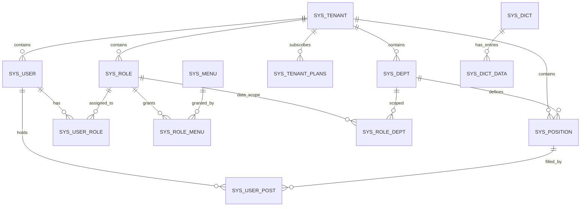
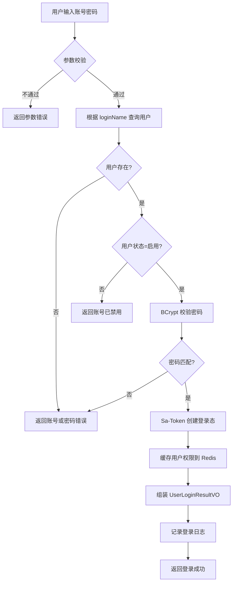
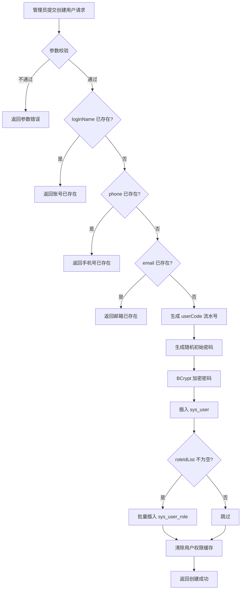
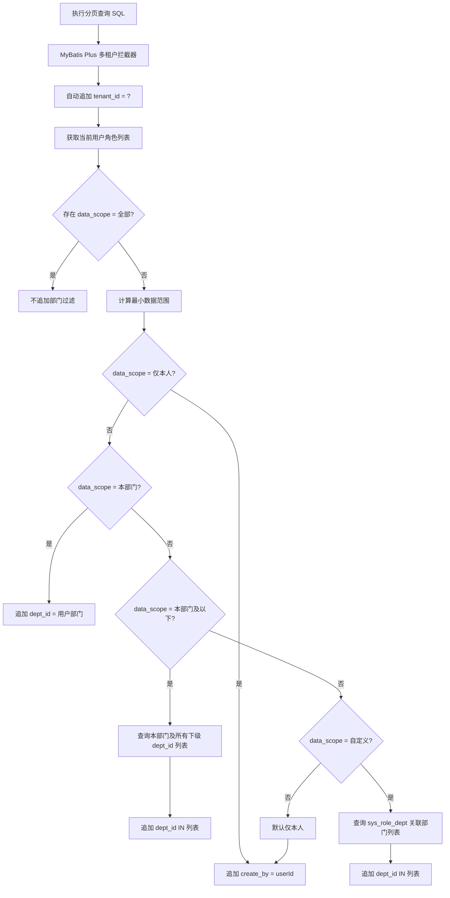
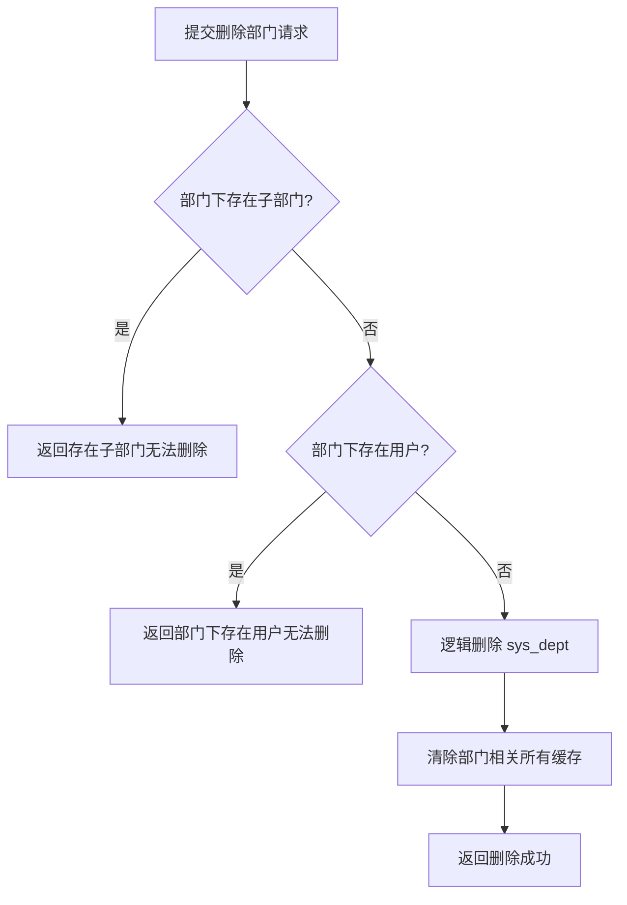
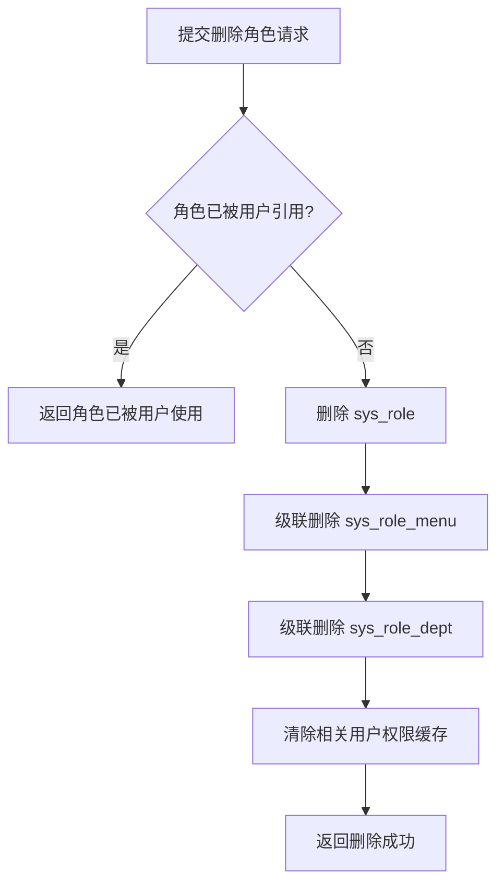
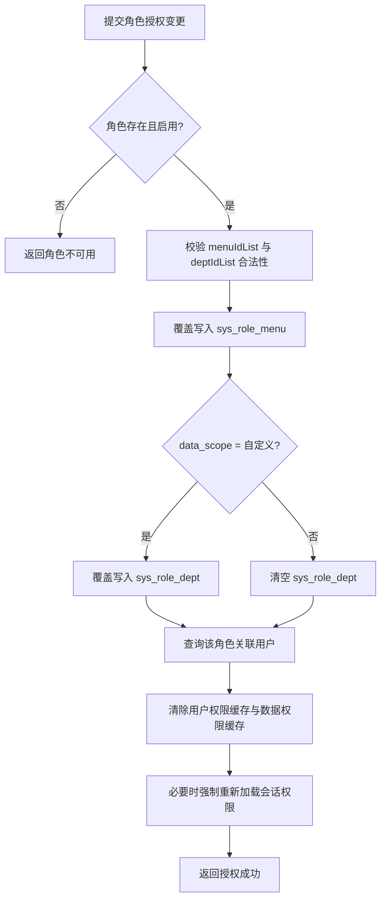

# MYOW-User 业务设计文档

## 目录
- **01** 概述与业务边界
- **02** 领域模型设计
- **03** 数据库表结构设计
- **04** API 接口设计
- **05** 业务流程设计
- **06** 关键业务规则
- **07** 可实现规格补充
## 01 概述与业务边界

myow-user 模块是 MYOW Platform 的用户管理与权限中枢，承担账户生命周期管理、RBAC 权限控制、多租户隔离、组织架构维护、系统字典与国际化等职责。该模块被 myow-overseas-app 和 myow-firstmile-app 两个应用模块共同依赖，是所有业务操作的入口鉴权层。

### 1.1 核心职责

#### 用户生命周期

用户创建、更新、禁用/启用、锁定/解锁、删除、密码重置、登录认证与登出。

#### RBAC 权限

角色定义、菜单权限绑定、数据权限范围控制（全部/自定义/部门/本人等）。

#### 多租户隔离

租户注册、套餐管理、租户级数据隔离、租户管理员初始化。

#### 组织架构

部门树管理、岗位定义、用户-部门-岗位关联。

#### 系统配置

字典管理、国际化键值对、操作日志、流水号规则。

#### 安全与审计

Sa-Token 会话管理、密码策略、登录失败锁定、登录日志、操作日志记录、登录缓存清理。

### 1.2 业务边界划分

- 用户体系：分为系统用户（system 子包）与业务用户（顶层包）。系统用户面向租户管理员进行后台配置；业务用户面向具体业务操作（如海外仓操作员）。两者共享同一套物理表 sys_user，通过 user_type 区分。

- 权限体系：菜单权限控制前端路由可见性与后端 API 访问权；数据权限控制用户能查看的数据范围（基于部门树）。

- 租户边界：租户能力可通过配置开关启用或关闭。关闭时系统按单租户模式运行，不校验租户上下文、不追加 tenant_id 过滤；开启后每个租户拥有独立的用户、部门、角色、菜单配置，通过 tenant_id BIGINT 与 MyBatis Plus 多租户拦截器实现隔离。

## 02 领域模型设计

领域模型采用 RBAC + 多租户架构，核心实体包括用户、角色、菜单、部门、岗位、租户。实体间通过关联表建立多对多关系，数据权限通过角色上的 data_scope 字段与 sys_role_dept 关联表共同实现。

### 2.1 实体关系图



图 2-1：核心实体关系（省略字段，仅展示关联）

### 2.2 聚合根与实体定义

#### 2.2.1 用户聚合（User Aggregate）

以 sys_user 表为核心的聚合，包含用户基本信息、所属部门与岗位、角色关联。

| 字段 | 类型 | 约束 | 说明 |
| --- | --- | --- | --- |
| user_id | BIGINT | PK | 用户唯一标识 |
| tenant_id | BIGINT | FK, NOT NULL | 所属租户 |
| login_name | VARCHAR(64) | NOT NULL, UK | 登录账号（租户内唯一） |
| user_code | VARCHAR(64) | NOT NULL | 用户编号（流水号生成） |
| dept_id | BIGINT | FK | 所属部门 |
| position_id | BIGINT | FK | 所属岗位 |
| password | VARCHAR(128) | NOT NULL | 加密后的密码（BCrypt） |
| status | SMALLINT | DEFAULT 1 | 0=禁用, 1=启用, 2=锁定, 3=待激活, 4=密码过期 |
| admin_flag | SMALLINT | DEFAULT 0 | 0=普通用户, 1=管理员 |
| failed_login_count | INT | DEFAULT 0 | 连续登录失败次数 |
| locked_until | TIMESTAMP(3) |  | 账号锁定截止时间 |
| password_update_time | TIMESTAMP(3) |  | 最近一次密码更新时间 |
| password_expire_time | TIMESTAMP(3) |  | 密码过期时间 |
| must_change_password | BOOLEAN | DEFAULT FALSE | 是否强制下次登录修改密码 |
| last_login_time | TIMESTAMP(3) |  | 最近一次登录成功时间 |
| deleted_flag | BOOLEAN | DEFAULT FALSE | 逻辑删除标志，false=正常，true=已删除 |

#### 2.2.2 角色实体（Role）

角色是权限的集合载体，同时承载数据权限范围定义。

| 字段 | 类型 | 约束 | 说明 |
| --- | --- | --- | --- |
| role_id | BIGINT | PK | 角色唯一标识 |
| tenant_id | BIGINT | FK, NOT NULL | 所属租户 |
| role_name | VARCHAR(64) | NOT NULL | 角色名称 |
| role_code | VARCHAR(64) | NOT NULL | 角色编码 |
| data_scope | SMALLINT | DEFAULT 1 | 数据权限范围 |
| menu_check_strictly | SMALLINT | DEFAULT 1 | 菜单选择严格模式 |
| dept_check_strictly | SMALLINT | DEFAULT 1 | 部门选择严格模式 |
| status | SMALLINT | DEFAULT 1 | 0=停用, 1=正常 |

#### 2.2.3 菜单实体（Menu）

菜单定义前端路由与后端 API 权限，分为目录、菜单、按钮三级。

| 字段 | 类型 | 约束 | 说明 |
| --- | --- | --- | --- |
| menu_id | BIGINT | PK | 菜单唯一标识 |
| parent_id | BIGINT | DEFAULT 0 | 父菜单ID，0为顶级 |
| menu_name | VARCHAR(64) | NOT NULL | 菜单名称 |
| menu_type | CHAR(1) | NOT NULL | M=目录, C=菜单, F=按钮 |
| path | VARCHAR(128) |  | 路由地址 |
| component | VARCHAR(128) |  | 组件路径 |
| api_perms | VARCHAR(256) |  | API权限标识（逗号分隔） |
| visible | SMALLINT | DEFAULT 1 | 0=隐藏, 1=显示 |
| status | SMALLINT | DEFAULT 1 | 0=停用, 1=正常 |

#### 2.2.4 部门实体（Dept）

部门采用树形结构，支持无限层级，是数据权限的核心维度。

| 字段 | 类型 | 约束 | 说明 |
| --- | --- | --- | --- |
| dept_id | BIGINT | PK | 部门唯一标识 |
| tenant_id | BIGINT | FK, NOT NULL | 所属租户 |
| parent_id | BIGINT | DEFAULT 0 | 父部门ID，0为顶级 |
| dept_name | VARCHAR(64) | NOT NULL | 部门名称 |
| sort | INT | DEFAULT 0 | 显示排序 |
| manager_id | BIGINT |  | 部门负责人ID |

#### 2.2.5 租户实体（Tenant）

租户是数据隔离的顶层边界，每个租户拥有独立的用户、部门、角色配置。

| 字段 | 类型 | 约束 | 说明 |
| --- | --- | --- | --- |
| tenant_id | BIGINT | PK | 租户唯一标识 |
| tenant_code | VARCHAR(64) | NOT NULL, UK | 租户编码 |
| name | VARCHAR(64) | NOT NULL | 租户名称 |
| plans_id | BIGINT | FK | 订阅套餐ID |
| expire_time | TIMESTAMP |  | 过期时间 |
| account_count | INT | DEFAULT 0 | 账号数量限制 |
| status | SMALLINT | DEFAULT 1 | 0=停用, 1=正常 |

#### 2.2.6 岗位实体（Position）

岗位归属于租户与部门，用于描述用户在组织内的职责位置。用户与岗位通过 sys_user_post 建立关联。

| 字段 | 类型 | 约束 | 说明 |
| --- | --- | --- | --- |
| position_id | BIGINT | PK | 岗位唯一标识 |
| tenant_id | BIGINT | NOT NULL | 所属租户 |
| dept_id | BIGINT | FK | 所属部门 |
| position_name | VARCHAR(64) | NOT NULL | 岗位名称 |
| position_code | VARCHAR(64) | NOT NULL | 岗位编码，租户内唯一 |
| status | SMALLINT | DEFAULT 1 | 0=停用, 1=正常 |

#### 2.2.7 租户套餐实体（TenantPlans）

租户套餐定义租户可用能力边界，包括账号数量、功能范围和有效期策略。租户通过 plans_id 订阅套餐。

| 字段 | 类型 | 约束 | 说明 |
| --- | --- | --- | --- |
| plans_id | BIGINT | PK | 套餐唯一标识 |
| plans_code | VARCHAR(64) | UK, NOT NULL | 套餐编码 |
| plans_name | VARCHAR(64) | NOT NULL | 套餐名称 |
| user_count | INT | DEFAULT -1 | 账号数量限制，-1 表示不限 |
| status | SMALLINT | DEFAULT 1 | 0=停用, 1=正常 |

#### 2.2.8 字典实体（Dict / DictData）

字典由字典类型与字典数据组成，用于维护系统级枚举配置。字典类型全局唯一，字典数据归属于字典类型。

字典不是单层列表，而是“字典集合 + 字典数据项”的主从结构：

- Dict：字典集合/字典类型，例如用户状态、菜单类型、客户等级、订单状态。它描述一组枚举的业务含义、编码和生命周期。
- DictData：字典集合下的具体选项，例如用户状态下的正常、停用、锁定。它必须归属于一个 dict_id，不允许脱离 Dict 独立维护。
- 管理端页面必须同时使用 DictController 与 DictDataController。只展示 sys_dict 会导致用户只能维护集合，无法维护集合下的数据项，属于不完整实现。
- 业务模块引用字典时优先引用 dict_code + data_value；管理后台维护时使用 dict_id 作为主从关联键。

| 实体 | 关键字段 | 约束 | 说明 |
| --- | --- | --- | --- |
| Dict | dict_id, dict_code, dict_name | dict_code 全局唯一 | 字典类型 |
| DictData | dict_data_id, dict_id, label, value, sort | 同一 dict_id 下 value 唯一 | 字典数据项 |

#### 2.2.9 流水号实体（SerialNoConfig / SerialNoRecord）

流水号配置定义业务编号生成模板，流水号记录保存指定周期内的最后序号，保证并发生成时不会重复。

| 实体 | 关键字段 | 约束 | 说明 |
| --- | --- | --- | --- |
| SerialNoConfig | serial_number_id, business_name, prefix, cycle_type | business_name 全局唯一 | 流水号规则 |
| SerialNoRecord | serial_number_id, record_date, last_number | serial_number_id + record_date 唯一 | 流水号当前值 |

#### 2.2.10 系统参数实体（SystemConfig）

系统参数用于承载运行时可调整的安全策略、租户策略、会话策略和基础开关。参数可分为全局参数与租户参数，tenant_id = 0 表示全局参数，租户参数优先级高于全局参数。

| 字段 | 类型 | 约束 | 说明 |
| --- | --- | --- | --- |
| config_id | BIGINT | PK | 参数唯一标识 |
| tenant_id | BIGINT | DEFAULT 0 | 所属租户，0 表示全局参数 |
| config_key | VARCHAR(128) | NOT NULL | 参数键 |
| config_value | VARCHAR(512) |  | 参数值 |
| config_type | VARCHAR(32) | DEFAULT 'STRING' | STRING/NUMBER/BOOLEAN/JSON |
| system_flag | BOOLEAN | DEFAULT FALSE | 是否系统内置参数 |

### 2.3 枚举定义

| 枚举 | 值 | 说明 |
| --- | --- | --- |
| GenderEnum | UNKNOWN(0) | 未知 |
| MAN(1) | 男 |  |
| WOMAN(2) | 女 |  |
| MenuTypeEnum | CATALOG("M") | 目录（前端路由分组） |
| MENU("C") | 菜单（可点击页面） |  |
| POINTS("F") | 按钮/权限点（API 控制） |  |
| UserTypeEnum | SYS_USER("sys_user") | 系统用户（后台管理） |
| CLIENT_USER("client_user") | 客户端用户（业务操作） |  |
| UserStatusEnum | DISABLED(0) | 禁用，不允许登录与执行业务操作 |
| ENABLED(1) | 启用，允许正常登录 |  |
| LOCKED(2) | 锁定，由连续登录失败或管理员操作触发 |  |
| PENDING_ACTIVATION(3) | 待激活，创建后未完成首次激活 |  |
| PASSWORD_EXPIRED(4) | 密码过期，只允许进入改密流程 |  |

### 2.4 数据权限范围

角色的 data_scope 字段定义该角色用户可查看的数据范围：

| 值 | 范围 | 实现方式 |
| --- | --- | --- |
| 1 | 全部数据 | 不附加部门过滤条件 |
| 2 | 自定义 | 通过 sys_role_dept 关联表指定部门 |
| 3 | 本部门 | 只查看本部门数据 |
| 4 | 本部门及以下 | 查看本部门及其所有下级部门数据 |
| 5 | 仅本人 | 只查看本人创建的数据 |
| 6 | 部门及以下或本人 | 查看本部门及以下，或本人数据 |

## 03 数据库表结构设计

所有表统一使用 PostgreSQL，字符集 UTF-8。租户内业务表均包含 tenant_id BIGINT 实现多租户隔离；需要逻辑删除的表统一使用 deleted_flag BOOLEAN DEFAULT FALSE；需要审计的表包含 create_time/update_time。

即使运行时关闭租户能力，表结构仍保留 tenant_id 字段；写入时可使用默认租户值（如 1），以便后续平滑开启多租户。

### 3.1 核心表清单

| 表名 | 说明 | 数据量预估 | 核心索引 |
| --- | --- | --- | --- |
| sys_user | 系统用户 | 万级/租户 | uk: login_name + tenant_id |
| sys_dept | 部门 | 百级/租户 | idx: parent_id, tenant_id |
| sys_role | 角色 | 十级/租户 | uk: role_code + tenant_id |
| sys_menu | 菜单 | 百级（全局共享） | idx: parent_id, menu_type |
| sys_role_menu | 角色-菜单关联 | 千级/租户 | pk: role_id + menu_id |
| sys_role_dept | 角色-部门关联（数据权限） | 百级/租户 | pk: role_id + dept_id |
| sys_position | 岗位 | 十级/租户 | idx: dept_id |
| sys_user_post | 用户-岗位关联 | 千级/租户 | pk: user_id + position_id |
| sys_user_role | 用户-角色关联 | 千级/租户 | pk: user_id + role_id |
| sys_tenant | 租户 | 百级（全局） | uk: tenant_code |
| sys_tenant_plans | 租户套餐 | 十级（全局） | uk: plans_code |
| sys_dict | 字典类型 | 百级（全局） | uk: dict_code |
| sys_dict_data | 字典数据 | 千级（全局） | idx: dict_id, sort |
| sys_config | 系统参数 | 百级（全局/租户） | uk: tenant_id + config_key |
| sys_oper_log | 操作日志 | 百万级/租户 | idx: tenant_id, oper_time |
| sys_login_log | 登录日志 | 百万级/租户 | idx: tenant_id, login_time; idx: login_name |
| t_i18n_key | 国际化键 | 千级（全局） | uk: key_code |
| t_i18n_message | 国际化消息 | 万级（全局） | uk: key_code + lang |
| sys_serial_no_config | 流水号配置 | 十级（全局） | uk: business_name |
| sys_serial_no_record | 流水号记录 | 百级（全局） | pk: serial_number_id + record_date |

### 3.2 建表语句示例

#### sys_user（系统用户表）

```sql
CREATE TABLE sys_user (
    user_id         BIGINT PRIMARY KEY,
    tenant_id       BIGINT NOT NULL,
    login_name      VARCHAR(64) NOT NULL,
    user_code       VARCHAR(64) NOT NULL,
    dept_id         BIGINT,
    position_id     BIGINT,
    password        VARCHAR(128) NOT NULL,
    salt            VARCHAR(32),
    user_type       VARCHAR(32) DEFAULT 'sys_user',
    nick_name       VARCHAR(64),
    email           VARCHAR(128),
    phone           VARCHAR(32),
    gender          SMALLINT DEFAULT 0,
    avatar          VARCHAR(256),
    status          SMALLINT DEFAULT 1,
    admin_flag      SMALLINT DEFAULT 0,
    failed_login_count INT DEFAULT 0,
    locked_until    TIMESTAMP(3),
    password_update_time TIMESTAMP(3),
    password_expire_time TIMESTAMP(3),
    must_change_password BOOLEAN DEFAULT FALSE,
    last_login_time TIMESTAMP(3),
    last_login_ip   VARCHAR(64),
    remark          VARCHAR(512),
    create_dept     BIGINT,
    create_by       BIGINT,
    create_time     TIMESTAMP(3) DEFAULT CURRENT_TIMESTAMP(3),
    update_by       BIGINT,
    update_time     TIMESTAMP(3) DEFAULT CURRENT_TIMESTAMP(3),
    deleted_flag    BOOLEAN DEFAULT FALSE,
    CONSTRAINT uk_sys_user_login_name UNIQUE (tenant_id, login_name)
);
CREATE INDEX idx_sys_user_dept_id ON sys_user(dept_id);
CREATE INDEX idx_sys_user_tenant_id ON sys_user(tenant_id);
COMMENT ON TABLE sys_user IS '系统用户表';
COMMENT ON COLUMN sys_user.user_id IS '用户ID';
COMMENT ON COLUMN sys_user.tenant_id IS '租户ID';
COMMENT ON COLUMN sys_user.login_name IS '登录账号';
COMMENT ON COLUMN sys_user.user_code IS '用户编号';
COMMENT ON COLUMN sys_user.status IS '状态: 0=禁用, 1=启用, 2=锁定, 3=待激活, 4=密码过期';
COMMENT ON COLUMN sys_user.must_change_password IS '是否强制下次登录修改密码';
```

#### sys_role（角色表）

```sql
CREATE TABLE sys_role (
    role_id             BIGINT PRIMARY KEY,
    tenant_id           BIGINT NOT NULL,
    role_name           VARCHAR(64) NOT NULL,
    role_code           VARCHAR(64) NOT NULL,
    data_scope          SMALLINT DEFAULT 1,
    menu_check_strictly SMALLINT DEFAULT 1,
    dept_check_strictly SMALLINT DEFAULT 1,
    sort                INT DEFAULT 0,
    status              SMALLINT DEFAULT 1,
    remark              VARCHAR(512),
    create_by           BIGINT,
    create_time         TIMESTAMP(3) DEFAULT CURRENT_TIMESTAMP(3),
    update_by           BIGINT,
    update_time         TIMESTAMP(3) DEFAULT CURRENT_TIMESTAMP(3),
    deleted_flag        BOOLEAN DEFAULT FALSE,
    CONSTRAINT uk_sys_role_code UNIQUE (tenant_id, role_code)
);
COMMENT ON TABLE sys_role IS '角色表';
COMMENT ON COLUMN sys_role.data_scope IS '数据权限: 1=全部,2=自定义,3=本部门,4=本部门及以下,5=仅本人,6=部门及以下或本人';
```

#### sys_menu（菜单表）

```sql
CREATE TABLE sys_menu (
    menu_id     BIGINT PRIMARY KEY,
    parent_id   BIGINT DEFAULT 0,
    menu_name   VARCHAR(64) NOT NULL,
    sort        INT DEFAULT 0,
    path        VARCHAR(128),
    component   VARCHAR(128),
    query_param VARCHAR(256),
    is_frame    SMALLINT DEFAULT 0,
    is_cache    SMALLINT DEFAULT 0,
    menu_type   CHAR(1) NOT NULL,
    visible     SMALLINT DEFAULT 1,
    status      SMALLINT DEFAULT 1,
    api_perms   VARCHAR(256),
    icon        VARCHAR(128),
    remark      VARCHAR(512),
    create_by   BIGINT,
    create_time TIMESTAMP(3) DEFAULT CURRENT_TIMESTAMP(3),
    update_by   BIGINT,
    update_time TIMESTAMP(3) DEFAULT CURRENT_TIMESTAMP(3),
    deleted_flag BOOLEAN DEFAULT FALSE
);
CREATE INDEX idx_sys_menu_parent_id ON sys_menu(parent_id);
CREATE INDEX idx_sys_menu_type ON sys_menu(menu_type);
COMMENT ON TABLE sys_menu IS '菜单权限表';
COMMENT ON COLUMN sys_menu.menu_type IS '菜单类型: M=目录, C=菜单, F=按钮';
COMMENT ON COLUMN sys_menu.api_perms IS 'API权限标识,逗号分隔';
```

#### sys_role_menu（角色-菜单关联表）

```sql
CREATE TABLE sys_role_menu (
    role_id BIGINT NOT NULL,
    menu_id BIGINT NOT NULL,
    PRIMARY KEY (role_id, menu_id)
);
CREATE INDEX idx_sys_role_menu_menu ON sys_role_menu(menu_id);
COMMENT ON TABLE sys_role_menu IS '角色与菜单关联表';
```

#### sys_role_dept（角色-部门关联表）

```sql
CREATE TABLE sys_role_dept (
    role_id BIGINT NOT NULL,
    dept_id BIGINT NOT NULL,
    PRIMARY KEY (role_id, dept_id)
);
CREATE INDEX idx_sys_role_dept_dept ON sys_role_dept(dept_id);
COMMENT ON TABLE sys_role_dept IS '角色与部门关联表，用于自定义数据权限';
```

#### sys_user_role（用户-角色关联表）

```sql
CREATE TABLE sys_user_role (
    user_id BIGINT NOT NULL,
    role_id BIGINT NOT NULL,
    PRIMARY KEY (user_id, role_id)
);
CREATE INDEX idx_sys_user_role_role ON sys_user_role(role_id);
COMMENT ON TABLE sys_user_role IS '用户与角色关联表';
```

#### sys_user_post（用户-岗位关联表）

```sql
CREATE TABLE sys_user_post (
    user_id BIGINT NOT NULL,
    position_id BIGINT NOT NULL,
    PRIMARY KEY (user_id, position_id)
);
CREATE INDEX idx_sys_user_post_position ON sys_user_post(position_id);
COMMENT ON TABLE sys_user_post IS '用户与岗位关联表';
```

#### sys_position（岗位表）

```sql
CREATE TABLE sys_position (
    position_id   BIGINT PRIMARY KEY,
    tenant_id     BIGINT NOT NULL,
    dept_id       BIGINT,
    position_code VARCHAR(64) NOT NULL,
    position_name VARCHAR(64) NOT NULL,
    sort          INT DEFAULT 0,
    status        SMALLINT DEFAULT 1,
    remark        VARCHAR(512),
    create_by     BIGINT,
    create_time   TIMESTAMP(3) DEFAULT CURRENT_TIMESTAMP(3),
    update_by     BIGINT,
    update_time   TIMESTAMP(3) DEFAULT CURRENT_TIMESTAMP(3),
    deleted_flag  BOOLEAN DEFAULT FALSE,
    CONSTRAINT uk_sys_position_code UNIQUE (tenant_id, position_code)
);
CREATE INDEX idx_sys_position_dept ON sys_position(dept_id);
COMMENT ON TABLE sys_position IS '岗位表';
```

#### sys_tenant（租户表）

```sql
CREATE TABLE sys_tenant (
    tenant_id       BIGINT PRIMARY KEY,
    tenant_code     VARCHAR(64) NOT NULL UNIQUE,
    name            VARCHAR(64) NOT NULL,
    plans_id        BIGINT,
    expire_time     TIMESTAMP,
    account_count   INT DEFAULT 0,
    status          SMALLINT DEFAULT 1,
    contact_name    VARCHAR(64),
    contact_phone   VARCHAR(32),
    address         VARCHAR(256),
    license_number  VARCHAR(64),
    intro           TEXT,
    domain          VARCHAR(128),
    remark          VARCHAR(512),
    create_by       BIGINT,
    create_time     TIMESTAMP(3) DEFAULT CURRENT_TIMESTAMP(3),
    update_by       BIGINT,
    update_time     TIMESTAMP(3) DEFAULT CURRENT_TIMESTAMP(3),
    deleted_flag    BOOLEAN DEFAULT FALSE
);
COMMENT ON TABLE sys_tenant IS '租户表';
COMMENT ON COLUMN sys_tenant.status IS '状态: 0=停用, 1=正常';
```

#### sys_tenant_plans（租户套餐表）

```sql
CREATE TABLE sys_tenant_plans (
    plans_id     BIGINT PRIMARY KEY,
    plans_code   VARCHAR(64) NOT NULL,
    plans_name   VARCHAR(64) NOT NULL,
    user_count   INT DEFAULT -1,
    status       SMALLINT DEFAULT 1,
    remark       VARCHAR(512),
    create_by    BIGINT,
    create_time  TIMESTAMP(3) DEFAULT CURRENT_TIMESTAMP(3),
    update_by    BIGINT,
    update_time  TIMESTAMP(3) DEFAULT CURRENT_TIMESTAMP(3),
    deleted_flag BOOLEAN DEFAULT FALSE,
    CONSTRAINT uk_sys_tenant_plans_code UNIQUE (plans_code)
);
COMMENT ON TABLE sys_tenant_plans IS '租户套餐表';
```

#### sys_dict（字典类型表）

```sql
CREATE TABLE sys_dict (
    dict_id      BIGINT PRIMARY KEY,
    dict_code    VARCHAR(64) NOT NULL,
    dict_name    VARCHAR(64) NOT NULL,
    sort         INT DEFAULT 0,
    status       SMALLINT DEFAULT 1,
    remark       VARCHAR(512),
    create_by    BIGINT,
    create_time  TIMESTAMP(3) DEFAULT CURRENT_TIMESTAMP(3),
    update_by    BIGINT,
    update_time  TIMESTAMP(3) DEFAULT CURRENT_TIMESTAMP(3),
    deleted_flag BOOLEAN DEFAULT FALSE,
    CONSTRAINT uk_sys_dict_code UNIQUE (dict_code)
);
COMMENT ON TABLE sys_dict IS '字典类型表';
```

#### sys_dict_data（字典数据表）

```sql
CREATE TABLE sys_dict_data (
    dict_data_id BIGINT PRIMARY KEY,
    dict_id      BIGINT NOT NULL,
    label        VARCHAR(64) NOT NULL,
    value        VARCHAR(128) NOT NULL,
    sort         INT DEFAULT 0,
    status       SMALLINT DEFAULT 1,
    remark       VARCHAR(512),
    create_by    BIGINT,
    create_time  TIMESTAMP(3) DEFAULT CURRENT_TIMESTAMP(3),
    update_by    BIGINT,
    update_time  TIMESTAMP(3) DEFAULT CURRENT_TIMESTAMP(3),
    deleted_flag BOOLEAN DEFAULT FALSE,
    CONSTRAINT uk_sys_dict_data_value UNIQUE (dict_id, value)
);
CREATE INDEX idx_sys_dict_data_dict ON sys_dict_data(dict_id);
COMMENT ON TABLE sys_dict_data IS '字典数据表';
```

#### sys_config（系统参数表）

```sql
CREATE TABLE sys_config (
    config_id    BIGINT PRIMARY KEY,
    tenant_id    BIGINT NOT NULL DEFAULT 0,
    config_key   VARCHAR(128) NOT NULL,
    config_value VARCHAR(512),
    config_type  VARCHAR(32) DEFAULT 'STRING',
    group_code   VARCHAR(64),
    system_flag  BOOLEAN DEFAULT FALSE,
    remark       VARCHAR(512),
    create_by    BIGINT,
    create_time  TIMESTAMP(3) DEFAULT CURRENT_TIMESTAMP(3),
    update_by    BIGINT,
    update_time  TIMESTAMP(3) DEFAULT CURRENT_TIMESTAMP(3),
    deleted_flag BOOLEAN DEFAULT FALSE,
    CONSTRAINT uk_sys_config_key UNIQUE (tenant_id, config_key)
);
CREATE INDEX idx_sys_config_group ON sys_config(group_code);
COMMENT ON TABLE sys_config IS '系统参数表';
COMMENT ON COLUMN sys_config.tenant_id IS '租户ID，0表示全局参数';
```

#### t_i18n_key（国际化键表）

```sql
CREATE TABLE t_i18n_key (
    id          BIGINT PRIMARY KEY,
    key_code    VARCHAR(128) NOT NULL,
    module      VARCHAR(64),
    description VARCHAR(256),
    status      SMALLINT DEFAULT 1,
    created_by  VARCHAR(64),
    create_time TIMESTAMP(3) DEFAULT CURRENT_TIMESTAMP(3),
    update_time TIMESTAMP(3) DEFAULT CURRENT_TIMESTAMP(3),
    CONSTRAINT uk_i18n_key_code UNIQUE (key_code)
);
COMMENT ON TABLE t_i18n_key IS '国际化键表';
COMMENT ON COLUMN t_i18n_key.key_code IS '国际化键编码';
```

#### t_i18n_message（国际化消息表）

```sql
CREATE TABLE t_i18n_message (
    id          BIGINT PRIMARY KEY,
    key_code    VARCHAR(128) NOT NULL,
    lang        VARCHAR(16) NOT NULL,
    message     TEXT NOT NULL,
    version     INT DEFAULT 0,
    status      SMALLINT DEFAULT 1,
    created_by  VARCHAR(64),
    create_time TIMESTAMP(3) DEFAULT CURRENT_TIMESTAMP(3),
    update_time TIMESTAMP(3) DEFAULT CURRENT_TIMESTAMP(3),
    CONSTRAINT uk_i18n_message_key_lang UNIQUE (key_code, lang)
);
COMMENT ON TABLE t_i18n_message IS '国际化消息表';
COMMENT ON COLUMN t_i18n_message.version IS '乐观锁版本号';
```

#### sys_oper_log（操作日志表）

```sql
CREATE TABLE sys_oper_log (
    oper_id         BIGINT PRIMARY KEY,
    tenant_id       BIGINT,
    title           VARCHAR(64),
    business_type   SMALLINT DEFAULT 0,
    method          VARCHAR(256),
    request_method  VARCHAR(16),
    operator_type   SMALLINT DEFAULT 0,
    oper_name       VARCHAR(64),
    dept_name       VARCHAR(64),
    oper_url        VARCHAR(512),
    oper_ip         VARCHAR(64),
    oper_location   VARCHAR(128),
    oper_param      TEXT,
    json_result     TEXT,
    status          SMALLINT DEFAULT 0,
    error_msg       TEXT,
    oper_time       TIMESTAMP(3),
    cost_time       BIGINT,
    create_time     TIMESTAMP(3) DEFAULT CURRENT_TIMESTAMP(3)
);
CREATE INDEX idx_oper_log_tenant_time ON sys_oper_log(tenant_id, oper_time);
COMMENT ON TABLE sys_oper_log IS '操作日志表';
COMMENT ON COLUMN sys_oper_log.cost_time IS '耗时(毫秒)';
```

#### sys_login_log（登录日志表）

```sql
CREATE TABLE sys_login_log (
    login_log_id  BIGINT PRIMARY KEY,
    tenant_id     BIGINT,
    user_id       BIGINT,
    login_name    VARCHAR(64) NOT NULL,
    login_type    VARCHAR(32) DEFAULT 'PASSWORD',
    login_client  VARCHAR(32),
    login_ip      VARCHAR(64),
    login_location VARCHAR(128),
    user_agent    VARCHAR(512),
    status        SMALLINT DEFAULT 0,
    fail_reason   VARCHAR(256),
    login_time    TIMESTAMP(3) DEFAULT CURRENT_TIMESTAMP(3),
    trace_id      VARCHAR(64)
);
CREATE INDEX idx_login_log_tenant_time ON sys_login_log(tenant_id, login_time);
CREATE INDEX idx_login_log_name_time ON sys_login_log(login_name, login_time);
COMMENT ON TABLE sys_login_log IS '登录日志表';
COMMENT ON COLUMN sys_login_log.status IS '登录状态: 0=失败, 1=成功';
```

#### sys_serial_no_config（流水号配置表）

```sql
CREATE TABLE sys_serial_no_config (
    serial_number_id BIGINT PRIMARY KEY,
    business_name    VARCHAR(64) NOT NULL,
    prefix           VARCHAR(32),
    date_pattern     VARCHAR(32),
    seq_length       INT DEFAULT 5,
    cycle_type       VARCHAR(16) DEFAULT 'NONE',
    status           SMALLINT DEFAULT 1,
    remark           VARCHAR(512),
    create_time      TIMESTAMP(3) DEFAULT CURRENT_TIMESTAMP(3),
    update_time      TIMESTAMP(3) DEFAULT CURRENT_TIMESTAMP(3),
    CONSTRAINT uk_serial_no_business UNIQUE (business_name)
);
COMMENT ON TABLE sys_serial_no_config IS '流水号配置表';
COMMENT ON COLUMN sys_serial_no_config.cycle_type IS '重置周期: NONE/DAY/MONTH/YEAR';
```

#### sys_serial_no_record（流水号记录表）

```sql
CREATE TABLE sys_serial_no_record (
    serial_number_id BIGINT NOT NULL,
    record_date      VARCHAR(16) NOT NULL,
    last_number      BIGINT DEFAULT 0,
    last_time        TIMESTAMP(3),
    create_time      TIMESTAMP(3) DEFAULT CURRENT_TIMESTAMP(3),
    update_time      TIMESTAMP(3) DEFAULT CURRENT_TIMESTAMP(3),
    PRIMARY KEY (serial_number_id, record_date)
);
COMMENT ON TABLE sys_serial_no_record IS '流水号记录表';
```

### 3.3 分表与归档策略

- sys_oper_log / sys_login_log：数据量最大，建议按租户 + 时间分区（PostgreSQL 原生支持表分区），或按月归档到历史表。

- sys_user / sys_role / sys_dept：单租户数据量有限，无需分表，通过 tenant_id 索引过滤即可。

- sys_tenant / sys_menu / sys_dict / sys_dict_data / sys_config / sys_tenant_plans / t_i18n_key / t_i18n_message：全局共享表，数据量较小，不分区。

## 04 API 接口设计

接口分为顶层 API（面向业务用户）与 system 子模块 API（面向系统管理员）。本模块明确采用命令式 POST 风格：创建、更新、删除、状态切换、分页查询、详情查询、树查询等业务接口统一使用 POST；所有接口统一返回 Result，使用 Sa-Token 进行权限校验。

### 4.1 认证接口

| 方法 | URL | 说明 | 权限 |
| --- | --- | --- | --- |
| POST | /api/auth/login | 用户登录 | 公开 |
| POST | /api/auth/logout | 用户登出 | 登录态 |
| POST | /api/auth/refresh | 刷新 Token（规划） | 登录态 |
| POST | /api/auth/change-password | 当前用户修改密码 | 登录态 |
| POST | /api/auth/forgot-password | 忘记密码申请（规划） | 公开 |
| POST | /api/auth/reset-password | 忘记密码重置（规划） | 公开 |
| POST | /api/auth/session/page | 当前用户会话列表 | 登录态 |
| POST | /api/auth/session/kickout | 踢出指定会话 | 登录态 |

#### 登录请求

```
POST /api/auth/login
Content-Type: application/json

{
  "loginName": "admin",
  "password": "123456",
  "loginClient": "PC",
  "captchaCode": "1234",
  "captchaUuid": "captcha-uuid"
}
```

#### 登录响应

```json
{
  "code": 200,
  "data": {
    "token": "satoken-xxxxx",
    "userId": 10001,
    "tenantId": 1,
    "userCode": "U00001",
    "loginName": "admin",
    "nickName": "管理员",
    "phone": "13800138000",
    "email": "admin@myow.com",
    "adminFlag": 1,
    "menuList": [...]
  }
}
```

### 4.2 系统用户管理接口（system）

| 方法 | URL | 说明 | 权限标识 |
| --- | --- | --- | --- |
| POST | /api/system/user/create | 创建用户 | system:user:add |
| POST | /api/system/user/update | 更新用户 | system:user:update |
| POST | /api/system/user/delete | 删除用户 | system:user:delete |
| POST | /api/system/user/get/{id} | 查询用户详情 | system:user:query |
| POST | /api/system/user/page | 分页查询用户 | system:user:query |
| POST | /api/system/user/{id}/disable | 禁用用户（规划） | system:user:update |
| POST | /api/system/user/{id}/enable | 启用用户（规划） | system:user:update |
| POST | /api/system/user/{id}/unlock | 解除账号锁定 | system:user:update |
| POST | /api/system/user/{id}/reset-password | 重置密码（规划） | system:user:update |
| POST | /api/system/user/{id}/force-change-password | 强制下次登录改密 | system:user:update |
| POST | /api/system/user/import | 批量导入用户（规划） | system:user:add |
| POST | /api/system/user/export | 导出用户列表（规划） | system:user:export |

#### 创建用户请求

```
POST /api/system/user/create
Content-Type: application/json
Authorization: satoken-xxxxx

{
  "loginName": "zhangsan",
  "nickName": "张三",
  "deptId": 1001,
  "positionId": 2001,
  "gender": 1,
  "email": "zhangsan@myow.com",
  "phone": "13800138001",
  "roleIdList": [1, 2],
  "remark": "海外仓操作员"
}
```

### 4.2.1 当前用户与个人中心接口

| 方法 | URL | 说明 | 权限 |
| --- | --- | --- | --- |
| POST | /api/profile/current | 获取当前登录用户信息 | 登录态 |
| POST | /api/profile/menus | 获取当前用户菜单树 | 登录态 |
| POST | /api/profile/permissions | 获取当前用户权限标识列表 | 登录态 |
| POST | /api/profile/update | 修改当前用户基本资料 | 登录态 |
| POST | /api/profile/change-password | 修改当前用户密码 | 登录态 |
| POST | /api/profile/avatar/upload | 上传当前用户头像（规划） | 登录态 |

### 4.3 部门管理接口（system）

| 方法 | URL | 说明 | 权限标识 |
| --- | --- | --- | --- |
| POST | /api/system/dept/create | 创建部门 | system:dept:add |
| POST | /api/system/dept/update | 更新部门 | system:dept:update |
| POST | /api/system/dept/delete/{id} | 删除部门 | system:dept:delete |
| POST | /api/system/dept/get/{id} | 查询部门详情 | system:dept:query |
| POST | /api/system/dept/tree | 获取部门树 | system:dept:query |
| POST | /api/system/dept/list | 获取部门列表 | system:dept:query |

### 4.4 角色管理接口（system）

| 方法 | URL | 说明 | 权限标识 |
| --- | --- | --- | --- |
| POST | /api/system/role/create | 创建角色 | system:role:add |
| POST | /api/system/role/update | 更新角色 | system:role:update |
| POST | /api/system/role/delete/{id} | 删除角色 | system:role:delete |
| POST | /api/system/role/get/{id} | 查询角色详情 | system:role:query |
| POST | /api/system/role/page | 分页查询角色 | system:role:query |

### 4.5 菜单管理接口（system）

| 方法 | URL | 说明 | 权限标识 |
| --- | --- | --- | --- |
| POST | /api/system/menu/create | 创建菜单 | system:menu:add |
| POST | /api/system/menu/update | 更新菜单 | system:menu:update |
| POST | /api/system/menu/delete/{id} | 删除菜单 | system:menu:delete |
| POST | /api/system/menu/get/{id} | 查询菜单详情 | system:menu:query |
| POST | /api/system/menu/page | 分页查询菜单 | system:menu:query |

### 4.6 租户管理接口（system）

| 方法 | URL | 说明 | 权限标识 |
| --- | --- | --- | --- |
| POST | /api/system/tenant/register | 租户注册 | 公开 |
| POST | /api/system/tenant/create | 创建租户（规划） | system:tenant:add |
| POST | /api/system/tenant/update | 更新租户（规划） | system:tenant:update |
| POST | /api/system/tenant/update-status | 切换租户状态 | system:tenant:update |
| POST | /api/system/tenant/delete/{id} | 删除租户（规划） | system:tenant:delete |
| POST | /api/system/tenant/get/{id} | 查询租户详情（规划） | system:tenant:query |
| POST | /api/system/tenant/page | 分页查询租户 | system:tenant:query |

### 4.7 其他接口速查

| Controller | 基础路径 | 说明 |
| --- | --- | --- |
| PositionController | /api/system/position | 岗位 CRUD |
| UserPostController | /api/system/user-post | 用户-岗位关联 |
| RoleMenuController | /api/system/role-menu | 角色-菜单关联 |
| RoleDeptController | /api/system/role-dept | 角色-部门关联（数据权限） |
| DictController | /api/system/dict | 字典集合/字典类型 CRUD，维护 sys_dict |
| DictDataController | /api/system/dict-data | 字典数据项 CRUD，按 dict_id 维护 sys_dict_data |
| I18nKeyController | /api/system/i18n-key | 国际化键 CRUD |
| I18nMessageController | /api/system/i18n-message | 国际化消息 CRUD |
| ConfigController | /api/system/config | 系统参数查询、更新、刷新缓存 |
| OperLogController | /api/system/oper-log | 操作日志 CRUD + 分页 |
| LoginLogController | /api/system/login-log | 登录日志查询、清理、归档 |
| TenantPlansController | /api/system/tenant-plans | 租户套餐 CRUD |
| SerialNoConfigController | /api/system/serial-no-config | 流水号配置 |
| SerialNoRecordController | /api/system/serial-no-record | 流水号记录查询 |

### 4.8 权限标识清单

权限标识采用 system:{resource}:{action} 格式，按钮级菜单必须绑定对应 API 权限标识。

| 资源 | 权限标识 | 说明 |
| --- | --- | --- |
| 用户 | system:user:add | 创建用户 |
| 用户 | system:user:update | 更新、启用、禁用、解锁、重置密码、强制改密 |
| 用户 | system:user:delete | 删除用户 |
| 用户 | system:user:query | 查询用户 |
| 用户 | system:user:export | 导出用户列表 |
| 角色 | system:role:add, system:role:update, system:role:delete, system:role:query | 角色管理 |
| 菜单 | system:menu:add, system:menu:update, system:menu:delete, system:menu:query | 菜单权限管理 |
| 部门 | system:dept:add, system:dept:update, system:dept:delete, system:dept:query | 部门管理 |
| 岗位 | system:position:add, system:position:update, system:position:delete, system:position:query | 岗位管理 |
| 租户 | system:tenant:add, system:tenant:update, system:tenant:delete, system:tenant:query | 租户管理 |
| 字典 | system:dict:add, system:dict:update, system:dict:delete, system:dict:query | 字典类型与字典数据管理 |
| 系统参数 | system:config:update, system:config:query | 系统参数查询、更新与缓存刷新 |
| 国际化 | system:i18n:add, system:i18n:update, system:i18n:delete, system:i18n:query | 国际化键与消息管理 |
| 操作日志 | system:oper-log:query, system:oper-log:delete | 操作日志查询与清理 |
| 登录日志 | system:login-log:query, system:login-log:delete | 登录日志查询与清理 |
| 流水号 | system:serial-no:add, system:serial-no:update, system:serial-no:query | 流水号配置与记录查询 |

## 05 业务流程设计

本章节以流程图形式呈现核心业务的执行顺序与分支判断，包括用户登录、用户创建、租户注册、权限校验等关键流程。

### 5.1 用户登录流程



图 5-1：用户登录流程

登录安全补充：每次登录尝试均写入 sys_login_log。密码错误时递增 failed_login_count，达到阈值后将用户状态置为 LOCKED(2) 并写入 locked_until；登录成功后清零失败次数、更新 last_login_time 与 last_login_ip。若 must_change_password=true 或 password_expire_time 已过期，只允许进入改密流程，不返回完整业务菜单。

### 5.2 用户创建流程



图 5-2：用户创建流程

### 5.3 租户注册流程

```mermaid
flowchart TD
    A[提交租户注册请求] --> B{参数校验}
    B -->|不通过| C[返回参数错误]
    B -->|通过| D{tenantCode 已存在?}
    D -->|是| E[返回租户编码已存在]
    D -->|否| F{套餐 plansId 有效?}
    F -->|否| G[返回套餐不存在]
    F -->|是| H[插入 sys_tenant]
    H --> I[获取 tenantId]
    I --> J[@InterceptorIgnore 绕过租户拦截器]
    J --> K[初始化默认部门]
    K --> L[初始化租户管理员角色]
    L --> M[按套餐授权默认菜单]
    M --> N[创建租户管理员用户]
    N --> O[userCode=0001, adminFlag=1]
    O --> P[分配管理员角色]
    P --> Q[初始化默认字典与参数]
    Q --> R[返回注册成功]
```

图 5-3：租户注册流程（创建租户时绕过 tenant_id 拦截器）

租户初始化模板：新租户创建后必须初始化根部门、租户管理员角色、管理员用户、默认菜单授权、基础字典、系统参数和流水号配置。若任一步失败，整个租户注册事务必须回滚，避免产生半初始化租户。

### 5.4 API 权限校验流程

```mermaid
flowchart TD
    A[请求到达 Controller] --> B[@SaCheckPermission 拦截]
    B --> C[Sa-Token 校验登录态]
    C --> D{已登录?}
    D -->|否| E[返回 401 未登录]
    D -->|是| F[从 Redis 获取用户权限列表]
    F --> G{权限列表包含所需权限?}
    G -->|否| H[返回 403 无权限]
    G -->|是| I[执行 Controller 方法]
    I --> J[返回业务结果]
```

图 5-4：API 权限校验流程（基于 Sa-Token）

### 5.5 数据权限过滤流程



图 5-5：数据权限动态过滤流程（在 SQL 拦截器中完成）

### 5.6 部门删除流程



图 5-6：部门删除流程（含存在性校验）

### 5.7 角色删除流程



图 5-7：角色删除流程（级联清理关联数据）

### 5.8 角色授权变更流程



图 5-8：角色授权变更流程（菜单权限 + 数据权限）

## 06 关键业务规则

本章节汇总 myow-user 模块中需要特别注意的业务规则与边界条件，是代码评审与测试用例设计的核心参考。

### 6.1 多租户隔离规则

- 租户开关：通过 myow.tenant.enabled 控制租户隔离是否启用，默认可为 false，便于早期按单租户模式开发。

- 关闭模式：当 myow.tenant.enabled=false 时，不校验 TenantContext，MyBatis Plus 租户拦截器应忽略所有表，不追加 tenant_id = ? 条件；业务写入可使用默认租户值。

- 开启模式：当 myow.tenant.enabled=true 时，租户内业务查询通过 MyBatis Plus MyTenantLineHandler 自动追加 tenant_id = ? 条件，缺少租户上下文时必须拒绝请求。

- 全局表例外：sys_tenant, sys_menu, sys_dict, sys_dict_data, sys_config, sys_tenant_plans, t_i18n_key, t_i18n_message 为全局共享表，不附加租户过滤。

- 租户创建例外：创建租户时通过 @InterceptorIgnore(tenantLine = "true") 绕过拦截器，允许在 tenant_id = null 的上下文中写入。

- 跨租户唯一性：login_name, role_code, dept_name 等在租户内唯一，联合唯一索引须包含 tenant_id。

### 6.2 用户管理规则

- 登录名唯一：同一租户内 login_name 不可重复，全局超级管理员除外。

- 用户编码生成：新用户创建时自动分配 userCode，格式为 U + 5位全局自增序列（如 U00001）。

- 初始密码：创建用户时生成随机密码，通过 BCrypt 加密存储。初始密码须通过独立渠道告知用户，并将 must_change_password 置为 true。

- 管理员保护：adminFlag = 1 的用户不可被删除，不可被禁用。

- 更新级联：更新用户部门/岗位/角色时，须同步清除该用户的权限缓存与登录缓存。

- 删除级联：删除用户时须级联删除 sys_user_role 与 sys_user_post 关联记录。

### 6.2.1 账号安全与密码策略

- 密码强度：默认要求至少 8 位，必须包含字母与数字；生产环境可通过系统参数提高复杂度要求。

- 密码存储：只存储 BCrypt 哈希值，不存储明文密码；重置密码后旧密码立即失效。

- 失败锁定：同一账号连续登录失败达到 5 次后锁定 30 分钟，锁定期间不再校验密码，直接返回账号锁定。

- 失败计数：登录成功后清零 failed_login_count；管理员解锁后同时清零失败次数与 locked_until。

- 密码过期：默认 90 天过期。过期后用户只能访问当前用户信息、登出、修改密码接口。

- 强制改密：管理员重置密码、新用户首次登录、密码策略升级后，应将 must_change_password 置为 true。

- 验证码策略：验证码能力可配置。默认在连续失败 3 次后要求验证码；生产环境可配置为登录必填。

### 6.2.2 会话治理规则

- 登录端标识：登录请求必须带 loginClient，用于区分 PC、APP、API 等客户端。

- 多端策略：默认允许同一用户多端登录；如配置为单端登录，新登录成功后踢出同客户端旧会话。

- Token 续期：Token 到期前可通过刷新接口续期；被踢出、禁用、删除、改密后的旧 Token 必须失效。

- Token 黑名单：登出、踢下线、强制改密、管理员禁用用户时，应将相关 Token 加入黑名单或删除 Sa-Token 会话。

- 会话查询：用户可查询本人会话，管理员可按权限查看用户在线状态并踢下线。

### 6.3 RBAC 权限规则

- 菜单类型约束： 目录（M）下可挂载目录或菜单，不可挂载按钮。

- 菜单（C）下可挂载按钮，不可挂载目录或菜单。

- 按钮（F）必须为叶子节点，不可有子菜单。

- 权限标识约束：按钮类型菜单必须配置 api_perms，格式为 module:resource:action（如 system:user:add）。

- 超级管理员：全局超级管理员绕过菜单权限与数据权限校验；租户管理员仅在当前租户内拥有默认管理权限，不得跨租户访问数据。

- 授权覆盖：角色菜单授权与角色部门授权采用覆盖式保存，提交的 ID 列表即为最新授权结果。

- 角色引用保护：删除角色前须校验是否被用户引用，若存在引用则禁止删除。

- 菜单引用保护：删除菜单前须校验是否存在子菜单或被角色引用。

- 权限缓存刷新：角色-菜单关系变更、用户-角色关系变更、菜单结构变更时，须清除受影响用户的权限缓存。

### 6.4 数据权限规则

- 范围优先级：用户可能拥有多个角色，每个角色定义不同的 data_scope。实际数据范围取最宽松的角色范围（如一个角色是"全部"，另一个是"仅本人"，则最终为"全部"）。

- 自定义范围：data_scope = 2 时，通过 sys_role_dept 关联表明确指定可见部门，未关联的部门数据不可见。

- 部门及以下：data_scope = 4 时，需要递归查询部门树获取自身及所有下级部门 ID 列表。

- 仅本人：data_scope = 5 时，SQL 中追加 create_by = userId，只能查看自己创建的数据。

- 业务表要求：需要接入数据权限的业务表必须包含 tenant_id、dept_id 或 create_by 中的必要字段；若缺少这些字段，应在 spec 中明确说明不适用数据权限。

### 6.5 部门树规则

- 树形结构：部门通过 parent_id 自关联，支持无限层级。parent_id = 0 表示根部门。

- 删除保护：删除部门前须校验是否存在子部门或存在用户归属，任一条件满足则禁止删除。

- 缓存策略：部门树、部门列表、部门路径、自包含下级 ID 列表均纳入 Spring Cache，部门变更时统一失效所有相关缓存。

- 排序规则：同级部门按 sort 字段升序排列，sort 相同时按 dept_id 升序。

### 6.6 字典与国际化规则

- 字典编码格式：dict_code 必须以字母开头，只能包含字母、数字、下划线。

- 主从结构：字典管理必须按 Dict / DictData 两层实现。DictController 只负责字典集合，DictDataController 只负责字典集合下的数据项，前端不得把两者合并成单层表格。

- 页面交互：管理端字典页面采用左侧字典集合列表、右侧字典数据项列表。选中字典集合后，右侧以 dict_id 调用 DictDataController 分页查询数据项。

- 新增数据项：新增字典数据必须携带 dict_id；禁止前端只传 dict_code 让后端猜测所属字典。

- 唯一性：dict_code 全局唯一；同一 dict_id 下 data_value 唯一，data_label 建议唯一，避免同一字典下出现重复展示名。

- 字典删除保护：删除字典类型前须校验是否存在字典数据，存在则禁止删除。

- 字典数据删除保护：若字典数据已被业务表引用，后续应通过引用校验或禁用状态处理，避免直接删除导致历史数据无法解释。

- 排序规则：同一 dict_id 下按 sort 升序展示，sort 相同时按 dict_data_id 升序。

- 国际化乐观锁：t_i18n_message 表使用 @Version 实现乐观锁，并发更新时以版本号为准，冲突时返回更新失败。

- 国际化键唯一：key_code 全局唯一，key_code + lang 联合唯一。

### 6.7 操作日志规则

- 全量记录：所有写操作（增删改）必须记录操作日志，读操作可选记录。

- 敏感信息脱敏：操作日志中的请求参数须对密码、Token 等敏感字段进行脱敏处理。

- 耗时记录：每次操作须记录执行耗时（毫秒），超过阈值（如 1s）标记为慢操作。

- 保留周期：操作日志保留 180 天，超期数据自动归档或清理。

### 6.7.1 登录日志规则

- 记录范围：登录成功、登录失败、登出、Token 刷新、踢下线、账号锁定、管理员解锁均应记录登录日志或安全事件。

- 失败原因：日志内部记录具体失败原因；对外响应统一返回账号或密码错误，避免暴露账号是否存在。

- 审计字段：必须记录 tenant_id、user_id、login_name、IP、User-Agent、客户端类型、traceId、登录时间与状态。

- 归档策略：登录日志保留 180 天，支持按租户与时间归档。

### 6.8 缓存管理规则

- 权限缓存 Key：user:perm:{userId}，缓存用户角色列表与权限标识列表。

- 登录缓存 Key：user:login:{userId}，缓存登录用户信息。

- 部门缓存 Key：user:dept:tree:{tenantId}, user:dept:list:{tenantId} 等。

- 缓存失效时机： 用户角色变更 -> 清除 user:perm:{userId}

- 用户禁用/删除 -> 清除 user:perm:{userId} + user:login:{userId}

- 部门增删改 -> 清除所有部门相关缓存

- 角色菜单变更 -> 清除该角色下所有用户的权限缓存

### 6.9 流水号生成规则

- 策略模式：通过 SerialNumberGenerator + SerialTemplate 实现可扩展的流水号生成。

- 用户编号格式：U + 5位数字，全局自增，不随日期重置。

- 并发安全：流水号生成须保证并发安全，通过数据库行锁或分布式锁实现。

- 记录归档：sys_serial_no_record 按日/月/年记录最后序号，支持按周期重置。

### 6.9.1 租户初始化规则

- 初始化内容：租户创建时初始化根部门、管理员角色、管理员用户、默认菜单授权、基础字典、系统参数与流水号配置。

- 事务一致性：租户初始化必须在同一业务事务中完成；失败时回滚所有已创建数据。

- 默认管理员：租户管理员用户 admin_flag=1，必须强制首次登录修改密码。

- 套餐约束：默认菜单授权应受 sys_tenant_plans 约束，租户不可使用套餐外功能。

### 6.10 错误码清单

错误码采用 USER_{场景}{序号} 格式：1xxx 表示参数或校验错误，2xxx 表示业务规则错误，3xxx 表示认证授权错误，9xxx 表示系统异常。

| 错误码 | 场景 | 说明 |
| --- | --- | --- |
| USER_1001 | 参数错误 | 必填字段为空或格式不合法 |
| USER_1002 | 登录名重复 | 同一租户内 login_name 已存在 |
| USER_1003 | 手机号重复 | 同一租户内 phone 已存在 |
| USER_1004 | 邮箱重复 | 同一租户内 email 已存在 |
| USER_2001 | 用户不存在 | 用户 ID 或登录名不存在 |
| USER_2002 | 用户已禁用 | 禁用用户不可登录或执行业务操作 |
| USER_2003 | 密码错误 | 登录密码校验失败 |
| USER_2004 | 管理员保护 | 管理员用户不可删除或禁用 |
| USER_2005 | 账号锁定 | 连续登录失败达到阈值，账号暂时锁定 |
| USER_2006 | 密码过期 | 当前密码已过期，需要修改密码 |
| USER_2007 | 强制改密 | 当前用户必须先修改密码 |
| USER_2101 | 角色不存在 | 角色 ID 不存在或已删除 |
| USER_2102 | 角色被引用 | 角色已分配给用户，不允许删除 |
| USER_2201 | 部门不存在 | 部门 ID 不存在或已删除 |
| USER_2202 | 部门存在子节点 | 存在下级部门，不允许删除 |
| USER_2203 | 部门存在用户 | 部门下仍有用户，不允许删除 |
| USER_2301 | 租户不存在 | 租户 ID 或租户编码不存在 |
| USER_2302 | 租户已停用 | 停用租户不可登录或创建新用户 |
| USER_2401 | 字典被引用 | 字典类型下仍有字典数据，不允许删除 |
| USER_3001 | 未登录 | 缺少有效登录态 |
| USER_3002 | 无权限 | 用户不具备当前 API 所需权限 |
| USER_3003 | 会话失效 | Token 已过期、被踢下线或已加入黑名单 |
| USER_9001 | 流水号生成失败 | 并发冲突或配置缺失导致编号生成失败 |

### 6.11 审计日志机制

- 落地方式：采用注解 + AOP 记录操作日志，业务代码只声明审计意图，不直接拼装 OperLogDO。

- 注解建议：定义 @OperLog 注解，包含 title、businessType、operatorType、recordRequest、recordResponse 等属性。

- 记录内容：操作人、租户、请求路径、请求方法、请求参数、响应结果、IP、User-Agent、耗时、错误信息。

- 脱敏规则：password、token、authorization、phone、email 等敏感字段必须在写入日志前脱敏。

- 失败兜底：审计日志写入失败不能影响主业务事务，应记录错误日志并允许主流程继续。

- 异步策略：高频写操作可通过 Spring 事件异步落库，但必须保证同一请求的 traceId 可追踪。

业务规则 checklist（代码评审用）：

1. 若 myow.tenant.enabled=true，新建查询是否遗漏 tenant_id 过滤？（多租户拦截器是否生效）

2. 删除操作是否校验了引用关系？（角色是否被用户引用、菜单是否有子节点）

3. 关联关系变更后是否清除了相关缓存？

4. 新增字段是否添加了数据库注释？

5. 敏感操作是否记录了操作日志？

6. 若 myow.tenant.enabled=true，唯一性校验是否包含 tenant_id？

7. 若 myow.tenant.enabled=false，是否避免强制读取 TenantContext？

8. 登录、登出、锁定、解锁、踢下线是否记录登录日志或安全事件？

9. 改密、重置密码、禁用用户后，旧 Token 与相关缓存是否失效？

10. 需要数据权限的业务表是否具备 dept_id 或 create_by 字段？

11. 新租户初始化是否具备事务回滚与默认授权校验？

## 07 可实现规格补充

本章节用于把规则落成可编码规格，重点定义运行时配置项、初始化种子数据、核心 DTO 字段与校验规则。

### 7.1 系统参数配置项

系统参数优先从租户参数读取，租户未配置时回退到全局参数；高频参数应缓存到 Redis，参数更新后必须发布缓存失效事件。

| 参数键 | 默认值 | 类型 | 说明 |
| --- | --- | --- | --- |
| myow.tenant.enabled | false | BOOLEAN | 是否启用多租户隔离 |
| security.password.min-length | 8 | NUMBER | 密码最小长度 |
| security.password.require-letter | true | BOOLEAN | 密码是否必须包含字母 |
| security.password.require-number | true | BOOLEAN | 密码是否必须包含数字 |
| security.password.expire-days | 90 | NUMBER | 密码有效天数，0 表示不过期 |
| security.login.max-fail-count | 5 | NUMBER | 连续登录失败锁定阈值 |
| security.login.lock-minutes | 30 | NUMBER | 账号锁定分钟数 |
| security.login.captcha-enabled | false | BOOLEAN | 是否登录必填验证码 |
| security.login.captcha-after-fail-count | 3 | NUMBER | 失败多少次后要求验证码 |
| security.session.multi-login | true | BOOLEAN | 是否允许同账号多端登录 |
| security.session.token-timeout-seconds | 7200 | NUMBER | Token 有效期 |
| security.session.refresh-window-seconds | 1800 | NUMBER | Token 到期前允许刷新窗口 |
| audit.oper-log.retention-days | 180 | NUMBER | 操作日志保留天数 |
| audit.login-log.retention-days | 180 | NUMBER | 登录日志保留天数 |

### 7.2 初始化种子数据

系统启动或租户创建时必须具备可重复执行的初始化脚本。初始化脚本应支持幂等执行，使用自然键（如 role_code、menu_name + parent_id、config_key）判断是否已存在。

| 类别 | 种子数据 | 关键要求 |
| --- | --- | --- |
| 全局菜单 | 系统管理、用户管理、角色管理、菜单管理、部门管理、岗位管理、租户管理、字典管理、参数配置、操作日志、登录日志 | 菜单为全局共享，按钮节点绑定权限标识 |
| 全局权限 | system:user:*、system:role:*、system:menu:*、system:config:* 等 | 权限标识必须与 Controller 注解一致 |
| 默认角色 | tenant_admin、system_operator、readonly | 租户管理员默认拥有当前租户内系统管理权限 |
| 默认部门 | 根部门 | 每个租户必须且只能有一个根部门 |
| 默认用户 | 租户管理员 | 强制首次登录改密，分配 tenant_admin 角色 |
| 默认字典 | 用户状态、性别、菜单类型、数据权限范围、操作类型、登录状态 | 字典编码全局唯一 |
| 默认参数 | 7.1 中全部系统参数 | 全局参数必须先初始化，租户参数按需覆盖 |
| 流水号 | 用户编号 USER_CODE | 默认格式 U + 5 位序号 |
| 当前开发种子 | V3__myow_user_default_seed.sql | 初始化默认租户、部门、岗位、角色、管理员用户、系统菜单和基础授权；默认账号仅用于本地开发和部署验证 |
| 管理权限补丁 | V4__myow_user_management_permissions.sql | 补齐角色、菜单、部门、岗位、字典、配置的新增、修改、删除权限按钮，并授权给默认超级管理员角色 |
| 剩余菜单补丁 | V5__myow_user_remaining_management_menus.sql | 补齐租户、套餐、日志、I18n、流水号等剩余管理菜单，并授权给默认超级管理员角色 |

### 7.3 核心 DTO 与校验规则

| DTO | 关键字段 | 校验规则 |
| --- | --- | --- |
| LoginRequest | loginName, password, loginClient, captchaCode, captchaUuid | loginName/password 必填；达到验证码策略时 captcha 必填；对外失败响应不暴露账号是否存在 |
| ChangePasswordRequest | oldPassword, newPassword, confirmPassword | 旧密码必须正确；新密码满足密码策略；两次输入一致；新旧密码不可相同 |
| UserCreateRequest | loginName, nickName, deptId, positionId, phone, email, roleIdList | loginName 租户内唯一；phone/email 租户内唯一；角色、部门、岗位必须存在且启用 |
| UserUpdateRequest | userId, nickName, deptId, positionId, phone, email, status, roleIdList | userId 必填；不可修改已删除用户；管理员保护规则必须生效 |
| RoleSaveRequest | roleName, roleCode, dataScope, menuIdList, deptIdList | roleCode 租户内唯一；DTO 字段 dataScope 映射数据库字段 data_scope，自定义数据权限时 deptIdList 必填 |
| MenuSaveRequest | parentId, menuName, menuType, path, component, apiPerms, sort | 按钮类型必须配置 apiPerms；按钮不可有子节点；菜单路径同级唯一 |
| DeptSaveRequest | parentId, deptName, managerId, sort | 同级部门名称租户内唯一；不可形成循环父子关系 |
| TenantRegisterRequest | tenantCode, name, plansId, adminLoginName, adminPassword | tenantCode 全局唯一；套餐必须存在且启用；管理员账号租户内唯一 |
| ConfigUpdateRequest | configKey, configValue, tenantId | 系统内置参数不允许删除；值必须符合 configType；更新后刷新缓存 |

### 7.4 统一响应与分页约定

- 统一响应：所有接口返回 Result，包含 code、message、data、traceId。

- 分页请求：分页 DTO 统一继承 PageParam，包含 pageNum、pageSize、sortItemList；pageSize 最大 500。

- 分页响应：分页结果统一返回 PageResult，包含 list、total、pages、pageNum、pageSize、emptyFlag。

- 时间格式：接口时间字段统一使用 ISO-8601 字符串，数据库使用 TIMESTAMP(3)。

### 7.5 阶段范围划分

| 阶段 | 必须完成 | 可后置 |
| --- | --- | --- |
| 第一阶段 | 登录/登出、当前用户、用户 CRUD、角色 CRUD、菜单 CRUD、部门 CRUD、岗位 CRUD、用户-角色、角色-菜单、角色-部门、数据权限、租户开关、系统参数、操作日志、登录日志、缓存失效、初始化种子 | 忘记密码、头像上传、批量导入导出、Token 刷新增强 |
| 第二阶段 | 租户注册、租户套餐、租户初始化模板、租户状态管理、账号数量限制、套餐菜单授权 | 租户自助续费、套餐计费、复杂组织权限审批 |
| 第三阶段 | 用户批量导入导出、验证码强制策略、会话列表与踢下线、日志归档任务 | OAuth、MFA、SSO、第三方身份源同步 |

### 7.6 Flyway 数据库补丁约定

- 迁移目录：用户中心数据库补丁统一放在 myow-user/src/main/resources/db/migration，随业务模块进入 App 运行时 classpath。

- 文件命名：版本脚本使用 V{版本号}__{说明}.sql，例如 V1__myow_user_base_schema.sql、V2__myow_user_phase1_schema.sql、V3__myow_user_default_seed.sql、V4__myow_user_management_permissions.sql、V5__myow_user_remaining_management_menus.sql；版本号只递增，不允许复用或改写已发布脚本。

- 执行职责：myow-user 只提供 SQL 补丁；myow-overseas-app、myow-firstmile-app 等启动模块通过 Flyway 自动发现并执行补丁。

- 基线策略：空库从 V1 基础建表开始迁移；既有非空环境允许开启 baseline-on-migrate，基线版本为 1，从 V2 开始执行阶段补丁。

- SQL 兼容：补丁必须优先使用幂等写法，例如 IF NOT EXISTS、ON CONFLICT、条件重命名；避免依赖人工重复执行。

- 默认账号：当前开发种子提供 admin / MyowAdmin2026! 用于本地启动和接口验证；生产环境必须在部署后立即修改默认密码，或按环境替换初始化策略。

- 部署原则：应用启动时由 Flyway 记录和校验 flyway_schema_history；业务代码不得在运行期临时创建或修改表结构。

MYOW-User 业务设计文档 v1.0 &middot; 2026年6月

本规范基于 myow-user 模块现有代码资产编制，随业务演进持续迭代
